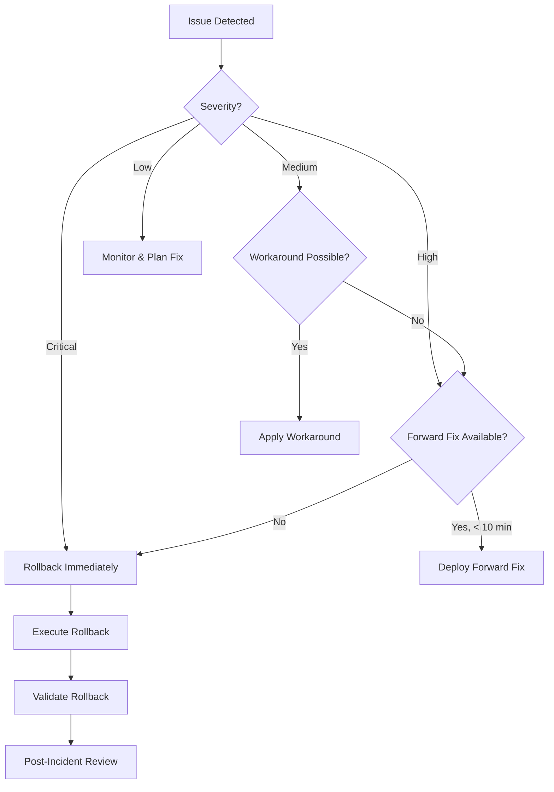

# Rollback Procedures

**Document Version:** 1.0  
**Last Updated:** October 6, 2025  
**Status:** Production Ready  
**Owner:** EDI Platform Team (Operations)
**CRITICAL:** Memorize these procedures for incident response

---

## Table of Contents

1. [Overview](#1-overview)
2. [Decision Criteria](#2-decision-criteria)
3. [Infrastructure Rollback](#3-infrastructure-rollback)
4. [Function App Rollback](#4-function-app-rollback)
5. [ADF Pipeline Rollback](#5-adf-pipeline-rollback)
6. [Configuration Rollback](#6-configuration-rollback)
7. [Emergency Procedures](#7-emergency-procedures)

---

## 1. Overview

### 1.1 Rollback Philosophy

**Goal:** Restore service as quickly as possible, investigate root cause later

**Principles:**
- 🚨 **Speed Over Perfection** - Don't debug in production during outage
- 🔄 **Known-Good State** - Revert to last working version
- 📊 **Monitor Closely** - Watch metrics during and after rollback
- 📝 **Document Everything** - Capture timeline for post-mortem

### 1.2 Rollback SLAs

| Component | Target Rollback Time | Maximum Downtime |
|-----------|---------------------|------------------|
| **Function Apps** | 5 minutes | 10 minutes |
| **Configuration** | 2 minutes | 5 minutes |
| **Infrastructure** | 15 minutes | 30 minutes |
| **ADF Pipelines** | 10 minutes | 20 minutes |

---

## 2. Decision Criteria

### 2.1 When to Rollback

Rollback immediately if:

- ❌ **Error Rate Spike:** >5% increase in error rate
- ❌ **Performance Degradation:** >50% increase in latency
- ❌ **Service Unavailable:** Health endpoints returning 500 errors
- ❌ **Data Loss Risk:** Potential for data corruption or loss
- ❌ **Security Incident:** Security vulnerability introduced
- ❌ **Regulatory Violation:** HIPAA compliance issue

### 2.2 When NOT to Rollback

Consider alternatives if:

- ✅ **Minor Performance Issue:** <5% latency increase, not affecting users
- ✅ **Known Issue with Workaround:** Issue can be mitigated without rollback
- ✅ **Forward Fix Available:** Bug fix can be deployed faster than rollback
- ✅ **Configuration Tweak Needed:** Issue resolved by config change only

### 2.3 Rollback Decision Tree



---

## 3. Infrastructure Rollback

### 3.1 Bicep Infrastructure Rollback

**Scenario:** Recent infrastructure deployment caused issues

#### Step 1: Identify Last Known Good Deployment

```powershell
# List recent deployments
az deployment group list \
  --resource-group rg-edi-prod-eastus2 \
  --query "[?properties.provisioningState=='Succeeded'].{Name:name, Timestamp:properties.timestamp, SHA:tags.DeploymentSha}" \
  --output table
```

**Identify:** Last successful deployment before the issue

#### Step 2: Checkout Previous Commit

```powershell
# Clone repository
git clone https://github.com/PointCHealth/edi-data-platform.git
cd edi-data-platform

# Find last good commit
git log --oneline --all -- infra/bicep/

# Checkout last good commit
git checkout <GOOD_COMMIT_SHA>
```

#### Step 3: Deploy Previous Version

```powershell
# Login to Azure
az login

# Set subscription
az account set --subscription <PROD_SUBSCRIPTION_ID>

# Deploy last known good configuration
az deployment group create \
  --resource-group rg-edi-prod-eastus2 \
  --template-file infra/bicep/main.bicep \
  --parameters env/prod.parameters.json \
  --name rollback-$(date +%Y%m%d-%H%M%S)
```

**Expected Duration:** 10-15 minutes

#### Step 4: Validate Rollback

```powershell
# Check deployment status
az deployment group show \
  --resource-group rg-edi-prod-eastus2 \
  --name rollback-<TIMESTAMP> \
  --query properties.provisioningState
```

**Expected Result:** `"Succeeded"`

#### Step 5: Run Smoke Tests

```powershell
# Execute smoke test suite
pwsh scripts/smoke-tests.ps1 -Environment prod -ResourceGroup rg-edi-prod-eastus2
```

### 3.2 Rollback via GitHub Actions

**Alternative:** Use GitHub Actions workflow for rollback

#### Navigate to GitHub Actions

**Repository:** PointCHealth/edi-data-platform

**Workflow:** Infrastructure CD

#### Run Rollback Workflow

1. Click **Actions** tab
2. Select **Infrastructure CD** workflow
3. Click **Run workflow**
4. **Inputs:**
   - Environment: `prod`
   - Commit SHA: `<GOOD_COMMIT_SHA>` (if workflow supports it)
5. Click **Run workflow**

**Approval Required:** Override approval gates in emergency (if configured)

---

## 4. Function App Rollback

### 4.1 Slot Swap Rollback (Fastest)

**Use When:** Function deployed via staging slot

#### Step 1: Swap Slots Back

```powershell
# Login to Azure
az login
az account set --subscription <PROD_SUBSCRIPTION_ID>

# Swap staging slot back to production
az functionapp deployment slot swap \
  --name func-edi-router-prod-eastus2 \
  --resource-group rg-edi-prod-eastus2 \
  --slot staging \
  --target-slot production
```

**Expected Duration:** 30-60 seconds (zero downtime)

#### Step 2: Validate Rollback

```powershell
# Test health endpoint
curl https://func-edi-router-prod-eastus2.azurewebsites.net/api/health

# Check Application Insights for errors
az monitor app-insights query \
  --app func-edi-router-prod-eastus2 \
  --analytics-query "exceptions | where timestamp > ago(5m) | count" \
  --resource-group rg-edi-prod-eastus2
```

**Expected Result:** Health check passes, 0 exceptions

### 4.2 Redeploy Previous Version

**Use When:** No staging slot available or slot swap failed

#### Step 1: Find Previous Artifact

```powershell
# List recent workflow runs
gh run list --workflow function-cd.yml --repo PointCHealth/edi-platform-core --limit 10
```

**Identify:** Last successful run before the problematic deployment

#### Step 2: Download Artifact

```powershell
# Download artifact from previous run
gh run download <GOOD_RUN_ID> \
  --repo PointCHealth/edi-platform-core \
  --name function-app-<GOOD_RUN_NUMBER>
```

#### Step 3: Deploy Previous Version

```powershell
# Login to Azure
az login
az account set --subscription <PROD_SUBSCRIPTION_ID>

# Deploy previous version
az functionapp deployment source config-zip \
  --name func-edi-router-prod-eastus2 \
  --resource-group rg-edi-prod-eastus2 \
  --src function-app-<GOOD_RUN_NUMBER>.zip
```

**Expected Duration:** 3-5 minutes

#### Step 4: Restart Function App (if needed)

```powershell
# Restart to clear any cached issues
az functionapp restart \
  --name func-edi-router-prod-eastus2 \
  --resource-group rg-edi-prod-eastus2
```

### 4.3 Rollback via GitHub Actions

#### Run Rollback Workflow

1. Navigate to **Actions** → **Function App CD**
2. Click **Run workflow**
3. **Inputs:**
   - Environment: `prod`
   - Artifact: `function-app-<GOOD_RUN_NUMBER>`
4. Click **Run workflow**

**Approval:** May require override in emergency

---

## 5. ADF Pipeline Rollback

### 5.1 Disable Triggers Immediately

**First Action:** Stop data processing if pipelines are failing

```powershell
# Stop all triggers in production ADF
$triggers = az datafactory trigger list \
  --factory-name adf-edi-prod-eastus2 \
  --resource-group rg-edi-prod-eastus2 \
  --query "[].name" \
  --output tsv

foreach ($trigger in $triggers) {
    Write-Host "Stopping trigger: $trigger" -ForegroundColor Yellow
    az datafactory trigger stop \
      --factory-name adf-edi-prod-eastus2 \
      --resource-group rg-edi-prod-eastus2 \
      --name $trigger
}
```

**Expected Duration:** 1-2 minutes

### 5.2 Deploy Previous ARM Templates

#### Step 1: Find Previous ARM Templates

```powershell
# Download ARM templates from previous GitHub run
gh run list --workflow adf-export.yml --repo PointCHealth/edi-data-platform --limit 10
gh run download <GOOD_RUN_ID> --repo PointCHealth/edi-data-platform --name adf-arm-templates
```

#### Step 2: Deploy Previous Version

```powershell
# Deploy ARM templates
az deployment group create \
  --resource-group rg-edi-prod-eastus2 \
  --template-file ARMTemplateForFactory.json \
  --parameters ARMTemplateParametersForFactory.json \
  --name rollback-adf-$(date +%Y%m%d-%H%M%S)
```

**Expected Duration:** 5-10 minutes

#### Step 3: Re-enable Triggers

```powershell
# Re-enable triggers after validation
foreach ($trigger in $triggers) {
    Write-Host "Starting trigger: $trigger" -ForegroundColor Green
    az datafactory trigger start \
      --factory-name adf-edi-prod-eastus2 \
      --resource-group rg-edi-prod-eastus2 \
      --name $trigger
}
```

### 5.3 Manual Rollback in ADF UI

**Alternative:** Use ADF Studio for manual rollback

1. Open Azure Data Factory Studio
2. Navigate to **Manage** → **Git configuration**
3. Select previous commit from dropdown
4. Click **Apply** to revert workspace
5. Click **Publish** to deploy changes

---

## 6. Configuration Rollback

### 6.1 Partner Configuration Rollback

**Fastest Rollback:** Change configuration version pointer

#### Step 1: Identify Previous Configuration Version

```powershell
# List configuration versions in blob storage
az storage blob list \
  --account-name stediproeastus2 \
  --container-name configs \
  --query "[].name" \
  --output table
```

**Identify:** Previous configuration version (e.g., `config-v2024-10-05-100000`)

#### Step 2: Update App Settings

```powershell
# Update all function apps to use previous config version
$functionApps = @(
    "func-edi-router-prod-eastus2",
    "func-edi-validator-prod-eastus2",
    "func-edi-orchestrator-prod-eastus2"
)

foreach ($app in $functionApps) {
    Write-Host "Updating $app..." -ForegroundColor Cyan
    az functionapp config appsettings set \
      --name $app \
      --resource-group rg-edi-prod-eastus2 \
      --settings "ConfigVersion=config-v2024-10-05-100000"
}
```

**Expected Duration:** 1-2 minutes

#### Step 3: Restart Function Apps

```powershell
# Restart to reload configuration
foreach ($app in $functionApps) {
    Write-Host "Restarting $app..." -ForegroundColor Cyan
    az functionapp restart \
      --name $app \
      --resource-group rg-edi-prod-eastus2
}
```

**Expected Duration:** 2-3 minutes

#### Step 4: Validate Configuration

```powershell
# Test configuration validation endpoint
foreach ($app in $functionApps) {
    $url = "https://$app.azurewebsites.net/api/config/validate"
    $response = Invoke-WebRequest -Uri $url -UseBasicParsing
    Write-Host "$app config status: $($response.StatusCode)" -ForegroundColor Green
}
```

---

## 7. Emergency Procedures

### 7.1 Total System Outage

**Scenario:** Multiple components failing, system-wide outage

#### Immediate Actions (First 5 Minutes)

1. **Declare Incident:** Page on-call engineer
2. **Disable Inbound:** Stop SFTP connectors and API endpoints
3. **Disable Outbound:** Pause Service Bus message processing
4. **Notify Stakeholders:** Send outage notification

```powershell
# Stop all function apps
$functionApps = @(
    "func-edi-router-prod-eastus2",
    "func-edi-validator-prod-eastus2",
    "func-edi-orchestrator-prod-eastus2",
    "func-edi-mapper-837p-prod-eastus2",
    "func-edi-mapper-835-prod-eastus2",
    "func-edi-sftp-inbound-prod-eastus2",
    "func-edi-sftp-outbound-prod-eastus2"
)

foreach ($app in $functionApps) {
    Write-Host "Stopping $app..." -ForegroundColor Red
    az functionapp stop --name $app --resource-group rg-edi-prod-eastus2
}

# Stop all ADF triggers
$triggers = az datafactory trigger list \
  --factory-name adf-edi-prod-eastus2 \
  --resource-group rg-edi-prod-eastus2 \
  --query "[].name" \
  --output tsv

foreach ($trigger in $triggers) {
    az datafactory trigger stop \
      --factory-name adf-edi-prod-eastus2 \
      --resource-group rg-edi-prod-eastus2 \
      --name $trigger
}
```

#### Recovery Steps (Next 15 Minutes)

1. **Identify Root Cause:** Check Azure Monitor, Application Insights
2. **Determine Rollback Scope:** Infrastructure, code, or configuration?
3. **Execute Rollback:** Follow component-specific procedures above
4. **Validate Each Component:** Test health endpoints
5. **Restart Services:** Enable function apps and triggers

```powershell
# Restart all function apps
foreach ($app in $functionApps) {
    Write-Host "Starting $app..." -ForegroundColor Green
    az functionapp start --name $app --resource-group rg-edi-prod-eastus2
}

# Wait for startup
Start-Sleep -Seconds 60

# Validate health
foreach ($app in $functionApps) {
    $url = "https://$app.azurewebsites.net/api/health"
    try {
        $response = Invoke-WebRequest -Uri $url -UseBasicParsing
        Write-Host "✅ $app healthy" -ForegroundColor Green
    } catch {
        Write-Host "❌ $app failed" -ForegroundColor Red
    }
}
```

### 7.2 Partial Service Degradation

**Scenario:** One component failing, others operational

#### Isolation Strategy

1. **Identify Failing Component:** Use Azure Monitor
2. **Isolate Component:** Stop only the failing component
3. **Rollback Component:** Follow component-specific rollback
4. **Monitor Dependencies:** Watch for cascade failures

### 7.3 Data Corruption Scenario

**Scenario:** Deployment introduced data corruption

#### Critical Actions

1. **STOP ALL PROCESSING IMMEDIATELY**
2. **Assess Data Impact:** Identify affected records
3. **Restore from Backup:** Use Azure Backup or point-in-time restore
4. **Rollback Application:** Prevent further corruption
5. **Validate Data Integrity:** Run data quality checks

```powershell
# Stop all data processing
# (Use commands from section 7.1)

# Restore SQL database to point-in-time (example)
az sql db restore \
  --dest-name db-edi-tracking-prod-restored \
  --resource-group rg-edi-prod-eastus2 \
  --server sql-edi-prod-eastus2 \
  --time "2024-10-06T12:00:00Z" \
  --source-database db-edi-tracking-prod
```

---

## 8. Post-Rollback Actions

### 8.1 Immediate Post-Rollback (T+0 to T+30 min)

- [ ] Validate all components operational
- [ ] Monitor error rates for 30 minutes
- [ ] Check Application Insights for anomalies
- [ ] Verify data processing resumed normally
- [ ] Send "service restored" notification

### 8.2 Short-Term Post-Rollback (T+30 min to T+24 hours)

- [ ] Create incident ticket with timeline
- [ ] Document root cause (if known)
- [ ] Identify fix strategy (forward fix vs. investigate)
- [ ] Schedule post-mortem meeting
- [ ] Update stakeholders on resolution plan

### 8.3 Long-Term Post-Rollback (T+24 hours+)

- [ ] Conduct post-mortem meeting
- [ ] Document lessons learned
- [ ] Update runbooks with findings
- [ ] Implement preventive measures
- [ ] Schedule fix deployment (if applicable)

---

## 9. Contact Information

### 9.1 Escalation Path

| Level | Contact | Availability |
|-------|---------|--------------|
| **L1** | On-Call Engineer | 24/7 via PagerDuty |
| **L2** | Platform Lead (@vincemic) | Business hours + on-call rotation |
| **L3** | Security Team | 24/7 for security incidents |
| **Executive** | VP Engineering | Critical incidents only |

### 9.2 External Contacts

| Service | Contact | Purpose |
|---------|---------|---------|
| **Azure Support** | 1-800-AZURE (Premium Support) | Azure platform issues |
| **GitHub Support** | support@github.com | GitHub platform issues |
| **Microsoft Account Team** | TAM (assigned) | Escalations |

---

## 10. Rollback Testing

### 10.1 Quarterly Rollback Drill

**Objective:** Validate rollback procedures work as documented

**Schedule:** Last Friday of each quarter, 2 PM ET

**Procedure:**
1. Deploy test version to staging environment
2. Simulate failure scenario
3. Execute rollback per documented procedures
4. Measure rollback time
5. Document findings and improvements

### 10.2 Rollback Metrics

Track these metrics for continuous improvement:

| Metric | Target | Current |
|--------|--------|---------|
| Mean Time to Detect (MTTD) | < 5 minutes | TBD |
| Mean Time to Rollback (MTTR) | < 15 minutes | TBD |
| Rollback Success Rate | > 95% | TBD |
| False Rollback Rate | < 5% | TBD |

---

**🚨 EMERGENCY CONTACTS 🚨**

- **PagerDuty:** [PagerDuty Link]
- **Teams:** @platform-team
- **Phone:** On-call rotation phone (see PagerDuty)

---

**Document Maintenance:**
- Review after every production rollback
- Update procedures based on lessons learned
- Validate quarterly during rollback drills
