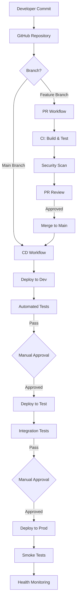

# EDI Platform Deployment Automation Documentation

**Version:** 1.0  
**Last Updated:** October 6, 2025  
**Status:** Production Ready  
**Owner:** EDI Platform Team

---

## 📚 Documentation Overview

This directory contains comprehensive deployment automation documentation for the EDI Platform, covering CI/CD pipelines, deployment strategies, and operational procedures.

## 📖 Document Catalog

| Document | Purpose | Audience |
|----------|---------|----------|
| [01-deployment-overview.md](./01-deployment-overview.md) | High-level deployment architecture and strategy | All team members |
| [02-github-actions-setup.md](./02-github-actions-setup.md) | GitHub Actions infrastructure and configuration | DevOps Engineers |
| [03-cicd-workflows.md](./03-cicd-workflows.md) | Detailed CI/CD workflow implementations | Developers, DevOps |
| [04-deployment-procedures.md](./04-deployment-procedures.md) | Step-by-step deployment procedures | Operations Team |
| [05-adf-deployment.md](./05-adf-deployment.md) | Azure Data Factory deployment guide | Data Engineers |
| [06-rollback-procedures.md](./06-rollback-procedures.md) | Emergency rollback procedures | Operations, Support |
| [07-troubleshooting-guide.md](./07-troubleshooting-guide.md) | Common issues and resolutions | All team members |
| [08-security-compliance.md](./08-security-compliance.md) | Security scanning and compliance | Security Team, DevOps |

## 🎯 Quick Start

### For Developers
1. Read [01-deployment-overview.md](./01-deployment-overview.md) for context
2. Review [03-cicd-workflows.md](./03-cicd-workflows.md) for PR and merge workflows
3. Understand [06-rollback-procedures.md](./06-rollback-procedures.md) for emergency scenarios

### For DevOps Engineers
1. Start with [02-github-actions-setup.md](./02-github-actions-setup.md) for initial configuration
2. Follow [03-cicd-workflows.md](./03-cicd-workflows.md) to implement workflows
3. Configure monitoring per [04-deployment-procedures.md](./04-deployment-procedures.md)

### For Operations Team
1. Review [04-deployment-procedures.md](./04-deployment-procedures.md) for deployment execution
2. Memorize [06-rollback-procedures.md](./06-rollback-procedures.md) for incident response
3. Reference [07-troubleshooting-guide.md](./07-troubleshooting-guide.md) as needed

## 🏗️ Architecture Overview

## 🌍 Environment Strategy

| Environment | Purpose | Deployment Trigger | Approval Required | Data |
|-------------|---------|-------------------|-------------------|------|
| **Dev** | Development testing | Automatic on merge to `main` | No | Synthetic |
| **Test** | Integration testing | Manual after dev validation | 1 reviewer | Anonymized production copy |
| **Staging** | Pre-production validation | Manual after test validation | 2 reviewers | Production-like synthetic |
| **Prod** | Production workloads | Manual with change control | 2 reviewers + approval gate | Live production data |

## 🔐 Security & Compliance

### Authentication
- **Azure OIDC:** Passwordless authentication via OpenID Connect
- **No Secrets:** No long-lived credentials stored in GitHub
- **Short-Lived Tokens:** Tokens valid only for workflow duration

### Scanning
- **IaC Security:** Checkov, PSRule for Azure
- **Code Security:** CodeQL, .NET Security Analyzers
- **Dependencies:** Dependabot, Snyk
- **Secrets:** GitHub Secret Scanning with push protection

### Compliance
- **HIPAA:** Security scanning, access controls, audit logging
- **Change Control:** Approval gates, change validation
- **Audit Trail:** All deployments logged with SHA, actor, timestamp

## 📊 Deployment Metrics

### Key Performance Indicators

| Metric | Target | Current | Status |
|--------|--------|---------|--------|
| Deployment Frequency | Daily | TBD | 🟡 In Progress |
| Lead Time for Changes | < 1 day | TBD | 🟡 In Progress |
| Change Failure Rate | < 15% | TBD | 🟡 In Progress |
| Mean Time to Recovery | < 1 hour | TBD | 🟡 In Progress |
| Deployment Success Rate | > 95% | TBD | 🟡 In Progress |

### Monitoring Dashboards
- **Azure Monitor:** Real-time resource health
- **Application Insights:** Application performance
- **GitHub Actions:** Workflow execution metrics
- **Cost Management:** Budget tracking and forecasting

## 🚀 Deployment Workflow Summary

### Infrastructure Deployment (Bicep)
1. **PR Created:** CI validates Bicep, runs what-if, security scans
2. **PR Approved:** Merge to main triggers CD workflow
3. **Dev Deploy:** Automatic deployment to dev environment
4. **Test Deploy:** Manual trigger after dev validation
5. **Prod Deploy:** Manual trigger with approval gates

### Function App Deployment (.NET)
1. **PR Created:** CI builds, tests, security scans
2. **PR Approved:** Merge to main builds deployment artifacts
3. **Dev Deploy:** Automatic deployment to dev function apps
4. **Test Deploy:** Manual trigger after integration tests
5. **Prod Deploy:** Blue-green deployment with health checks

### Azure Data Factory Deployment
1. **ADF Authoring:** Develop in ADF UI connected to Git
2. **PR Workflow:** Validation build from collaboration branch
3. **Main Merge:** Export ARM templates via build
4. **Environment Deploy:** Deploy ARM templates to target environment
5. **Post-Deploy:** Run validation tests and data quality checks

## 🛠️ Tools & Technologies

| Category | Tool | Purpose |
|----------|------|---------|
| **CI/CD Platform** | GitHub Actions | Workflow orchestration |
| **IaC** | Azure Bicep | Infrastructure provisioning |
| **Security Scanning** | Checkov, PSRule, CodeQL | Vulnerability detection |
| **Dependency Management** | Dependabot | Automated dependency updates |
| **Monitoring** | Azure Monitor, App Insights | Observability |
| **Notifications** | Microsoft Teams | Team communication |

## 📞 Support & Contacts

| Role | Contact | Escalation |
|------|---------|------------|
| **Platform Lead** | vincemic | @vincemic |
| **DevOps Team** | @platform-team | @security-team |
| **On-Call** | PagerDuty | After-hours support |
| **Security Team** | @security-team | Security incidents |

## 📝 Document Maintenance

- **Review Cadence:** Quarterly or after major platform changes
- **Update Procedure:** PR to this repository with 2 approvals
- **Version History:** See Git commit history
- **Feedback:** Create GitHub issue or contact @vincemic

## 🎓 Training Resources

- [GitHub Actions Documentation](https://docs.github.com/en/actions)
- [Azure Bicep Documentation](https://learn.microsoft.com/azure/azure-resource-manager/bicep/)
- [Azure DevOps Best Practices](https://learn.microsoft.com/azure/architecture/checklist/dev-ops)
- [HIPAA Compliance on Azure](https://learn.microsoft.com/azure/compliance/offerings/offering-hipaa-us)

---

**Next Steps:**
1. Complete [02-github-actions-setup.md](./02-github-actions-setup.md) for initial configuration
2. Implement workflows from [03-cicd-workflows.md](./03-cicd-workflows.md)
3. Test deployment procedures from [04-deployment-procedures.md](./04-deployment-procedures.md)
4. Configure monitoring and alerting

**Status:** ✅ Ready for initial deployment
