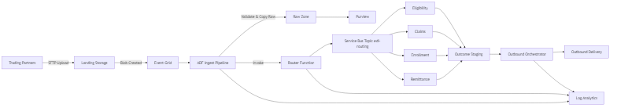
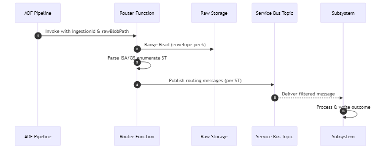

# Healthcare EDI Ingestion & Data Lake Platform – Architecture Specification

> **Note:** For GitHub Actions CI/CD implementation details, see [04a-github-actions-implementation.md](./04a-github-actions-implementation.md)

## 1. Overview / Executive Summary

This document defines the target architecture for ingesting healthcare EDI (e.g., X12 270/271, 276/277, 278, 834, 835, 837, custom CSV/JSON companion outputs) files delivered by external trading partners via SFTP, landing them securely in Azure, and persisting canonical copies plus enriched metadata into an Azure Data Lake for downstream analytics, compliance retention, and operational reporting. The solution emphasizes HIPAA compliance, least‑privilege security, automation, observability, repeatability (Infrastructure as Code), and a governed SDLC.

## 2. Business Goals & Success Criteria

- Reliable near–real‑time ingestion of partner EDI payloads (target under 5 minutes from arrival to raw zone persistence)
- Immutable retention of original (“as received”) artifacts for compliance & dispute resolution (WORM optional per policy)
- Standardized metadata for lineage, partner attribution, transaction set, file integrity, timestamps
- Scalable to > N partners (design target 50+) and peak bursts (e.g., eligibility morning spikes)
- Security & Compliance: HIPAA PHI handling, encryption in transit & at rest, auditable access
- Operational Excellence: automated onboarding, self‑service partner configuration via code + metadata, proactive monitoring & alerting
- Cost Transparency: tagging and cost allocation by environment & workload
- Deterministic Scheduled Workloads: governed automation for outbound and reconciliation runs that cannot rely on partner events

## 3. In-Scope

- Ingestion of EDI files via per‑partner SFTP user accounts (Managed SFTP on Storage / Azure SFTP pattern)
- Routing to Azure Data Lake Storage Gen2 with multi‑zone layout (raw / curated / processed)
- Metadata extraction (file, partner, transaction set, size, checksum, received timestamps, processing status)
- Event‑driven orchestration using Azure Data Factory (ADF) pipelines & triggers (option: Event Grid + Azure Functions for advanced parsing)
- Time-based orchestration via Enterprise Scheduler for internally generated or outbound EDI workloads
- Centralized secret & key management (Azure Key Vault)
- Observability: Logging, metrics, lineage, and alerting (Log Analytics, Azure Monitor, Azure Purview / Microsoft Purview)
- Infrastructure as Code (Bicep) and CI/CD pipelines for promotion across dev/test/prod

## 4. Out-of-Scope (Phase 1)

- Full semantic parsing / transformation of EDI into relational models (will be staged for downstream pipelines)
- Real-time API-based ingestion (e.g., AS2, API gateway transactions)
- Master data management or downstream analytics warehouse modeling
- Data quality rule authoring beyond basic structural validation

## 5. Core Architectural Principles

1. Zero Trust / Least Privilege – RBAC & ACL minimization, just-in-time elevation
2. Separation of Concerns – Ingestion vs. enrichment vs. analytics tiers
3. Idempotent & Replayable – Ability to reprocess from immutable raw store
4. Event-Driven First – Prefer storage and message events for partner-driven flows, complemented by governed scheduling for proactive workloads
5. Declarative Infrastructure – Everything versioned & reproducible via IaC
6. Secure by Default – Encryption, private endpoints, restricted egress
7. Observability First – Unified telemetry, lineage, and SLA tracking
8. Metadata-Centric – All processing actions stamped & queryable

## 6. Target High-Level Architecture

(See accompanying diagram – textual description below.)



[Mermaid source](./diagrams/architecture-overview.mmd)

### Components

- **Trading Partners** (External and Internal) – All systems sending or receiving EDI data, including:
  - External partners (payers, providers, clearinghouses) via SFTP
  - Internal systems (eligibility, claims, enrollment, remittance) via configured endpoints
- Azure Storage (SFTP-enabled hierarchical namespace) – Partner landing and outbound containers/folders
- Event Grid (Blob Created events)
- Azure Data Factory – Orchestrates validation, tagging, movement, and status updates
- Optional Azure Function / Container App – Pluggable EDI pre-processor (checksum, virus scan, structural validation)
- Azure Data Lake Storage Gen2 – Multi-zone structure
- Azure Key Vault – Secrets (SFTP local accounts keys/SSH public keys if needed), service principals, encryption keys (if CMK)
- Microsoft Purview – Data catalog, lineage capture (ADF integration)
- Log Analytics Workspace – Central logging, query, alert rules
- Azure Monitor / Action Groups – Alerts (failed pipeline, latency thresholds)
- GitHub – Repository, Actions workflows (CI for IaC + ADF JSON, CD for releases)
- Azure Active Directory (Entra ID) – Managed Identities for ADF, Functions, Purview scanners
- Azure Service Bus (Topics) – Durable routing fan‑out for trading partner endpoints
- Enterprise Scheduler (ADF + Function + Service Bus) – Governs time-based EDI generation and reconciliation jobs (see 14-enterprise-scheduler-spec)
- **Partner Integration Adapters** (within platform scope) – Bidirectional connectors for each trading partner endpoint, handling format transformation and protocol adaptation

### Routing & Trading Partner Integration (Overview)

The core ingestion architecture is extended by a Routing Layer that decouples raw file validation/persistence from transactional processing and outbound distribution. After a file is validated and the immutable raw copy is persisted, a lightweight routing function (or ADF activity invoking a Function) parses only the envelope headers needed to emit one routing message per ST transaction. These messages are published to a Service Bus Topic (e.g., `edi-routing`) with filterable application properties (`transactionSet`, `partnerCode`, `priority`, `direction`).

**All trading partners** (both external partners and internal systems like eligibility, claims, enrollment management, remittance) are configured with integration endpoints and adapters. Each trading partner:

- Has a unique partner code and configuration profile
- Connects via configured endpoints (SFTP, REST API, database, message queue)
- May send data to the platform (inbound), receive data from the platform (outbound), or both (bidirectional)
- Receives data through partner-specific integration adapters that handle format transformation and protocol adaptation

For example, the Enrollment Management system is configured as an internal trading partner that:

- Receives inbound 834 transactions via Service Bus subscription
- Implements event sourcing internally for transaction processing
- Sends outcome signals back through the platform for acknowledgment generation
- Operates with the same loose coupling as external partners

This unified pattern:

1. Treats all data sources and destinations consistently as trading partners
2. Prevents tight coupling between ingestion/outbound throughput and partner system responsiveness
3. Enables independent scaling and retry semantics per partner via Service Bus DLQs
4. Provides a normalized, minimal metadata contract (no PHI) for routing
5. Allows each trading partner to implement their own architectural patterns without impacting the platform
6. Simplifies configuration by using the same partner model for internal and external systems

Outbound acknowledgment and response generation (TA1, 999, 271, 277, 835) is orchestrated separately (Durable Function or scheduled ADF pipeline) aggregating subsystem outcomes and constructing response EDI files in an outbound staging area before partner pickup. See companion `08-transaction-routing-outbound-spec.md` for full details.

Key additions introduced by the Routing Layer:

- Service Bus Topic: `edi-routing` plus subscription rule governance.
- Routing Function: Stateless, envelope‑peek only (avoid full file parse cost on hot path).
- Correlation IDs: `ingestionId` (file) and `routingId` (per ST) propagate through logs and outbound lineage.
- Outbound Orchestrator: Builds acknowledgment/response artifacts; publishes optional `edi-outbound-ready` signal.

Security Notes (Routing Scope):

- Principle of least privilege: Router granted read on raw container + send on routing topic only.
- No PHI or member identifiers placed into routing messages—envelope & technical metadata only.
- Control numbers managed centrally to avoid duplication; stored in a concurrency‑safe counter store.

Performance Considerations:

- Envelope peek reads only the first N KB of the raw blob; large file size does not linearly impact routing latency.
- Target routing publish latency p95 < 2 seconds from raw persistence.

(Detailed sequencing, message schema, control number governance, and outbound acknowledgment SLAs are defined in `08-transaction-routing-outbound-spec.md`.)

### Enterprise Scheduler (Time-Based Generation)

Some enterprise processes must originate EDI transactions on a fixed cadence (e.g., nightly enrollment deltas, weekly compliance acknowledgments, monthly financial remittances). To support these proactive workloads without reverting to bespoke cron jobs, the platform incorporates an **Enterprise Scheduler** that executes within Azure Data Factory and Azure Functions:

- Schedule definitions live in source control (`config/schedules`) and are validated by CI to ensure change governance.
- An ADF trigger invokes `pl_schedule_dispatch`, which evaluates calendars, blackout windows, and dependencies before publishing jobs to a dedicated Service Bus topic.
- `fn_scheduler_router` fan-outs execution to target pipelines or Functions (e.g., outbound assemblers, reconciliation scripts) while applying retry and SLA monitoring policies.
- Observability is captured in Log Analytics (`SchedulerRun_CL`), and operations receive alerts on late or failed jobs.

Reference `14-enterprise-scheduler-spec.md` for the detailed design, configuration schema, and operational playbooks supporting this capability.

#### Routing Fast Path Sequence (Mermaid)



[Mermaid source](./diagrams/routing-sequence.mmd)

### Data Lake Zoning (Example)

- `raw/partner=<code>/transaction=<x12set>/ingest_date=YYYY-MM-DD/filename`
- `staging/` (optional structural normalization or decompression)
- `curated/` (downstream transformed model – later phase)
- `metadata/` (catalog exports, process audit logs not in Log Analytics)

### Processing Sequence (Happy Path)

1. Partner uploads file via SFTP to assigned folder (e.g., `/inbound/partnerA/`)
2. Blob Created event emitted to Event Grid
3. Event triggers Data Factory pipeline (or Function which then invokes ADF) with blob URL + metadata
4. Pipeline executes: integrity checks (size > 0, extension matches allowlist), optional AV scan, compute checksum (SHA256)
5. Capture technical + business metadata (partner, transaction code inferred by file naming pattern or header peek) into metadata store (e.g., ADLS metadata folder and/or Purview custom lineage + Log Analytics custom table)
6. Move or copy (recommended: copy original to immutable raw path; optionally set legal hold/WORM if policy) and tag blob with classification labels
7. (Optional) Trigger downstream parsing pipeline (Phase 2) via pipeline dependency or event
8. Emit success/failure telemetry; update status table (e.g., Azure Table Storage or Delta Lake log) for traceability

### Error Handling

- Quarantine container for files failing structural or security validation
- Dead-letter event concept: Events that cause repeated pipeline failure logged and queued for agent-directed remediation
- Reprocessing: Agent-managed trigger referencing original blob path & metadata

## 7. Logical Architecture Layers

| Layer | Purpose |
|-------|---------|  
| Ingestion | Secure reception of partner files (SFTP) |
| Orchestration | Pipeline coordination, conditional branching (ADF) |
| Validation & Prep | Integrity, security, classification |
| Routing Layer | Envelope peek + publish transaction routing events (Service Bus) |
| Storage (Raw) | Immutable retention of originals |
| Storage (Staging/Curated) | (Future) Transformation outputs |
| **Partner Integration** | Bidirectional adapters for all trading partners (external and internal) |
| Outbound Assembly | Generate acknowledgments / response EDI files |
| Metadata & Catalog | Lineage, schema, audit, discovery |
| Observability | Logs, metrics, alerts, SLA dashboards |
| Security & Governance | IAM, encryption, policy, compliance |

## 8. Technology Choices Rationale

- Azure Storage SFTP vs. standalone SFTP VM: PaaS managed, integrates with Blob events, lower ops overhead.
- Event Grid vs. ADF schedule triggers: True event-driven, lower latency and cost vs. polling.
- Data Factory: Native integration with diverse sinks, monitoring UI, Purview lineage.
- Optional Azure Function: Extensible for advanced validations not natively supported.
- Azure Service Bus (Topics): Durable, ordered, filterable fan‑out decoupling ingestion from downstream processing with DLQ isolation.
- Purview: Central governance & lineage (mandatory for regulated data lineage evidence).
- Key Vault & Managed Identities: Eliminates embedded secrets, supports rotation.
- IaC (Bicep): Declarative, modular, environment parity.

## 9. High-Level Naming Conventions (Illustrative)

- Resource Group: `rg-edi-${env}`
- Storage Account (Landing/Data Lake): `stedi${env}001`, `datalake${env}001`
- Key Vault: `kv-edi-${env}`
- Data Factory: `adf-edi-${env}`
- Log Analytics: `log-edi-${env}`
- Purview: `pvw-edi-${env}`
- Function App: `func-edi-validate-${env}`
- Tags: `env=${env}`, `owner=dataplatform`, `costCenter=...`, `dataSensitivity=PHI`

## 10. Capacity & Scale Considerations

- Target throughput: design for burst 100 files/minute aggregated across partners
- Average file size: assume 1–5 MB (eligibility, claims); plan for occasional 50–100 MB batches (use parallel block blob upload client config if needed)
- Storage performance tier: Hot for landing + raw; lifecycle to Cool/Archive after retention threshold (policy-driven)
- Concurrency: ADF pipeline concurrency limited by integration runtime; scale with parallel activities and separation of validation vs. copy

## 11. Extensibility

- Plug-in parser architecture (Function dispatch by transaction set)
- Partner config file (JSON/Delta) drives dynamic routing, naming validation, and expected frequency SLA
- Feature flags (App Config / Key Vault secrets) to toggle advanced validation steps
- Routing plug-ins: Additional subscription handlers can be added without modifying ingestion pipelines by attaching new filtered Service Bus subscriptions.
- Outbound template library: Segment templates for acknowledgments maintained independently from ingestion code.

## 12. Dependencies & Integrations

- Identity: Entra ID (Managed Identities)
- Security Ops: SIEM integration (export diagnostic logs)
- Downstream Analytics: Synapse / Fabric (Phase 2)
- **Trading Partners (Internal and External)**: All partners consume routing messages and send responses/acknowledgments:
  - **External Partners**: Traditional healthcare trading partners (payers, providers, clearinghouses)
  - **Internal Partners**: Internal systems treated as trading partners with configured endpoints:
    - Claims Processing Partner (837, 276, 277 transactions)
    - Eligibility Service Partner (270, 271 transactions)
    - Enrollment Management Partner (834 transactions with event sourcing)
    - Remittance Processing Partner (835, 820 transactions)
- Outbound Acknowledgment Flow: Aggregates partner outcome signals to build TA1/999/271/277/835 responses

## 13. Assumptions

- Trading partners can be provisioned with SFTP credentials or SSH keys
- File naming patterns follow documented standard to infer transaction types
- Network access to Storage SFTP endpoint is restricted via firewall + private endpoints (partners use public SFTP as required; alternative IP allowlist)

## 14. Open Questions

- Are legal hold / immutability policies (Blob Immutable Storage) mandated for all raw EDI files? Duration?
- Required retention period (e.g., 7 years)?
- Need for near real-time downstream transformations in Phase 1?
- Volume projections per trading partner (external and internal) for sizing cost model?
- Service Bus namespace multi-tenant vs. dedicated? (Throughput & isolation)
- Preferred orchestrator for outbound (ADF vs. Durable Functions)?
- Control number store implementation (Table vs. Durable entity)?
- Configuration approach for internal trading partners vs external (same schema or extended)?

---
(Additional sections—security, data flow, IaC, SDLC—will be in companion documents.)

## Appendix A – Healthcare EDI Transaction Catalog (Overview)

This catalog summarizes commonly supported ASC X12N HIPAA healthcare transaction sets (plus key technical acknowledgments) to ground architectural routing, storage, and outbound response design. For each transaction: purpose, primary business use, salient data elements (envelope + core segments – not exhaustive), typical internal routing destinations, security/PHI considerations, and expected response/acknowledgment patterns are listed. This serves as a master reference for partner onboarding, routing rule authoring, and observability dashboards.

### Legend / Conventions

- Control Numbers: Interchange (ISA13), Functional Group (GS06), Transaction (ST02), Claim/Eligibility control numbers appear in specific segments (e.g., BHT, TRN, CLM, NM1).
- Acknowledgments: TA1 (interchange), 999 (functional syntax), 277CA (claims acknowledgement variant), 271 (eligibility response), 277 (claim status), 835 (remittance), 824 (application advice – optional), 997 (legacy; superseded by 999 but may appear historically), 864 (text report – rare), 820 (payment order – sometimes paired with 835 EFT).
- Routing: Describes the internal subsystem or domain service that consumes the routing message/event (after envelope peek) and any secondary processors (e.g., analytics, compliance audit).
- PHI Sensitivity: High (contains member/claim data), Medium (member identifiers but limited clinical detail), Low (primarily financial/summary) – all treated as PHI under platform security; classification drives minimization in routing metadata.

### A.1 Eligibility Inquiry / Response (270 / 271)

| Aspect | 270 Inquiry | 271 Response |
|--------|-------------|--------------|
| Purpose | Request eligibility & benefit info for a subscriber/dependent | Return coverage, benefit, plan, service-level details |
| Core Segments (beyond envelope) | BHT, HL loops (2000A/B/C/D), NM1 (submitter, receiver, subscriber, dependent), TRN (trace), DTP (service date), EQ (service type), REF (trace/mbr id) | BHT, HL loops mirrored, NM1, TRN (echo), EB (eligibility or benefit), DTP, MSG (text), AAA (rejection), REF |
| Key Identifiers | TRN02 (trace), Subscriber/Member ID (NM109), Provider NPI (NM109 in 2100A) | Echo TRN02, Member ID, EB qualifiers |
| Typical Routing | Eligibility service (real-time or near RT); analytics (volumes, rejection codes) | Returns assembled outbound path to partner via outbound orchestrator |
| Expected Responses | 999 (syntax) and 271 (business) | TA1/999 from partner on our 271 (if partner returns ack); none internally |
| PHI Sensitivity | Medium | Medium |
| Notable Errors | AAA segments (request reject), missing coverage | AAA segments conveying denial reason |

### A.2 Claim (Professional / Institutional / Dental) – 837P / 837I / 837D

| Aspect | Description |
|--------|-------------|
| Purpose | Submit healthcare claims for reimbursement (professional, institutional facility, dental). |
| Core Segments | BHT, NM1 loops (billing provider, subscriber, patient, payer), HL hierarchical loops, CLM (claim), DTP (service dates), SV1/SV2/SV3 (service lines), REF (claim identifiers), HI (diagnosis codes), NM1 rendering/referring providers, AMT, CAS (adjustments – sometimes later). |
| Key Identifiers | CLM01 (claim submitter’s identifier), Patient/Subscriber IDs, Payer ID, Billing provider NPI (NM109), BHT03 (reference). |
| Typical Routing | Claims intake service -> pre-adjudication validation -> claim repository; compliance audit; analytics (lag patterns). |
| Expected Responses | TA1 (if interchange issue), 999 (syntax), 277CA (claim acknowledgment/validation status), later 835 (remittance) and 277 (claim status) depending on lifecycle. |
| PHI Sensitivity | High (diagnosis/procedure). |
| Notable Errors | Validation (invalid codes), duplicate CLM01, subscriber not eligible, provider not authorized. |

### A.3 Remittance Advice – 835

| Aspect | Description |
|--------|-------------|
| Purpose | Communicate adjudicated claim payment details, adjustments, and patient responsibility amounts. |
| Core Segments | BPR (payment order), TRN (trace/EFT reference), REF (payer identifiers), CLP (claim payment info), NM1 loops (payer, payee, patient), CAS (adjustments), AMT (totals), PLB (provider-level adjustments), SVC (service line), DTM (dates). |
| Key Identifiers | TRN02 (trace/EFT), CLP01 (claim control), Payer ID, Payee NPI/TIN. |
| Typical Routing | Remittance processing service -> financial posting, reconciliation, analytics, provider portal export. |
| Expected Responses | 999 (syntax) back to payer if inbound; rarely 824 if application-level issue. Outbound side: none beyond partner’s acks. |
| PHI Sensitivity | High (claim/member). |
| Notable Errors | Control total mismatch, missing associated claim, duplicate TRN, adjustment code mapping failures. |

### A.4 Enrollment (Member Maintenance) – 834

| Aspect | Description |
|--------|-------------|
| Purpose | Add, change, terminate, or reinstate member coverage and demographic details. |
| Core Segments | INS (member action), REF (subscriber/mbr identifiers), DTP (effective dates), NM1 loops (member, sponsor, payer), HD (coverage details), LX (transaction set line number), COB (coordination of benefits), AMT, N1 (sponsor/employer). |
| Key Identifiers | INS03 (maintenance reason), REF*0F (subscriber ID), Member ID, Policy/Group number (REF), Coverage effective dates (DTP). |
| Typical Routing | Enrollment service -> member master data store -> eligibility engine refresh. |
| Expected Responses | TA1 (if structural), 999 (syntax). Some trading partners also exchange 824 for application acceptance/rejection; internally may generate 999 + optional 824. |
| PHI Sensitivity | Medium (demographics, coverage – limited clinical). |
| Notable Errors | Overlapping coverage date, termination without prior enrollment, invalid maintenance reason code. |

### A.5 Claim Status Inquiry / Response – 276 / 277

| Aspect | 276 Inquiry | 277 Response |
|--------|------------|--------------|
| Purpose | Request status of previously submitted claim(s). | Provide status (accepted, denied, pending, paid) and action codes. |
| Core Segments | BHT, HL loops, TRN (trace), REF (claim identifier), DTP (service date), NM1 loops (provider, payer, subscriber), PAT | BHT, HL loops, TRN (echo), STC (status info), REF (claim or control numbers), DTP, SVC (service line status). |
| Key Identifiers | Claim control/reference (REF), TRN02, Provider NPI, Patient ID | STC status codes, echoed claim reference, TRN02. |
| Typical Routing | Claim inquiry processor -> claim repository index lookup. | Claim status service -> outbound assembly. |
| Expected Responses | 999 (syntax), 277 (business). | TA1/999 (partner acks). |
| PHI Sensitivity | Medium (claim reference, limited detail) | Medium |
| Notable Errors | Unknown claim, invalid date range, unauthorized provider | Missing internal claim mapping, stale status. |

### A.6 Health Care Services Review (Prior Authorization) – 278 (Request & Response)

| Aspect | Request (278) | Response (278) |
|--------|-------------|----------------|
| Purpose | Request authorization for healthcare services or admissions. | Grant, pend, modify, or deny services. |
| Core Segments | BHT, HL loops (requester, subscriber, dependent), UM (request details), HCR (certification), HSD (quantity/time), REF (patient/control), DTP (service dates), AAA (reject) | Mirror BHT/HL, UM (review outcome), HCR, REF, DTP, AAA (denial), MSG. |
| Key Identifiers | REF (patient/control), UM01 (request category) | Echo control REF, certification number, UM outcome. |
| Typical Routing | Prior auth service -> clinical/utilization management workflow. | Same service -> outbound response assembly. |
| Expected Responses | 999 (syntax), 278 response (business). | TA1/999 acks from partner on outbound. |
| PHI Sensitivity | High (clinical intent/procedures). | High (clinical outcome). |
| Notable Errors | Missing clinical documentation, invalid service type, coverage inactive | Inconsistent certification, duplicate request. |

### A.7 Payment Order / Remittance – 820 (If Used)

| Aspect | Description |
|--------|-------------|
| Purpose | Transmit premium payment or payment order and remittance information (often payer to plan/employer or employer to payer). |
| Core Segments | BPR (payment), TRN (trace), REF (originator), DTM (dates), N1 loops, ENT (entity detail), RMR (remittance ref), SE. |
| Key Identifiers | TRN02 (trace), RMR02 (invoice/remit ref), Payer/Payee IDs. |
| Typical Routing | Finance/payment reconciliation module; pairing with related 834/benefit invoice. |
| Expected Responses | 999 (syntax) optionally 824 (application) if rejection or balancing issue. |
| PHI Sensitivity | Low (financial, not clinical). |
| Notable Errors | Amount mismatch, unknown invoice reference, duplicate TRN. |

### A.8 Application Advice – 824 (Optional)

| Aspect | Description |
|--------|-------------|
| Purpose | Provide application-level acceptance/rejection (beyond syntactic 999) for inbound 834, 820, 837, etc. |
| Core Segments | BGN (begin), OTI (transaction info), REF (reference), TED (error details), SE. |
| Key Identifiers | OTI02 (group control), OTI03 (transaction set), REF (reference to original), TED segments (error codes). |
| Typical Routing | Generated by application validation module when business content fails (e.g., invalid coverage change). |
| Expected Responses | 999 (syntax) for the 824 itself; no business response. |
| PHI Sensitivity | Low (should avoid detailed PHI – error codes only). |
| Notable Errors | Provided as codes in TED segments. |

### A.9 Functional Acknowledgment – 999 & Legacy 997

| Aspect | Description |
|--------|-------------|
| Purpose | Report syntactic validation results at functional group & transaction level (AK1/AK2/IK3/IK4/AK9). 997 legacy analogous without detailed error codes. |
| Core Segments | AK1, AK2, IK3/IK4 (errors), AK9 (summary). |
| Key Identifiers | AK1/AK2 reference GS06, ST02; AK9 aggregates counts. |
| Typical Routing | Outbound orchestrator after validation engine results aggregated. |
| Expected Responses | Partner may send TA1 if interchange issue with our 999. No further business response. |
| PHI Sensitivity | Low. |
| Notable Errors | Syntax, segment sequence, missing required element. |

### A.10 Interchange Acknowledgment – TA1

| Aspect | Description |
|--------|-------------|
| Purpose | Accept/reject interchange envelope (ISA/IEA) before functional-level processing. |
| Core Segments | TA1 segment within X12 interchange (not its own transaction set). |
| Key Identifiers | Interchange control number (ISA13), date/time, error code. |
| Typical Routing | Immediate generation by envelope validator if structural errors. |
| Expected Responses | None (terminal). |
| PHI Sensitivity | Low. |
| Notable Errors | ISA/IEA mismatch, invalid date, repetition separator error. |

### A.11 Claim Status Response (277) & Claim Acknowledgment (277CA distinction)

| Aspect | Description |
|--------|-------------|
| Purpose | 277CA specifically acknowledges receipt/validation of 837 claim; 277 (status) communicates ongoing adjudication outcomes. |
| Core Segments | STC (status codes), BHT, HL loops, TRN, REF (claim ctrl), SVC (service line), DTP. |
| Key Identifiers | Claim control number (REF), STC01 composite status, TRN02. |
| Typical Routing | Claims status engine -> outbound orchestrator; analytics for turnaround metrics. |
| Expected Responses | 999 from partner for our 277; inbound we produce 999 + downstream claim ingest. |
| PHI Sensitivity | Medium–High depending on included service info. |
| Notable Errors | Status code mapping, orphaned status (no prior claim). |

### A.12 Miscellaneous / Less Common (If Required Future Phases)

- 864 Text Report: human-readable report; rarely used – consider converting to structured log.
- 880 Grocery Products Invoice (not healthcare) – exclude unless multi-industry.
- NCPDP Telecom (non-X12) – distinct standard; out-of-scope here.

### A.13 Transaction to Response Matrix (Summary)

| Inbound Transaction | Primary Business Response | Technical Acks Expected | Possible Additional Responses | Outbound Timing Considerations |
|---------------------|---------------------------|-------------------------|-------------------------------|-------------------------------|
| 270 | 271 | TA1 (if envelope), 999 | 824 (rare) | Near real-time (<2–5 min) |
| 276 | 277 | TA1, 999 | (None) | Near real-time |
| 278 Request | 278 Response | TA1, 999 | 824 (if business rule fail) | Near real-time or short batch |
| 834 | 999 | TA1 | 824 (application advice) | Batch (daily or intra-day) |
| 820 | 999 | TA1 | 824 | Batch (financial settlement windows) |
| 837 (P/I/D) | 999, 277CA, later 277 status, 835 remittance | TA1 | 824 (optional), 277 (subsequent) | Multi-stage lifecycle (minutes to days) |
| 835 | (None – financial) | TA1, 999 | 824 (if we issue application rejection) | Batch (payer schedules) |
| 824 | (None) | TA1, 999 | — | As generated by application engine |
| 999 | (None) | TA1 | — | Within SLA (<15 min) |
| TA1 | (None) | — | — | Immediate |
| 277CA | (Intermediate) | TA1, 999 | 277 (later), 835 (final) | Within hours |
| 277 (status) | 835 (ultimate financial) | TA1, 999 | — | Periodic until final |

### A.14 Routing Metadata Minimization

Only minimal, non-PHI envelope metadata is published on the routing topic: `transactionSet`, `partnerCode`, `interchangeControl`, `functionalGroup`, `stPosition`, `routingId`, `ingestionId`, checksum, and correlation key. Member IDs, claim numbers (CLM01), diagnosis/procedure codes, monetary amounts, and benefit details are deliberately excluded at the routing layer to uphold least-privilege and minimize sensitive data propagation.

### A.15 Observability Crosswalk

| Transaction | Key Metrics | Error Signals | SLA Anchor |
|------------|-------------|--------------|-----------|
| 270/271 | Inquiry volume, response latency | AAA rejects spike | Response latency (<2–5 min) |
| 278 | Auth request count, decision latency | AAA/denials | Decision latency (<15 min initial) |
| 834 | Member adds/terms, reject rate | 824 negative count | Daily batch completion window |
| 837 | Claim intake rate, 277CA issuance latency | 999 rejects, 277CA errors | 999 <15m; 277CA <4h |
| 835 | Payment posting latency | Control total mismatch alerts | Remit availability vs payer SLA |
| 276/277 | Inquiry -> status turnaround | STC error code anomalies | Status response <2–5 min |
| 820 | Payment order variance | Balancing failures | Settlement window adherence |
| 824 | Application reject trends | High error code concentration | N/A (supporting) |
| 999 | Syntax reject ratio | AK9 reject spike | <15 min from ingest |
| TA1 | Interchange reject ratio | Envelope errors per partner | Immediate (<5 min) |

### A.16 Security & Compliance Notes

- Encryption: All transactions at rest & in transit (TLS/SFTP); optional PGP Phase 2 for 834, 837, 835 based on partner requirements.
- Access Segmentation: Claim (837) & Remittance (835) raw paths may require stricter ACLs vs. eligibility (270/271) due to richer PHI & financial data.
- Retention: Proposed uniform baseline (e.g., 7 years) with potential shorter analytic derivative retention; catalog enables differential retention policies by transaction if required.
- Data Masking: Downstream curated views must ensure suppression of unneeded clinical codes for non-claims personas.

### A.17 Future Extensions

- Add FHIR mapping reference table (837 -> Claim FHIR resources; 834 -> Coverage/Enrollment; 270/271 -> CoverageEligibilityRequest/Response) when Phase 2 semantics parsing begins.
- Introduce automated completeness scoring for 837 (presence of HI segments, CLM line counts) feeding quality dashboards.
- Evaluate addition of 275 (attachments) if prior authorization / claim documentation exchange becomes in-scope.

---

## Appendix B: Component Responsibility Matrix

This matrix clarifies which architectural components handle each transaction type through its lifecycle, from ingestion through acknowledgment generation. Use this for impact analysis when modifying system components.

### B.1 Transaction Processing & Acknowledgment Responsibility

| Inbound Transaction | Ingestion & Validation | Routing | Trading Partner Recipient | Technical Ack Generator | Business Response Generator | Notes |
|---------------------|------------------------|---------|---------------------------|------------------------|----------------------------|-------|
| **834 (Enrollment)** | Core Platform (ADF) | Router Function | Enrollment Management Partner (configured internal partner with event sourcing) | Core (TA1 if structural), Core (999) | N/A (internal state changes only) | Large file handling; concurrent member processing |
| **837 (Claims)** | Core Platform (ADF) | Router Function | Claims Processing Partner (configured internal partner) | Core (TA1, 999) | Outbound Orchestrator (277CA) | Multi-ST fan-out; control number critical |
| **835 (Remittance)** | Core Platform (ADF) | Router Function | Remittance Processing Partner (configured internal partner) | Core (TA1, 999) | N/A (inbound only) | Financial variance monitoring; stricter ACL |
| **270 (Eligibility Inquiry)** | Core Platform (ADF) | Router Function | Eligibility Service Partner (configured internal partner) | Core (999) | Outbound Orchestrator (271) | Low latency path; p95 < 2 min target |
| **271 (Eligibility Response)** | Core Platform (ADF) | Optional (analytics) | Analytics (optional) | Core (999) | N/A (already response) | Stored for trace; may skip routing if configured |
| **276 (Claim Status Inquiry)** | Core Platform (ADF) | Router Function | Claims Status Service Partner (configured internal partner) | Core (999) | Outbound Orchestrator (277) | Parity with 270 latency |
| **277 (Claim Status)** | Core Platform (ADF) | Router Function | Claims Status Service Partner (configured internal partner) | Core (999) | Outbound Orchestrator (835 eventual) | Drives remittance SLA timer |
| **277CA (Claim Ack)** | Core Platform (ADF) | Router Function | Claims Processing Partner (configured internal partner) | Core (999) | Outbound Orchestrator (277 lifecycle updates) | Marks claim validation stage |
| **278 (Prior Auth Request)** | Core Platform (ADF) | Router Function | Prior Authorization Service Partner (configured internal partner) | Core (999) | Outbound Orchestrator (278 Response) | Priority escalation via partner config |
| **278 (Prior Auth Response)** | Core Platform (ADF) | Router Function (analytics) | Analytics (optional) | Core (999 if errors) | N/A (already response) | Completion of auth lifecycle |
| **820 (Payroll Deduction)** | Core Platform (ADF) | Router Function | Finance/Remittance Partner (configured internal partner) | Core (TA1, 999) | N/A (inbound only) | Financial variance monitoring |
| **824 (Application Advice)** | Core Platform (ADF) | Optional (analytics) | Analytics | Core (999) | N/A (already application response) | Generated internally for business rejects; may skip routing |
| **999 (Functional Ack - inbound)** | Core Platform (ADF) | Router Function | Ack Correlation Service | Core (TA1 if envelope error) | N/A | Correlates to outbound files; updates validation metrics |
| **TA1 (Interchange Ack - inbound)** | Core Platform (ADF) | Ack Correlation Service | Ack Correlation Service | N/A (we received it) | N/A | Immediate structural failure escalation |

### B.2 Component Definitions

| Component | Responsibility | Technology |
|-----------|---------------|------------|
| **Core Platform (ADF)** | File ingestion, structural validation, raw persistence, metadata extraction | Azure Data Factory + Storage Events |
| **Router Function** | Envelope parsing (ISA/GS/ST), routing message publication | Azure Function (HTTP/Event trigger) |
| **Trading Partner Integration Adapters** | Bidirectional data transformation and protocol adaptation for all partners (external and internal) | Azure Functions, Service Bus, partner-specific connectors |
| **Trading Partners (External)** | External healthcare organizations sending/receiving EDI (payers, providers, clearinghouses) | SFTP, AS2, API endpoints |
| **Trading Partners (Internal)** | Internal systems configured as partners with dedicated endpoints and processing logic | Service Bus subscriptions, internal APIs, databases |
| **Core Technical Ack Generator** | TA1 (interchange errors), 999 (syntax validation) generation immediately post-ingestion | Core Platform (ADF activity or inline Function) |
| **Outbound Orchestrator** | Business response aggregation (271, 277CA, 278R, 835), control number management, file assembly | Azure Function (Timer/Durable) + Azure SQL (control store) |
| **Ack Correlation Service** | Tracks inbound acks (999, TA1) received from partners, correlates to outbound files | Analytics / Monitoring (Log Analytics queries) |

### B.3 Acknowledgment Type Matrix

| Ack Type | Trigger Condition | Generated By | Timing | SLA Target |
|----------|------------------|--------------|--------|------------|
| **TA1** | ISA/IEA mismatch or structural interchange errors | Core Platform | **Deferred post-validation** (< 5 min acceptable) | < 5 min from ingestion |
| **999** | Functional group or transaction syntax validation | Core Platform | Post-structural validation | < 15 min from ingestion |
| **271** | Successful 270 eligibility inquiry processing | Outbound Orchestrator (aggregates Eligibility Service outcomes) | After eligibility determination | < 5 min from 270 ingestion |
| **277** | Claim status update or inquiry response | Outbound Orchestrator (aggregates Claims Service outcomes) | Variable (inquiry vs lifecycle update) | < 30 min (inquiry); batch (lifecycle) |
| **277CA** | Claim acceptance acknowledgment | Outbound Orchestrator (aggregates Claims intake validation) | After initial claim validation | < 4 hrs from 837 ingestion |
| **278 Response** | Prior authorization determination | Outbound Orchestrator (aggregates Prior Auth Service outcomes) | After authorization review | < 15 min from 278 request |
| **824** | Application-level rejection (business rule failure) | Outbound Orchestrator (triggered by destination system business reject signal) | On reject condition | Variable (within parent transaction SLA) |
| **835** | Payment remittance advice | Outbound Orchestrator (aggregates payment cycle outcomes) | Payment cycle completion | Payer-specific (e.g., weekly) |

### B.4 Data Flow Sequence by Transaction Type

#### B.4.1 837 Claim (Full Lifecycle Example)

```text

1. Partner SFTP Upload (837 file)

   ↓

2. Core Platform Ingestion (ADF)
   - Validate ISA/IEA envelope
   - Persist raw file (immutable)
   - Extract metadata

   ↓

3. Core Technical Ack Generation
   - Generate TA1 if structural errors (defer OK)
   - Generate 999 for syntax validation

   ↓

4. Router Function
   - Parse ST segments (claims)
   - Publish routing messages to Service Bus (edi-routing)

   ↓

5. Claims Processing (Destination System)
   - Subscribe to Service Bus (filter: transactionSet = '837%')
   - Process claim business logic
   - Write outcome signal to staging (accepted/rejected/pended)

   ↓

6. Outbound Orchestrator
   - Poll/event-trigger from staging
   - Aggregate claim outcomes
   - Generate 277CA (claim acknowledgment)
   - Acquire control numbers from Azure SQL
   - Persist 277CA file to outbound storage

   ↓

7. Partner Retrieval (SFTP)
   - Partner downloads TA1, 999, 277CA from outbound path

```

#### B.4.2 270/271 Eligibility (Fast Path Example)

```text

1. Partner SFTP Upload (270 inquiry)

   ↓

2. Core Platform Ingestion (ADF) - validate & persist

   ↓

3. Core Technical Ack (999 - minimal delay)

   ↓

4. Router Function - publish to edi-routing

   ↓

5. Eligibility Service (Destination System)
   - Subscribe (filter: transactionSet = '270')
   - Determine eligibility
   - Write outcome signal (eligible/not eligible/pended)

   ↓

6. Outbound Orchestrator
   - Generate 271 response (< 5 min target)
   - Persist to outbound storage

   ↓

7. Partner Retrieval (999 + 271)

```

#### B.4.3 834 Enrollment (Event Sourcing Example)

```text

1. Partner SFTP Upload (834 batch)

   ↓

2. Core Platform Ingestion - validate & persist raw

   ↓

3. Core Technical Ack (TA1 if needed, 999)

   ↓

4. Router Function - publish to edi-routing

   ↓

5. Enrollment Management (Event Sourcing Destination System)
   - Subscribe (filter: transactionSet = '834')
   - Append domain events (MemberEnrolled, CoverageChanged, etc.)
   - Build projections (current enrollment state)
   - Write outcome signal (processed count, errors)

   ↓

6. Outbound Orchestrator
   - Optional: Generate 824 if application-level rejects

   ↓

7. Partner Retrieval (TA1, 999, optional 824)

```

### B.5 Component Modification Impact Analysis

Use this matrix to assess blast radius when modifying components:

| Component Change | Impacted Transaction Types | Testing Focus | Rollback Complexity |
|------------------|---------------------------|---------------|---------------------|
| **Core Ingestion Pipeline** | ALL | Full regression (all transaction types) | High (affects all partners) |
| **Router Function** | ALL (routing-dependent) | Routing message schema, Service Bus delivery | Medium (isolated Function; previous version redeployable) |
| **Outbound Orchestrator** | 271, 277CA, 278R, 835, 824 | Business response generation, control numbers | Medium (staging isolation limits blast radius) |
| **Control Number Store** | ALL (outbound acks) | Concurrency, gap detection, rollover | High (data persistence; requires backup/restore testing) |
| **Destination System (e.g., Claims)** | 837, 276, 277, 835 | Domain-specific; does not affect other transaction types | Low (isolated; other systems unaffected) |
| **Eligibility Service** | 270, 271 | Eligibility determination logic, latency | Low (isolated) |
| **Enrollment Management** | 834, optional 824 | Event sourcing, projections, reversal | Low (isolated; see doc 11) |

### B.6 Design Decisions Summary

| Decision Point | Choice | Rationale | Document Reference |
|----------------|--------|-----------|-------------------|
| **Control Number Store** | Azure SQL Database | ACID guarantees, optimistic concurrency, native backup/DR, observability integration | Doc 08 §14 |
| **TA1 Generation Timing** | Deferred post-validation (< 5 min acceptable) | Allows asynchronous processing without impacting ingestion throughput; meets SLA | Doc 08 §7, Appendix B.3 |
| **Routing Backbone** | Azure Service Bus Topics | Durable, ordered, filterable, DLQ isolation, proven at scale | Doc 01 §6, Doc 08 §3 |
| **Destination System Coupling** | Loosely coupled via Service Bus subscriptions | Enables independent scaling, deployment, and architecture choices (event sourcing vs CRUD) | Doc 01 §6, Doc 08 §3.1 |
| **Multi-Region DR** | Active-Passive with paired region | Cost-effective; RTO 2 hours acceptable; agent-directed failover | Doc 07 §?, Appendix B.7 (pending) |
| **Purview Lineage** | ADF automatic lineage (built-in) | Sufficient for Phase 1; custom REST API calls deferred | Doc 01 §6, Doc 02 §6 |
| **Event Grid vs Service Bus for Routing** | Service Bus (pending evaluation) | Ordering, filtering, DLQ required; Event Grid assessed for cost optimization | Doc 01 §6, Appendix B.8 (pending) |

### B.7 Multi-Region Disaster Recovery Strategy (Active-Passive)

**Decision: Active-Passive with Azure Paired Region** (cost-effective; RTO 2 hours acceptable)

| Component | Primary Region | Secondary Region (Paired) | Failover Strategy |
|-----------|----------------|---------------------------|-------------------|
| **Storage (Raw/Outbound)** | East US 2 (active writes) | Central US (GRS read-only) | Agent-triggered failover; promote secondary to read-write |
| **Azure SQL (Control Numbers)** | East US 2 (active) | Central US (geo-replica read-only) | Agent-triggered failover; validate counter integrity post-failover |
| **Service Bus Namespace** | East US 2 (active) | Central US (standby namespace, no geo-DR in Standard) | Recreate subscriptions in secondary; redirect router Function |
| **ADF** | East US 2 (active) | Central US (IaC redeploy) | Deploy ADF via Bicep to secondary; update triggers |
| **Functions (Router, Orchestrator)** | East US 2 (active) | Central US (standby deployment) | Update Function App DNS/config to secondary region |
| **Key Vault** | East US 2 (active) | Central US (replicated secrets) | Azure Key Vault geo-redundant by default; access via secondary endpoint |
| **Log Analytics** | East US 2 (active) | Central US (separate workspace or same multi-region) | Maintain separate workspace in secondary; merge queries for global view |

**Failover Procedure**:

1. **Detection**: Primary region outage detected via health probes (> 15 min sustained failure)
2. **Decision**: Governance agent declares disaster state and coordinates promotion
3. **Execution**:
   - Promote Storage GRS secondary to read-write (15-30 min)
   - Failover Azure SQL to geo-replica (< 5 min)
   - Redirect router Function config to secondary Service Bus namespace
   - Deploy ADF pipelines to secondary region via IaC
   - Update DNS / Front Door routing if applicable
4. **Validation**:
   - Run synthetic ingestion test file
   - Verify routing message delivery
   - Confirm control number integrity (run gap detection query)
5. **Communication**: Notify partners of temporary disruptions (< 2 hrs target)

**Failback Procedure**:

- After primary region restored, reverse failover steps
- Synchronize data changes made during outage (control numbers, audit logs)
- Validate parity before switching traffic back

**Cost Impact**: GRS storage ~2x LRS cost; geo-replica SQL ~2x single region; standby Functions minimal (consumption or stopped). Estimated +$200-300/month for DR posture (see Doc 10 Budget Plan).

**Testing**: Annual DR drill (synthetic failover) to validate RTO/RPO; document lessons learned.

### B.8 Event Grid vs Service Bus for Routing Layer (Evaluation Pending)

**Current State**: Service Bus Topics for routing (Doc 01, 08)

**Event Grid Evaluation Criteria**:

| Requirement | Service Bus | Event Grid | Recommendation |
|-------------|-------------|------------|----------------|
| **Message Ordering** | Guaranteed (sessions) | Not guaranteed | **Service Bus** (ordering critical for transactional integrity) |
| **DLQ & Retry** | Built-in per subscription | Per subscription (20 retries max) | **Service Bus** (mature DLQ handling) |
| **Filtering** | SQL filters (rich) | Advanced filtering (limited compared to SQL) | **Service Bus** (richer filter expressions) |
| **Throughput** | 1000+ msg/sec (Standard); more in Premium | 10M events/sec | Either sufficient for 5k files/week |
| **Cost** | ~$10-40/month (Standard; see Doc 10) | $0.60 per million events (first 100k free) | **Event Grid cheaper** if volume low |
| **At-Least-Once Delivery** | Yes | Yes | Both |
| **Integration with ADF** | Native | Native (via Event Grid trigger) | Both |
| **Observability** | Mature metrics | Mature metrics | Both |

**Decision**: **Continue with Service Bus** for routing due to:

- Ordering guarantees (critical for transactional sequences like 837 multi-ST)
- Richer SQL filtering (complex partner/transaction rules)
- Mature DLQ and retry policies (operational maturity)

**Event Grid Use Cases** (where appropriate):

- Blob storage events (already in use for ingestion trigger)
- Lightweight fan-out for analytics/observability sinks (non-critical paths)

**Reassessment Trigger**: If monthly routing messages exceed 5 million (cost crossover point), reevaluate Event Grid for non-ordered transaction types (e.g., 834 where order within file less critical).

---
