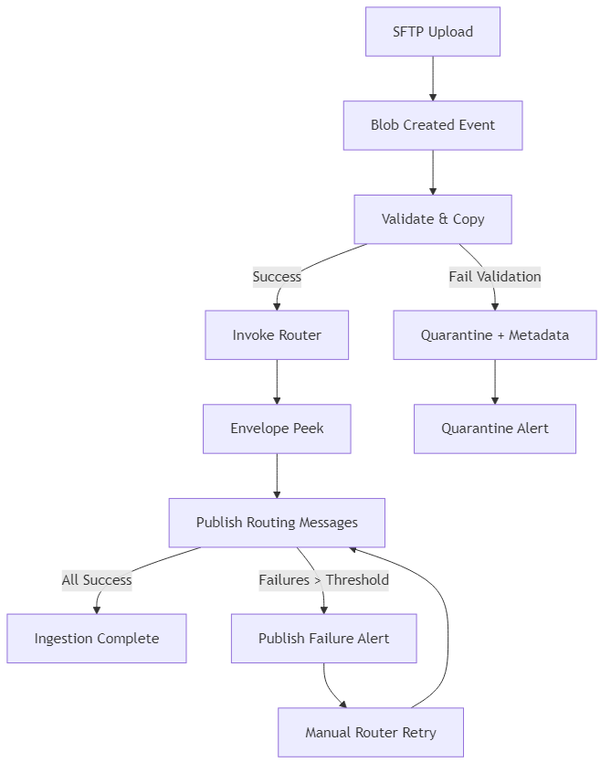

# Healthcare EDI Ingestion – Data Flow & Processing Specification

## 1. Purpose

Defines the end-to-end operational flow, validation logic, metadata model, error management, and reprocessing procedures for EDI file ingestion into Azure Data Lake using Azure Data Factory and supporting components.

## 2. Actors & Roles

| Actor | Description | Responsibilities |
|-------|-------------|------------------|
| Trading Partner SFTP User | External partner uploading EDI files | Sends files to designated SFTP directory with agreed naming pattern |
| Data Factory Managed Identity | Executes pipelines | Access Storage, Key Vault, writes metadata/logs |
| Operations Engineer | Monitors, manages incidents | Reviews failures, triggers reprocess |
| Data Steward / Governance | Ensures lineage and compliance | Reviews catalog, updates partner config |
| Security / Compliance | Audits access, ensures policies | Reviews logs, approves retention / immutability |

## 3. Inbound File Specification

### 3.1 Naming Convention

`<PartnerCode>_<TransactionSet>_<YYYYMMDDHHMMSS>_<Sequence>.<ext>`

- PartnerCode: Alphanumeric (max 10)
- TransactionSet: X12 code (e.g., 270, 271, 276, 277, 278, 834, 835, 837x, 999, TA1) or custom token
- Timestamp: UTC capture at sender generation
- Sequence: Zero-padded incremental (optional)
- ext: `edi`, `txt`, `dat`, `zip` (if batched/compressed)

### 3.2 Allowed File Types

| Type | Handling |
|------|----------|
| `.edi` / plain text | Process directly |
| `.zip` | Decompress to staging; treat each entry as inbound unit |
| PGP Encrypted (`.pgp`) | Decrypt (optional Phase 2) using Function + Key Vault held key |

### 3.3 Size Constraints

- Soft limit: 50 MB per file; spike tolerance 100 MB (activities branch to parallelized copy if >25 MB)

## 4. Event & Trigger Design

1. Partner upload to SFTP-enabled Storage container path `sftp-root/inbound/<partnerCode>/`.
2. Blob Created event published to Event Grid topic with subject filter on `/inbound/`.
3. Event subscription triggers ADF pipeline `pl_ingest_dispatch` (system/managed trigger binding) passing blob URL + system properties.
4. Optional filter on file extension to exclude temp/partial uploads (pattern `_tmp` or size=0). Consider partner guidance for atomic writes (upload to temp name then rename).

## 5. Pipeline Orchestration

### 5.1 Primary Pipelines

| Pipeline | Purpose |
|----------|---------|
| `pl_ingest_dispatch` | Entry point; validates naming, determines transaction set, routes |
| `pl_ingest_validate_copy` | Performs checksum, virus scan hook, copies to raw zone, tags blobs |
| `pl_ingest_zip_expand` | Decompresses archives to staging then invokes validate/copy foreach file |
| `pl_ingest_error_handler` | Centralized failure notification & quarantine actions |
| `pl_ingest_metadata_publish` | Writes metadata records to storage + Log Analytics custom table |

### 5.2 Activities (Illustrative)

- Get Metadata (blob properties)
- Azure Function (virus scan / structural peek) – optional
- If Condition (extension / size logic)
- ForEach (iterate archive entries)
- Copy Activity (landing -> raw zone path)
- Set Variable (transactionSet, partnerCode)
- Web Activity (call Purview lineage REST if not auto-captured)
- Stored Procedure / Data Flow (future parsing)

## 6. Validation Rules

| Rule | Description | Action on Fail |
|------|-------------|----------------|
| Naming Format | Regex match `^[A-Za-z0-9]{2,10}_(\d{3}[A-Za-z]?)_\d{14}_[0-9]{3,6}\.[A-Za-z0-9]+$` (example) | Quarantine + metadata status=NAME_INVALID |
| Partner Authorized | Partner code exists in partner config table | Quarantine + alert |
| Transaction Supported | Transaction set in allowed list for partner | Quarantine |
| Size > 0 | Non-empty file | Quarantine |
| Max Size | <= configured max size | Quarantine or Split (future) |
| Checksum Integrity | Re-hash after copy equals original | Retry then Quarantine |
| Virus Scan | AV engine returns clean | Quarantine + high severity alert |
| Structural Peek | Basic ISA/GS/IEA envelope consistency (for X12) | Quarantine |

## 7. Metadata Model (Logical)

| Field | Type | Source | Notes |
|-------|------|--------|-------|
| ingestionId | GUID | Generated | Correlates related records |
| partnerCode | String | File name / config | |
| transactionSet | String | File name / header parse | X12 code |
| originalFileName | String | Blob property | |
| receivedUtc | Timestamp | Event Grid event time | |
| processedUtc | Timestamp | Pipeline | |
| blobPathRaw | String | Constructed | Raw zone final path |
| checksumSha256 | String | Function / activity | Integrity validation |
| fileSizeBytes | Long | Blob properties | |
| validationStatus | Enum | Pipeline | SUCCESS / QUARANTINED / RETRY_PENDING |
| quarantineReason | String | Validation | Null if success |
| retryCount | Int | Pipeline variable | |
| envelopeControlNumbers | JSON | Parser (optional) | ISA13, GS06, etc. |
| lineageRef | String | Purview asset GUID | |
| dataSensitivity | String | Config (PHI/PII) | Blob tag duplicate |

Metadata persisted in: (a) ADLS `metadata/ingestion/YYYY/MM/DD/*.json` (append-only), (b) Log Analytics custom table `EDIIngestion_CL`, (c) Optional Delta table for analytics.

## 8. Storage Path Patterns

- Landing (SFTP root): `sftp-root/inbound/<partnerCode>/...`
- Raw Zone: `raw/partner=<partnerCode>/transaction=<transactionSet>/ingest_date=YYYY-MM-DD/<originalFileName>`
- Quarantine: `quarantine/partner=<partnerCode>/ingest_date=YYYY-MM-DD/<originalFileName>`
- Metadata: `metadata/ingestion/date=YYYY-MM-DD/part-*.json`

## 9. Error Handling & Quarantine

### 9.1 Failure Categories

| Category | Examples | Severity |
|----------|----------|----------|
| Validation | Naming, unauthorized partner | Medium |
| Security | Virus detected, tampering | High |
| System | ADF activity timeout, network | Medium |
| Data Integrity | Checksum mismatch | High |

### 9.2 Quarantine Workflow

1. Move (or copy+delete) failing file to quarantine path preserving original name.
2. Append metadata record with `validationStatus=QUARANTINED`.
3. Emit alert (Action Group -> email/Teams/ServiceNow).
4. Operations triages; either delete permanently (per policy) or reprocess after correction.

## 10. Reprocessing Procedure

- Trigger manual pipeline `pl_reprocess` with parameters: `originalBlobPath`, `force=true/false`.
- Pipeline fetches metadata record, validates that file exists in raw or quarantine.
- If quarantine: copy back to staging temp, re-run validation sequence.
- Update metadata with incremented `retryCount` and new status.

## 11. Idempotency & Duplicate Detection

- Checksum + partnerCode + transactionSet + receivedUtc minute window used to detect duplicates.
- If duplicate detected and policy=SKIP: record metadata with `validationStatus=SKIPPED_DUPLICATE`.
- If policy=KEEP: store anyway; maintain pointer to first ingestionId.

## 12. Purview Lineage Strategy

- Register raw zone container as data asset collection.
- Use ADF’s built-in lineage for Copy Activity (source: landing, sink: raw). If landing excluded from catalog, create pseudo-source asset referencing partner logical source system.
- Add custom lineage for quarantine and reprocess events via REST API.

## 13. Observability & Metrics

| Metric | Definition | Target |
|--------|-----------|--------|
| IngestionLatencySeconds | processedUtc - receivedUtc | < 300 sec p95 |
| ValidationFailureRate | failures / total per day | < 2% |
| QuarantineCount | Count per partner | Watch trend |
| DuplicateRate | duplicates / total | < 1% |
| MeanFileSizeMB | Rolling average | Capacity planning |
| PipelineFailures | ADF activity errors | 0 critical |

Dashboards: Workbook combining Log Analytics queries + Purview lineage visuals.

## 14. SLA & SLO Examples

- SLO: 95% of files available in raw zone within 5 minutes.
- SLA (internal): 99.5% pipeline availability monthly.

## 15. Security Controls in Flow

- No plaintext PHI leaves Storage network boundary (private endpoint used for internal operations; SFTP uses secure channel)
- All metadata excluding PHI (no claim lines) – only envelope & technical data.

## 16. Extensibility Hooks

- Azure Function custom validators registry (Key Vault secret controlling active validator list)
- Feature flag: enable_pgp_decrypt, enable_av_scan, enable_structural_peek

## 17. Configuration Artifacts

| Artifact | Format | Location |
|----------|--------|----------|
| Partner Config | JSON/Delta | `config/partners/partners.json` |
| Transaction Policy | JSON | `config/transactions/` |
| Feature Flags | App Config / KV | Key Vault secrets or App Configuration |

## 18. Operational Runbook References (See Ops Spec)

- Quarantine triage
- Reprocess manual trigger steps
- Adding a new partner

## 19. Routing Layer Sequence (Post-Validation)

  
[Mermaid source](./diagrams/routing-sequence.mmd)

### 19.1 Purpose

Extend core ingestion to emit granular routing messages per ST transaction segment without delaying raw persistence. Decouples downstream subsystem processing from ingestion throughput.

### 19.2 Sequence (Validated File -> Routing Event)

1. `pl_ingest_validate_copy` completes (SUCCESS) and records metadata (`ingestionId`, checksum, raw path).
2. ADF invokes Azure Function `func_router_dispatch` (Activity: Web/Function) passing `ingestionId` + `rawBlobPath`.
3. Function performs bounded envelope peek (reads first N KB) to extract ISA13, GS06, and enumerate ST segments.
4. For each ST segment, allocate `routingId` (GUID) and publish JSON message to Service Bus Topic `edi-routing` with application properties: `transactionSet`, `partnerCode`, `priority`.
5. Service Bus subscription rules deliver messages to subsystem queues (e.g., `sub-eligibility`, `sub-claims`).
6. Function writes a routing audit record to Log Analytics `RoutingEvent_CL` with latency = publishTime - validationCompleteTime.
7. Control: If publish failure after max retries, write poison record and raise alert (Ops runbook: Routing Publish Failure).

### 19.3 Routing Message JSON (Illustrative)

```json
{
  "routingId": "9f1c6d2e-3f3d-4b6c-9d4b-0e9e2a6c1a11",
  "ingestionId": "af82c4d7-...",
  "partnerCode": "PARTNERA",
  "transactionSet": "270",
  "interchangeControl": "123456789",
  "functionalGroup": "987654321",
  "stPosition": 1,
  "fileBlobPath": "raw/partner=PARTNERA/transaction=270/ingest_date=2025-09-22/PARTNERA_270_20250922120000_001.edi",
  "receivedUtc": "2025-09-22T12:00:10Z",
  "checksumSha256": "...",
  "priority": "standard",
  "correlationKey": "PARTNERA-123456789-987654321"
}
```

### 19.4 Failure & Retry Logic

- Transient Service Bus error: exponential backoff (250ms, 500ms, 1s, 2s, 4s) then fail.
- On failure: log `routingPublishStatus=FAILED`, emit alert (High if >5 failures in 10m), do NOT block ingestion completion; downstream processing for that file is halted until manual retry via `func_router_dispatch` re-invocation.

### 19.5 Performance Targets

- RoutingLatencyMs p95 < 2000.
- Publish success rate > 99.9% monthly.

## 19a. Ingestion & Routing Error Handling Diagram

  
[Mermaid source](./diagrams/routing-error-handling.mmd)

## 20. Downstream Subsystem Consumption Flow

Each subsystem (e.g., Eligibility) listens on a filtered subscription. Processing steps (outside ingestion SLA scope) typically:

1. Receive routing message; deserialize; idempotency check by `(routingId)` existence in subsystem state store.
2. Fetch raw file slice (or entire file if needed) using `fileBlobPath`; parse relevant segments.
3. Persist domain outcome (e.g., eligibility result, claim status placeholder) to its staging area with `routingId` linkage.
4. Emit outcome event (optional) or write record polled by Outbound Orchestrator.
5. On fatal parse error, abandon / dead-letter message; metrics increment `RoutingDLQCount`.

## 21. Outbound Response Assembly Sequence

### 21.1 Scope

Aggregates subsystem outcome fragments into standard acknowledgments / responses (TA1, 999, 271, 277, 835) referencing original control numbers and `ingestionId` for traceability. See `08-transaction-routing-outbound-spec.md` for deep design.

### 21.2 Sequence (Example: 999 Acknowledgment)

1. Trigger (Timer every 5 min or event `edi-outbound-ready`).
2. Query outcome staging for all validation results pending acknowledgment window.
3. Group by `partnerCode` + `interchangeControl` (and transactionSet where applicable).
4. Acquire envelope counters (ISA13/GS06) via counter store (optimistic concurrency with ETag).
5. Build segment list using template library; embed AK1/AK2/AK9 segments summarizing validation statuses.
6. Validate control counts and segment totals; compute checksum (SHA256) for metadata.
7. Write file to `outbound/partner=<code>/transaction=999/date=YYYY-MM-DD/<filename>.edi`.
8. Optionally publish Service Bus message to `edi-outbound-ready` with minimal metadata for notification pipeline.
9. Log audit record `AckAssembly_CL` with latency and included routingIds.
10. Errors: Move partial artifacts to `outbound-staging/errors/`; raise alert.

### 21.3 TA1 Negative Acknowledgment Early Path

If router detects structural ISA/IEA mismatch before routing messages emission:

1. Generate TA1 immediately (no routing messages).
2. Persist to outbound path; mark ingestion metadata `validationStatus=STRUCTURAL_ERROR`.
3. Alert operations (Severity Medium unless volume spike).

### 21.4 Control Number Collision Handling

- Detect via optimistic concurrency failure; re-fetch current counter and retry up to 5 times.
- If still failing, raise `ControlNumberCollision` alert and pause further assemblies (circuit breaker flag in config) until resolved.

### 21.5 Metrics Added

| Metric | Source | Definition |
|--------|--------|------------|
| RoutingLatencyMs | RoutingEvent_CL | publishTime - validationCompleteTime |
| RoutingDLQCount | Service Bus | Count dead-lettered routing messages |
| AckPublishCount | AckAssembly_CL | Number of outbound files generated |
| OutboundAssemblyLatencyMs | AckAssembly_CL | filePersistedTime - lastOutcomeReadyTime |
| ControlNumberRetries | AckAssembly_CL | Average retries to obtain counters |
| OutboundErrorRate | AckAssembly_CL | failedAssemblies / totalAssemblies |

## 22. Data Lineage Extension

- Link metadata chain: ingestion metadata (`ingestionId`) -> routing events (`routingId`) -> outbound acknowledgment file metadata.
- Purview custom lineage entries added asynchronously (batch job or Function) to avoid blocking hot path.

## 23. Updated Open Issues (Data Flow Scope)

- Determine batching window per transaction set (eligibility near real-time vs. claims batch).
- Decide on event-driven vs. scheduled trigger for outbound orchestrator.
- Select counter store implementation (Table Storage vs. Durable Entity) balancing simplicity vs. concurrency guarantees.
- Define SLAs for each acknowledgment type (e.g., 999 within 15 minutes, TA1 within 5 minutes).

## 24. Open Issues (Original Ingestion Scope)

- AV engine selection & licensing (Defender integration?)
- PGP decryption timeline
- Required lineage detail depth for audit signoff

---
