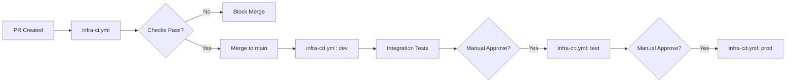

# Healthcare EDI Ingestion – Infrastructure as Code (IaC) & Environment Strategy

## 1. Objectives

Provide a standardized, repeatable, audited approach for provisioning and updating all Azure resources supporting EDI ingestion using declarative IaC (Bicep) integrated with CI/CD pipelines.

## 2. Scope

Includes: Resource Groups, Storage (landing + data lake), Key Vault, Data Factory, Event Grid Subscriptions, Function App (optional), Log Analytics, Purview, Monitoring artifacts (Action Groups, Alerts), Policies, Role Assignments. Excludes: Downstream analytics (Phase 2), manual partner key distribution.

## 3. Technology Selection

| Choice | Rationale |
|--------|-----------||
| Bicep | Native Azure, concise syntax, what-if deployments, modularization |
| azd (Azure Developer CLI) | Environment templating & consistent provisioning workflow |
| GitHub Actions | Version control + automated deployment gates, native GitHub integration |

## 3.1 GitHub Actions Workflow Structure

### Workflow Organization

```text
/.github
  /workflows
    infra-ci.yml                    # IaC validation on PR
    infra-cd.yml                    # Environment deployments
    function-ci.yml                 # Function app build & test
    function-cd.yml                 # Function deployment
    adf-export.yml                  # Data Factory export
    adf-deploy.yml                  # Data Factory deployment
    config-validation.yml           # Partner config validation
    drift-detection.yml             # Scheduled what-if check
    security-scan.yml               # Dependency & secret scanning
  /actions
    azure-login/                    # Reusable login composite action
    bicep-whatif/                   # Reusable what-if composite action
```

### Authentication Strategy

#### Recommended: OpenID Connect (OIDC) Federated Identity

Benefits over Service Principal secrets:

- No secret rotation required
- Short-lived tokens (auto-expiring)
- GitHub-native trust relationship
- Audit trail via Azure AD sign-in logs

#### Setup Requirements

1. **Azure AD App Registration** (per environment or shared)
   - Federated credential configuration:
     - Issuer: `https://token.actions.githubusercontent.com`
     - Subject: `repo:vincemic/ai-adf-edi-spec:environment:prod`
     - Audience: `api://AzureADTokenExchange`

1. **GitHub Secrets** (Repository-level)

  ```text
   AZURE_CLIENT_ID           # Application (client) ID
   AZURE_TENANT_ID           # Directory (tenant) ID
   AZURE_SUBSCRIPTION_ID     # Subscription ID
   ```

1. **GitHub Environments** (with protection rules)
   - `dev` - Auto-deploy on main branch
   - `test` - Manual approval (1 reviewer)
   - `prod` - Manual approval (2 reviewers, security team)

### Workflow Triggers

| Trigger | Use Case | Workflow |
|---------|----------|----------|
| `pull_request` | Validation & what-if | infra-ci.yml, function-ci.yml |
| `push: [main]` | Auto-deploy to dev | infra-cd.yml (dev job) |
| `workflow_dispatch` | Manual deploy | All CD workflows |
| `schedule: '0 2 * * *'` | Nightly drift check | drift-detection.yml |
| `release: published` | Prod release | infra-cd.yml (prod job) |

## 4. Repository Layout (Illustrative)

```text
/infra
  /bicep
    main.bicep
    variables.bicep
    modules/
      storage.bicep
      datafactory.bicep
      keyvault.bicep
      eventgrid.bicep
      functionapp.bicep
      servicebus.bicep
      router-function.bicep
      outbound-orchestrator.bicep
      monitoring.bicep
      purview.bicep
      policy.bicep
/env
  dev.parameters.json
  test.parameters.json
  prod.parameters.json
/pipelines
  adf_export_pipeline.yml
  infra_deploy.yml
/docs
```

## 5. Parameterization & Configuration

| Parameter | Purpose | Example |
|-----------|---------|---------|
| environment | Drive naming & tags | dev / test / prod |
| location | Azure region | eastus2 |
| enableCmk | Toggle CMK encryption | true/false |
| retentionDaysRaw | Lifecycle rule | 2555 |
| quarantineRetentionDays | Quarantine lifecycle | 90 |
| logAnalyticsRetention | Observability retention | 120 |
| partnerConfigPath | Path to partner config file | config/partners/partners.json |
| enableRouting | Toggle provisioning of routing layer | true/false |
| routingTopicName | Service Bus topic for routing | edi-routing |
| outboundReadyTopicName | Optional outbound topic | edi-outbound-ready |
| serviceBusSku | Namespace SKU (Basic/Standard/Premium) | Standard |
| enablePrivateEndpointsSb | Private endpoint for Service Bus | true/false |
| controlNumberStoreType | Counter backend (table/durable) | table |

## 6. Naming & Tagging

- Enforce via module outputs + central tag map (env, owner, costCenter, dataSensitivity, compliance=HIPAA)
- Azure Policy ensures required tags present at creation.

## 7. Deployment Workflow (Bicep)

### GitHub Actions Pipeline Flow



### Detailed Stage Breakdown

**1. Pull Request Validation** (`infra-ci.yml`)

- Checkout repository
- Azure CLI setup
- Bicep build & lint (fail on warnings)
- PSRule for Azure security scan
- Checkov IaC security scan
- Azure login (OIDC, dev subscription)
- `az deployment group what-if` against dev
- Post what-if summary as PR comment
- Upload build artifacts (compiled ARM JSON)

**2. Dev Environment Deployment** (triggered on merge to `main`)

- Download build artifact
- Azure login (dev environment)
- `az deployment group create` with dev parameters
- Wait for deployment completion
- Run smoke tests:
  - Storage account connectivity
  - Key Vault RBAC validation
  - Service Bus topic exists
  - Data Factory managed identity active
- Upload deployment manifest (resource IDs, outputs)

**3. Integration Tests** (post-dev deployment)

- Generate synthetic EDI file
- Upload via SFTP (test partner account)
- Poll for file in raw zone (timeout 5 min)
- Verify routing message published (if routing enabled)
- Check metadata in Log Analytics

**4. Test Environment Deployment** (manual approval required)

- GitHub Environment protection: 1 approver from data-engineering team
- Reuse compiled artifact from dev
- `az deployment group what-if` (post as deployment comment)
- Deploy with test parameters
- Run integration tests

**5. Production Deployment** (manual approval required)

- GitHub Environment protection: 2 approvers (security + platform lead)
- Change management ticket required (validated via API or manual)
- `az deployment group what-if` with annotation
- Deploy with prod parameters
- Post-deployment validation
- Create release annotation in Log Analytics
- Notify stakeholders (Teams webhook)

## 8. Data Factory Assets Versioning

- Use ADF Git integration (collaboration branch) or export pipelines via script `adf_export_pipeline.yml` to JSON artifacts under `adf/` directory.
- Deploy with ADF ARM template (Bicep can reference) or use `az datafactory pipeline create/update` steps.

## 9. Secret & Key Provisioning

| Item | Provision Step |
|------|----------------|
| Key Vault | Bicep module with RBAC & purge protection enabled |
| CMK | Optional `az keyvault key create` post-provision or Bicep key resource |
| SFTP Local Users | Scripted using Azure CLI post Storage creation (idempotent) |
| Diagnostic Settings | Bicep referencing Log Analytics workspace ID |
| Service Bus Auth (Managed) | No SAS keys; assign RBAC roles to identities |
| Control Number Counter Seed | Key Vault secret or Table entity created if absent |

## 10. Policies & Compliance as Code

- Policy definitions stored in `/infra/policy/` (JSON) + assignment modules.
- Example policies: disallow-public-keyvault, enforce-https-storage, require-private-endpoints, tag-enforcement.
- Deployed in management group or subscription context (separate pipeline if org standard).

## 11. Drift Detection

| Mechanism | Description |
|----------|-------------|
| `what-if` in CI | Flags unexpected resource changes |
| Azure Policy compliance scans | Identify config deviations |
| Scheduled pipeline | Nightly `what-if` summary report to channel |

## 13. Testing Strategy (IaC)

| Test Type | Tool | Purpose |
|----------|------|---------||
| Lint | `bicep build` + custom scripts | Syntax & best practice |
| Security Scan | PSRule for Azure, Checkov | Misconfig detection |
| Unit (Module) | Deployment to ephemeral RG | Validate outputs & dependencies |
| Integration | Deploy dev env; run synthetic ingestion event | Validate end-to-end |
| Policy Compliance | `az policy state summarize` | Confirm enforcement |

## 14. Rollback & Recovery

- Rollback via redeploy previous template version (artifact stored with hash + timestamp).
- For destructive mistakes: restore from backups (Key Vault soft delete, storage versioning for config, pipeline JSON in git).
- Maintain change log referencing deployment run IDs.

## 15. Environment Promotion Rules

| Rule | Rationale |
|------|-----------|
| No direct edits in Test/Prod | Prevent drift |
| Artifact immutability | Guarantees reproducibility |
| Parameter file diff required for env differences | Explicit, reviewable variance |
| Security review required for new public endpoints | Risk mitigation |

## 16. Observability Resources IaC

- Action Groups, Alert Rules (Pipeline failure metric, Quarantine spike, Latency threshold) defined as Bicep modules.
- Routing metrics: Namespace diagnostic settings exporting `IncomingRequests`, `OutgoingRequests`, `UserErrors`, `DeadletteredMessages` to Log Analytics.
- Custom logs: Router Function + Outbound Orchestrator Application Insights / Log Analytics linkage via diagnostic settings.
- Log Analytics solutions (AzureDiagnostics tables) configured via diagnostic settings.

## 17. Sample Bicep Snippet (Storage & SFTP User Skeleton)

```bicep
param storageName string
param location string
param tags object

resource stg 'Microsoft.Storage/storageAccounts@2023-01-01' = {
  name: storageName
  location: location
  sku: { name: 'Standard_LRS' }
  kind: 'StorageV2'
  properties: {
    allowBlobPublicAccess: false
    minimumTlsVersion: 'TLS1_2'
    supportsHttpsTrafficOnly: true
    isSftpEnabled: true
    isLocalUserEnabled: true
    allowSharedKeyAccess: false
  }
  tags: tags
}

// Local user example (public key provisioning would be separate or secure parameter)
resource localUser 'Microsoft.Storage/storageAccounts/localUsers@2023-01-01' = {
  name: '${storageName}/partnerA'
  properties: {
    hasSshPassword: false
    homeDirectory: '/inbound/partnerA'
    permissions: {
      root: 'lr'
      homeDirectory: 'lrw'
    }
    sshAuthorizedKeys: [
      {
        description: 'partnerA-key1'
        key: 'ssh-rsa AAAAB3Nz...'
      }
    ]
  }
  dependsOn: [ stg ]
}
```

### 17.1 Service Bus Topic & Subscriptions (Sample)

```bicep
param sbNamespaceName string
param routingTopicName string = 'edi-routing'
param enablePartitioning bool = true

resource sb 'Microsoft.ServiceBus/namespaces@2022-10-01-preview' = {
  name: sbNamespaceName
  location: location
  sku: {
    name: 'Standard'
    tier: 'Standard'
  }
  properties: {
    zoneRedundant: false
    disableLocalAuth: true
  }
  tags: tags
}

resource routingTopic 'Microsoft.ServiceBus/namespaces/topics@2022-10-01-preview' = {
  name: '${sbNamespaceName}/${routingTopicName}'
  properties: {
    enablePartitioning: enablePartitioning
    supportOrdering: true
    maxSizeInMegabytes: 1024
    defaultMessageTimeToLive: 'P7D'
  }
}

@description('Eligibility subscription filtered to 270/271')
resource subEligibility 'Microsoft.ServiceBus/namespaces/topics/subscriptions@2022-10-01-preview' = {
  name: '${sbNamespaceName}/${routingTopicName}/sub-eligibility'
  properties: {
    maxDeliveryCount: 10
    defaultMessageTimeToLive: 'P3D'
    lockDuration: 'PT1M'
  }
}

@description('Example SQL filter assignment via ARM not directly supported; use deployment script or CLI step for rules.')
module subRuleEligibility '../scripts/add-subscription-rule.bicep' = if (false) {
  name: 'rule-eligibility'
  params: {
    // placeholder for future module implementing rule create
  }
}
```

### 17.2 Router Function vs. Outbound Orchestrator

Two Function Apps (or one with isolated functions) recommended for least privilege separation:

- Router: trigger (HTTP from ADF or Event Grid) + Service Bus sender output binding.
- Outbound Orchestrator: timer / queue trigger reading subsystem outcomes + outbound assembly logic, optional Durable Functions entity for control numbers.

### 17.3 Control Number Store (Table Storage Option)

Table entity schema:
PartitionKey: `COUNTER` | RowKey: `<partnerCode>-<sequenceType>` | `currentValue` (int) | `updatedUtc` (datetime). Increment via optimistic concurrency (If-Match ETag) logic in Function code; exposed IaC only creates seed rows if absent (deployment script).

## 18. Governance & Approvals

- Mandatory reviewers: Security, Data Platform lead for resource changes.
- Automated check: Tag compliance, policy compliance summary comment on PR.

## 19. Risks & Mitigations (IaC Focus)

| Risk | Mitigation |
|------|-----------|
| Drift via portal edits | Nightly what-if + policy deny effects |
| Secrets accidental commit | Git hooks + secret scanning (TruffleHog) |
| Large blast radius changes | Module scoping + incremental deployments |
| Policy assignment timing | Separate pipeline ensures policies exist before resource deploy |
| SAS keys accidentally enabled on Service Bus | Enforce `disableLocalAuth=true` and policy audit |
| Over-privileged router function | Separate function app + minimal RBAC (Send only) |
| Subscription rule drift | Nightly validation script compares expected JSON filters vs. actual |
| Control number counter corruption | Nightly integrity check (monotonic progression query) + backup export |

## 20. Open Items

- Confirm adoption of azd vs. native scripts
- Define ephemeral preview environment lifecycle

---
