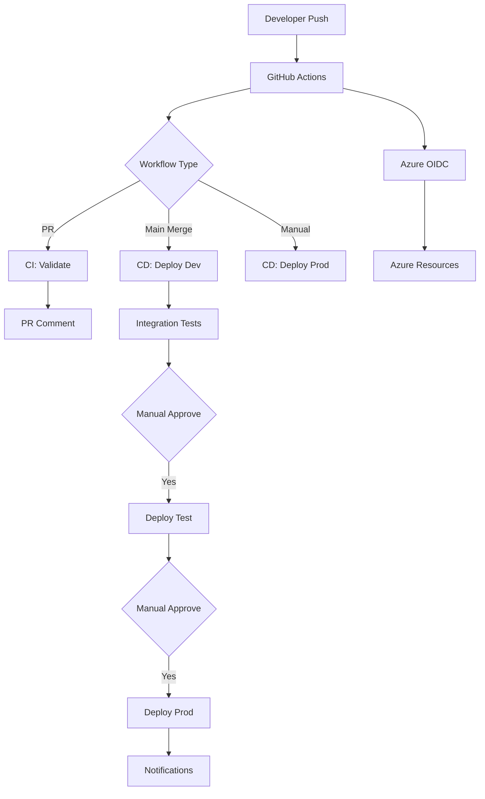

# Healthcare EDI Platform – GitHub Actions Implementation Guide

**Document Version:** 1.0  
**Last Updated:** October 2, 2025  
**Status:** Implementation Guide  
**Related Documents:**

- [04-iac-strategy-spec.md](./04-iac-strategy-spec.md)
- [05-sdlc-devops-spec.md](./05-sdlc-devops-spec.md)
- [06-operations-spec.md](./06-operations-spec.md)

---

## Table of Contents

1. [Overview](#1-overview)
2. [Repository Setup](#2-repository-setup)
3. [Azure Authentication Configuration](#3-azure-authentication-configuration)
4. [GitHub Environments](#4-github-environments)
5. [Workflow Catalog](#5-workflow-catalog)
6. [Reusable Components](#6-reusable-components)
7. [Security & Compliance](#7-security--compliance)
8. [Performance Optimization](#8-performance-optimization)
9. [Troubleshooting Guide](#9-troubleshooting-guide)

---

## 1. Overview

### 1.1 Purpose

This document provides detailed implementation guidance for GitHub Actions workflows supporting the Healthcare EDI Platform. It covers authentication setup, workflow configuration, best practices, and operational procedures specific to GitHub Actions.

### 1.2 Benefits of GitHub Actions

| Benefit | Description |
|---------|-------------|
| **Native Integration** | Tight coupling with GitHub repositories, PRs, and issues |
| **OIDC Authentication** | Passwordless, short-lived tokens for Azure access |
| **Marketplace Actions** | Extensive library of pre-built actions (Azure, security scanning) |
| **Free Tier** | 2,000 minutes/month for private repos, unlimited for public |
| **Matrix Strategies** | Parallel execution across environments/configurations |
| **Composite Actions** | Reusable workflow components |
| **Secrets Management** | Environment-scoped secrets with approval gates |

### 1.3 Architecture Overview



---

## 2. Repository Setup

### 2.1 Required Repository Structure

```text
ai-adf-edi-spec/
├── .github/
│   ├── workflows/
│   │   ├── infra-ci.yml
│   │   ├── infra-cd.yml
│   │   ├── infra-drift-detection.yml
│   │   ├── function-ci.yml
│   │   ├── function-cd.yml
│   │   ├── function-health-check.yml
│   │   ├── cost-monitoring.yml
│   │   ├── security-audit.yml
│   │   ├── adf-export.yml
│   │   ├── adf-deploy.yml
│   │   └── config-validation.yml
│   ├── actions/
│   │   ├── azure-login/
│   │   │   └── action.yml
│   │   ├── bicep-whatif/
│   │   │   └── action.yml
│   │   └── post-deployment-tests/
│   │       └── action.yml
│   ├── CODEOWNERS
│   └── pull_request_template.md
├── infra/
│   └── bicep/
├── src/
│   └── functions/
├── scripts/
│   ├── smoke-tests.ps1
│   ├── integration-tests.ps1
│   └── post-deploy-validation.ps1
└── env/
    ├── dev.parameters.json
    ├── test.parameters.json
    └── prod.parameters.json
```

### 2.2 Branch Protection Rules

Configure in **Settings → Branches → Branch protection rules**:

**Rule: `main`**

- ✅ Require a pull request before merging
  - Required approvals: 2
  - Dismiss stale reviews when new commits are pushed
  - Require review from Code Owners
- ✅ Require status checks to pass before merging
  - Required checks:
    - `validate / bicep-build`
    - `validate / security-scan`
    - `validate / whatif-dev`
- ✅ Require conversation resolution before merging
- ✅ Require signed commits
- ✅ Do not allow bypassing the above settings
- ✅ Restrict who can push to matching branches
  - Only admins and CI service accounts

**Rule: `hotfix/*`**

- Similar to main but:
  - Required approvals: 1
  - Allow force pushes (for rebase)
  - Include administrators in restrictions (can be overridden)

### 2.3 CODEOWNERS Configuration

Create `.github/CODEOWNERS`:

```text
# Infrastructure & IaC
/infra/                 @vincemic @platform-team
/env/                   @vincemic @platform-team
/.github/workflows/     @vincemic @platform-team

# Application Code
/src/functions/         @vincemic @data-engineering-team
/adf/                   @vincemic @data-engineering-team

# Configuration & Security
/config/partners/       @vincemic @partner-management-team @security-team
/docs/*security*        @vincemic @security-team
/docs/*compliance*      @vincemic @compliance-team

# Catch-all
*                       @vincemic
```

---

## 3. Azure Authentication Configuration

### 3.1 OpenID Connect (OIDC) Setup

#### Step 1: Create Azure AD App Registration (Per Environment)

```powershell
# Login to Azure
az login

# Variables
$appName = "github-actions-edi-prod"
$subscriptionId = "your-subscription-id"
$repo = "vincemic/ai-adf-edi-spec"
$environment = "prod"  # or null for repo-level

# Create App Registration
$app = az ad app create --display-name $appName --query appId -o tsv

# Create Service Principal
az ad sp create --id $app

# Create Federated Credential for Environment
az ad app federated-credential create `
  --id $app `
  --parameters @- <<EOF
{
  "name": "github-$environment",
  "issuer": "https://token.actions.githubusercontent.com",
  "subject": "repo:$repo:environment:$environment",
  "description": "GitHub Actions OIDC for $environment environment",
  "audiences": [
    "api://AzureADTokenExchange"
  ]
}
EOF

# Assign RBAC to Subscription (adjust scope as needed)
az role assignment create `
  --assignee $app `
  --role "Contributor" `
  --scope "/subscriptions/$subscriptionId/resourceGroups/rg-edi-$environment-eastus2"

# Get App Details
Write-Host "AZURE_CLIENT_ID: $app"
Write-Host "AZURE_TENANT_ID: $(az account show --query tenantId -o tsv)"
Write-Host "AZURE_SUBSCRIPTION_ID: $subscriptionId"
```

#### Step 2: Create Additional Federated Credentials

For PR validation (without environment):

```powershell
az ad app federated-credential create `
  --id $app `
  --parameters @- <<EOF
{
  "name": "github-pr",
  "issuer": "https://token.actions.githubusercontent.com",
  "subject": "repo:$repo:pull_request",
  "description": "GitHub Actions OIDC for PR validation",
  "audiences": [
    "api://AzureADTokenExchange"
  ]
}
EOF
```

For branch deployments:

```powershell
az ad app federated-credential create `
  --id $app `
  --parameters @- <<EOF
{
  "name": "github-main-branch",
  "issuer": "https://token.actions.githubusercontent.com",
  "subject": "repo:$repo:ref:refs/heads/main",
  "description": "GitHub Actions OIDC for main branch",
  "audiences": [
    "api://AzureADTokenExchange"
  ]
}
EOF
```

### 3.2 Required RBAC Assignments

| Identity | Scope | Role | Reason |
|----------|-------|------|--------|
| github-actions-edi-dev | rg-edi-dev-* | Contributor | Full IaC deployment |
| github-actions-edi-dev | Key Vault (dev) | Key Vault Secrets Officer | Seed initial secrets |
| github-actions-edi-test | rg-edi-test-* | Contributor | Full IaC deployment |
| github-actions-edi-prod | rg-edi-prod-* | Contributor | Full IaC deployment |
| github-actions-edi-prod | Subscription | Reader | Cost queries, policy checks |

**Minimal Privilege Alternative:**

Instead of `Contributor`, use granular roles:

- `Storage Blob Data Contributor`
- `Data Factory Contributor`
- `Service Bus Data Owner`
- `Key Vault Administrator`
- `Monitoring Contributor`

### 3.3 GitHub Secrets Configuration

Navigate to **Settings → Secrets and variables → Actions**:

**Repository Secrets** (used by all workflows):

```text
AZURE_CLIENT_ID          = <app-id-from-step-1>
AZURE_TENANT_ID          = <tenant-id>
AZURE_SUBSCRIPTION_ID    = <subscription-id>
```

**Environment Secrets** (if using different apps per env):

For `dev` environment:

```text
AZURE_CLIENT_ID          = <dev-app-id>
AZURE_SUBSCRIPTION_ID    = <dev-subscription-id>
```

For `prod` environment:

```text
AZURE_CLIENT_ID          = <prod-app-id>
AZURE_SUBSCRIPTION_ID    = <prod-subscription-id>
TEAMS_WEBHOOK_URL        = <teams-channel-webhook>
```

**Repository Variables** (non-sensitive):

```text
DEV_RESOURCE_GROUP       = rg-edi-dev-eastus2
TEST_RESOURCE_GROUP      = rg-edi-test-eastus2
PROD_RESOURCE_GROUP      = rg-edi-prod-eastus2
AZURE_LOCATION           = eastus2
```

---

## 4. GitHub Environments

### 4.1 Environment Configuration

Navigate to **Settings → Environments** and create:

#### Environment: `dev`

**Deployment branches:** `main` only

**Environment secrets:**

- (Inherit from repository if using same app)

**Environment variables:**

```text
RESOURCE_GROUP           = rg-edi-dev-eastus2
ENVIRONMENT              = dev
```

**Protection rules:**

- None (auto-deploy)

#### Environment: `test`

**Deployment branches:** `main` only

**Environment secrets:**

- (Environment-specific if needed)

**Protection rules:**

- ✅ Required reviewers: `@data-engineering-team` (1 approver)
- ✅ Wait timer: 0 minutes
- ⬜ Prevent administrators from bypassing

#### Environment: `prod`

**Deployment branches:** `main`, `hotfix/*`

**Environment secrets:**

- `AZURE_CLIENT_ID` (if separate app)
- `TEAMS_WEBHOOK_URL`

**Environment variables:**

```text
RESOURCE_GROUP           = rg-edi-prod-eastus2
ENVIRONMENT              = prod
ENABLE_CHANGE_VALIDATION = true
```

**Protection rules:**

- ✅ Required reviewers: `@security-team`, `@platform-lead` (2 approvers)
- ✅ Wait timer: 5 minutes (cooling-off period)
- ✅ Prevent administrators from bypassing

### 4.2 Concurrency Controls

Prevent multiple simultaneous deployments to same environment:

```yaml
# In workflow file
concurrency:
  group: deploy-${{ inputs.environment || 'dev' }}
  cancel-in-progress: false  # Queue deployments, don't cancel
```

---

## 5. Workflow Catalog

### 5.1 Infrastructure CI Workflow

**File:** `.github/workflows/infra-ci.yml`

**Purpose:** Validate Bicep templates on pull requests

**Triggers:** `pull_request` (paths: `infra/**`, `env/**`)

**Full Implementation:**

```yaml
name: Infrastructure CI

on:
  pull_request:
    branches: [main]
    paths:
      - 'infra/**'
      - 'env/**'
      - '.github/workflows/infra-ci.yml'
  workflow_dispatch:

permissions:
  id-token: write
  contents: read
  pull-requests: write
  security-events: write

jobs:
  validate:
    name: Validate IaC
    runs-on: ubuntu-latest
    
    steps:
      - name: Checkout Repository
        uses: actions/checkout@v4
      
      - name: Setup Azure CLI
        uses: azure/setup-azure-cli@v1
        with:
          version: 2.53.0
      
      - name: Install Bicep
        run: az bicep install
      
      - name: Bicep Build
        id: bicep-build
        run: |
          echo "::group::Building Bicep Templates"
          az bicep build --file infra/bicep/main.bicep
          echo "::endgroup::"
      
      - name: Bicep Lint
        run: |
          echo "::group::Linting Bicep Templates"
          # Fail on any warnings
          OUTPUT=$(az bicep lint infra/bicep/main.bicep 2>&1)
          echo "$OUTPUT"
          if echo "$OUTPUT" | grep -q "Warning\|Error"; then
            echo "::error::Bicep lint found issues"
            exit 1
          fi
          echo "::endgroup::"
      
      - name: PSRule Security Scan
        uses: microsoft/ps-rule@v2
        continue-on-error: true
        with:
          modules: PSRule.Rules.Azure
          inputPath: infra/bicep/
          outputFormat: Sarif
          outputPath: reports/ps-rule-results.sarif
      
      - name: Upload PSRule Results
        uses: github/codeql-action/upload-sarif@v2
        if: always()
        with:
          sarif_file: reports/ps-rule-results.sarif
          category: psrule
      
      - name: Checkov IaC Security Scan
        uses: bridgecrewio/checkov-action@v12
        with:
          directory: infra/bicep
          framework: bicep
          output_format: sarif
          output_file_path: reports/checkov-results.sarif
          soft_fail: false
          skip_check: CKV_AZURE_109  # Example: skip specific checks if justified
      
      - name: Upload Checkov Results
        uses: github/codeql-action/upload-sarif@v2
        if: always()
        with:
          sarif_file: reports/checkov-results.sarif
          category: checkov
      
      - name: Azure Login (OIDC)
        uses: azure/login@v1
        with:
          client-id: ${{ secrets.AZURE_CLIENT_ID }}
          tenant-id: ${{ secrets.AZURE_TENANT_ID }}
          subscription-id: ${{ secrets.AZURE_SUBSCRIPTION_ID }}
      
      - name: What-If Deployment (Dev)
        id: whatif
        continue-on-error: true
        run: |
          echo "::group::Running What-If Analysis"
          az deployment group what-if \
            --resource-group ${{ vars.DEV_RESOURCE_GROUP }} \
            --template-file infra/bicep/main.bicep \
            --parameters env/dev.parameters.json \
            --result-format FullResourcePayloads \
            --no-pretty-print \
            > whatif-output.txt 2>&1
          
          WHATIF_EXIT_CODE=$?
          echo "exit-code=$WHATIF_EXIT_CODE" >> $GITHUB_OUTPUT
          echo "::endgroup::"
      
      - name: Format What-If Output
        if: always()
        run: |
          cat whatif-output.txt | head -n 500 > whatif-summary.txt
          echo "" >> whatif-summary.txt
          echo "--- Output truncated at 500 lines ---" >> whatif-summary.txt
      
      - name: Post What-If Comment to PR
        uses: actions/github-script@v7
        if: github.event_name == 'pull_request'
        with:
          script: |
            const fs = require('fs');
            const output = fs.readFileSync('whatif-summary.txt', 'utf8');
            const exitCode = '${{ steps.whatif.outputs.exit-code }}';
            
            const statusEmoji = exitCode === '0' ? '✅' : '⚠️';
            const statusText = exitCode === '0' ? 'No unexpected changes' : 'Review changes carefully';
            
            const body = `### ${statusEmoji} Infrastructure What-If Results
            
            **Status:** ${statusText}
            **Exit Code:** ${exitCode}
            
            <details>
            <summary>Click to expand What-If output</summary>
            
            \`\`\`
            ${output}
            \`\`\`
            
            </details>
            
            ---
            
            **Next Steps:**
            - Review resource changes above
            - Ensure no unexpected deletions or modifications
            - Verify parameter values are correct for dev environment
            `;
            
            // Find existing comment
            const { data: comments } = await github.rest.issues.listComments({
              owner: context.repo.owner,
              repo: context.repo.repo,
              issue_number: context.issue.number
            });
            
            const botComment = comments.find(comment => 
              comment.user.type === 'Bot' && 
              comment.body.includes('Infrastructure What-If Results')
            );
            
            // Update or create comment
            if (botComment) {
              await github.rest.issues.updateComment({
                owner: context.repo.owner,
                repo: context.repo.repo,
                comment_id: botComment.id,
                body: body
              });
            } else {
              await github.rest.issues.createComment({
                owner: context.repo.owner,
                repo: context.repo.repo,
                issue_number: context.issue.number,
                body: body
              });
            }
      
      - name: Upload Build Artifacts
        uses: actions/upload-artifact@v4
        with:
          name: bicep-compiled-pr-${{ github.event.pull_request.number }}
          path: |
            infra/bicep/*.json
            env/*.parameters.json
            whatif-output.txt
          retention-days: 14
      
      - name: Job Summary
        if: always()
        run: |
          echo "## 📋 Validation Summary" >> $GITHUB_STEP_SUMMARY
          echo "" >> $GITHUB_STEP_SUMMARY
          echo "- **Bicep Build:** ${{ steps.bicep-build.outcome }}" >> $GITHUB_STEP_SUMMARY
          echo "- **PSRule Scan:** Completed (see Security tab)" >> $GITHUB_STEP_SUMMARY
          echo "- **Checkov Scan:** Completed (see Security tab)" >> $GITHUB_STEP_SUMMARY
          echo "- **What-If Analysis:** Exit Code ${{ steps.whatif.outputs.exit-code }}" >> $GITHUB_STEP_SUMMARY
```

### 5.2 Infrastructure CD Workflow

**File:** `.github/workflows/infra-cd.yml`

**Purpose:** Deploy infrastructure to environments

**Triggers:**

- `push` to `main` (auto-deploy dev)
- `workflow_dispatch` (manual for test/prod)

**Full Implementation:**

```yaml
name: Infrastructure CD

on:
  push:
    branches: [main]
    paths:
      - 'infra/**'
      - 'env/**'
  workflow_dispatch:
    inputs:
      environment:
        description: 'Target environment'
        required: true
        type: choice
        options:
          - dev
          - test
          - prod
      skip_tests:
        description: 'Skip post-deployment tests'
        required: false
        type: boolean
        default: false

permissions:
  id-token: write
  contents: read
  deployments: write

jobs:
  deploy-dev:
    name: Deploy to Dev
    if: |
      (github.event_name == 'push' && github.ref == 'refs/heads/main') ||
      (github.event_name == 'workflow_dispatch' && inputs.environment == 'dev')
    runs-on: ubuntu-latest
    environment: dev
    concurrency:
      group: deploy-dev
      cancel-in-progress: false
    
    outputs:
      deployment-name: ${{ steps.deploy.outputs.deployment-name }}
    
    steps:
      - uses: actions/checkout@v4
      
      - name: Azure Login
        uses: azure/login@v1
        with:
          client-id: ${{ secrets.AZURE_CLIENT_ID }}
          tenant-id: ${{ secrets.AZURE_TENANT_ID }}
          subscription-id: ${{ secrets.AZURE_SUBSCRIPTION_ID }}
      
      - name: Deploy Infrastructure
        id: deploy
        uses: azure/arm-deploy@v1
        with:
          scope: resourcegroup
          resourceGroupName: ${{ vars.DEV_RESOURCE_GROUP }}
          template: infra/bicep/main.bicep
          parameters: env/dev.parameters.json
          deploymentName: deploy-${{ github.run_number }}-${{ github.sha }}
          failOnStdErr: false
      
      - name: Tag Resources with Deployment Info
        run: |
          az tag create \
            --resource-id "/subscriptions/${{ secrets.AZURE_SUBSCRIPTION_ID }}/resourceGroups/${{ vars.DEV_RESOURCE_GROUP }}" \
            --tags \
              DeploymentId=${{ github.run_number }} \
              DeploymentSha=${{ github.sha }} \
              DeployedBy="${{ github.actor }}" \
              DeployedAt="$(date -u +%Y-%m-%dT%H:%M:%SZ)"
      
      - name: Run Smoke Tests
        if: inputs.skip_tests != true
        run: |
          pwsh -File scripts/smoke-tests.ps1 -Environment dev -ResourceGroup ${{ vars.DEV_RESOURCE_GROUP }}
      
      - name: Deployment Summary
        run: |
          echo "## ✅ Dev Deployment Complete" >> $GITHUB_STEP_SUMMARY
          echo "" >> $GITHUB_STEP_SUMMARY
          echo "- **Deployment Name:** ${{ steps.deploy.outputs.deployment-name }}" >> $GITHUB_STEP_SUMMARY
          echo "- **Resource Group:** ${{ vars.DEV_RESOURCE_GROUP }}" >> $GITHUB_STEP_SUMMARY
          echo "- **Commit:** ${{ github.sha }}" >> $GITHUB_STEP_SUMMARY
          echo "- **Run:** ${{ github.run_number }}" >> $GITHUB_STEP_SUMMARY

  deploy-test:
    name: Deploy to Test
    needs: deploy-dev
    if: |
      success() &&
      (github.event_name == 'workflow_dispatch' && 
       (inputs.environment == 'test' || inputs.environment == 'prod'))
    runs-on: ubuntu-latest
    environment: test
    concurrency:
      group: deploy-test
      cancel-in-progress: false
    
    steps:
      - uses: actions/checkout@v4
      
      - name: Azure Login
        uses: azure/login@v1
        with:
          client-id: ${{ secrets.AZURE_CLIENT_ID }}
          tenant-id: ${{ secrets.AZURE_TENANT_ID }}
          subscription-id: ${{ secrets.AZURE_SUBSCRIPTION_ID }}
      
      - name: What-If Deployment
        run: |
          echo "::group::What-If Analysis"
          az deployment group what-if \
            --resource-group ${{ vars.TEST_RESOURCE_GROUP }} \
            --template-file infra/bicep/main.bicep \
            --parameters env/test.parameters.json
          echo "::endgroup::"
      
      - name: Deploy Infrastructure
        id: deploy
        uses: azure/arm-deploy@v1
        with:
          scope: resourcegroup
          resourceGroupName: ${{ vars.TEST_RESOURCE_GROUP }}
          template: infra/bicep/main.bicep
          parameters: env/test.parameters.json
          deploymentName: deploy-${{ github.run_number }}-${{ github.sha }}
          failOnStdErr: false
      
      - name: Run Integration Tests
        if: inputs.skip_tests != true
        run: |
          pwsh -File scripts/integration-tests.ps1 -Environment test -ResourceGroup ${{ vars.TEST_RESOURCE_GROUP }}

  deploy-prod:
    name: Deploy to Production
    needs: deploy-test
    if: |
      success() &&
      github.event_name == 'workflow_dispatch' && 
      inputs.environment == 'prod'
    runs-on: ubuntu-latest
    environment: prod
    concurrency:
      group: deploy-prod
      cancel-in-progress: false
    
    steps:
      - uses: actions/checkout@v4
      
      - name: Validate Change Management
        if: vars.ENABLE_CHANGE_VALIDATION == 'true'
        run: |
          # Integration with change management system
          # Example: Query for approved change ticket
          echo "::warning::Change validation not yet implemented"
          # exit 1 if no valid change ticket
      
      - name: Azure Login
        uses: azure/login@v1
        with:
          client-id: ${{ secrets.AZURE_CLIENT_ID }}
          tenant-id: ${{ secrets.AZURE_TENANT_ID }}
          subscription-id: ${{ secrets.AZURE_SUBSCRIPTION_ID }}
      
      - name: What-If Deployment
        run: |
          echo "::group::What-If Analysis"
          az deployment group what-if \
            --resource-group ${{ vars.PROD_RESOURCE_GROUP }} \
            --template-file infra/bicep/main.bicep \
            --parameters env/prod.parameters.json \
            --result-format FullResourcePayloads
          echo "::endgroup::"
      
      - name: Deploy Infrastructure
        id: deploy
        uses: azure/arm-deploy@v1
        with:
          scope: resourcegroup
          resourceGroupName: ${{ vars.PROD_RESOURCE_GROUP }}
          template: infra/bicep/main.bicep
          parameters: env/prod.parameters.json
          deploymentName: deploy-${{ github.run_number }}-${{ github.sha }}
          failOnStdErr: false
      
      - name: Tag Resources
        run: |
          az tag create \
            --resource-id "/subscriptions/${{ secrets.AZURE_SUBSCRIPTION_ID }}/resourceGroups/${{ vars.PROD_RESOURCE_GROUP }}" \
            --tags \
              DeploymentId=${{ github.run_number }} \
              DeploymentSha=${{ github.sha }} \
              DeployedBy="${{ github.actor }}" \
              DeployedAt="$(date -u +%Y-%m-%dT%H:%M:%SZ)" \
              Environment=prod
      
      - name: Post-Deployment Validation
        run: |
          pwsh -File scripts/post-deploy-validation.ps1 \
            -Environment prod \
            -ResourceGroup ${{ vars.PROD_RESOURCE_GROUP }}
      
      - name: Create Release Annotation
        continue-on-error: true
        run: |
          WORKSPACE_ID=$(az monitor log-analytics workspace show \
            --resource-group ${{ vars.PROD_RESOURCE_GROUP }} \
            --workspace-name law-edi-prod-eastus2 \
            --query customerId -o tsv)
          
          # Note: Requires Monitoring Contributor role
          az monitor log-analytics workspace query \
            --workspace "$WORKSPACE_ID" \
            --analytics-query "print now()"
      
      - name: Notify Stakeholders
        if: success()
        run: |
          WEBHOOK_URL="${{ secrets.TEAMS_WEBHOOK_URL }}"
          if [ -n "$WEBHOOK_URL" ]; then
            curl -X POST "$WEBHOOK_URL" \
              -H "Content-Type: application/json" \
              -d '{
                "title": "✅ Production Deployment Successful",
                "text": "Infrastructure deployed to production",
                "sections": [{
                  "activityTitle": "Deployment Details",
                  "facts": [
                    {"name": "Environment", "value": "Production"},
                    {"name": "Deployment", "value": "${{ steps.deploy.outputs.deployment-name }}"},
                    {"name": "Commit", "value": "${{ github.sha }}"},
                    {"name": "Deployed By", "value": "${{ github.actor }}"}
                  ]
                }]
              }'
          fi
      
      - name: Deployment Summary
        run: |
          echo "## 🚀 Production Deployment Complete" >> $GITHUB_STEP_SUMMARY
          echo "" >> $GITHUB_STEP_SUMMARY
          echo "- **Environment:** Production" >> $GITHUB_STEP_SUMMARY
          echo "- **Deployment Name:** ${{ steps.deploy.outputs.deployment-name }}" >> $GITHUB_STEP_SUMMARY
          echo "- **Resource Group:** ${{ vars.PROD_RESOURCE_GROUP }}" >> $GITHUB_STEP_SUMMARY
          echo "- **Commit:** ${{ github.sha }}" >> $GITHUB_STEP_SUMMARY
```

### 5.3 Function App CI/CD Workflow

**File:** `.github/workflows/function-ci.yml` and `function-cd.yml`

See section 6.2 in the SDLC spec (already detailed above).

### 5.4 Drift Detection Workflow

**File:** `.github/workflows/drift-detection.yml`

**Purpose:** Nightly check for infrastructure drift

**Triggers:** `schedule: '0 2 * * *'`, `workflow_dispatch`

```yaml
name: Drift Detection

on:
  schedule:
    - cron: '0 2 * * *'  # 2 AM UTC daily
  workflow_dispatch:

permissions:
  id-token: write
  contents: read
  issues: write

jobs:
  detect-drift:
    runs-on: ubuntu-latest
    strategy:
      matrix:
        environment: [dev, test, prod]
    
    steps:
      - uses: actions/checkout@v4
      
      - name: Azure Login
        uses: azure/login@v1
        with:
          client-id: ${{ secrets.AZURE_CLIENT_ID }}
          tenant-id: ${{ secrets.AZURE_TENANT_ID }}
          subscription-id: ${{ secrets.AZURE_SUBSCRIPTION_ID }}
      
      - name: Run What-If
        id: whatif
        continue-on-error: true
        run: |
          RG_NAME="rg-edi-${{ matrix.environment }}-eastus2"
          
          OUTPUT=$(az deployment group what-if \
            --resource-group "$RG_NAME" \
            --template-file infra/bicep/main.bicep \
            --parameters env/${{ matrix.environment }}.parameters.json \
            --result-format ResourceIdOnly \
            2>&1)
          
          echo "$OUTPUT" > drift-${{ matrix.environment }}.txt
          
          if echo "$OUTPUT" | grep -q "Resource changes:"; then
            echo "drift-detected=true" >> $GITHUB_OUTPUT
          else
            echo "drift-detected=false" >> $GITHUB_OUTPUT
          fi
      
      - name: Create Issue if Drift Detected
        if: steps.whatif.outputs.drift-detected == 'true'
        uses: actions/github-script@v7
        with:
          script: |
            const fs = require('fs');
            const output = fs.readFileSync('drift-${{ matrix.environment }}.txt', 'utf8');
            
            const { data: issues } = await github.rest.issues.listForRepo({
              owner: context.repo.owner,
              repo: context.repo.repo,
              labels: 'drift-detection,${{ matrix.environment }}',
              state: 'open'
            });
            
            if (issues.length === 0) {
              await github.rest.issues.create({
                owner: context.repo.owner,
                repo: context.repo.repo,
                title: `⚠️ Infrastructure Drift Detected - ${{ matrix.environment }}`,
                body: `## Infrastructure Drift Alert
                
                Drift detected in **${{ matrix.environment }}** environment during scheduled scan.
                
                <details>
                <summary>What-If Output</summary>
                
                \`\`\`
                ${output}
                \`\`\`
                
                </details>
                
                ### Action Required
                - Review the changes above
                - Determine if drift is expected (manual change) or configuration mismatch
                - Update IaC templates to match or revert manual changes
                - Close this issue once resolved
                
                **Detected:** ${new Date().toISOString()}
                `,
                labels: ['drift-detection', '${{ matrix.environment }}', 'needs-triage']
              });
            }
```

### 5.5 Cost Monitoring Workflow

**File:** `.github/workflows/cost-monitoring.yml`

**Purpose:** Daily Azure cost tracking and budget alerting

**Triggers:** `schedule: '0 8 * * *'` (8 AM UTC daily), `workflow_dispatch`

**Key Features:**
- Multi-environment cost tracking (dev, test, prod)
- Budget threshold alerts (80%, 90%, 100%, 110%)
- Cost projections and anomaly detection
- Automatic GitHub issue creation for budget overruns
- Teams notifications
- Top 10 expensive resources per environment

**Budget Thresholds:**
- Dev: $500/month
- Test: $1,000/month
- Prod: $5,000/month

**Jobs:**
1. `fetch-cost-data` - Query Azure Cost Management API
2. `analyze-spending` - Calculate budget percentages and projections
3. `alert-on-anomalies` - Create issues and send Teams notifications
4. `cost-summary` - Post workflow summary

### 5.6 Security Audit Workflow

**File:** `.github/workflows/security-audit.yml`

**Purpose:** Weekly comprehensive security scanning and HIPAA compliance validation

**Triggers:** `schedule: '0 3 * * 1'` (Monday 3 AM UTC), `pull_request`, `workflow_dispatch`

**Key Features:**
- IaC security scanning (Checkov + Microsoft Security DevOps)
- Application code security (CodeQL + .NET analyzers)
- Dependency vulnerability scanning
- HIPAA compliance validation (10 requirements)
- SARIF upload to GitHub Security tab
- Automatic GitHub issue creation for critical findings

**Jobs:**
1. `scan-infrastructure` - Bicep template security analysis
2. `scan-application-code` - C# code security scanning
3. `scan-dependencies` - NuGet package vulnerability detection
4. `compliance-check` - HIPAA compliance validation
5. `report-findings` - Aggregate results and create issues
6. `security-summary` - Post workflow summary

### 5.7 Function Health Check Workflow

**File:** `.github/workflows/function-health-check.yml`

**Purpose:** Proactive health monitoring of Azure Functions

**Triggers:** `schedule: '*/15 * * * *'` (every 15 minutes), callable workflow

**Key Features:**
- Health endpoint testing (all 7 functions × 3 environments)
- Application Insights integration
- Automatic GitHub issue creation for production failures
- Synthetic transaction testing
- Response time validation (<5 seconds)

**Jobs:**
1. `health-check-dev` - Dev environment health checks
2. `health-check-test` - Test environment health checks
3. `health-check-prod` - Prod environment health checks (critical)
4. `create-health-issue` - Auto-create/update GitHub issues
5. `health-summary` - Post workflow summary

---

## 6. Reusable Components

### 6.1 Composite Action: Azure Login

**File:** `.github/actions/azure-login/action.yml`

```yaml
name: 'Azure Login with OIDC'
description: 'Authenticate to Azure using OpenID Connect'

inputs:
  environment:
    description: 'Environment name (dev, test, prod)'
    required: true

runs:
  using: 'composite'
  steps:
    - name: Azure CLI Login
      uses: azure/login@v1
      with:
        client-id: ${{ env.AZURE_CLIENT_ID }}
        tenant-id: ${{ env.AZURE_TENANT_ID }}
        subscription-id: ${{ env.AZURE_SUBSCRIPTION_ID }}
    
    - name: Set Azure Subscription Context
      shell: bash
      run: |
        az account show
        az account set --subscription ${{ env.AZURE_SUBSCRIPTION_ID }}
```

### 6.2 Composite Action: Bicep What-If

**File:** `.github/actions/bicep-whatif/action.yml`

```yaml
name: 'Bicep What-If Deployment'
description: 'Run Azure deployment what-if analysis'

inputs:
  environment:
    description: 'Environment name'
    required: true
  resource-group:
    description: 'Resource group name'
    required: true
  template-file:
    description: 'Path to Bicep template'
    required: true
    default: 'infra/bicep/main.bicep'
  parameters-file:
    description: 'Path to parameters file'
    required: true

outputs:
  has-changes:
    description: 'Whether what-if detected changes'
    value: ${{ steps.whatif.outputs.has-changes }}

runs:
  using: 'composite'
  steps:
    - name: Run What-If
      id: whatif
      shell: bash
      run: |
        OUTPUT=$(az deployment group what-if \
          --resource-group ${{ inputs.resource-group }} \
          --template-file ${{ inputs.template-file }} \
          --parameters ${{ inputs.parameters-file }} \
          --result-format FullResourcePayloads \
          2>&1)
        
        echo "$OUTPUT"
        
        if echo "$OUTPUT" | grep -q "Resource changes:"; then
          echo "has-changes=true" >> $GITHUB_OUTPUT
        else
          echo "has-changes=false" >> $GITHUB_OUTPUT
        fi
```

---

## 7. Security & Compliance

### 7.1 Secret Scanning

**Built-in GitHub Secret Scanning:** Automatically enabled for public repos, enable for private:

Settings → Code security and analysis:

- ✅ Secret scanning
- ✅ Push protection

### 7.2 Dependency Scanning

**File:** `.github/workflows/security-scan.yml`

```yaml
name: Security Scan

on:
  push:
    branches: [main]
  pull_request:
  schedule:
    - cron: '0 5 * * 1'  # Weekly Monday 5 AM

permissions:
  security-events: write
  contents: read

jobs:
  dependency-review:
    runs-on: ubuntu-latest
    if: github.event_name == 'pull_request'
    steps:
      - uses: actions/checkout@v4
      - uses: actions/dependency-review-action@v3
        with:
          fail-on-severity: high
  
  codeql:
    runs-on: ubuntu-latest
    steps:
      - uses: actions/checkout@v4
      - uses: github/codeql-action/init@v2
        with:
          languages: 'python,csharp'  # Adjust based on your stack
      - uses: github/codeql-action/autobuild@v2
      - uses: github/codeql-action/analyze@v2
```

### 7.3 SARIF Upload Best Practices

- Always use `upload-sarif` action for security tool results
- Results appear in Security tab → Code scanning alerts
- Supports: PSRule, Checkov, CodeQL, Trivy, Bandit

---

## 8. Performance Optimization

### 8.1 Caching Strategies

**Bicep Module Cache:**

```yaml
- name: Cache Bicep Modules
  uses: actions/cache@v3
  with:
    path: ~/.azure/bicep
    key: bicep-${{ hashFiles('infra/bicep/**/*.bicep') }}
```

**Function Dependencies:**

```yaml
- name: Cache NuGet Packages
  uses: actions/cache@v3
  with:
    path: ~/.nuget/packages
    key: nuget-${{ hashFiles('**/*.csproj') }}
```

### 8.2 Artifact Optimization

- Compress before upload: `zip -r artifact.zip .`
- Use targeted paths (avoid entire repo)
- Set appropriate retention (14-30 days typical, 90 max for release artifacts)

### 8.3 Job Parallelization

Use matrix strategy where possible:

```yaml
jobs:
  test-functions:
    strategy:
      matrix:
        function: [router, validator, orchestrator]
        environment: [dev, test]
    runs-on: ubuntu-latest
    steps:
      - run: test-function-${{ matrix.function }}.sh ${{ matrix.environment }}
```

### 8.4 Self-Hosted Runners (Optional)

**When to use:**

- High workflow volume (>2000 min/month)
- Need for private network access (Azure private endpoints)
- Custom hardware requirements

**Setup:**

```powershell
# On VM with network access to Azure
mkdir actions-runner && cd actions-runner
Invoke-WebRequest -Uri https://github.com/actions/runner/releases/download/v2.310.2/actions-runner-win-x64-2.310.2.zip -OutFile actions-runner.zip
Expand-Archive -Path actions-runner.zip -DestinationPath .
./config.cmd --url https://github.com/vincemic/ai-adf-edi-spec --token <TOKEN>
./run.cmd
```

**Label usage in workflow:**

```yaml
runs-on: [self-hosted, windows, azure-network]
```

---

## 9. Troubleshooting Guide

### 9.1 Common Issues

| Issue | Symptoms | Resolution |
|-------|----------|------------|
| **OIDC Login Failure** | "Error: Login failed with Error: Unable to get ACTIONS_ID_TOKEN_REQUEST_URL" | Verify `id-token: write` permission in workflow; check federated credential subject matches exactly |
| **What-If Fails** | "ResourceGroupNotFound" | Ensure resource group exists; check RBAC (Reader minimum) |
| **Bicep Lint Errors** | "Symbolic name ... is not defined" | Update Bicep CLI: `az bicep upgrade` |
| **Deployment Timeout** | Job exceeds 6 hour limit | Break into smaller deployments; use `--no-wait` for long-running resources |
| **Artifact Not Found** | "Unable to find artifact" | Check retention period; verify upload/download job dependency |
| **Environment Protection** | Deployment stuck in "Waiting for approval" | Notify reviewers; check GitHub notifications settings |

### 9.2 Debug Techniques

**Enable Debug Logging:**

Add repository secrets:

```text
ACTIONS_RUNNER_DEBUG = true
ACTIONS_STEP_DEBUG = true
```

Re-run workflow to see detailed logs.

**Local Testing with `act`:**

```powershell
# Install act (GitHub Actions runner locally)
choco install act-cli

# Run workflow locally
act -j validate -s AZURE_CLIENT_ID=$env:AZURE_CLIENT_ID
```

**Manual Azure Login Test:**

```powershell
# Test federated credential
$token = gh auth token
az login --service-principal \
  -u $AZURE_CLIENT_ID \
  -t $AZURE_TENANT_ID \
  --federated-token $token
```

### 9.3 GitHub Actions Status

Check platform status: https://www.githubstatus.com/

---

## 10. Additional Resources

- [GitHub Actions Documentation](https://docs.github.com/en/actions)
- [Azure Login Action](https://github.com/Azure/login)
- [Azure ARM Deploy Action](https://github.com/Azure/arm-deploy)
- [Bicep Documentation](https://learn.microsoft.com/en-us/azure/azure-resource-manager/bicep/)
- [PSRule for Azure](https://azure.github.io/PSRule.Rules.Azure/)
- [OIDC with Azure](https://docs.github.com/en/actions/deployment/security-hardening-your-deployments/configuring-openid-connect-in-azure)

---

**Document Maintenance:**

- Review quarterly or after major GitHub Actions platform updates
- Update action versions semi-annually (Dependabot recommended)
- Capture lessons learned from deployment incidents
