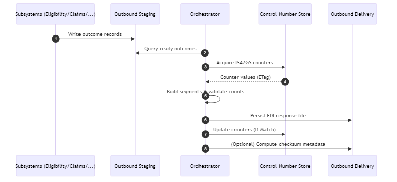
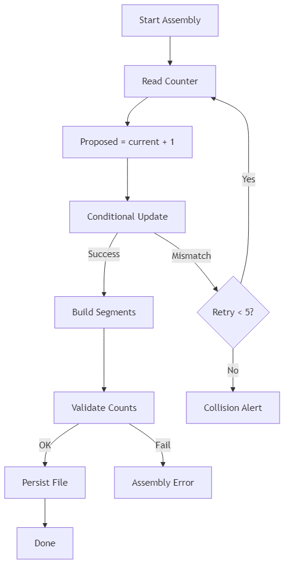
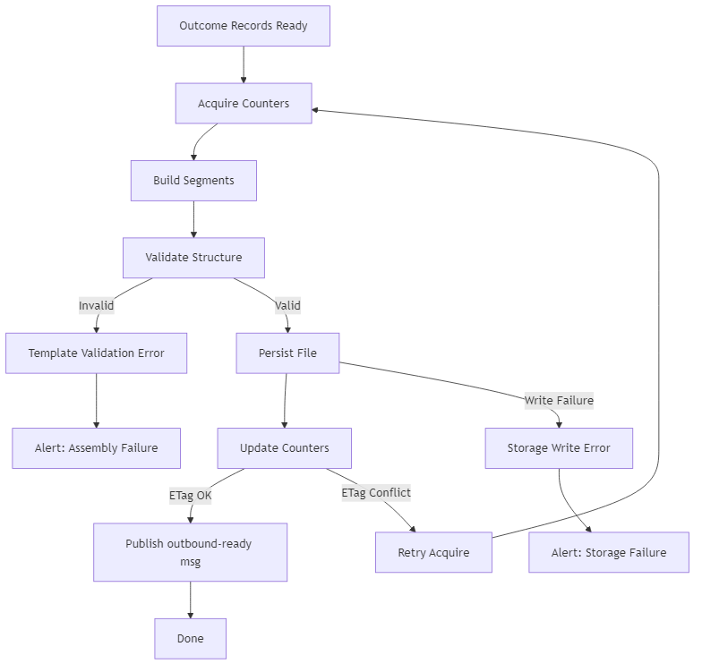

# Healthcare EDI Platform – Transaction Routing & Outbound Response Specification

## 1. Purpose

Define architecture and processes for routing ingested EDI transactions to internal downstream subsystems and generating outbound acknowledgments / response EDI files (e.g., TA1, 999, 277, 271, 835) back to trading partners.

## 2. Scope

| In-Scope | Out-of-Scope (Phase 1) |
|----------|------------------------|
| Transaction classification & routing metadata | Full semantic transformation into canonical clinical models |
| Event distribution to internal consumers | Real-time APIs (AS2, REST) for partners |
| Correlation & tracking IDs | Advanced claim adjudication logic |
| Outbound technical acknowledgments (TA1/999) | Business decision system modifications |
| Outbound business responses (e.g., 271, 277) aggregation & file assembly | EDI encryption (PGP) – optional Phase 2 |

## 3. Routing Architecture Overview

A routing layer decouples ingestion from internal processing using message/event distribution. Raw files persist first (immutability), then metadata-driven fan-out publishes one message per logical transaction set.

### 3.1 Core Components

| Component | Role |
|-----------|-----|
| Azure Data Factory (dispatch stage) | Invokes routing Function or posts routing event after validation |
| Azure Function (router) | Parses envelope headers (ISA/GS/ST) lightweight, enriches routing event, publishes messages |
| Azure Event Grid (ingestion event) | Source trigger to ADF; optional fan-out for simple subscribers |
| Azure Service Bus (Topics) | Durable distribution of transaction routing messages with subscription filters |
| Subscription Rules | Filter by `transactionSet`, `partnerCode`, `priority` |
| Internal Subsystems (Eligibility, Claims, Enrollment, Remittance) | Consume routing messages to trigger domain processing flows |
| Outbound Orchestrator (ADF / Durable Function) | Aggregates internal processing results into outbound EDI responses |
| Storage: Outbound Staging | Temporary assembly area for response segments |
| Storage: Outbound Delivery | Final response files for SFTP pickup or push |

### 3.2 Message Flow (High-Level)

1. Ingestion pipeline completes validation & raw persistence.
2. Router Function reads blob (header slice) to extract envelope identifiers: ISA control number, GS functional group, ST transaction set IDs.
3. For each ST segment (batch may contain multiple): emit routing message to Service Bus Topic `edi-routing` with body + metadata.
4. Subsystem-specific subscriptions receive relevant messages (e.g., filter: `transactionSet IN ('270','276','834','835')`).
5. Subsystem processes (internal logic) and writes outcome summary (ACK status, business response payload elements) to its outbound staging container/table.
6. Outbound Orchestrator periodically (or event-driven) aggregates ready responses, builds appropriate EDI (e.g., 999 acknowledgement referencing original control numbers or 271 eligibility response) and writes to `outbound/partner=<code>/` path.
7. Optional: Generate TA1 if ISA envelope structural errors detected early; send negative acknowledgment without further processing.
8. SFTP partner retrieves response or receives notification (future: push via separate SFTP user folder `/outbound/<partnerCode>/`).

## 4. Routing Message Schema

| Field | Type | Description |
|-------|------|-------------|
| routingId | GUID | Unique per ST transaction emitted |
| ingestionId | GUID | Reference to original file ingest metadata |
| partnerCode | String | Trading partner identifier |
| transactionSet | String | ST01 (e.g., 270) |
| functionalGroup | String | GS06 value |
| interchangeControl | String | ISA13 value |
| fileBlobPath | String | Raw file blob path |
| stPosition | Int | Index of ST segment within file (1-based) |
| receivedUtc | Timestamp | Original ingestion receive time |
| priority | String | Derived (e.g., eligibility=standard, claim=high) |
| checksumSha256 | String | Original file checksum (for integrity) |
| correlationKey | String | Concise key partner + interchange + group |

Messages delivered as JSON body in Service Bus with application properties mirroring filterable fields (`transactionSet`, `partnerCode`).

## 5. Service Bus Topology

| Topic | Subscriptions | Purpose |
|-------|--------------|---------|
| `edi-routing` | `sub-eligibility`, `sub-claims`, `sub-enrollment`, `sub-remittance` | Primary routing fan-out |
| `edi-deadletter` | (n/a) | DLQ for poison messages |
| `edi-outbound-ready` | `sub-outbound-orchestrator` | Signals partial results ready for assembly |

Subscription rules example (SQL Filter):

```sql
transactionSet IN ('270','271') AND partnerCode = 'PARTNERA'
```

## 6. Correlation & Tracking

- Primary correlation: `ingestionId` (file-level). Secondary: `routingId` per ST.
- Outbound acknowledgments include ISA/GS/ST control numbers referencing original plus `ingestionId` in metadata (not in EDI segments) for internal traceability.
- Logging: Each routing message write operation produces Log Analytics entry `RoutingEvent_CL`.

## 7. Outbound Response Generation

### 7.1 Acknowledgment Types

| Type | Trigger | Standard |
|------|--------|----------|
| TA1 | Interchange structural error (ISA/IEA mismatch) | X12 |
| 999 | Functional group / transaction syntax validation (AK segments) | X12 |
| 277CA / 277 | Claim status responses | X12 |
| 271 | Eligibility benefit responses | X12 |
| 835 | Remittance advice | X12 |

### 7.2 Orchestration Pattern

| Step | Action |
|------|--------|
| 1 | Collect subsystem outcome records ready for response (query staging tables / events) |
| 2 | Group by partner + transactionSet + response type batching window (e.g., 5 min) |
| 3 | Generate envelope numbers (ISA/GS/GE/IEA) – maintain sequence store (Key Vault secret + durable entity, or Table Storage) |
| 4 | Build segment list (e.g., ISA/GS/ST ... SE/GE/IEA) using template library |
| 5 | Validate segment counts & control numbers |
| 6 | Persist response file to `outbound/partner=<code>/transaction=<type>/date=YYYY-MM-DD/` |
| 7 | Publish message to Service Bus `edi-outbound-ready` (optional partner notification) |
| 8 | (Future) PGP encrypt if partner requires |

#### 7.2.1 Outbound Assembly Sequence (Mermaid)

  
[Mermaid source](./diagrams/outbound-assembly-sequence.mmd)

### 7.3 Envelope Number Management

- Maintain monotonic counters per partner or global with concurrency protection (e.g., Azure Table entity with ETag check or Durable Function single threaded entity).
- Store current ISA13 / GS06 seeds encrypted (Key Vault secret or table with encryption at rest) – avoid exposing in logs.
- Roll-over handling: detect approaching max (e.g., 999999999) and coordinate reset window (standards allow fixed length with leading zeros).
- Idempotency: if assembly fails post-increment, either reuse number only if file not distributed or mark gap and document (audit trail).
- Retry logic: implement optimistic concurrency retry (exponential backoff up to 5 attempts) on ETag mismatch to avoid duplicate control numbers; record retry count metric.

## 8. Response File Naming Convention

`<partnerCode>_<transactionSet>_<ackTypeOrResponse>_<interchangeControl>_<timestampUTC>.edi`

Example:

`PARTNERA_270_999_123456789_20250114T221530Z.edi`

## 9. Error Handling (Routing & Outbound)

| Scenario | Handling |
|----------|----------|
| Router cannot parse ISA/GS | Quarantine file; emit operational alert; TA1 negative if partial header ok |
| Service Bus publish failure | Retry with exponential backoff (5 attempts); then log + dead-letter fallback queue |
| Subscription processing failure | Application-level DLQ (auto-forward to `edi-deadletter`) |
| Outbound assembly validation fail | Move artifacts to `outbound-staging/errors/`; raise alert; do not generate partial file |
| Control number collision | Halt assembly; alert; investigate counter corruption |
| Missing subsystem component data | Defer batch until timeout threshold then emit partial with status indicator segment (business decision) |

## 10. Security Considerations

- Service Bus access via Managed Identity (Send/Listen scopes per subscription).
- No PII/PHI inside routing message body beyond minimal envelope references (ISA13, GS06, ST codes). Do not include patient identifiers.
- Outbound staging isolated from partner-accessible SFTP paths (staging vs. delivery containers with distinct ACLs).
- Optional future PGP encryption before partner pickup (Phase 2) – keys stored in Key Vault; encryption worker Function.
- Enforce private endpoints / firewall rules for Service Bus and Storage.
- Least privilege: Only outbound orchestrator identity granted write/list on staging; partners restricted to delivery container path.
- Integrity: Response files include SHA256 checksum stored as blob metadata for partner dispute resolution and audit.

## 11. Monitoring & Metrics

| Metric | Definition | Target |
|--------|------------|--------|
| RoutingLatencyMs | Time from raw blob created to routing message published | p95 < 2000 ms |
| OutboundAssemblyLatencyMs | Time from last required component record to file persisted | p95 < 10 min |
| AckPublishCount | Number of acknowledgments generated per day | Tracked |
| RoutingDLQCount | Dead-lettered routing messages per day | 0 (investigate >0) |
| ControlNumberGap | Detected skipped sequence numbers | 0 (document if >0) |
| OutboundErrorRate | Failed assemblies / total assemblies | < 1% |
| ControlNumberRetries | Average retries per envelope generation | < 2 |

## 12. Purview & Lineage Extension

- Register outbound container and link lineage from original ingestion asset via `ingestionId` -> `routingId` -> `responseFile` custom lineage graph.
- Add custom classification: `edi-routing-event` for messages (logical asset) and `edi-ack-file` for acknowledgments.

## 13. Configuration Artifacts

| Artifact | Purpose | Location |
|----------|---------|----------|
| `routing-rules.json` | Partner / transaction filter overrides | `config/routing/` |
| `ack-templates/` | Segment layout templates per ack type | `config/outbound/templates/` |
| `counter-store` | Envelope control number persistence | Table Storage / Durable Entity |
| `partner-profile.json` | Flags: expectsTA1, expects999, pgpRequired | `config/partners/` |
| `subsystem-outcome-schema/` | Normalized staging schema definitions | `config/outbound/` |

## 14. Open Items

- Decide batching window per transaction type (e.g., 5 min vs. immediate)
- SLA for outbound eligibility (target < 2 min?) vs. claims (batch)
- Evaluate Durable Functions vs. timer-trigger Functions for assembly
- Decide whether to introduce event-driven assembly (each component raises event) now or later
- Confirm which subsystems will publish outcome events vs. be polled
- Determine encryption requirements for outbound (PGP, SFTP-only, both)
- Define SLA for 999 acknowledgments (e.g., < 15 minutes from ingestion)

## 15. Appendix – Pseudo-code Outlines

## 16. Transaction Routing & Acknowledgment Expectations (Detailed Matrix)

Derived from Architecture Appendix A; focuses on routing properties, mandatory vs. optional acknowledgments, and special handling rules adopted in this implementation.

| Inbound Transaction | Primary Domain Consumer Subscription | Routing Filters (Example) | Mandatory Technical Acks We Send | Expected Business / Domain Responses We Assemble | Optional / Conditional Acks | Special Handling Rules |
|---------------------|---------------------------------------|---------------------------|----------------------------------|-----------------------------------------------|------------------------------|-----------------------|
| 270 | Eligibility Service (`sub-eligibility`) | `transactionSet = '270'` | 999 (syntax if errors) | 271 | 824 (rare) | Low latency target path; escalate if p95 > 2m. |
| 271 (if inbound) | (Analytics optional) | `transactionSet = '271'` | 999 (syntax) | None (already response) | — | Stored for trace only; may skip routing if configured. |
| 276 | Claim Status Inquiry (`sub-claims`) | `transactionSet = '276'` | 999 | 277 | — | Prioritize parity with 270 latency. |
| 277CA | Claims Intake Status (`sub-claims`) | `transactionSet = '277' AND isCA=true` (flag added downstream) | 999 | 277 (later lifecycle) | — | Mark claim lifecycle stage = VALIDATED. |
| 277 (status) | Claims Status (`sub-claims`) | `transactionSet = '277' AND isCA=false` | 999 | 835 (eventual) | — | Drives SLA timer for remittance expectation. |
| 278 Request | Prior Auth (`sub-claims` or `sub-clinical`) | `transactionSet = '278' AND direction='INBOUND'` | 999 | 278 Response | 824 (if business reject) | Priority escalation allowed via partner config. |
| 278 Response | Prior Auth (analytics) | `transactionSet = '278' AND direction='OUTBOUND'` | 999 (if inbound) | None | — | Completion of auth lifecycle metrics. |
| 834 | Enrollment (`sub-enrollment`) | `transactionSet = '834'` | TA1 (if structural), 999 | None (business changes internal) | 824 (application advice) | Large file concurrency tuning; INS action counts aggregated downstream. |
| 820 | Finance (`sub-remittance`) | `transactionSet = '820'` | TA1, 999 | None | 824 | Financial variance monitoring triggers 824. |
| 824 | (Optional analytics) | `transactionSet = '824'` | 999 | None | — | Generated internally; may skip routing. |
| 835 | Remittance (`sub-remittance`) | `transactionSet = '835'` | TA1, 999 | None | 824 (if application reject) | Stricter ACL; checksum verification emphasis. |
| 837 (P/I/D) | Claims Intake (`sub-claims`) | `transactionSet IN ('837P','837I','837D')` | TA1, 999 | 277CA (business ack) then 277 & 835 | 824 (business reject) | Multi-ST fan-out; control number tracking critical. |
| 999 (inbound) | Ack Correlation (`sub-ack`) | `transactionSet = '999'` | TA1 (if envelope error) | None | — | Correlate to outbound file; update validation metrics. |
| TA1 (inbound) | Ack Correlation (`sub-ack`) | (Envelope classification) | (N/A—we received) | None | — | Immediate structural failure escalation. |

Notes:

- `direction` property may be injected by ingestion (based on partner path) or by outbound orchestrator for internally generated responses.
- `isCA` flag for 277 vs 277CA determined after downstream claim validation stage; not present at initial routing (added on re-publication or enrichment message if needed).
- For minimization, table references conceptual attributes not all physically present in routing message (e.g., `isCA` may require enrichment topic).

### 16.1 Routing Rule Authoring Pattern

Rules are defined declaratively in `routing-rules.json` with structure:

```json
{
  "rules": [
    {"name": "eligibility-270", "filter": "transactionSet = '270'", "subscription": "sub-eligibility"},
    {"name": "claims-837", "filter": "transactionSet LIKE '837%'", "subscription": "sub-claims"},
    {"name": "remit-835", "filter": "transactionSet = '835'", "subscription": "sub-remittance"}
  ]
}
```

ADF / Function deployment step compares desired rules vs. existing Service Bus subscription SQL filters and applies additive / removal changes idempotently.

### 16.2 Acknowledgment Assembly Decision Matrix

| Condition | TA1 Generated? | 999 Generated? | 824 Generated? | Business Response (271/277/278/277CA/835) |
|-----------|----------------|----------------|----------------|-------------------------------------------|
| ISA/IEA mismatch | Yes (immediate) | No (skipped) | No | No |
| Functional syntax errors only | No | Yes (with IK3/IK4) | No | Possibly deferred (if partial successes) |
| Business validation failure (e.g., 834 member invalid) | No | Yes (syntax still) | Yes (TED codes) | N/A |
| 837 accepted and claim ingest success | No | Yes (AK9=Accepted) | No | 277CA then 277 later, 835 eventual |
| Eligibility inquiry valid | No | Yes (if partner requires) | No | 271 |
| Prior auth request valid | No | Yes (if partner requires) | No | 278 response |

### 16.3 Control Number Integrity Checks

- Pre-assembly: verify no gap in internal counter sequence since last persisted outbound for that partner/transaction class.
- Post-assembly: compare AK9 / trailer counts with computed ST/SE counts; log discrepancy metric.
- Reissue policy: If outbound file fails after counter increment but before partner visibility, attempt single retry with identical control numbers; if already visible, next file uses next sequence (gap documented).

### 16.4 SLA Reference Mapping

| Acknowledgment / Response | SLA Target (Illustrative) | Trigger Start | Trigger End | Metric Source |
|---------------------------|---------------------------|---------------|-------------|---------------|
| TA1 | < 5 min | Ingestion event time | TA1 file persisted | InterchangeValidation log |
| 999 | < 15 min | Ingestion event time | 999 file persisted | AckAssembly_CL |
| 277CA | < 4 hrs | 837 routing publish | 277CA file persisted | AckAssembly_CL + claim status store |
| 271 | < 5 min | 270 ingestion event | 271 file persisted | AckAssembly_CL |
| 278 Response | < 15 min | 278 request ingestion | 278 response persisted | AckAssembly_CL |
| 277 (status) | Variable (batch) | Claim adjudication milestone | 277 file persisted | AckAssembly_CL |
| 835 | Payer SLA (e.g., weekly cycle) | Claim payment cycle start | 835 file persisted | AckAssembly_CL |

### 16.5 Observability Enhancements

- Custom dimension `ackType` added to AckAssembly_CL enabling pivot dashboards (999, 271, 277CA, etc.).
- Derived metric `AckLatencySeconds` for each file; percentile targets aligned with SLA table.
- Alert thresholds:
  - 999LatencyP95 > 900 seconds over 30 min window -> Warning.
  - TA1FailureRate > 0.5% daily -> Investigate envelope generation or partner formatting.
  - ControlNumberGapDetected = true -> Critical.

### 16.6 Security Reinforcement

- Outbound assembly process never persists PHI in transient logs; only file path + control numbers + counts.
- Routing enrichment forbids adding member IDs unless `featureFlag_allowMemberIdInRouting` explicitly enabled (default disabled).
- All rule changes audited (config drift detection comparing deployed vs. git-sourced `routing-rules.json`).

### 16.7 Future Enhancements

- Introduce event-sourced acknowledgment pipeline (each routing message completion posts minimal event; orchestrator reacts rather than polling).
- Add FHIR companion response emit (parallel 271/277 FHIR resources) in Phase 2 parsing.
- Automated anomaly detection (e.g., sudden spike in 999 rejects) via Log Analytics scheduled query + ML baseline.


### 15.1 Router Function (HTTP Trigger from ADF)

```pseudo
handleRequest(request):
  ingestionId = request.body.ingestionId
  rawBlobPath = request.body.rawBlobPath
  headerBytes = storage.rangeRead(rawBlobPath, 0, MAX_HEADER_BYTES)
  envelopes = parseEnvelopeHeaders(headerBytes)
  stSegments = enumerateStSegments(headerBytes or partial stream)
  for st in stSegments:
    routingId = newGuid()
    message = {
      routingId, ingestionId,
      partnerCode: envelopes.partner,
      transactionSet: st.code,
      interchangeControl: envelopes.isa13,
      functionalGroup: envelopes.gs06,
      stPosition: st.index,
      fileBlobPath: rawBlobPath,
      receivedUtc: envelopes.receivedUtc,
      checksumSha256: envelopes.checksum,
      priority: derivePriority(partnerCode, st.code),
      correlationKey: buildCorrelation(partnerCode, envelopes.isa13, envelopes.gs06)
    }
    serviceBus.send(topic='edi-routing', body=message, props={transactionSet: st.code, partnerCode})
  logRoutingEvents(batchSize=len(stSegments), latency=now()-request.start)
  return 202
```

### 15.2 Outbound Orchestrator (Timer Trigger / Durable)

```pseudo
onTimer():
  candidates = queryOutcomeStaging(window=ACK_WINDOW_MINUTES)
  groups = groupBy(candidates, keys=[partnerCode, interchangeControl, responseType])
  for g in groups:
    counters = acquireCounters(partnerCode=g.partnerCode, type=g.responseType)
    segments = buildSegments(g, counters)
    validate(segments)
    filename = buildFileName(g, counters)
    path = writeOutboundFile(partner=g.partnerCode, type=g.responseType, name=filename, segments)
    checksum = computeChecksum(path)
    persistAckMetadata(group=g, path, checksum, counters)
    updateCounters(counters)
    publishOutboundReady(partner=g.partnerCode, responseType=g.responseType, path)
    logAckAssembly(path, latency=now()-g.lastOutcomeReady)
```

### 15.3 Control Number Acquisition (Optimistic Concurrency)

```pseudo
acquireCounters(partnerCode, type):
  retry = 0
  while retry < 5:
    row, etag = table.get(partition='COUNTER', row=partnerCode+'-'+type)
    proposed = row.currentValue + 1
    success = table.updateIfMatch(etag, newValue=proposed)
    if success: return { value: proposed, etag }
    retry += 1
  raise ControlNumberCollision
```

### 15.4 Control Number Flow Diagram

  
[Mermaid source](./diagrams/control-number-flow.mmd)

### 15.5 Outbound Assembly Error Handling Diagram

  
[Mermaid source](./diagrams/outbound-error-handling.mmd)
