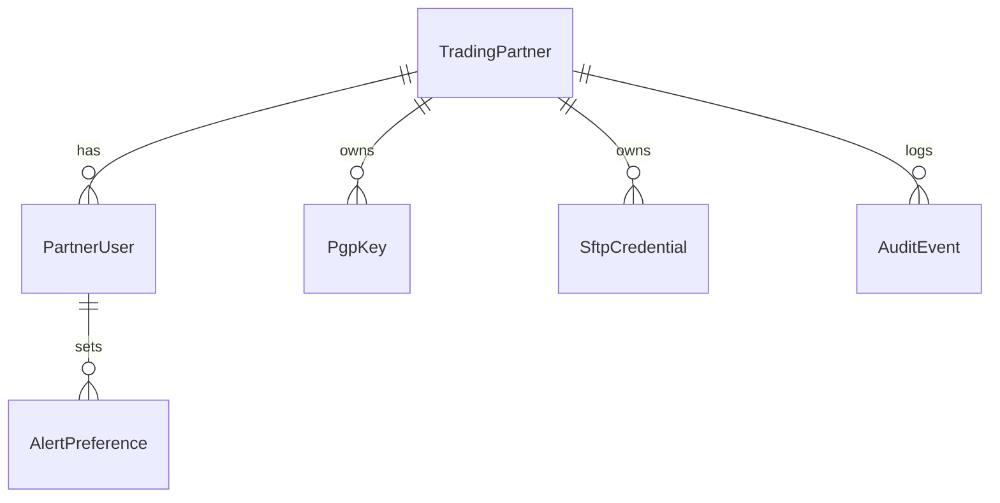

# Domain Model (Draft v0.1)

## 1. Purpose

Define core entities, relationships, and invariants for portal domain.

## 2. Entities & Attributes

### TradingPartner

- id (GUID)
- name (string, unique)
- status (active|suspended)
- defaultSLAProfileRef (string, nullable)
- createdAt (UTC)

### PartnerUser

- id (GUID)
- partnerId (FK TradingPartner)
- email (string, unique per partner, lowercase)
- role (Standard|Admin)
- status (active|disabled)
- mfaEnabled (bool)
- createdAt, lastLoginAt

### SftpCredential

- id (GUID)
- partnerId
- type (Password|SSHKey)
- fingerprint (string, if key)
- createdAt
- rotatedAt (nullable)
- expiresAt (nullable)
- status (active|superseded|pending-rotation)

### PgpKey

- id (GUID)
- partnerId
- fingerprint (string, unique per partner, immutable)
- uploadedAt
- expiresAt (nullable) – recommended <= 3y
- status (active|deprecated|revoked)
- version (int, incrementing)

### FileIngestionRecord (Read Model View)

- fileName
- partnerId
- receivedAt
- sizeBytes
- validationStatus
- routingStatus
- ackTa1Status / ack999Status / ack277caStatus (accepted|rejected|pending|null)
- interchangeControlNumber
- transactionSetCount
- latencySecondsAck999 (example metric)

### AlertPreference

- id (GUID)
- partnerUserId
- category (latency|rejects|anomalies|backlog|keyExpiry)
- channel (email)
- enabled (bool)

### AuditEvent

- id (GUID)
- partnerId
- actorUserId
- actionType (KeyUploaded|KeyDeprecated|UserInvited|UserDisabled|RotationRequested|AlertPrefChanged|CredentialRotationRequested)
- targetType (PgpKey|PartnerUser|SftpCredential|AlertPreference)
- targetId (GUID or composite string)
- timestamp
- metadata (JSON: diff / context)
- correlationId

## 3. Relationships

- TradingPartner 1 - * PartnerUser
- TradingPartner 1 - * PgpKey
- TradingPartner 1 - * SftpCredential
- PartnerUser 1 - * AlertPreference
- TradingPartner 1 - * AuditEvent

## 4. Invariants

- Only one active PgpKey per partner at any time.
- Only one active SftpCredential of each type per partner.
- PartnerUser email uniqueness enforced within partner (global uniqueness optional but recommended).
- Deprecated keys cannot be reactivated; instead new version created.

## 5. Derived Views

- CurrentActiveKey: SELECT top 1 active ORDER BY uploadedAt desc.
- PartnerHealthSnapshot: Pre-aggregated ingestion counts + reject percentages for dashboard.

## 6. Value Objects

- KeyFingerprint (validates base16 length & charset)
- EmailAddress (lowercase normalization)

## 7. ER Diagram (Mermaid)

## 8. Open Questions

- OPEN: Store FileIngestionRecord in SQL or always query external log tables + materialize API view?
- OPEN: Need separate table for rotation requests vs overloading SftpCredential status?
- OPEN: Should we store hashed normalized email for case-insensitive index portability?

## 9. References

- `AI_PROJECT_OVERVIEW.md`
