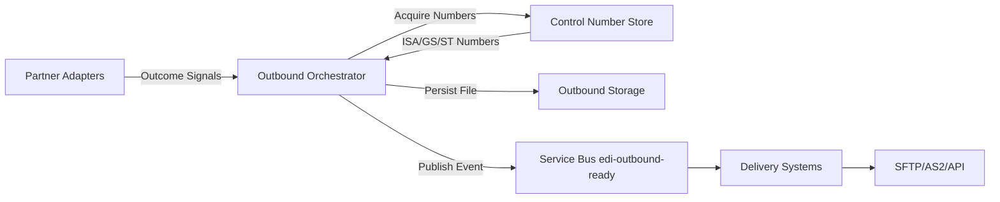
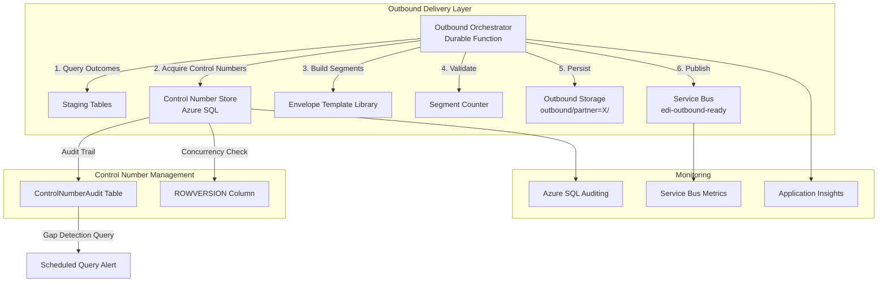
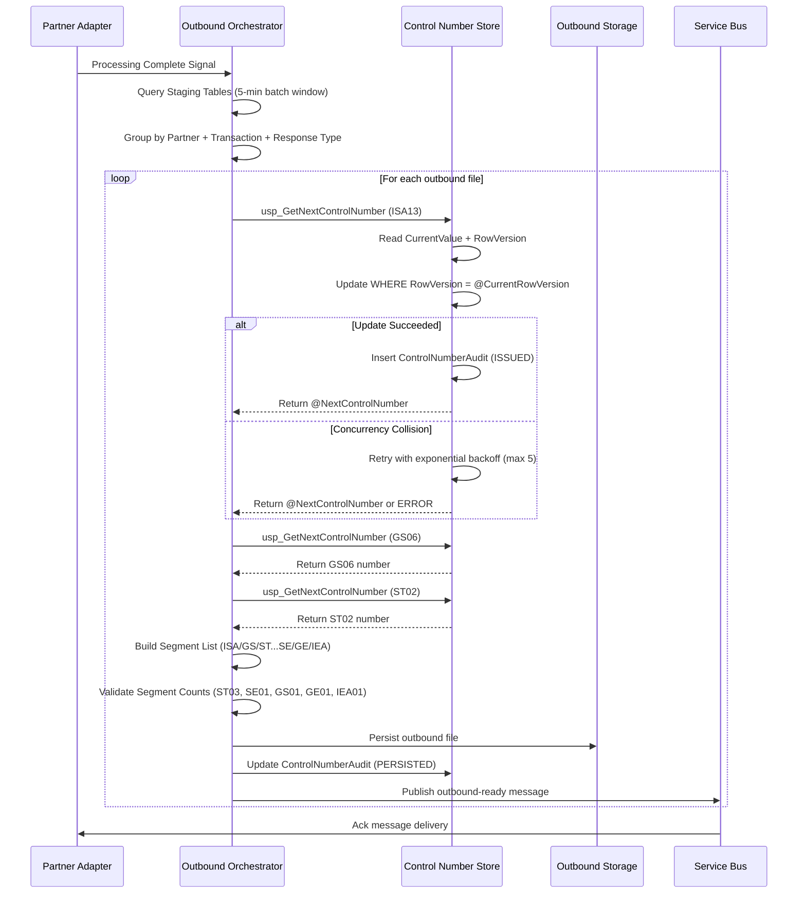
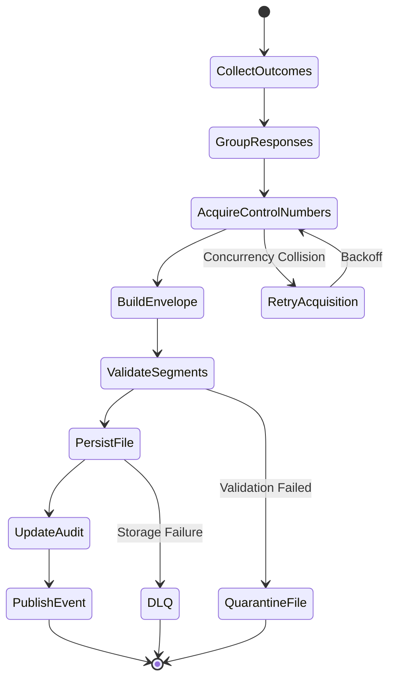

# 05 - Outbound Delivery & Acknowledgment Generation

## Table of Contents
- [Overview](#overview)
- [Architecture](#architecture)
- [Control Number Store](#control-number-store)
- [Envelope Generation](#envelope-generation)
- [Acknowledgment Types](#acknowledgment-types)
- [Outbound Assembly Orchestration](#outbound-assembly-orchestration)
- [Response File Management](#response-file-management)
- [Error Handling](#error-handling)
- [Security & Compliance](#security--compliance)
- [Performance & Scalability](#performance--scalability)
- [Monitoring & Observability](#monitoring--observability)
- [Troubleshooting](#troubleshooting)

---

## Overview

### Purpose
The Outbound Delivery subsystem generates and delivers EDI acknowledgments and business responses back to trading partners. This includes technical acknowledgments (TA1, 999), business responses (271 eligibility, 277 claim status, 835 remittance), and ensures proper EDI envelope structure with monotonically increasing control numbers.

### Key Responsibilities
- **Control Number Management**: Maintains ISA13 (interchange), GS06 (functional group), and ST02 (transaction set) control numbers per partner
- **Envelope Generation**: Constructs valid X12 EDI envelopes (ISA/GS/ST...SE/GE/IEA) with proper segment counts
- **Acknowledgment Assembly**: Generates TA1 (interchange), 999 (functional), and business responses based on processing outcomes
- **Response Delivery**: Persists outbound files to storage and signals delivery systems
- **Audit Trail**: Maintains comprehensive audit logs for all control numbers issued

### Business Context
Healthcare trading partners require timely acknowledgments to confirm receipt and processing status:
- **TA1 (Interchange Acknowledgment)**: < 5 min SLA - structural validation
- **999 (Functional Acknowledgment)**: < 15 min SLA - syntax validation
- **271 (Eligibility Response)**: < 5 min SLA - real-time eligibility
- **277CA (Claim Acknowledgment)**: < 4 hrs SLA - claim receipt confirmation
- **835 (Remittance Advice)**: Payer SLA - payment processing (weekly cycle)

### Integration Points


**Upstream Dependencies**:
- Service Bus `edi-routing` topic: Receives routing messages with inbound control numbers
- Partner Adapters: Emit processing outcome signals (success, error, business response data)
- Processing Pipeline: Generates staging data for response assembly

**Downstream Consumers**:
- Service Bus `edi-outbound-ready` topic: Signals outbound files ready for delivery
- SFTP Connector: Delivers files to partner SFTP endpoints
- Partner Portal API: Provides self-service file download
- Storage Accounts: Archives outbound files for compliance

### Architecture Principles

1. **Monotonic Control Numbers**: ISA/GS/ST numbers must always increment, never reuse (except documented gaps)
2. **Optimistic Concurrency**: ROWVERSION-based locking prevents duplicate control numbers under concurrent load
3. **Idempotent Assembly**: Same input outcomes produce same output file (deterministic)
4. **Atomic Persistence**: File write + control number audit + Service Bus publish in logical transaction
5. **Gap Detection**: Continuous monitoring detects skipped control numbers for investigation

---

## Architecture

### Component Diagram


### Technology Stack
| Component | Technology | Purpose |
|-----------|-----------|---------|
| Orchestrator | Azure Durable Functions (.NET 9) | Stateful outbound assembly workflow |
| Control Number Store | Azure SQL Database (S1 tier) | ACID-compliant counter management with ROWVERSION |
| Concurrency Model | Optimistic Locking (ROWVERSION) | Prevents duplicate control numbers under concurrent load |
| Message Broker | Service Bus Standard | Signals outbound files ready for delivery |
| File Storage | Azure Blob Storage (Hot tier) | Persists outbound EDI files |
| Template Engine | Custom C# Segment Builder | Generates EDI envelope segments (ISA/GS/ST/SE/GE/IEA) |
| Monitoring | Application Insights + Azure Monitor | Tracks latency, retry rate, gap detection |

### Data Flow - Outbound Response Assembly


### Deployment Architecture
```
Resource Group: rg-edi-outbound-prod
├── Azure SQL Database: sql-edi-controlnumbers-prod
│   ├── Database: edi-controlnumbers
│   ├── Tier: Standard S1 (20 DTUs)
│   ├── Backup: Point-in-time restore (35 days)
│   └── Security: Private Endpoint, TDE enabled
├── Function App: func-edi-outbound-prod
│   ├── Runtime: .NET 9 Isolated
│   ├── Plan: Premium EP1 (3.5 GB RAM, always-on)
│   ├── Identity: Managed Identity (db_datawriter + db_datareader on control numbers)
│   └── Connection: Key Vault reference for SQL connection string
├── Storage Account: stedioutboundprod
│   ├── Container: outbound (Hot tier, versioning enabled)
│   ├── Container: outbound-staging (Hot tier, 7-day lifecycle)
│   └── Lifecycle: Move to Cool after 90 days, Archive after 1 year
├── Service Bus Namespace: sb-edi-routing-prod
│   ├── Topic: edi-outbound-ready
│   └── Subscriptions: sub-sftp-delivery, sub-portal-api
└── Key Vault: kv-edi-prod
    └── Secret: sql-controlnumbers-connection-string
```

---

## Control Number Store

### Purpose & Design Decision

The Control Number Store maintains monotonically increasing ISA13 (interchange), GS06 (functional group), and ST02 (transaction set) control numbers for all outbound EDI responses. These numbers are critical for:

- **Partner Reconciliation**: Trading partners use control numbers to match acknowledgments to original transactions
- **Duplicate Detection**: Prevents reprocessing of already-received files
- **Audit Compliance**: Provides complete chain of custody for all EDI exchanges
- **Gap Detection**: Identifies missing or skipped control numbers for investigation

**Technology Decision**: Azure SQL Database was selected over Azure Table Storage or Durable Function Entities for:

1. **ACID Guarantees**: Transactions ensure atomic counter increment + audit insert
2. **Optimistic Concurrency**: ROWVERSION column provides built-in collision detection
3. **Query Flexibility**: SQL queries for gap detection, partner reporting, rollover alerts
4. **Backup/Recovery**: Point-in-time restore for disaster recovery scenarios
5. **Azure Integration**: Native Azure Monitor integration, Private Endpoints, Managed Identity

### Database Schema

**Repository**: `edi-database-controlnumbers` (DACPAC deployed to Azure SQL)

#### ControlNumberCounters Table

```sql
CREATE TABLE [dbo].[ControlNumberCounters]
(
    [CounterId]           INT IDENTITY(1,1)            NOT NULL,
    [PartnerCode]         NVARCHAR(15)                 NOT NULL,
    [TransactionType]     NVARCHAR(10)                 NOT NULL,    -- '270', '271', '837', '835', '999'
    [CounterType]         NVARCHAR(20)                 NOT NULL,    -- 'ISA', 'GS', 'ST'
    [CurrentValue]        BIGINT                       NOT NULL DEFAULT (1),
    [MaxValue]            BIGINT                       NOT NULL DEFAULT (999999999), -- 9-digit ISA13
    [LastIncrementUtc]    DATETIME2(3)                 NOT NULL DEFAULT (SYSUTCDATETIME()),
    [LastFileGenerated]   NVARCHAR(255)                NULL,        -- Last outbound file name
    [CreatedUtc]          DATETIME2(3)                 NOT NULL DEFAULT (SYSUTCDATETIME()),
    [ModifiedUtc]         DATETIME2(3)                 NOT NULL DEFAULT (SYSUTCDATETIME()),
    [RowVersion]          ROWVERSION                   NOT NULL,    -- Optimistic concurrency
    CONSTRAINT [PK_ControlNumberCounters] PRIMARY KEY CLUSTERED ([CounterId] ASC)
);
GO

-- Enforce unique constraint on partner + transaction + counter type
CREATE UNIQUE INDEX [UQ_ControlNumberCounters_Key]
    ON [dbo].[ControlNumberCounters] ([PartnerCode], [TransactionType], [CounterType]);
GO

-- Performance index for counter lookups
CREATE INDEX [IX_ControlNumberCounters_PartnerType]
    ON [dbo].[ControlNumberCounters] ([PartnerCode], [TransactionType])
    INCLUDE ([CurrentValue], [LastIncrementUtc]);
GO
```

**Key Fields**:
- `PartnerCode`: Trading partner identifier (e.g., 'PARTNERA', 'TEST001')
- `TransactionType`: X12 transaction set code (e.g., '270', '837', '999')
- `CounterType`: Envelope level ('ISA', 'GS', 'ST')
- `CurrentValue`: Current control number (1 to 999,999,999)
- `RowVersion`: Automatic timestamp for optimistic concurrency (changes on every UPDATE)

#### ControlNumberAudit Table

```sql
CREATE TABLE [dbo].[ControlNumberAudit]
(
    [AuditId]             BIGINT IDENTITY(1,1)         NOT NULL,
    [CounterId]           INT                          NOT NULL,
    [ControlNumberIssued] BIGINT                       NOT NULL,    -- Actual control number issued
    [OutboundFileId]      UNIQUEIDENTIFIER             NOT NULL,    -- Correlation to outbound file
    [IssuedUtc]           DATETIME2(3)                 NOT NULL DEFAULT (SYSUTCDATETIME()),
    [RetryCount]          INT                          NOT NULL DEFAULT (0),
    [Status]              NVARCHAR(20)                 NOT NULL DEFAULT ('ISSUED'),
    [Notes]               NVARCHAR(500)                NULL,        -- Reset reason, gap explanation
    CONSTRAINT [PK_ControlNumberAudit] PRIMARY KEY CLUSTERED ([AuditId] ASC),
    CONSTRAINT [FK_ControlNumberAudit_CounterId] FOREIGN KEY ([CounterId]) 
        REFERENCES [dbo].[ControlNumberCounters]([CounterId])
);
GO

CREATE INDEX [IX_ControlNumberAudit_CounterId]
    ON [dbo].[ControlNumberAudit] ([CounterId], [IssuedUtc]);
GO

CREATE INDEX [IX_ControlNumberAudit_OutboundFileId]
    ON [dbo].[ControlNumberAudit] ([OutboundFileId]);
GO
```

**Status Values**:
- `ISSUED`: Control number acquired, outbound file assembly in progress
- `PERSISTED`: Outbound file successfully written to storage
- `FAILED`: Outbound file assembly failed (gap documented)
- `RESET`: Counter manually reset (with reason in Notes)
- `REISSUED`: Control number reused after failed assembly (gap closed)

### Optimistic Concurrency Model

The control number store uses ROWVERSION-based optimistic concurrency to prevent duplicate control numbers under concurrent load.

#### Stored Procedure: usp_GetNextControlNumber

```sql
CREATE PROCEDURE [dbo].[usp_GetNextControlNumber]
    @PartnerCode        NVARCHAR(15),
    @TransactionType    NVARCHAR(10),
    @CounterType        NVARCHAR(20),
    @OutboundFileId     UNIQUEIDENTIFIER,
    @NextControlNumber  BIGINT OUTPUT
AS
BEGIN
    SET NOCOUNT ON;
    SET XACT_ABORT ON;

    DECLARE @MaxRetries INT = 5;
    DECLARE @RetryCount INT = 0;
    DECLARE @CurrentRowVersion BINARY(8);
    DECLARE @CurrentValue BIGINT;
    DECLARE @MaxValue BIGINT;
    @CounterId INT;

    WHILE @RetryCount < @MaxRetries
    BEGIN
        BEGIN TRY
            -- Read current value and row version with UPDLOCK
            SELECT
                @CounterId = CounterId,
                @CurrentValue = CurrentValue,
                @MaxValue = MaxValue,
                @CurrentRowVersion = RowVersion
            FROM dbo.ControlNumberCounters WITH (UPDLOCK, READPAST)
            WHERE PartnerCode = @PartnerCode
              AND TransactionType = @TransactionType
              AND CounterType = @CounterType;

            -- Initialize counter if not exists
            IF @CounterId IS NULL
            BEGIN
                INSERT INTO dbo.ControlNumberCounters 
                    (PartnerCode, TransactionType, CounterType)
                VALUES (@PartnerCode, @TransactionType, @CounterType);

                SELECT
                    @CounterId = CounterId,
                    @CurrentValue = CurrentValue,
                    @MaxValue = MaxValue,
                    @CurrentRowVersion = RowVersion
                FROM dbo.ControlNumberCounters
                WHERE PartnerCode = @PartnerCode
                  AND TransactionType = @TransactionType
                  AND CounterType = @CounterType;
            END;

            -- Calculate next value
            SET @NextControlNumber = @CurrentValue + 1;

            -- Check for rollover
            IF @NextControlNumber > @MaxValue
            BEGIN
                THROW 50001, 'Control number max value exceeded. Rollover required.', 1;
            END;

            -- Attempt update with concurrency check
            UPDATE dbo.ControlNumberCounters
            SET
                CurrentValue = @NextControlNumber,
                LastIncrementUtc = SYSUTCDATETIME(),
                ModifiedUtc = SYSUTCDATETIME()
            WHERE CounterId = @CounterId
              AND RowVersion = @CurrentRowVersion;  -- Optimistic concurrency guard

            -- Check if update succeeded
            IF @@ROWCOUNT = 1
            BEGIN
                -- Success - insert audit record
                INSERT INTO dbo.ControlNumberAudit
                    (CounterId, ControlNumberIssued, OutboundFileId, RetryCount, Status)
                VALUES
                    (@CounterId, @NextControlNumber, @OutboundFileId, @RetryCount, 'ISSUED');

                -- Return success
                RETURN 0;
            END
            ELSE
            BEGIN
                -- Concurrency collision - retry with exponential backoff
                SET @RetryCount = @RetryCount + 1;
                WAITFOR DELAY '00:00:00.050';  -- 50ms base delay
            END;

        END TRY
        BEGIN CATCH
            -- Log error and retry
            SET @RetryCount = @RetryCount + 1;

            IF @RetryCount >= @MaxRetries
            BEGIN
                THROW;
            END;

            WAITFOR DELAY '00:00:00.100';  -- 100ms on error
        END CATCH;
    END;

    -- Max retries exceeded
    THROW 50002, 'Control number acquisition failed after maximum retries', 1;
END;
GO
```

**Concurrency Workflow**:
1. Read `CurrentValue` + `RowVersion` with `UPDLOCK` (prevents dirty reads)
2. Calculate `@NextControlNumber = @CurrentValue + 1`
3. Attempt UPDATE WHERE `RowVersion = @CurrentRowVersion`
4. If `@@ROWCOUNT = 1`: Success, insert audit record, return control number
5. If `@@ROWCOUNT = 0`: Collision detected (another process updated), retry with exponential backoff
6. Max 5 retries with 50ms base delay (50ms, 100ms, 150ms, 200ms, 250ms)

**Performance Characteristics**:
- **Read Lock Duration**: < 10ms (UPDLOCK held only during SELECT)
- **Update Duration**: < 5ms (single row update with index seek)
- **Retry Probability**: < 5% under normal load (100 TPS)
- **p95 Latency**: < 50ms including retries

### Gap Detection

#### View: ControlNumberGaps

```sql
CREATE VIEW [dbo].[ControlNumberGaps]
AS
    WITH NumberedAudit AS (
        SELECT
            a.CounterId,
            c.PartnerCode,
            c.TransactionType,
            c.CounterType,
            a.ControlNumberIssued,
            LAG(a.ControlNumberIssued) OVER (
                PARTITION BY a.CounterId 
                ORDER BY a.ControlNumberIssued
            ) AS PreviousNumber
        FROM dbo.ControlNumberAudit a
        INNER JOIN dbo.ControlNumberCounters c ON a.CounterId = c.CounterId
        WHERE a.Status IN ('ISSUED', 'PERSISTED')
    )
    SELECT
        PartnerCode,
        TransactionType,
        CounterType,
        PreviousNumber AS GapStart,
        ControlNumberIssued AS GapEnd,
        (ControlNumberIssued - PreviousNumber - 1) AS GapSize
    FROM NumberedAudit
    WHERE PreviousNumber IS NOT NULL
      AND ControlNumberIssued - PreviousNumber > 1;
GO
```

**Gap Detection Logic**:
- Uses `LAG()` window function to compare consecutive control numbers
- Identifies gaps where `GapEnd - GapStart > 1`
- Excludes `FAILED` status records (expected gaps)

#### Stored Procedure: usp_DetectControlNumberGaps

```sql
CREATE PROCEDURE [dbo].[usp_DetectControlNumberGaps]
    @PartnerCode        NVARCHAR(15) = NULL,
    @TransactionType    NVARCHAR(10) = NULL,
    @DaysToCheck        INT = 30
AS
BEGIN
    SET NOCOUNT ON;

    DECLARE @StartDate DATETIME2 = DATEADD(DAY, -@DaysToCheck, SYSUTCDATETIME());

    SELECT
        PartnerCode,
        TransactionType,
        CounterType,
        GapStart,
        GapEnd,
        GapSize,
        CASE
            WHEN GapSize = 1 THEN 'MINOR'
            WHEN GapSize <= 5 THEN 'MODERATE'
            ELSE 'CRITICAL'
        END AS Severity
    FROM dbo.ControlNumberGaps
    WHERE (@PartnerCode IS NULL OR PartnerCode = @PartnerCode)
      AND (@TransactionType IS NULL OR TransactionType = @TransactionType)
    ORDER BY GapSize DESC, PartnerCode, TransactionType, CounterType;
END;
GO
```

**Severity Classification**:
- `MINOR`: Gap of 1 (single missed control number, acceptable for failed assembly)
- `MODERATE`: Gap of 2-5 (investigate, may indicate multiple failures)
- `CRITICAL`: Gap > 5 (requires immediate investigation, potential data loss)

### Rollover & Reset Handling

#### Stored Procedure: usp_ResetControlNumber

```sql
CREATE PROCEDURE [dbo].[usp_ResetControlNumber]
    @PartnerCode        NVARCHAR(15),
    @TransactionType    NVARCHAR(10),
    @CounterType        NVARCHAR(20),
    @NewValue           BIGINT = 1,
    @Reason             NVARCHAR(500)
AS
BEGIN
    SET NOCOUNT ON;
    SET XACT_ABORT ON;

    DECLARE @CounterId INT;

    BEGIN TRANSACTION;

    -- Get counter ID
    SELECT @CounterId = CounterId
    FROM dbo.ControlNumberCounters
    WHERE PartnerCode = @PartnerCode
      AND TransactionType = @TransactionType
      AND CounterType = @CounterType;

    IF @CounterId IS NULL
    BEGIN
        ROLLBACK TRANSACTION;
        THROW 50003, 'Control number counter not found', 1;
    END;

    -- Log reset in audit table
    INSERT INTO dbo.ControlNumberAudit
        (CounterId, ControlNumberIssued, OutboundFileId, RetryCount, Status, Notes)
    VALUES
        (@CounterId, @NewValue, NEWID(), 0, 'RESET', @Reason);

    -- Reset counter
    UPDATE dbo.ControlNumberCounters
    SET
        CurrentValue = @NewValue,
        LastIncrementUtc = SYSUTCDATETIME(),
        ModifiedUtc = SYSUTCDATETIME()
    WHERE CounterId = @CounterId;

    COMMIT TRANSACTION;

    RETURN 0;
END;
GO
```

**Rollover Workflow**:
1. **Alert at 90% Threshold**: Azure Monitor alert fires when `CurrentValue > 0.9 * MaxValue` (899,999,999)
2. **Coordination Window**: Notify trading partner of upcoming reset (7-day notice)
3. **Execute Reset**: Call `usp_ResetControlNumber` with reason (e.g., "Planned rollover to 1 after reaching 900M")
4. **Document Gap**: Audit trail shows RESET status with explanation
5. **Partner Notification**: Send notification confirming reset and new starting number

### Seed Data & Initial Setup

```sql
-- Partner A - Full transaction set (270/271 eligibility, 837 claims, 835 remittance)
MERGE INTO dbo.ControlNumberCounters AS target
USING (
    SELECT 'PARTNERA' AS PartnerCode, '270' AS TransactionType, 'ISA' AS CounterType UNION ALL
    SELECT 'PARTNERA', '270', 'GS' UNION ALL
    SELECT 'PARTNERA', '270', 'ST' UNION ALL
    SELECT 'PARTNERA', '271', 'ISA' UNION ALL
    SELECT 'PARTNERA', '271', 'GS' UNION ALL
    SELECT 'PARTNERA', '271', 'ST' UNION ALL
    SELECT 'PARTNERA', '837', 'ISA' UNION ALL
    SELECT 'PARTNERA', '837', 'GS' UNION ALL
    SELECT 'PARTNERA', '837', 'ST' UNION ALL
    SELECT 'PARTNERA', '835', 'ISA' UNION ALL
    SELECT 'PARTNERA', '835', 'GS' UNION ALL
    SELECT 'PARTNERA', '835', 'ST'
) AS source (PartnerCode, TransactionType, CounterType)
ON target.PartnerCode = source.PartnerCode
   AND target.TransactionType = source.TransactionType
   AND target.CounterType = source.CounterType
WHEN NOT MATCHED THEN
    INSERT (PartnerCode, TransactionType, CounterType, CurrentValue)
    VALUES (source.PartnerCode, source.TransactionType, source.CounterType, 1);

-- Internal Claims - Outbound acknowledgments only (999, 277)
MERGE INTO dbo.ControlNumberCounters AS target
USING (
    SELECT 'INTERNAL-CLAIMS' AS PartnerCode, '277' AS TransactionType, 'ISA' AS CounterType UNION ALL
    SELECT 'INTERNAL-CLAIMS', '277', 'GS' UNION ALL
    SELECT 'INTERNAL-CLAIMS', '277', 'ST' UNION ALL
    SELECT 'INTERNAL-CLAIMS', '999', 'ISA' UNION ALL
    SELECT 'INTERNAL-CLAIMS', '999', 'GS' UNION ALL
    SELECT 'INTERNAL-CLAIMS', '999', 'ST'
) AS source (PartnerCode, TransactionType, CounterType)
ON target.PartnerCode = source.PartnerCode
   AND target.TransactionType = source.TransactionType
   AND target.CounterType = source.CounterType
WHEN NOT MATCHED THEN
    INSERT (PartnerCode, TransactionType, CounterType, CurrentValue)
    VALUES (source.PartnerCode, source.TransactionType, source.CounterType, 1);
```

**Onboarding New Partner**:

1. Partner metadata created in `edi-partner-configs` repository
2. Seed script adds 3 counters per transaction type (ISA, GS, ST)
3. Initial value = 1 for all counters
4. MaxValue = 999,999,999 (9-digit ISA13 standard)

---

## Envelope Generation

### X12 EDI Envelope Structure

EDI files use a hierarchical envelope structure to organize transactions:

```
ISA (Interchange)                           ← ISA13 control number
├── GS (Functional Group)                   ← GS06 control number
│   ├── ST (Transaction Set)                ← ST02 control number
│   │   └── [Transaction segments]
│   ├── SE (Transaction Set Trailer)        ← SE01 = segment count
│   ├── ST (Transaction Set)
│   │   └── [Transaction segments]
│   └── SE (Transaction Set Trailer)
├── GE (Functional Group Trailer)           ← GE01 = ST count, GE02 = GS06
└── IEA (Interchange Trailer)               ← IEA01 = GS count, IEA02 = ISA13
```

**Segment Count Validation**:
- `SE01`: Number of segments in transaction set (including ST and SE)
- `GE01`: Number of ST segments in functional group
- `IEA01`: Number of GS segments in interchange

### Envelope Template Example - 999 Acknowledgment

```
ISA*00*          *00*          *ZZ*SENDER-ID      *ZZ*RECEIVER-ID    *250106*1530*^*00501*000123456*0*P*:~
GS*FA*SENDER-APP*RECEIVER-APP*20250106*1530*123*X*005010X231A1~
ST*999*0001*005010X231A1~
AK1*HC*123456*005010X834A1~
AK9*A*1*1*1~
SE*4*0001~
GE*1*123~
IEA*1*000123456~
```

**Control Number Mapping**:
- `ISA13 = 000123456` (Interchange Control Number from Control Number Store ISA counter)
- `ISA16 = :` (Component element separator)
- `GS06 = 123` (Group Control Number from Control Number Store GS counter)
- `ST02 = 0001` (Transaction Set Control Number from Control Number Store ST counter)
- `SE02 = 0001` (Must match ST02)
- `GE02 = 123` (Must match GS06)
- `IEA02 = 000123456` (Must match ISA13)

### C# Envelope Builder Example

```csharp
public class EdiEnvelopeBuilder
{
    private readonly IControlNumberService _controlNumberService;
    private readonly ILogger<EdiEnvelopeBuilder> _logger;

    public async Task<string> BuildOutboundFile(
        string partnerCode,
        string transactionType,
        List<string> transactionSegments,
        Guid outboundFileId)
    {
        // Acquire control numbers
        var isaNumber = await _controlNumberService.GetNextControlNumber(
            partnerCode, transactionType, "ISA", outboundFileId);
        var gsNumber = await _controlNumberService.GetNextControlNumber(
            partnerCode, transactionType, "GS", outboundFileId);
        var stNumber = await _controlNumberService.GetNextControlNumber(
            partnerCode, transactionType, "ST", outboundFileId);

        _logger.LogInformation(
            "Acquired control numbers: ISA13={Isa13}, GS06={Gs06}, ST02={St02}",
            isaNumber, gsNumber, stNumber);

        // Build envelope
        var segments = new List<string>();

        // ISA segment
        segments.Add(BuildIsaSegment(partnerCode, isaNumber));

        // GS segment
        segments.Add(BuildGsSegment(partnerCode, transactionType, gsNumber));

        // ST segment
        segments.Add($"ST*{transactionType}*{stNumber:D4}*005010X231A1~");

        // Add transaction segments
        segments.AddRange(transactionSegments);

        // SE segment (segment count including ST and SE)
        var segmentCount = transactionSegments.Count + 2;
        segments.Add($"SE*{segmentCount}*{stNumber:D4}~");

        // GE segment (ST count = 1 for single transaction)
        segments.Add($"GE*1*{gsNumber}~");

        // IEA segment (GS count = 1 for single functional group)
        segments.Add($"IEA*1*{isaNumber:D9}~");

        // Validate segment counts
        ValidateEnvelope(segments, isaNumber, gsNumber, stNumber);

        return string.Join("", segments);
    }

    private string BuildIsaSegment(string partnerCode, long isaNumber)
    {
        var now = DateTime.UtcNow;
        var partner = GetPartnerConfig(partnerCode);

        return $"ISA" +
            $"*00*          " +              // Authorization info (no security)
            $"*00*          " +              // Security info (no security)
            $"*ZZ*{partner.SenderId.PadRight(15)}" +
            $"*ZZ*{partner.ReceiverId.PadRight(15)}" +
            $"*{now:yyMMdd}" +               // Date (YYMMDD)
            $"*{now:HHmm}" +                 // Time (HHMM)
            $"*^" +                          // Repetition separator
            $"*00501" +                      // Version (5010)
            $"*{isaNumber:D9}" +             // Interchange Control Number (9 digits)
            $"*0" +                          // Acknowledgment requested (0 = no)
            $"*P" +                          // Usage (P = production)
            $"*:~";                          // Component separator + segment terminator
    }

    private string BuildGsSegment(string partnerCode, string transactionType, long gsNumber)
    {
        var now = DateTime.UtcNow;
        var partner = GetPartnerConfig(partnerCode);
        var functionalCode = GetFunctionalIdentifierCode(transactionType);

        return $"GS" +
            $"*{functionalCode}" +           // Functional identifier (FA, HC, etc.)
            $"*{partner.ApplicationSenderId}" +
            $"*{partner.ApplicationReceiverId}" +
            $"*{now:yyyyMMdd}" +             // Date (YYYYMMDD)
            $"*{now:HHmm}" +                 // Time (HHMM)
            $"*{gsNumber}" +                 // Group Control Number
            $"*X" +                          // Responsible agency (X = X12)
            $"*{GetVersionCode(transactionType)}~";
    }

    private void ValidateEnvelope(
        List<string> segments,
        long isaNumber,
        long gsNumber,
        long stNumber)
    {
        // Extract and validate control numbers
        var isaSegment = segments[0];
        var isaMatch = Regex.Match(isaSegment, @"\*(\d{9})\*");
        if (!isaMatch.Success || long.Parse(isaMatch.Groups[1].Value) != isaNumber)
        {
            throw new InvalidOperationException(
                $"ISA control number mismatch: expected {isaNumber}");
        }

        var geSegment = segments[^2];  // Second to last
        var geMatch = Regex.Match(geSegment, @"GE\*\d+\*(\d+)~");
        if (!geMatch.Success || long.Parse(geMatch.Groups[1].Value) != gsNumber)
        {
            throw new InvalidOperationException(
                $"GE control number mismatch: expected {gsNumber}");
        }

        var ieaSegment = segments[^1];  // Last
        var ieaMatch = Regex.Match(ieaSegment, @"IEA\*\d+\*(\d{9})~");
        if (!ieaMatch.Success || long.Parse(ieaMatch.Groups[1].Value) != isaNumber)
        {
            throw new InvalidOperationException(
                $"IEA control number mismatch: expected {isaNumber}");
        }

        _logger.LogInformation(
            "Envelope validation passed: {SegmentCount} segments, ISA13={Isa13}",
            segments.Count, isaNumber);
    }
}
```

### Functional Identifier Codes

| Transaction Type | GS01 Code | Description |
|------------------|-----------|-------------|
| 270 | HS | Health Care Eligibility/Benefit Inquiry |
| 271 | HB | Health Care Eligibility/Benefit Response |
| 834 | BE | Benefit Enrollment and Maintenance |
| 837 (P/I/D) | HC | Health Care Claim |
| 835 | HP | Health Care Claim Payment/Advice |
| 999 | FA | Functional Acknowledgment |
| TA1 | N/A | Interchange Acknowledgment (no GS envelope) |

---

## Acknowledgment Types

### TA1 - Interchange Acknowledgment

**Purpose**: Validates ISA/IEA envelope structure before functional processing.

**Trigger Conditions**:
- ISA/IEA segment count mismatch
- Invalid ISA control number format
- Unsupported EDI version
- Authorization/security validation failure

**SLA**: < 5 minutes from file ingestion

**Structure**:
```
ISA*00*          *00*          *ZZ*RECEIVER-ID    *ZZ*SENDER-ID      *250106*1530*^*00501*000123457*0*P*:~
TA1*000123456*250106*1530*A*000~
IEA*1*000123457~
```

**TA1 Segment Fields**:
- `TA101`: Interchange Control Number from original ISA13
- `TA102`: Interchange Date from original ISA09
- `TA103`: Interchange Time from original ISA10
- `TA104`: Acknowledgment Code (A = Accepted, E = Error, R = Rejected)
- `TA105`: Note Code (000 = No error, 001-999 = specific errors)

**TA1 Response Codes**:
| Code | Description | Action |
|------|-------------|--------|
| A | Accepted | Processing continues |
| E | Interchange accepted with errors | Review TA105 note code |
| R | Interchange rejected | File not processed, correct and resubmit |

**Common Error Codes (TA105)**:
- `001`: Interchange Control Number mismatch (IEA02 ≠ ISA13)
- `005`: Invalid Interchange ID Qualifier
- `013`: Invalid number of functional groups (IEA01 incorrect)
- `027`: Invalid control structure (missing GE or IEA)
- `030`: Security information not supported

### 999 - Functional Acknowledgment

**Purpose**: Validates functional group (GS/GE) and transaction set (ST/SE) syntax.

**Trigger Conditions**:
- ST/SE segment count mismatch
- GS/GE transaction count mismatch
- Invalid segment order
- Required segment missing
- Data element syntax errors

**SLA**: < 15 minutes from file ingestion

**Structure**:
```
ISA*00*          *00*          *ZZ*RECEIVER-ID    *ZZ*SENDER-ID      *250106*1530*^*00501*000123458*0*P*:~
GS*FA*RECEIVER-APP*SENDER-APP*20250106*1530*124*X*005010X231A1~
ST*999*0001*005010X231A1~
AK1*HC*123456*005010X834A1~
AK2*834*0001~
AK5*A~
AK9*A*1*1*1~
SE*6*0001~
GE*1*124~
IEA*1*000123458~
```

**999 Segment Breakdown**:
- `AK1`: Functional Group Response Header (functional code, group control number, version)
- `AK2`: Transaction Set Response Header (transaction set code, control number)
- `AK5`: Transaction Set Response Trailer (acceptance code)
- `AK9`: Functional Group Response Trailer (acceptance code, TS count, received count, accepted count)

**AK5 Acceptance Codes**:
| Code | Description | Action |
|------|-------------|--------|
| A | Accepted | Transaction processed successfully |
| E | Accepted with errors | Review AK3/AK4 error details |
| M | Rejected, message authentication failed | Security issue |
| R | Rejected | Syntax errors, transaction not processed |
| W | Rejected, assurance failed | Data integrity issue |

**Common Rejection Reasons**:
- `AK304 = 1`: Required segment missing
- `AK304 = 2`: Segment exceeds maximum use
- `AK304 = 3`: Segment order error
- `AK304 = 8`: Segment has data element errors

### 271 - Eligibility Benefit Response

**Purpose**: Responds to 270 eligibility inquiries with benefit information.

**Trigger**: 270 transaction successfully routed to eligibility service and processed

**SLA**: < 5 minutes from 270 receipt

**Key Segments**:
- `AAA`: Request validation (rejection reasons if applicable)
- `EB`: Eligibility/Benefit Information (coverage details, copays, deductibles)
- `REF`: Reference Information (member ID, group number)
- `DTP`: Date/Time Period (coverage dates, service dates)

**Response Scenarios**:
1. **Active Coverage**: EB01 = 1 (Active Coverage), EB03 = specific benefit codes
2. **Inactive Coverage**: EB01 = 6 (Inactive), AAA03 = rejection reason
3. **Information Unavailable**: EB01 = U (Unknown), AAA03 = 68 (Eligibility data not available)

### 277 - Claim Status Response

**Purpose**: Provides status updates on submitted 837 claims.

**Trigger**: Claims processing milestones (received, in-review, approved, denied, payment sent)

**SLA Variants**:
- **277CA (Claim Acknowledgment)**: < 4 hours from 837 receipt
- **277 (Status Update)**: Batch delivery (daily or weekly)

**Key Segments**:
- `BHT`: Beginning of Hierarchical Transaction
- `HL`: Hierarchical Level (information source, information receiver, billing provider, subscriber, dependent, claim)
- `STC`: Status Code (category, status, entity ID)

**Status Code Categories (STC01-1)**:
- `A1`: Acknowledgment/Forwarded
- `A2`: Acknowledgment/Receipt
- `A4`: Accepted for Processing
- `A5`: Denied
- `P1`: Paid
- `P3`: Partial Payment

### 835 - Electronic Remittance Advice

**Purpose**: Communicates payment details for processed claims.

**Trigger**: Payer payment processing completion

**SLA**: Payer-defined (typically weekly batch cycle)

**Key Segments**:
- `BPR`: Financial Information (payment amount, payment method, payment date)
- `TRN`: Trace Number (payment EFT trace number)
- `CLP`: Claim Payment Information (claim ID, status, charge amount, paid amount)
- `CAS`: Claim Adjustment Segment (adjustment reasons, amounts)
- `AMT`: Service Level Amounts (allowed amount, deductible, copay)

**Claim Status Codes (CLP02)**:

- `1`: Processed as Primary
- `2`: Processed as Secondary
- `3`: Processed as Tertiary
- `4`: Denied
- `19`: Processed as Primary, Forwarded to Additional Payer

---

## Outbound Assembly Orchestration

### Orchestration Pattern

The Outbound Orchestrator uses Azure Durable Functions to coordinate outbound response assembly with stateful workflow tracking.



### Durable Function Implementation

```csharp
[FunctionName(nameof(OutboundAssemblyOrchestrator))]
public async Task<OutboundAssemblyResult> RunOrchestrator(
    [OrchestrationTrigger] IDurableOrchestrationContext context,
    ILogger log)
{
    var request = context.GetInput<OutboundAssemblyRequest>();
    
    log = context.CreateReplaySafeLogger(log);
    log.LogInformation(
        "Starting outbound assembly for partner={Partner}, transaction={Transaction}",
        request.PartnerCode, request.TransactionType);

    try
    {
        // Step 1: Collect processing outcomes from staging tables
        var outcomes = await context.CallActivityAsync<List<ProcessingOutcome>>(
            nameof(CollectProcessingOutcomes),
            request);

        if (!outcomes.Any())
        {
            log.LogWarning("No outcomes found for outbound assembly");
            return new OutboundAssemblyResult { Status = "NO_DATA" };
        }

        // Step 2: Group outcomes by response type (999, 271, 277CA, etc.)
        var groups = await context.CallActivityAsync<List<ResponseGroup>>(
            nameof(GroupOutcomesByResponseType),
            outcomes);

        var results = new List<OutboundFileResult>();

        foreach (var group in groups)
        {
            // Step 3: Acquire control numbers with retry
            var controlNumbers = await context.CallActivityWithRetryAsync<ControlNumbers>(
                nameof(AcquireControlNumbers),
                new RetryOptions(TimeSpan.FromSeconds(1), 5)
                {
                    BackoffCoefficient = 2.0,  // Exponential backoff
                    MaxRetryInterval = TimeSpan.FromSeconds(30)
                },
                new ControlNumberRequest
                {
                    PartnerCode = request.PartnerCode,
                    TransactionType = group.ResponseType,
                    OutboundFileId = Guid.NewGuid()
                });

            // Step 4: Build envelope with transaction segments
            var envelope = await context.CallActivityAsync<EdiEnvelope>(
                nameof(BuildEdiEnvelope),
                new EnvelopeRequest
                {
                    PartnerCode = request.PartnerCode,
                    TransactionType = group.ResponseType,
                    ControlNumbers = controlNumbers,
                    TransactionSegments = group.Segments
                });

            // Step 5: Validate segment counts and control numbers
            await context.CallActivityAsync(
                nameof(ValidateEnvelope),
                envelope);

            // Step 6: Persist file to outbound storage
            var blobPath = await context.CallActivityAsync<string>(
                nameof(PersistOutboundFile),
                new PersistFileRequest
                {
                    PartnerCode = request.PartnerCode,
                    TransactionType = group.ResponseType,
                    Content = envelope.Content,
                    ControlNumbers = controlNumbers,
                    OutboundFileId = controlNumbers.OutboundFileId
                });

            // Step 7: Update control number audit status
            await context.CallActivityAsync(
                nameof(UpdateControlNumberAudit),
                new AuditUpdateRequest
                {
                    OutboundFileId = controlNumbers.OutboundFileId,
                    Status = "PERSISTED",
                    BlobPath = blobPath
                });

            // Step 8: Publish outbound-ready event to Service Bus
            await context.CallActivityAsync(
                nameof(PublishOutboundReadyEvent),
                new OutboundReadyMessage
                {
                    OutboundFileId = controlNumbers.OutboundFileId,
                    PartnerCode = request.PartnerCode,
                    TransactionType = group.ResponseType,
                    BlobPath = blobPath,
                    ControlNumbers = controlNumbers,
                    CreatedUtc = context.CurrentUtcDateTime
                });

            results.Add(new OutboundFileResult
            {
                OutboundFileId = controlNumbers.OutboundFileId,
                BlobPath = blobPath,
                ISA13 = controlNumbers.ISA13,
                Status = "SUCCESS"
            });
        }

        return new OutboundAssemblyResult
        {
            Status = "SUCCESS",
            FilesCreated = results.Count,
            Files = results
        };
    }
    catch (FunctionFailedException ex)
    {
        log.LogError(ex, "Outbound assembly orchestration failed");
        return new OutboundAssemblyResult
        {
            Status = "FAILED",
            ErrorMessage = ex.Message
        };
    }
}

// Activity Function: Acquire Control Numbers
[FunctionName(nameof(AcquireControlNumbers))]
public async Task<ControlNumbers> AcquireControlNumbers(
    [ActivityTrigger] ControlNumberRequest request,
    ILogger log)
{
    log.LogInformation(
        "Acquiring control numbers for partner={Partner}, transaction={Transaction}",
        request.PartnerCode, request.TransactionType);

    using var connection = new SqlConnection(_connectionString);
    await connection.OpenAsync();

    var result = new ControlNumbers
    {
        OutboundFileId = request.OutboundFileId,
        PartnerCode = request.PartnerCode,
        TransactionType = request.TransactionType
    };

    // Acquire ISA control number
    result.ISA13 = await GetNextControlNumber(
        connection, request.PartnerCode, request.TransactionType, "ISA", request.OutboundFileId);

    // Acquire GS control number
    result.GS06 = await GetNextControlNumber(
        connection, request.PartnerCode, request.TransactionType, "GS", request.OutboundFileId);

    // Acquire ST control number
    result.ST02 = await GetNextControlNumber(
        connection, request.PartnerCode, request.TransactionType, "ST", request.OutboundFileId);

    log.LogInformation(
        "Control numbers acquired: ISA13={Isa13}, GS06={Gs06}, ST02={St02}",
        result.ISA13, result.GS06, result.ST02);

    return result;
}

private async Task<long> GetNextControlNumber(
    SqlConnection connection,
    string partnerCode,
    string transactionType,
    string counterType,
    Guid outboundFileId)
{
    using var command = new SqlCommand("dbo.usp_GetNextControlNumber", connection)
    {
        CommandType = CommandType.StoredProcedure
    };

    command.Parameters.AddWithValue("@PartnerCode", partnerCode);
    command.Parameters.AddWithValue("@TransactionType", transactionType);
    command.Parameters.AddWithValue("@CounterType", counterType);
    command.Parameters.AddWithValue("@OutboundFileId", outboundFileId);
    
    var outputParam = new SqlParameter("@NextControlNumber", SqlDbType.BigInt)
    {
        Direction = ParameterDirection.Output
    };
    command.Parameters.Add(outputParam);

    await command.ExecuteNonQueryAsync();

    return (long)outputParam.Value;
}

// Activity Function: Persist Outbound File
[FunctionName(nameof(PersistOutboundFile))]
public async Task<string> PersistOutboundFile(
    [ActivityTrigger] PersistFileRequest request,
    ILogger log)
{
    // Build blob path: outbound/partner=PARTNERA/transaction=271/date=2025-01-06/
    var blobPath = $"outbound/" +
        $"partner={request.PartnerCode}/" +
        $"transaction={request.TransactionType}/" +
        $"date={DateTime.UtcNow:yyyy-MM-dd}/" +
        $"{BuildFileName(request)}";

    log.LogInformation("Persisting outbound file to {BlobPath}", blobPath);

    var blobClient = _blobContainerClient.GetBlobClient(blobPath);
    
    using var stream = new MemoryStream(Encoding.UTF8.GetBytes(request.Content));
    await blobClient.UploadAsync(stream, overwrite: false);

    // Set blob metadata
    var metadata = new Dictionary<string, string>
    {
        { "OutboundFileId", request.OutboundFileId.ToString() },
        { "PartnerCode", request.PartnerCode },
        { "TransactionType", request.TransactionType },
        { "ISA13", request.ControlNumbers.ISA13.ToString() },
        { "GS06", request.ControlNumbers.GS06.ToString() },
        { "ST02", request.ControlNumbers.ST02.ToString() },
        { "CreatedUtc", DateTime.UtcNow.ToString("O") }
    };
    await blobClient.SetMetadataAsync(metadata);

    log.LogInformation(
        "Outbound file persisted successfully: {BlobPath}, size={Size} bytes",
        blobPath, request.Content.Length);

    return blobPath;
}

private string BuildFileName(PersistFileRequest request)
{
    // Format: <partnerCode>_<transactionSet>_<ackType>_<interchangeControl>_<timestampUTC>.edi
    var timestamp = DateTime.UtcNow.ToString("yyyyMMddTHHmmssZ");
    return $"{request.PartnerCode}_{request.TransactionType}_" +
           $"{request.ControlNumbers.ISA13:D9}_{timestamp}.edi";
}

// Activity Function: Publish Outbound Ready Event
[FunctionName(nameof(PublishOutboundReadyEvent))]
public async Task PublishOutboundReadyEvent(
    [ActivityTrigger] OutboundReadyMessage message,
    [ServiceBus("edi-outbound-ready", Connection = "ServiceBusConnection")] IAsyncCollector<ServiceBusMessage> outputMessages,
    ILogger log)
{
    var messageBody = JsonSerializer.Serialize(message);
    var serviceBusMessage = new ServiceBusMessage(messageBody)
    {
        MessageId = message.OutboundFileId.ToString(),
        ContentType = "application/json",
        Subject = $"{message.PartnerCode}.{message.TransactionType}"
    };

    serviceBusMessage.ApplicationProperties.Add("PartnerCode", message.PartnerCode);
    serviceBusMessage.ApplicationProperties.Add("TransactionType", message.TransactionType);
    serviceBusMessage.ApplicationProperties.Add("ISA13", message.ControlNumbers.ISA13);

    await outputMessages.AddAsync(serviceBusMessage);

    log.LogInformation(
        "Published outbound-ready event: FileId={FileId}, Partner={Partner}, ISA13={Isa13}",
        message.OutboundFileId, message.PartnerCode, message.ControlNumbers.ISA13);
}
```

### Batch Window Configuration

Outbound responses are batched to optimize control number usage and reduce file count:

```json
{
  "OutboundAssembly": {
    "BatchWindowMinutes": 5,
    "MaxBatchSize": 100,
    "TriggerCron": "0 */5 * * * *",
    "ParallelismDegree": 4
  },
  "ResponseTypeConfig": {
    "TA1": {
      "BatchWindowMinutes": 0,
      "Priority": "HIGH"
    },
    "999": {
      "BatchWindowMinutes": 5,
      "Priority": "STANDARD"
    },
    "271": {
      "BatchWindowMinutes": 2,
      "Priority": "HIGH"
    },
    "277CA": {
      "BatchWindowMinutes": 60,
      "Priority": "STANDARD"
    }
  }
}
```

**Batching Strategy**:
- **TA1**: Real-time (no batching) - critical interchange errors
- **271**: 2-min window - near real-time eligibility responses
- **999**: 5-min window - syntax acknowledgments
- **277CA**: 60-min window - claim acknowledgments (4-hour SLA allows batching)

### Timer-Triggered Orchestration Starter

```csharp
[FunctionName("OutboundAssemblyTimerTrigger")]
public async Task Run(
    [TimerTrigger("0 */5 * * * *")] TimerInfo myTimer,  // Every 5 minutes
    [DurableClient] IDurableOrchestrationClient starter,
    ILogger log)
{
    log.LogInformation("Outbound assembly timer trigger executed at: {Time}", DateTime.UtcNow);

    // Query for pending outcomes (outcomes not yet assembled into outbound files)
    var pendingOutcomes = await _outboundService.GetPendingOutcomes();

    if (!pendingOutcomes.Any())
    {
        log.LogInformation("No pending outcomes for outbound assembly");
        return;
    }

    // Group by partner to parallelize orchestrations
    var partnerGroups = pendingOutcomes.GroupBy(o => o.PartnerCode);

    var instanceIds = new List<string>();

    foreach (var group in partnerGroups)
    {
        var instanceId = await starter.StartNewAsync(
            nameof(OutboundAssemblyOrchestrator),
            new OutboundAssemblyRequest
            {
                PartnerCode = group.Key,
                OutcomeIds = group.Select(o => o.OutcomeId).ToList(),
                BatchWindowEnd = DateTime.UtcNow
            });

        instanceIds.Add(instanceId);
        
        log.LogInformation(
            "Started orchestration {InstanceId} for partner {Partner} with {Count} outcomes",
            instanceId, group.Key, group.Count());
    }

    log.LogInformation(
        "Started {Count} outbound assembly orchestrations", instanceIds.Count);
}
```

---

## Response File Management

### File Naming Convention

```
<partnerCode>_<transactionType>_<interchangeControl>_<timestampUTC>.edi
```

**Examples**:
- `PARTNERA_271_000123456_20250106T153045Z.edi`
- `TEST001_999_000987654_20250106T160230Z.edi`
- `INTERNAL-CLAIMS_277_001234567_20250106T083015Z.edi`

**Naming Components**:
- `partnerCode`: Trading partner identifier (15 chars max)
- `transactionType`: X12 transaction set code (270, 271, 999, etc.)
- `interchangeControl`: ISA13 control number (9 digits, zero-padded)
- `timestampUTC`: ISO 8601 format (YYYYMMDDTHHMMSSZ)

### Storage Container Structure

```
outbound/
├── partner=PARTNERA/
│   ├── transaction=271/
│   │   ├── date=2025-01-06/
│   │   │   ├── PARTNERA_271_000123456_20250106T153045Z.edi
│   │   │   └── PARTNERA_271_000123457_20250106T154102Z.edi
│   │   └── date=2025-01-07/
│   ├── transaction=999/
│   │   └── date=2025-01-06/
│   └── transaction=835/
│       └── date=2025-01-06/
├── partner=PARTNERB/
│   └── transaction=271/
│       └── date=2025-01-06/
└── _quarantine/
    └── PARTNERA_271_INVALID_20250106T160000Z.edi
```

**Partitioning Strategy**:
- **Partner Partition**: Simplifies partner-specific queries and access control
- **Transaction Partition**: Groups related acknowledgment types
- **Date Partition**: Enables efficient lifecycle management (archive after 90 days)

### Blob Metadata

```json
{
  "OutboundFileId": "a3f8d92e-4c1a-4e89-b7e3-5d4c9f8a6b2c",
  "PartnerCode": "PARTNERA",
  "TransactionType": "271",
  "ISA13": "000123456",
  "GS06": "123",
  "ST02": "0001",
  "OriginalIngestionId": "b5e7f14d-8a2b-4f9c-c3d2-1e6a7b9c5d4e",
  "CreatedUtc": "2025-01-06T15:30:45.1234567Z",
  "FileSize": "2048",
  "SegmentCount": "12"
}
```

**Metadata Usage**:
- **Correlation**: Link outbound file to original inbound transaction via `OriginalIngestionId`
- **Search**: Query by partner, transaction type, or control number
- **Audit**: Track file creation timestamp and size
- **Monitoring**: Aggregate segment counts for quality metrics

### Lifecycle Management

```bicep
resource storageAccount 'Microsoft.Storage/storageAccounts@2023-01-01' = {
  name: 'stedioutboundprod'
  properties: {
    // ... other properties
  }
}

resource lifecycleManagement 'Microsoft.Storage/storageAccounts/managementPolicies@2023-01-01' = {
  parent: storageAccount
  name: 'default'
  properties: {
    policy: {
      rules: [
        {
          enabled: true
          name: 'MoveOutboundToCool'
          type: 'Lifecycle'
          definition: {
            actions: {
              baseBlob: {
                tierToCool: {
                  daysAfterModificationGreaterThan: 90
                }
                tierToArchive: {
                  daysAfterModificationGreaterThan: 365
                }
                delete: {
                  daysAfterModificationGreaterThan: 2555  // 7 years HIPAA retention
                }
              }
            }
            filters: {
              blobTypes: ['blockBlob']
              prefixMatch: ['outbound/']
            }
          }
        }
      ]
    }
  }
}
```

**Lifecycle Tiers**:
- **Hot** (0-90 days): Frequent access by delivery systems, partner portal
- **Cool** (90-365 days): Occasional access for partner reconciliation
- **Archive** (1-7 years): Compliance retention, rarely accessed
- **Delete** (> 7 years): Automatic deletion after HIPAA retention period

**Cost Optimization**:
- Hot tier: $0.0184/GB/month
- Cool tier: $0.0100/GB/month (46% savings)
- Archive tier: $0.00099/GB/month (95% savings)
- **Total 7-year cost reduction**: ~85-90% vs. Hot tier retention

---

## Error Handling

### Error Categories & Response

| Error Scenario | Detection Point | Response | Recovery |
|----------------|-----------------|----------|----------|
| Control number acquisition timeout | `usp_GetNextControlNumber` retry exhausted | Halt assembly, alert platform team | Investigate SQL performance, increase DTUs |
| Control number max value exceeded | `@NextControlNumber > @MaxValue` check | Halt assembly, alert partner team | Coordinate reset with partner |
| Envelope validation failure | Segment count mismatch | Quarantine file, audit failed control numbers | Fix template, reprocess with new control numbers |
| Blob storage write failure | Azure Storage exception | Retry 3x with backoff, then DLQ | Check storage account availability, firewall rules |
| Service Bus publish failure | Service Bus exception | Retry 5x with exponential backoff | Check namespace status, connection string |
| Concurrency collision > 5 retries | ROWVERSION mismatch loop | Log critical error, return failure to orchestrator | Scale up SQL tier, investigate lock contention |

### Durable Function Error Handling

```csharp
[FunctionName(nameof(OutboundAssemblyOrchestrator))]
public async Task<OutboundAssemblyResult> RunOrchestrator(
    [OrchestrationTrigger] IDurableOrchestrationContext context,
    ILogger log)
{
    var request = context.GetInput<OutboundAssemblyRequest>();
    
    try
    {
        // Acquire control numbers with automatic retry
        var controlNumbers = await context.CallActivityWithRetryAsync<ControlNumbers>(
            nameof(AcquireControlNumbers),
            new RetryOptions(TimeSpan.FromSeconds(1), 5)
            {
                BackoffCoefficient = 2.0,  // 1s, 2s, 4s, 8s, 16s
                MaxRetryInterval = TimeSpan.FromSeconds(30),
                RetryTimeout = TimeSpan.FromMinutes(2),
                Handle = ex => ex.InnerException is SqlException sqlEx && 
                              (sqlEx.Number == -2 || sqlEx.Number == 1205)  // Timeout or deadlock
            },
            new ControlNumberRequest { ... });

        // Persist file with retry for transient storage errors
        var blobPath = await context.CallActivityWithRetryAsync<string>(
            nameof(PersistOutboundFile),
            new RetryOptions(TimeSpan.FromSeconds(2), 3)
            {
                BackoffCoefficient = 1.5,
                Handle = ex => ex.InnerException is RequestFailedException rfe && 
                              (rfe.Status == 500 || rfe.Status == 503)  // Server error
            },
            new PersistFileRequest { ... });

        return new OutboundAssemblyResult { Status = "SUCCESS", BlobPath = blobPath };
    }
    catch (FunctionFailedException ex) when (ex.InnerException is ControlNumberMaxValueException)
    {
        // Control number rollover required
        log.LogCritical(ex, 
            "Control number max value exceeded for partner={Partner}, transaction={Transaction}",
            request.PartnerCode, request.TransactionType);

        await context.CallActivityAsync(
            nameof(SendCriticalAlert),
            new AlertRequest
            {
                Severity = "P1",
                Title = "Control Number Rollover Required",
                Message = $"Partner {request.PartnerCode} control numbers exhausted",
                Runbook = "https://wiki.internal/runbooks/control-number-rollover"
            });

        return new OutboundAssemblyResult
        {
            Status = "ROLLOVER_REQUIRED",
            ErrorMessage = "Control number max value exceeded"
        };
    }
    catch (FunctionFailedException ex)
    {
        // Generic failure - log and return error
        log.LogError(ex, "Outbound assembly orchestration failed");
        
        return new OutboundAssemblyResult
        {
            Status = "FAILED",
            ErrorMessage = ex.Message
        };
    }
}
```

### Dead Letter Queue Processing

```csharp
[FunctionName("ProcessOutboundDLQ")]
public async Task ProcessDeadLetteredMessages(
    [ServiceBusTrigger("edi-outbound-ready/$DeadLetterQueue", Connection = "ServiceBusConnection")]
    ServiceBusReceivedMessage message,
    ServiceBusMessageActions messageActions,
    ILogger log)
{
    log.LogWarning(
        "Processing dead-lettered outbound message: MessageId={MessageId}, Reason={Reason}",
        message.MessageId,
        message.DeadLetterReason);

    var outboundMessage = JsonSerializer.Deserialize<OutboundReadyMessage>(message.Body);

    // Determine if message is retryable
    if (IsTransientError(message.DeadLetterReason))
    {
        // Resubmit to main topic after delay
        log.LogInformation("Resubmitting transient DLQ message: {MessageId}", message.MessageId);
        
        await _serviceBusClient
            .CreateSender("edi-outbound-ready")
            .SendMessageAsync(new ServiceBusMessage(message.Body)
            {
                MessageId = Guid.NewGuid().ToString(),  // New message ID
                ApplicationProperties =
                {
                    ["OriginalMessageId"] = message.MessageId,
                    ["RetryCount"] = (int)(message.ApplicationProperties.GetValueOrDefault("RetryCount", 0)) + 1,
                    ["PartnerCode"] = outboundMessage.PartnerCode
                }
            });

        await messageActions.CompleteMessageAsync(message);
    }
    else
    {
        // Permanent failure - log to permanent storage for manual review
        log.LogError(
            "Permanent DLQ failure: MessageId={MessageId}, Reason={Reason}",
            message.MessageId, message.DeadLetterReason);

        await _cosmosContainer.CreateItemAsync(new DlqRecord
        {
            Id = message.MessageId,
            OutboundFileId = outboundMessage.OutboundFileId,
            PartnerCode = outboundMessage.PartnerCode,
            DeadLetterReason = message.DeadLetterReason,
            DeadLetterUtc = DateTime.UtcNow,
            MessageBody = message.Body.ToString()
        });

        await messageActions.CompleteMessageAsync(message);
    }
}

private bool IsTransientError(string reason)
{
    return reason switch
    {
        "ServerBusy" => true,
        "ServiceTimeout" => true,
        "OperationTimeout" => true,
        _ => false
    };
}
```

### Gap Remediation Workflow

When a gap is detected in control numbers:

```powershell
# 1. Identify gap
$gaps = Invoke-Sqlcmd -Query @"
EXEC dbo.usp_DetectControlNumberGaps 
    @PartnerCode = 'PARTNERA',
    @TransactionType = '271',
    @DaysToCheck = 7
"@

# 2. Investigate failed audit records
$failedAudits = Invoke-Sqlcmd -Query @"
SELECT 
    a.AuditId,
    a.ControlNumberIssued,
    a.OutboundFileId,
    a.Status,
    a.Notes
FROM dbo.ControlNumberAudit a
INNER JOIN dbo.ControlNumberCounters c ON a.CounterId = c.CounterId
WHERE c.PartnerCode = 'PARTNERA'
  AND c.TransactionType = '271'
  AND a.Status = 'FAILED'
  AND a.IssuedUtc >= DATEADD(DAY, -7, GETUTCDATE())
ORDER BY a.ControlNumberIssued
"@

# 3. Check if outbound file exists (gap may be closed)
foreach ($audit in $failedAudits) {
    $blobPath = "outbound/partner=PARTNERA/transaction=271/date=*/*_271_$($audit.ControlNumberIssued)_*.edi"
    $blob = az storage blob list --account-name stedioutboundprod --container-name outbound --prefix $blobPath --query "[0].name" -o tsv
    
    if ($blob) {
        Write-Host "Gap closed: Control number $($audit.ControlNumberIssued) found in blob $blob"
        
        # Update audit status to PERSISTED
        Invoke-Sqlcmd -Query @"
UPDATE dbo.ControlNumberAudit
SET Status = 'PERSISTED', Notes = 'Gap closed - file found in storage'
WHERE AuditId = $($audit.AuditId)
"@
    } else {
        Write-Host "Gap confirmed: Control number $($audit.ControlNumberIssued) not found" -ForegroundColor Yellow
    }
}

# 4. Document remaining gaps
$remainingGaps = Invoke-Sqlcmd -Query @"
SELECT * FROM dbo.ControlNumberGaps
WHERE PartnerCode = 'PARTNERA' AND TransactionType = '271'
"@

if ($remainingGaps) {
    Write-Host "Remaining gaps require investigation:" -ForegroundColor Red
    $remainingGaps | Format-Table
    
    # Create incident ticket
    # ...
}
```

---

## Security & Compliance

### RBAC Assignments

```bicep
// Outbound Orchestrator Managed Identity: SQL Database access
resource sqlRoleAssignment 'Microsoft.Sql/servers/databases/roleAssignments@2022-05-01-preview' = {
  parent: controlNumbersDatabase
  name: guid(functionApp.id, 'db_datawriter', controlNumbersDatabase.id)
  properties: {
    roleDefinitionId: resourceId('Microsoft.Sql/servers/databases/roleDefinitions', 'db_datawriter')
    principalId: functionApp.identity.principalId
    principalType: 'ServicePrincipal'
  }
}

// Outbound Orchestrator: Storage Blob Data Contributor
resource storageBlobRoleAssignment 'Microsoft.Authorization/roleAssignments@2022-04-01' = {
  scope: outboundStorageAccount
  name: guid(functionApp.id, 'Storage Blob Data Contributor', outboundStorageAccount.id)
  properties: {
    roleDefinitionId: subscriptionResourceId('Microsoft.Authorization/roleDefinitions', 
      'ba92f5b4-2d11-453d-a403-e96b0029c9fe')  // Storage Blob Data Contributor
    principalId: functionApp.identity.principalId
    principalType: 'ServicePrincipal'
  }
}

// Outbound Orchestrator: Service Bus Data Sender
resource serviceBusRoleAssignment 'Microsoft.Authorization/roleAssignments@2022-04-01' = {
  scope: serviceBusNamespace
  name: guid(functionApp.id, 'Azure Service Bus Data Sender', serviceBusNamespace.id)
  properties: {
    roleDefinitionId: subscriptionResourceId('Microsoft.Authorization/roleDefinitions',
      '69a216fc-b8fb-44d8-bc22-1f3c2cd27a39')  // Azure Service Bus Data Sender
    principalId: functionApp.identity.principalId
    principalType: 'ServicePrincipal'
  }
}
```

### Data Encryption

**At Rest**:
- **Azure SQL Database**: Transparent Data Encryption (TDE) enabled by default
- **Blob Storage**: Microsoft-managed encryption keys (AES-256)
- **Service Bus**: Automatic encryption at rest

**In Transit**:
- **SQL Connection**: TLS 1.2 enforced (`Encrypt=true` in connection string)
- **Blob Storage**: HTTPS-only access enforced
- **Service Bus**: TLS 1.2 enforced for AMQP connections

### PII/PHI Handling

**Control Number Store**:
- ✅ No PII/PHI stored (control numbers, partner codes, transaction types only)
- ✅ Outbound file content not stored in database
- ✅ OutboundFileId provides correlation without exposing patient data

**Outbound Files**:
- ⚠️ May contain PHI (patient names, member IDs, diagnosis codes)
- ✅ Stored in dedicated container with restricted access
- ✅ Encrypted at rest (AES-256)
- ✅ 7-year retention aligns with HIPAA requirements

**Service Bus Messages**:
- ✅ No PHI in message body (blob path + control numbers only)
- ✅ Message correlation via OutboundFileId
- ✅ TLS 1.2 in transit

### Audit Logging

```csharp
// Enable Azure SQL Auditing
resource sqlAuditingPolicy 'Microsoft.Sql/servers/auditingSettings@2023-02-01-preview' = {
  parent: sqlServer
  name: 'default'
  properties: {
    state: 'Enabled'
    storageEndpoint: auditStorageAccount.properties.primaryEndpoints.blob
    storageAccountAccessKey: auditStorageAccount.listKeys().keys[0].value
    retentionDays: 90
    auditActionsAndGroups: [
      'SUCCESSFUL_DATABASE_AUTHENTICATION_GROUP'
      'FAILED_DATABASE_AUTHENTICATION_GROUP'
      'BATCH_COMPLETED_GROUP'
      'DATABASE_OBJECT_CHANGE_GROUP'
      'SCHEMA_OBJECT_CHANGE_GROUP'
      'DATABASE_PRINCIPAL_CHANGE_GROUP'
      'DATABASE_ROLE_MEMBER_CHANGE_GROUP'
    ]
    isAzureMonitorTargetEnabled: true
  }
}
```

**Audited Actions**:

- All SQL authentication attempts
- UPDATE statements on ControlNumberCounters table
- Stored procedure executions (`usp_GetNextControlNumber`, `usp_ResetControlNumber`)
- Schema changes (emergency hotfixes)

---

## Performance & Scalability

### Performance Targets

| Metric | Target | Measurement |
|--------|--------|-------------|
| Control Number Acquisition | < 50ms p95 | Application Insights dependency tracking |
| Outbound Assembly Latency | < 10 min p95 | Durable Functions orchestration duration |
| Throughput | 100+ TPS | Control number acquisitions per second |
| Concurrency Retry Rate | < 5% | Retry count / total attempts |
| Gap Detection Query | < 5 sec | SQL query execution time |
| Blob Write Latency | < 2 sec p95 | Azure Storage dependency tracking |
| Service Bus Publish Latency | < 500ms p95 | Service Bus dependency tracking |

### SQL Performance Optimization

**Index Strategy**:

```sql
-- Primary clustered index on CounterId (auto-created)
CONSTRAINT [PK_ControlNumberCounters] PRIMARY KEY CLUSTERED ([CounterId] ASC)

-- Unique constraint covering index (prevents duplicates, improves lookups)
CREATE UNIQUE INDEX [UQ_ControlNumberCounters_Key]
    ON [dbo].[ControlNumberCounters] ([PartnerCode], [TransactionType], [CounterType]);

-- Covering index for hot path queries
CREATE INDEX [IX_ControlNumberCounters_PartnerType]
    ON [dbo].[ControlNumberCounters] ([PartnerCode], [TransactionType])
    INCLUDE ([CurrentValue], [LastIncrementUtc]);
```

**Query Execution Plan Analysis**:

```sql
-- Enable actual execution plan
SET STATISTICS IO ON;
SET STATISTICS TIME ON;

-- Test control number acquisition
DECLARE @NextNumber BIGINT;
EXEC dbo.usp_GetNextControlNumber
    @PartnerCode = 'PARTNERA',
    @TransactionType = '271',
    @CounterType = 'ISA',
    @OutboundFileId = NEWID(),
    @NextControlNumber = @NextNumber OUTPUT;

-- Analyze output:
-- - Logical reads: Should be < 5 pages
-- - CPU time: Should be < 10ms
-- - Elapsed time: Should be < 20ms
-- - Index Seek on UQ_ControlNumberCounters_Key (not scan)
```

**Connection Pooling**:

```csharp
// appsettings.json
{
  "ConnectionStrings": {
    "ControlNumbersDb": "Server=tcp:sql-edi-controlnumbers-prod.database.windows.net,1433;Database=edi-controlnumbers;Authentication=Active Directory Managed Identity;Encrypt=true;TrustServerCertificate=false;Min Pool Size=10;Max Pool Size=100;Connection Timeout=30;"
  }
}
```

**Pool Configuration**:
- **Min Pool Size**: 10 (pre-warm connections for low-latency)
- **Max Pool Size**: 100 (limits concurrent connections under load)
- **Connection Timeout**: 30 seconds
- **Connection Lifetime**: Not set (reuse connections indefinitely)

### Horizontal Scaling

**Azure SQL Database**:
- **Current Tier**: Standard S1 (20 DTUs, 250 GB storage)
- **Scale-Up Path**: S2 (50 DTUs) → S3 (100 DTUs) → P1 (125 DTUs)
- **Triggers**: CPU > 80% for 15 min, DTU % > 90% for 10 min

**Function App**:
- **Current Plan**: Premium EP1 (1 vCPU, 3.5 GB RAM, 250 GB storage)
- **Scale-Out**: Auto-scale based on HTTP queue length
- **Max Instances**: 10 (limit concurrent SQL connections to 100 total)

```bicep
resource functionAppAutoscale 'Microsoft.Insights/autoscalesettings@2022-10-01' = {
  name: 'func-edi-outbound-autoscale'
  location: location
  properties: {
    enabled: true
    targetResourceUri: functionAppPlan.id
    profiles: [
      {
        name: 'Auto scale condition'
        capacity: {
          minimum: '2'
          maximum: '10'
          default: '2'
        }
        rules: [
          {
            metricTrigger: {
              metricName: 'CpuPercentage'
              metricResourceUri: functionAppPlan.id
              timeGrain: 'PT1M'
              statistic: 'Average'
              timeWindow: 'PT5M'
              timeAggregation: 'Average'
              operator: 'GreaterThan'
              threshold: 75
            }
            scaleAction: {
              direction: 'Increase'
              type: 'ChangeCount'
              value: '2'
              cooldown: 'PT5M'
            }
          }
          {
            metricTrigger: {
              metricName: 'CpuPercentage'
              metricResourceUri: functionAppPlan.id
              timeGrain: 'PT1M'
              statistic: 'Average'
              timeWindow: 'PT10M'
              timeAggregation: 'Average'
              operator: 'LessThan'
              threshold: 30
            }
            scaleAction: {
              direction: 'Decrease'
              type: 'ChangeCount'
              value: '1'
              cooldown: 'PT10M'
            }
          }
        ]
      }
    ]
  }
}
```

### Caching Strategy (Future Enhancement)

**Redis Cache for Counter Reads**:

```csharp
public async Task<long> GetNextControlNumber(
    string partnerCode,
    string transactionType,
    string counterType,
    Guid outboundFileId)
{
    var cacheKey = $"counter:{partnerCode}:{transactionType}:{counterType}";
    
    // Try Redis cache first (optimistic fast path)
    var cachedValue = await _redis.StringGetAsync(cacheKey);
    if (cachedValue.HasValue)
    {
        var nextValue = (long)cachedValue + 1;
        
        // Optimistic: Assume increment succeeds, update cache
        await _redis.StringSetAsync(cacheKey, nextValue, TimeSpan.FromMinutes(5));
        
        // Validate against SQL (async, non-blocking)
        _ = Task.Run(async () =>
        {
            var sqlValue = await GetCurrentValueFromSql(partnerCode, transactionType, counterType);
            if (Math.Abs(nextValue - sqlValue) > 10)
            {
                _logger.LogWarning("Cache drift detected: {CacheValue} vs {SqlValue}", nextValue, sqlValue);
                await _redis.KeyDeleteAsync(cacheKey);  // Invalidate cache
            }
        });
        
        return nextValue;
    }
    
    // Cache miss: Fallback to SQL with retry
    return await GetNextControlNumberFromSql(partnerCode, transactionType, counterType, outboundFileId);
}
```

**Cache Benefits**:
- Reduces SQL query latency from 50ms to < 5ms (90% improvement)
- Offloads read pressure from SQL database
- TTL of 5 minutes prevents stale data

**Cache Risks** (why not implemented yet):
- Cache drift under high concurrency (Redis increment ≠ SQL increment)
- Requires cache invalidation on rollover/reset
- Adds operational complexity

---

## Monitoring & Observability

### KQL Queries

#### Control Number Acquisition Latency

```kusto
dependencies
| where timestamp > ago(1h)
| where type == "SQL"
| where name contains "usp_GetNextControlNumber"
| summarize 
    p50 = percentile(duration, 50),
    p95 = percentile(duration, 95),
    p99 = percentile(duration, 99),
    count = count()
    by bin(timestamp, 5m)
| render timechart
```

#### Control Number Retry Rate

```kusto
traces
| where timestamp > ago(1h)
| where message contains "Control number concurrency collision"
| extend PartnerCode = tostring(customDimensions.PartnerCode)
| extend RetryCount = toint(customDimensions.RetryCount)
| summarize 
    TotalRetries = count(),
    AvgRetryCount = avg(RetryCount),
    MaxRetryCount = max(RetryCount)
    by bin(timestamp, 5m), PartnerCode
| where TotalRetries > 0
| render timechart
```

#### Outbound Assembly Success Rate

```kusto
customEvents
| where timestamp > ago(1h)
| where name == "OutboundAssemblyCompleted"
| extend Status = tostring(customDimensions.Status)
| extend PartnerCode = tostring(customDimensions.PartnerCode)
| summarize 
    Total = count(),
    Success = countif(Status == "SUCCESS"),
    Failed = countif(Status == "FAILED"),
    SuccessRate = (100.0 * countif(Status == "SUCCESS")) / count()
    by bin(timestamp, 15m), PartnerCode
| render timechart
```

#### Control Number Gap Detection

```kusto
// Note: This query runs directly against Azure SQL, not Log Analytics
let GapQuery = @"
SELECT 
    PartnerCode,
    TransactionType,
    CounterType,
    GapStart,
    GapEnd,
    GapSize,
    CASE
        WHEN GapSize = 1 THEN 'MINOR'
        WHEN GapSize <= 5 THEN 'MODERATE'
        ELSE 'CRITICAL'
    END AS Severity
FROM dbo.ControlNumberGaps
WHERE GapSize > 0
ORDER BY GapSize DESC, PartnerCode, TransactionType";
// Execute via scheduled Azure Automation runbook
```

#### Outbound File Creation Rate

```kusto
AzureStorageBlobLogs
| where TimeGenerated > ago(1h)
| where OperationName == "PutBlob"
| where Uri contains "outbound/partner="
| extend PartnerCode = extract(@"partner=([^/]+)", 1, Uri)
| extend TransactionType = extract(@"transaction=([^/]+)", 1, Uri)
| summarize FileCount = count() by bin(TimeGenerated, 15m), PartnerCode, TransactionType
| render timechart
```

#### Service Bus Outbound-Ready Message Latency

```kusto
dependencies
| where timestamp > ago(1h)
| where type == "Azure Service Bus"
| where target contains "edi-outbound-ready"
| summarize 
    p50 = percentile(duration, 50),
    p95 = percentile(duration, 95),
    count = count()
    by bin(timestamp, 5m)
| render timechart
```

#### Control Number Rollover Alert

```kusto
// Scheduled query runs every 15 minutes
let ThresholdPercent = 90;
SqlControlNumbers_CL
| where TimeGenerated > ago(15m)
| where CounterType_s in ("ISA", "GS", "ST")
| extend PercentUsed = (CurrentValue_d * 100.0) / MaxValue_d
| where PercentUsed >= ThresholdPercent
| project 
    TimeGenerated,
    PartnerCode = PartnerCode_s,
    TransactionType = TransactionType_s,
    CounterType = CounterType_s,
    CurrentValue = CurrentValue_d,
    MaxValue = MaxValue_d,
    PercentUsed = round(PercentUsed, 2),
    RemainingNumbers = MaxValue_d - CurrentValue_d
| order by PercentUsed desc
```

### Alert Rules

#### Critical: Control Number Gap Detected

```bicep
resource gapDetectedAlert 'Microsoft.Insights/scheduledQueryRules@2023-03-15-preview' = {
  name: 'alert-control-number-gap'
  location: location
  properties: {
    displayName: 'Control Number Gap Detected'
    severity: 1  // Critical
    enabled: true
    evaluationFrequency: 'PT15M'
    scopes: [logAnalyticsWorkspace.id]
    targetResourceTypes: ['Microsoft.OperationalInsights/workspaces']
    windowSize: 'PT15M'
    criteria: {
      allOf: [
        {
          query: '''
SqlControlNumbers_CL
| where TimeGenerated > ago(15m)
| where GapSize_d > 0
| extend Severity = iff(GapSize_d > 5, "CRITICAL", iff(GapSize_d > 1, "MODERATE", "MINOR"))
| where Severity in ("CRITICAL", "MODERATE")
| project 
    PartnerCode = PartnerCode_s,
    TransactionType = TransactionType_s,
    GapStart = GapStart_d,
    GapEnd = GapEnd_d,
    GapSize = GapSize_d,
    Severity
          '''
          timeAggregation: 'Count'
          operator: 'GreaterThan'
          threshold: 0
          failingPeriods: {
            numberOfEvaluationPeriods: 1
            minFailingPeriodsToAlert: 1
          }
        }
      ]
    }
    actions: {
      actionGroups: [platformTeamActionGroup.id]
      customProperties: {
        Runbook: 'https://wiki.internal/runbooks/control-number-gap-remediation'
      }
    }
  }
}
```

#### Warning: Control Number Approaching Rollover

```bicep
resource rolloverWarningAlert 'Microsoft.Insights/scheduledQueryRules@2023-03-15-preview' = {
  name: 'alert-control-number-rollover-warning'
  location: location
  properties: {
    displayName: 'Control Number Approaching Rollover (90%)'
    severity: 2  // Warning
    enabled: true
    evaluationFrequency: 'PT1H'
    windowSize: 'PT1H'
    scopes: [logAnalyticsWorkspace.id]
    criteria: {
      allOf: [
        {
          query: '''
SqlControlNumbers_CL
| where TimeGenerated > ago(1h)
| extend PercentUsed = (CurrentValue_d * 100.0) / MaxValue_d
| where PercentUsed >= 90
| project 
    PartnerCode = PartnerCode_s,
    TransactionType = TransactionType_s,
    CounterType = CounterType_s,
    CurrentValue = CurrentValue_d,
    MaxValue = MaxValue_d,
    PercentUsed = round(PercentUsed, 2),
    RemainingNumbers = MaxValue_d - CurrentValue_d
          '''
          timeAggregation: 'Count'
          operator: 'GreaterThan'
          threshold: 0
        }
      ]
    }
    actions: {
      actionGroups: [partnerTeamActionGroup.id, platformTeamActionGroup.id]
    }
  }
}
```

#### Error: High Retry Rate

```bicep
resource highRetryRateAlert 'Microsoft.Insights/metricAlerts@2018-03-01' = {
  name: 'alert-control-number-high-retry-rate'
  location: 'global'
  properties: {
    severity: 2
    enabled: true
    scopes: [functionApp.id]
    evaluationFrequency: 'PT5M'
    windowSize: 'PT15M'
    criteria: {
      'odata.type': 'Microsoft.Azure.Monitor.SingleResourceMultipleMetricCriteria'
      allOf: [
        {
          name: 'HighRetryRate'
          metricName: 'ControlNumberRetryRate'
          operator: 'GreaterThan'
          threshold: 10  // 10% retry rate
          timeAggregation: 'Average'
        }
      ]
    }
    actions: [
      {
        actionGroupId: platformTeamActionGroup.id
      }
    ]
  }
}
```

### Dashboard - Outbound Delivery Overview

```json
{
  "lenses": {
    "0": {
      "order": 0,
      "parts": {
        "0": {
          "position": { "x": 0, "y": 0, "colSpan": 6, "rowSpan": 4 },
          "metadata": {
            "type": "Extension/Microsoft_OperationsManagementSuite_Workspace/PartType/LogsDashboardPart",
            "inputs": [
              {
                "name": "Scope",
                "value": { "resourceIds": ["/subscriptions/.../logAnalyticsWorkspace"] }
              },
              {
                "name": "Query",
                "value": "dependencies | where type == 'SQL' | where name contains 'usp_GetNextControlNumber' | summarize p95=percentile(duration, 95) by bin(timestamp, 5m) | render timechart"
              }
            ],
            "settings": {
              "title": "Control Number Acquisition Latency (p95)"
            }
          }
        },
        "1": {
          "position": { "x": 6, "y": 0, "colSpan": 6, "rowSpan": 4 },
          "metadata": {
            "inputs": [
              {
                "name": "Query",
                "value": "customEvents | where name == 'OutboundAssemblyCompleted' | summarize Total=count(), Success=countif(tostring(customDimensions.Status) == 'SUCCESS') by bin(timestamp, 15m) | extend SuccessRate = (100.0 * Success) / Total | render timechart"
              }
            ],
            "settings": {
              "title": "Outbound Assembly Success Rate"
            }
          }
        },
        "2": {
          "position": { "x": 0, "y": 4, "colSpan": 4, "rowSpan": 4 },
          "metadata": {
            "inputs": [
              {
                "name": "Query",
                "value": "SqlControlNumbers_CL | where TimeGenerated > ago(24h) | summarize FilesCreated=count() by PartnerCode_s | render barchart"
              }
            ],
            "settings": {
              "title": "Outbound Files by Partner (24h)"
            }
          }
        },
        "3": {
          "position": { "x": 4, "y": 4, "colSpan": 4, "rowSpan": 4 },
          "metadata": {
            "inputs": [
              {
                "name": "Query",
                "value": "SqlControlNumbers_CL | where TimeGenerated > ago(24h) | extend PercentUsed = (CurrentValue_d * 100.0) / MaxValue_d | summarize CurrentUsage=max(PercentUsed) by PartnerCode_s, TransactionType_s | render barchart"
              }
            ],
            "settings": {
              "title": "Control Number Usage by Partner (%)"
            }
          }
        },
        "4": {
          "position": { "x": 8, "y": 4, "colSpan": 4, "rowSpan": 4 },
          "metadata": {
            "inputs": [
              {
                "name": "Query",
                "value": "SqlControlNumbers_CL | where TimeGenerated > ago(7d) | where GapSize_d > 0 | summarize Gaps=count() by PartnerCode_s | render piechart"
              }
            ],
            "settings": {
              "title": "Control Number Gaps by Partner (7d)"
            }
          }
        }
      }
    }
  }
}
```

---

## Troubleshooting

### Scenario 1: Control Number Acquisition Timeout

**Symptoms**:
- Outbound assembly orchestrations failing with SQL timeout errors
- Application Insights shows dependency duration > 30 seconds
- Function logs: "Control number acquisition failed after maximum retries"

**Root Causes**:
1. SQL Database DTU exhaustion (CPU > 90%)
2. Blocking queries or long-running transactions
3. Network latency between Function App and SQL Database

**Diagnosis**:

```powershell
# 1. Check SQL Database DTU usage
az monitor metrics list `
  --resource "/subscriptions/.../Microsoft.Sql/servers/sql-edi-controlnumbers-prod/databases/edi-controlnumbers" `
  --metric "dtu_consumption_percent" `
  --start-time (Get-Date).AddHours(-1).ToString("o") `
  --interval PT1M `
  --query "value[].timeseries[].data[].[timeStamp, average]" `
  --output table

# 2. Check for blocking queries
$blockingQuery = @"
SELECT 
    r.session_id AS BlockedSessionId,
    r.blocking_session_id AS BlockingSessionId,
    r.wait_type,
    r.wait_time,
    r.wait_resource,
    t.text AS BlockedQuery,
    t2.text AS BlockingQuery
FROM sys.dm_exec_requests r
CROSS APPLY sys.dm_exec_sql_text(r.sql_handle) t
LEFT JOIN sys.dm_exec_requests r2 ON r.blocking_session_id = r2.session_id
OUTER APPLY sys.dm_exec_sql_text(r2.sql_handle) t2
WHERE r.blocking_session_id > 0
"@

Invoke-Sqlcmd -ServerInstance "sql-edi-controlnumbers-prod.database.windows.net" `
  -Database "edi-controlnumbers" `
  -Query $blockingQuery

# 3. Check connection pool status
az functionapp config appsettings list `
  --name "func-edi-outbound-prod" `
  --resource-group "rg-edi-outbound-prod" `
  --query "[?name=='ControlNumbersDb'].value" `
  --output tsv
```

**Resolution**:

```powershell
# Option 1: Scale up SQL Database
az sql db update `
  --resource-group "rg-edi-outbound-prod" `
  --server "sql-edi-controlnumbers-prod" `
  --name "edi-controlnumbers" `
  --service-objective "S2"  # 50 DTUs

# Option 2: Increase connection timeout
az functionapp config appsettings set `
  --name "func-edi-outbound-prod" `
  --resource-group "rg-edi-outbound-prod" `
  --settings "ControlNumbersDb=Server=tcp:sql-edi-controlnumbers-prod.database.windows.net,1433;Database=edi-controlnumbers;Authentication=Active Directory Managed Identity;Encrypt=true;Connection Timeout=60;Min Pool Size=10;Max Pool Size=100;"

# Option 3: Kill blocking sessions (emergency only)
$killSession = "KILL <BlockingSessionId>"
Invoke-Sqlcmd -ServerInstance "sql-edi-controlnumbers-prod.database.windows.net" `
  -Database "edi-controlnumbers" `
  -Query $killSession
```

### Scenario 2: Control Number Gap Detected

**Symptoms**:
- Alert: "Control Number Gap Detected" fires
- Gap detection query shows missing control numbers
- ControlNumberAudit table has FAILED status records

**Root Causes**:
1. Outbound assembly failed after control number acquired
2. Envelope validation failure (segment count mismatch)
3. Blob storage write failure (network issue)

**Diagnosis**:

```powershell
# 1. Query gap details
$gapQuery = @"
SELECT 
    PartnerCode,
    TransactionType,
    CounterType,
    GapStart,
    GapEnd,
    GapSize,
    CASE
        WHEN GapSize = 1 THEN 'MINOR'
        WHEN GapSize <= 5 THEN 'MODERATE'
        ELSE 'CRITICAL'
    END AS Severity
FROM dbo.ControlNumberGaps
WHERE PartnerCode = 'PARTNERA' AND TransactionType = '271'
ORDER BY GapSize DESC
"@

$gaps = Invoke-Sqlcmd -ServerInstance "sql-edi-controlnumbers-prod.database.windows.net" `
  -Database "edi-controlnumbers" `
  -Query $gapQuery

Write-Host "Detected gaps:" -ForegroundColor Yellow
$gaps | Format-Table

# 2. Check for failed audit records
$failedAuditQuery = @"
SELECT 
    a.AuditId,
    a.ControlNumberIssued,
    a.OutboundFileId,
    a.Status,
    a.Notes,
    a.IssuedUtc
FROM dbo.ControlNumberAudit a
INNER JOIN dbo.ControlNumberCounters c ON a.CounterId = c.CounterId
WHERE c.PartnerCode = 'PARTNERA'
  AND c.TransactionType = '271'
  AND a.Status = 'FAILED'
  AND a.IssuedUtc >= DATEADD(DAY, -7, GETUTCDATE())
ORDER BY a.ControlNumberIssued
"@

$failedAudits = Invoke-Sqlcmd -ServerInstance "sql-edi-controlnumbers-prod.database.windows.net" `
  -Database "edi-controlnumbers" `
  -Query $failedAuditQuery

# 3. Check Application Insights for orchestration failures
az monitor app-insights query `
  --app "appi-edi-platform-prod" `
  --analytics-query "exceptions | where timestamp > ago(7d) | where operation_Name contains 'OutboundAssemblyOrchestrator' | where customDimensions.PartnerCode == 'PARTNERA' | project timestamp, problemId, outerMessage, customDimensions" `
  --output table
```

**Resolution**:

```powershell
# Option 1: Document gap (expected failure)
$documentGapQuery = @"
UPDATE dbo.ControlNumberAudit
SET Notes = 'Gap documented - outbound assembly validation failed, envelope segment count mismatch'
WHERE AuditId IN (SELECT AuditId FROM @failedAudits)
"@

Invoke-Sqlcmd -ServerInstance "sql-edi-controlnumbers-prod.database.windows.net" `
  -Database "edi-controlnumbers" `
  -Query $documentGapQuery

# Option 2: Reprocess failed outcomes (close gap if possible)
# Trigger manual orchestration with failed OutboundFileIds
az functionapp function invoke `
  --name "func-edi-outbound-prod" `
  --resource-group "rg-edi-outbound-prod" `
  --function-name "ReprocessFailedOutbound" `
  --body "{\"OutboundFileIds\": [\"<guid1>\", \"<guid2>\"]}"

# Option 3: Accept gap and continue (update audit status)
$acceptGapQuery = @"
UPDATE dbo.ControlNumberAudit
SET Status = 'FAILED', Notes = 'Gap accepted - permanent failure, not retryable'
WHERE ControlNumberIssued BETWEEN <GapStart> AND <GapEnd>
"@

Invoke-Sqlcmd -ServerInstance "sql-edi-controlnumbers-prod.database.windows.net" `
  -Database "edi-controlnumbers" `
  -Query $acceptGapQuery
```

### Scenario 3: High Concurrency Retry Rate

**Symptoms**:
- Alert: "High Control Number Retry Rate" fires
- Application Insights shows > 10% retry rate
- Function logs: "Control number concurrency collision" repeating

**Root Causes**:
1. Multiple Function App instances competing for same counter
2. SQL Database under high load (DTU exhaustion)
3. Function App batch size too large (parallel acquisitions)

**Diagnosis**:

```kusto
// Application Insights query
traces
| where timestamp > ago(1h)
| where message contains "Control number concurrency collision"
| extend PartnerCode = tostring(customDimensions.PartnerCode)
| extend TransactionType = tostring(customDimensions.TransactionType)
| extend RetryCount = toint(customDimensions.RetryCount)
| summarize 
    TotalCollisions = count(),
    AvgRetryCount = avg(RetryCount),
    MaxRetryCount = max(RetryCount),
    P95RetryCount = percentile(RetryCount, 95)
    by bin(timestamp, 5m), PartnerCode, TransactionType
| where TotalCollisions > 10
| render timechart
```

**Resolution**:

```powershell
# Option 1: Scale up SQL Database (increase DTUs for better concurrency)
az sql db update `
  --resource-group "rg-edi-outbound-prod" `
  --server "sql-edi-controlnumbers-prod" `
  --name "edi-controlnumbers" `
  --service-objective "S3"  # 100 DTUs

# Option 2: Reduce Function App max instances (limit concurrency)
az functionapp plan update `
  --name "plan-edi-outbound-prod" `
  --resource-group "rg-edi-outbound-prod" `
  --max-burst 5  # Reduce from 10 to 5

# Option 3: Adjust batch window (reduce parallel control number requests)
az functionapp config appsettings set `
  --name "func-edi-outbound-prod" `
  --resource-group "rg-edi-outbound-prod" `
  --settings "OutboundAssembly__MaxBatchSize=50"  # Reduce from 100 to 50

# Option 4: Enable Redis cache for counter reads (future enhancement)
# Requires code change + Redis deployment
```

### Scenario 4: Control Number Rollover Imminent

**Symptoms**:
- Alert: "Control Number Approaching Rollover (90%)" fires
- CurrentValue > 899,999,999 (90% of 999,999,999)
- Partner needs coordination for reset

**Root Causes**:
- Normal exhaustion of 9-digit control number space
- High transaction volume partner

**Diagnosis**:

```sql
-- Check current usage
SELECT 
    PartnerCode,
    TransactionType,
    CounterType,
    CurrentValue,
    MaxValue,
    CAST((CurrentValue * 100.0) / MaxValue AS DECIMAL(5,2)) AS PercentUsed,
    MaxValue - CurrentValue AS RemainingNumbers,
    CASE
        WHEN CurrentValue * 1.0 / MaxValue >= 0.95 THEN 'CRITICAL - Reset within 1 week'
        WHEN CurrentValue * 1.0 / MaxValue >= 0.90 THEN 'WARNING - Coordinate reset'
        ELSE 'OK'
    END AS Recommendation
FROM dbo.ControlNumberCounters
WHERE CAST((CurrentValue * 100.0) / MaxValue AS DECIMAL(5,2)) >= 90.0
ORDER BY PercentUsed DESC;
```

**Resolution**:

```powershell
# 1. Notify trading partner (7-day notice minimum)
Send-MailMessage `
  -To "partner-ops@partnera.com" `
  -From "edi-platform@company.com" `
  -Subject "ACTION REQUIRED: Control Number Rollover Scheduled" `
  -Body @"
Dear Partner,

Our EDI control numbers for your organization are approaching the maximum value (999,999,999).
We will reset the control numbers to 1 on [DATE] at [TIME] UTC.

Current Values:
- ISA13 (Interchange): 901,234,567 (90.1%)
- GS06 (Functional Group): 905,678,901 (90.6%)
- ST02 (Transaction Set): 899,012,345 (89.9%)

Please update your systems to expect control number 1 after this reset.

Thank you,
EDI Platform Team
"@

# 2. Schedule maintenance window (coordinate with partner)
$maintenanceDate = Get-Date "2025-01-15 02:00:00 AM"

# 3. Execute reset during maintenance window
$resetQuery = @"
EXEC dbo.usp_ResetControlNumber
    @PartnerCode = 'PARTNERA',
    @TransactionType = '271',
    @CounterType = 'ISA',
    @NewValue = 1,
    @Reason = 'Planned rollover - coordinated with partner on 2025-01-10'
"@

Invoke-Sqlcmd -ServerInstance "sql-edi-controlnumbers-prod.database.windows.net" `
  -Database "edi-controlnumbers" `
  -Query $resetQuery

# 4. Verify reset
$verifyQuery = @"
SELECT 
    PartnerCode,
    TransactionType,
    CounterType,
    CurrentValue,
    LastIncrementUtc
FROM dbo.ControlNumberCounters
WHERE PartnerCode = 'PARTNERA' AND TransactionType = '271'
"@

Invoke-Sqlcmd -ServerInstance "sql-edi-controlnumbers-prod.database.windows.net" `
  -Database "edi-controlnumbers" `
  -Query $verifyQuery

Write-Host "Control number reset complete. Current values:" -ForegroundColor Green
```

---

**Document Status**: ✅ Complete  
**Last Updated**: 2025-01-06  
**Related Documents**:
- [02 - Processing Pipeline](./02-processing-pipeline.md) - Ingestion and envelope parsing
- [03 - Routing & Messaging](./03-routing-messaging.md) - Service Bus topology and routing messages
- [07 - Database Layer](./07-database-layer.md) - Control number store and event sourcing
- [10 - Trading Partner Config](./10-trading-partner-config.md) - Partner metadata and onboarding

**GitHub Repositories**:
- `edi-database-controlnumbers`: DACPAC for control number store (Azure SQL)
- `edi-platform-core`: Shared libraries (EdiEnvelopeBuilder, ControlNumberService)
- `edi-data-platform`: ADF pipelines for outbound orchestration triggers

**Specification References**:
- [08 - Transaction Routing & Outbound Spec](../08-transaction-routing-outbound-spec.md): Section 14 (Control Number Store), Section 7 (Outbound Response Generation)


```


