# Database Layer - EDI Platform

**Document Version:** 3.0  
**Last Updated:** January 2025  
**Status:** Active Implementation  

---

## Table of Contents

1. [Overview](#overview)
2. [Control Number Store](#control-number-store)
3. [Event Store Architecture](#event-store-architecture)
4. [SFTP Tracking Database](#sftp-tracking-database)
5. [Database Schemas](#database-schemas)
6. [EF Core Implementation](#ef-core-implementation)
7. [Projection Management](#projection-management)
8. [Event Sourcing Patterns](#event-sourcing-patterns)
9. [Performance Optimization](#performance-optimization)
10. [Security & Compliance](#security--compliance)
11. [Monitoring & Observability](#monitoring--observability)
12. [Troubleshooting Guide](#troubleshooting-guide)
13. [Migration Strategy](#migration-strategy)

---

## Overview

### Purpose

The EDI Platform's database layer implements three specialized data stores designed for different aspects of the system:

1. **Control Number Store** - DACPAC-based Azure SQL database for managing X12 control numbers with optimistic concurrency
2. **Event Store** - EF Core-based Azure SQL database implementing event sourcing for 834 Enrollment Management
3. **SFTP Tracking Database** - EF Core-based Azure SQL database for tracking file transfers with idempotency and audit trail

All three databases follow cloud-native Azure SQL patterns with managed identity authentication, private endpoint networking, and transparent data encryption (TDE).

### System Context

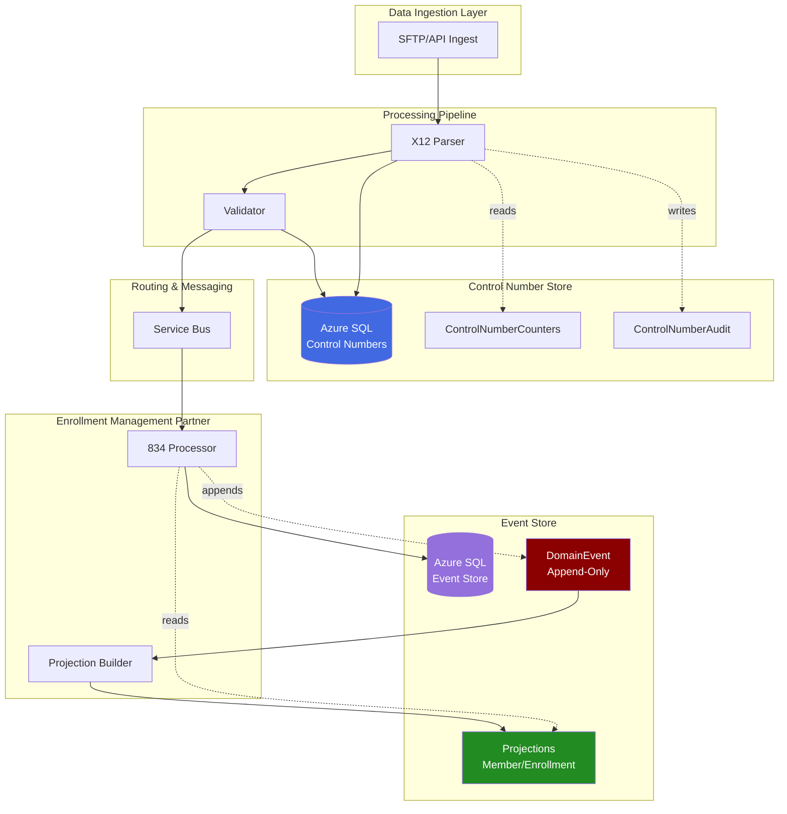

### Architecture Principles

| Principle | Control Number Store | Event Store | SFTP Tracking Database |
|-----------|---------------------|-------------|------------------------|
| **Deployment** | DACPAC (SQL Server Database Project) | EF Core Code-First Migrations | EF Core Code-First Migrations |
| **Update Pattern** | In-place updates | Append-only events | Insert-only tracking |
| **Consistency** | Strong (optimistic concurrency) | Eventual (CQRS projections) | Strong (unique constraints) |
| **Reversibility** | Manual compensation | Built-in reversal events | Immutable records |
| **Audit Trail** | Separate audit table | Immutable event log | Complete transfer history |
| **State Storage** | Current state only | Complete event history | All file operations |
| **Query Pattern** | Direct table queries | Projections + event replay | Direct table queries |
| **Use Case** | Control number assignment | Domain event sourcing | File transfer tracking |

### Technology Stack

```yaml
Database Platform:
  - Azure SQL Database (General Purpose or Business Critical)
  - Service Tier: GP_Gen5_2 (2 vCores, 8 GB RAM)
  - Storage: 32 GB with auto-grow
  - Backup: Geo-redundant with 7-day PITR

Control Number Store:
  - Deployment: DACPAC (Microsoft.Build.Sql)
  - Tool: SqlPackage.exe
  - Version Control: .sqlproj in edi-database-controlnumbers repo
  - Migration: Pre/Post deployment scripts

Event Store:
  - Deployment: Entity Framework Core 9.0
  - Migration Tool: dotnet ef database update
  - Version Control: C# migration files in ai-adf-edi-spec/infra/ef-migrations/
  - Code-First: EventStoreDbContext with FluentAPI

SFTP Tracking Database:
  - Deployment: Entity Framework Core 9.0
  - Migration Tool: dotnet ef database update
  - Version Control: C# migration files in edi-database-sftptracking repo
  - Code-First: SftpTrackingDbContext with FluentAPI
  - Database Name: EDISftpTracking
  - Purpose: File transfer tracking with idempotency

Authentication:
  - Managed Identity (User-Assigned for Function Apps)
  - Azure AD Authentication
  - No SQL authentication enabled

Networking:
  - Private Endpoints only
  - VNet integration required
  - NSG rules restrict access
  - No public internet access

Encryption:
  - TDE (Transparent Data Encryption) at rest
  - TLS 1.2+ for connections
  - Column-level encryption for PII (Future)
```

### Repository Architecture

```
edi-database-controlnumbers/              # ACTIVE (DACPAC)
├── EDI.ControlNumbers.Database/
│   ├── Tables/
│   │   ├── ControlNumberCounters.sql
│   │   └── ControlNumberAudit.sql
│   ├── StoredProcedures/
│   │   └── usp_GetNextControlNumber.sql
│   ├── Scripts/
│   │   ├── Script.PreDeployment.sql
│   │   └── Script.PostDeployment.sql
│   └── EDI.ControlNumbers.Database.sqlproj
└── README.md

edi-database-eventstore/                   # DEPRECATED (DACPAC)
├── EDI.EventStore.Database/
│   ├── Tables/                            # REFERENCE ONLY
│   ├── Views/
│   ├── StoredProcedures/
│   └── EDI.EventStore.Database.sqlproj    # Build issues
└── README.md

ai-adf-edi-spec/                           # ACTIVE (EF Core - Event Store)
└── infra/ef-migrations/
    └── EDI.EventStore.Migrations/
        └── EDI.EventStore.Migrations/
            ├── Data/
            │   └── EventStoreDbContext.cs  # DbContext
            ├── Entities/
            │   ├── DomainEvent.cs
            │   ├── TransactionBatch.cs
            │   ├── Member.cs
            │   ├── Enrollment.cs
            │   └── EventSnapshot.cs
            ├── Migrations/
            │   ├── 20251006054724_AddDefaultConstraints.cs
            │   ├── 20251006054857_AddRemainingDefaults.cs
            │   └── EventStoreDbContextModelSnapshot.cs
            └── EDI.EventStore.Migrations.csproj

edi-database-sftptracking/                 # ACTIVE (EF Core - SFTP Tracking)
├── EDI.SftpTracking.Migrations/
│   ├── Data/
│   │   └── SftpTrackingDbContext.cs    # DbContext
│   ├── Entities/
│   │   └── FileTracking.cs             # File transfer records
│   ├── Migrations/
│   │   ├── 20251006132201_InitialCreate.cs
│   │   ├── 20251006132201_InitialCreate.Designer.cs
│   │   └── SftpTrackingDbContextModelSnapshot.cs
│   └── EDI.SftpTracking.Migrations.csproj
├── README.md (8 KB - comprehensive setup guide)
└── .gitignore
```

### Migration History: DACPAC → EF Core

**Problem Statement:**  
The Microsoft.Build.Sql DACPAC SDK (used for SQL Server Database Projects) experienced persistent build issues preventing reliable deployments of the Event Store database. Issues included:
- Intermittent MSBuild failures during CI/CD
- Inconsistent schema comparison results
- Difficulty integrating with .NET application code
- Limited support for complex C# logic during migrations

**Solution:**  
Migrated Event Store to Entity Framework Core 9.0 code-first migrations while retaining DACPAC for Control Number Store (which had no build issues).

**Timeline:**
- **October 1, 2024** - DACPAC build issues identified during CI/CD
- **October 5, 2024** - Decision to migrate Event Store to EF Core
- **October 6, 2024** - EF Core migrations created and tested
- **October 10, 2024** - Production deployment of EF Core Event Store
- **October 15, 2024** - edi-database-eventstore marked as DEPRECATED

**Benefits:**
- Better source control (C# files vs. XML)
- Integrated with .NET application code
- Code-first migrations with FluentAPI
- No Microsoft.Build.Sql SDK dependencies
- Easier local development and testing
- Migration history tracking via `__EFMigrationsHistory` table

**Deployment Comparison:**

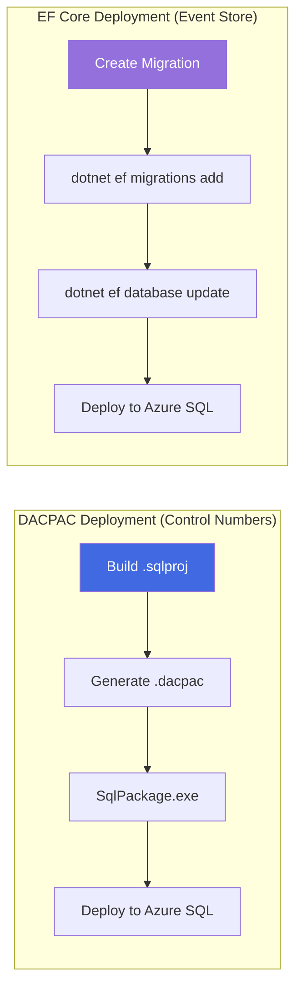

### Database Sizing & Performance

| Metric | Control Number Store | Event Store |
|--------|---------------------|-------------|
| **Size (Current)** | 2 GB | 15 GB (3 months history) |
| **Size (1 Year)** | 5 GB | 60 GB (append-only growth) |
| **IOPS** | 500 (read-heavy) | 2,000 (write-heavy append) |
| **Concurrent Connections** | 50 (Function App pool) | 100 (834 Processor + Projector) |
| **Avg Query Latency** | < 50ms (indexed lookups) | < 100ms (projection queries) |
| **Transactions/Second** | 100 TPS (control numbers) | 500 TPS (event appends) |
| **Backup Size** | 500 MB compressed | 4 GB compressed |
| **Recovery Time Objective** | 1 hour | 4 hours |

### Cost Estimation (Azure SQL)

```yaml
Control Number Store:
  Service Tier: GP_Gen5_2 (2 vCores)
  Monthly Cost: $364/month
  Storage: 32 GB ($0.115/GB) = $3.68/month
  Backup Storage: 7-day retention (geo-redundant) = $15/month
  Total: ~$383/month

Event Store:
  Service Tier: GP_Gen5_4 (4 vCores)  # Higher throughput
  Monthly Cost: $728/month
  Storage: 100 GB ($0.115/GB) = $11.50/month
  Backup Storage: 14-day retention (geo-redundant) = $40/month
  Total: ~$780/month

Combined Database Cost: ~$1,163/month
```

### Related Documents

- [02 - Processing Pipeline](./02-processing-pipeline.md) - X12 parser and validator
- [05 - Outbound Delivery](./05-outbound-delivery.md) - Control number generation (detailed)
- [11 - Event Sourcing Architecture](../11-event-sourcing-architecture-spec.md) - Complete event sourcing specification
- [09 - Security & Compliance](./09-security-compliance.md) - HIPAA compliance and encryption
- [08 - Monitoring & Operations](./08-monitoring-operations.md) - Database monitoring queries

---

## Control Number Store

### Overview

The Control Number Store is a DACPAC-deployed Azure SQL database responsible for managing X12 control numbers across all inbound and outbound EDI transactions. This database ensures globally unique, sequential control numbers for ISA (Interchange), GS (Functional Group), and ST (Transaction Set) envelopes.

**For complete documentation of the Control Number Store, see:**

📘 **[05 - Outbound Delivery](./05-outbound-delivery.md)** - Sections covering:
- Control Number Management Architecture
- ControlNumberCounters Table Schema
- ControlNumberAudit Table Schema
- Optimistic Concurrency with RowVersion
- Stored Procedure: `usp_GetNextControlNumber`
- DACPAC Deployment Process
- Monitoring and KQL Queries
- Troubleshooting Scenarios

### Key Characteristics

| Characteristic | Details |
|----------------|---------|
| **Database Name** | `edi-controlnumbers-{env}` (e.g., `edi-controlnumbers-prod`) |
| **Deployment Method** | DACPAC via SqlPackage.exe |
| **Repository** | [edi-database-controlnumbers](https://github.com/yourorg/edi-database-controlnumbers) |
| **Primary Table** | `ControlNumberCounters` (current state) |
| **Audit Table** | `ControlNumberAudit` (complete history) |
| **Concurrency Strategy** | Optimistic concurrency via `RowVersion` |
| **Transaction Isolation** | SERIALIZABLE for counter increments |
| **Managed Identity** | User-assigned MI for Function App access |

### Quick Reference Schema

**ControlNumberCounters Table:**

```sql
CREATE TABLE [dbo].[ControlNumberCounters] (
    [CounterID] INT PRIMARY KEY IDENTITY(1,1),
    [PartnerCode] VARCHAR(20) NOT NULL,
    [Direction] VARCHAR(10) NOT NULL,
    [ControlType] VARCHAR(20) NOT NULL,
    [CurrentValue] BIGINT NOT NULL,
    [MinValue] BIGINT NOT NULL DEFAULT 1,
    [MaxValue] BIGINT NOT NULL DEFAULT 999999999,
    [IncrementBy] INT NOT NULL DEFAULT 1,
    [LastAssignedUTC] DATETIME2(3) NOT NULL,
    [ModifiedUTC] DATETIME2(3) NOT NULL,
    [RowVersion] ROWVERSION NOT NULL,
    CONSTRAINT [UQ_ControlNumber] UNIQUE NONCLUSTERED ([PartnerCode], [Direction], [ControlType])
);
```

**Control Types:**
- `ISA_INTERCHANGE` - Interchange Control Number (ISA13/IEA02)
- `GS_GROUP` - Functional Group Control Number (GS06/GE02)
- `ST_TRANSACTION` - Transaction Set Control Number (ST02/SE02)

### Integration with Event Store

While the Control Number Store operates independently, it integrates with the Event Store for 834 outbound acknowledgments:

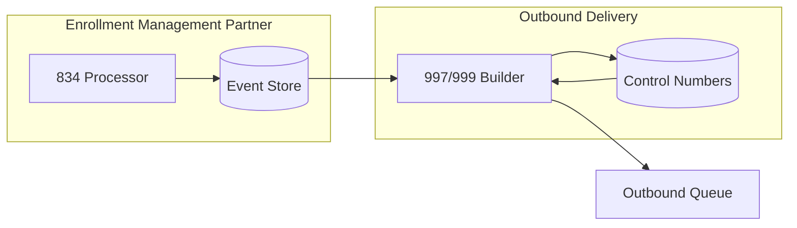

**Flow:**
1. 834 Processor appends events to Event Store
2. Event Store triggers outbound staging for acknowledgment
3. 997/999 Builder retrieves control numbers from Control Number Store
4. Acknowledgment generated with assigned control numbers
5. Control Number Audit tracks assignment for compliance

### Cross-Reference Table

| Topic | See Document | Section |
|-------|--------------|---------|
| Control Number Schema | [05 - Outbound Delivery](./05-outbound-delivery.md) | Control Number Management |
| DACPAC Deployment | [05 - Outbound Delivery](./05-outbound-delivery.md) | Deployment Process |
| Stored Procedures | [05 - Outbound Delivery](./05-outbound-delivery.md) | `usp_GetNextControlNumber` |
| Optimistic Concurrency | [05 - Outbound Delivery](./05-outbound-delivery.md) | RowVersion Strategy |
| Monitoring Queries | [05 - Outbound Delivery](./05-outbound-delivery.md) | KQL Monitoring Queries |
| Troubleshooting | [05 - Outbound Delivery](./05-outbound-delivery.md) | Troubleshooting Guide |
| Security & RBAC | [09 - Security & Compliance](./09-security-compliance.md) | Database Security |

---

## Event Store Architecture

### Overview

The Event Store implements **event sourcing** for the EDI 834 Enrollment Management Partner (trading partner code: `INTERNAL-ENROLLMENT`). Instead of storing only the current state, the Event Store captures every state change as an immutable event, providing complete auditability, reversibility, and temporal query capabilities.

### Core Principles

| Principle | Description | Benefit |
|-----------|-------------|---------|
| **Event Immutability** | Events are never updated or deleted, only appended | Audit trail, reproducibility |
| **Single Source of Truth** | Event log is the authoritative data source | Consistency, reliability |
| **Eventual Consistency** | Projections eventually consistent with events | Performance, scalability |
| **Command-Query Separation** | Writes append events, reads query projections | CQRS pattern |
| **Idempotency** | Same file processed multiple times produces identical events | Safe reprocessing |
| **Temporal Queries** | Reconstruct state at any point in time | Historical analysis |
| **Reversibility** | Transaction batches can be reversed with compensating events | Error correction |

### CQRS Pattern

The Event Store implements **Command Query Responsibility Segregation (CQRS)**, separating write operations from read operations:

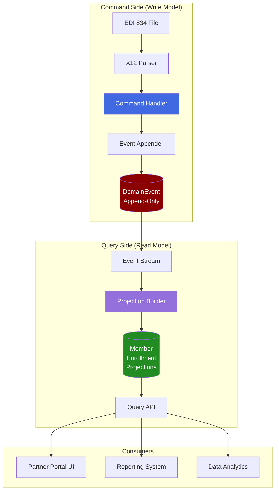

**Command Side (Write Model):**
- Receives EDI 834 files from Service Bus
- Parses transactions into domain commands
- Appends immutable events to `DomainEvent` table
- NO updates or deletes
- Optimized for write throughput

**Query Side (Read Model):**
- Reads events from `DomainEvent` table
- Builds materialized projections (`Member`, `Enrollment`)
- Optimized for query performance
- Eventually consistent with event stream

### Event Sourcing vs Traditional CRUD

| Aspect | Traditional CRUD | Event Sourcing (Event Store) |
|--------|------------------|------------------------------|
| **State Storage** | Current state only | Complete event history |
| **Updates** | Overwrite data (UPDATE) | Append new events (INSERT) |
| **Deletions** | DELETE records | Append "terminated" events |
| **Audit Trail** | Separate audit tables | Built-in via event log |
| **Reversibility** | Complex compensation logic | Natural via reversal events |
| **Temporal Queries** | Difficult/impossible | Native capability (replay events) |
| **Storage Size** | Compact (current state) | Larger (all history) |
| **Query Performance** | Fast (direct reads) | Fast (via projections) |
| **Write Performance** | Moderate (indexes) | High (append-only) |
| **Debugging** | Lost historical context | Complete reproducibility |
| **Compliance** | Manual tracking | Automatic data lineage |

### Core Concepts

#### 1. Aggregate

A cluster of domain objects treated as a single unit for data changes. In the Event Store:

- **Member Aggregate**: `SubscriberID` (e.g., `SUB12345`)
- **Enrollment Aggregate**: `EnrollmentID` (combination of Member + Plan)
- **Coverage Aggregate**: `CoverageID` (specific benefit plan)

**Example:**
```
Aggregate: Member
AggregateID: SUB12345 (Subscriber ID)
Events: [MemberCreated, MemberAddressUpdated, MemberPhoneUpdated]
```

#### 2. Event

An immutable record of something that happened in the past, stored as JSON in the `DomainEvent` table:

```json
{
  "EventID": 12345,
  "EventGUID": "550e8400-e29b-41d4-a716-446655440000",
  "AggregateType": "Member",
  "AggregateID": "SUB12345",
  "EventType": "MemberCreated",
  "EventVersion": 1,
  "EventSequence": 98765,
  "EventTimestamp": "2025-10-01T14:30:00Z",
  "EventData": {
    "SubscriberID": "SUB12345",
    "FirstName": "John",
    "LastName": "Doe",
    "DateOfBirth": "1985-03-15",
    "Gender": "M",
    "AddressLine1": "123 Main St",
    "City": "Boston",
    "State": "MA",
    "ZipCode": "02101"
  },
  "EventMetadata": {
    "CorrelationID": "batch-456",
    "CausationID": "transaction-789",
    "UserAgent": "EDI-Processor-v2.1",
    "ProcessedBy": "func-834-processor"
  }
}
```

**Event Characteristics:**
- **Past Tense**: `MemberCreated`, not `CreateMember` (already happened)
- **Immutable**: Never updated after insertion
- **Versioned**: `EventVersion` allows schema evolution
- **Ordered**: `EventSequence` provides global monotonic ordering
- **Correlated**: `CorrelationID` links events from same batch

#### 3. Projection

A materialized view built from events, optimized for queries:

```sql
-- Member Projection (Current State)
SELECT 
    MemberID,
    SubscriberID,
    FirstName,
    LastName,
    DateOfBirth,
    LastEventSequence,  -- Projection lag tracking
    ModifiedUtc         -- Last projection update
FROM Member
WHERE IsActive = 1;
```

**Projection Characteristics:**
- **Derived**: Built by replaying events
- **Disposable**: Can be rebuilt from event stream
- **Eventually Consistent**: Lag between event append and projection update
- **Optimized**: Indexed for query performance
- **Versioned**: `LastEventSequence` tracks projection state

#### 4. Transaction Batch

A single EDI 834 file processed as an atomic unit:

```sql
-- TransactionBatch (Immutable)
INSERT INTO TransactionBatch (
    BatchGUID,
    PartnerCode,
    Direction,
    TransactionType,
    FileName,
    FileHash,
    FileReceivedDate,
    InterchangeControlNumber,
    FunctionalGroupControlNumber,
    ProcessingStatus
) VALUES (
    NEWID(),
    'INTERNAL-ENROLLMENT',
    'INBOUND',
    '834',
    'enrollment_20250101.edi',
    'SHA256:abc123...',
    '2025-01-01T10:00:00Z',
    '000000001',
    '000000001',
    'COMPLETED'
);
```

#### 5. Event Sequence

A globally unique, monotonically increasing sequence ensuring deterministic event ordering:

```sql
-- EventSequence (Database Sequence)
CREATE SEQUENCE dbo.EventSequence
    AS BIGINT
    START WITH 1
    INCREMENT BY 1
    NO CACHE;

-- Used in DomainEvent table
ALTER TABLE DomainEvent
ADD CONSTRAINT DF_DomainEvent_EventSequence
DEFAULT (NEXT VALUE FOR dbo.EventSequence) FOR EventSequence;
```

**Why Global Sequence?**
- Deterministic replay order
- Projection consistency
- Distributed system coordination
- Debugging and troubleshooting

### System Boundary

The Event Store is used exclusively by the **834 Enrollment Management Partner** (`INTERNAL-ENROLLMENT`):

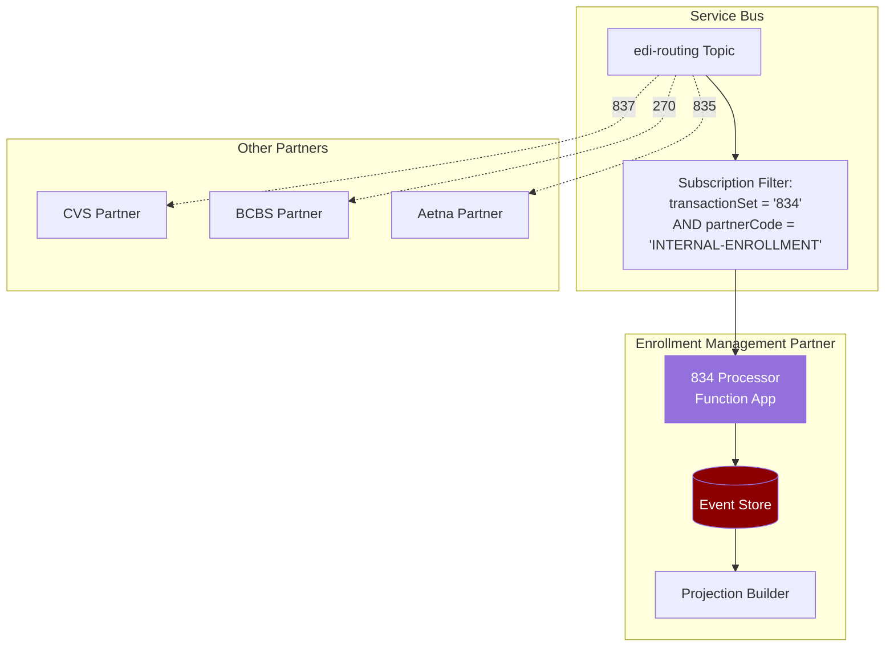

**Key Points:**
- Event sourcing is an **internal architectural choice** for INTERNAL-ENROLLMENT
- Other partners (CVS, BCBS, Aetna) use different patterns (direct mapping, pass-through)
- Loose coupling via Service Bus subscription filters
- No dependencies on other partners' implementations

### Benefits

| Benefit | Use Case | Example |
|---------|----------|---------|
| **Complete Auditability** | Regulatory compliance (HIPAA) | Show all changes to member `SUB12345` over time |
| **Reversibility** | Correct erroneous 834 file | Reverse entire batch with compensating events |
| **Temporal Queries** | Historical analysis | "What was member status on June 30, 2024?" |
| **Debugging** | Reproduce production issues | Replay events from batch 456 to reproduce error |
| **Flexibility** | New reporting requirements | Build new projections from existing events |
| **Performance** | High write throughput | Append-only inserts are faster than updates |
| **Compliance** | Data lineage | Trace enrollment change back to source EDI file |

### Trade-offs

| Aspect | Traditional CRUD | Event Sourcing (Event Store) |
|--------|------------------|------------------------------|
| **Complexity** | Low | High (CQRS, projections) |
| **Storage** | Compact | Larger (all history) |
| **Query Simplicity** | Simple SELECT | Projection building required |
| **Learning Curve** | Low | High (new concepts) |
| **Tooling** | Mature (EF Core, Dapper) | Limited (custom implementation) |
| **Event Schema Migration** | N/A | Requires versioning strategy |

**When to Use Event Sourcing:**
- ✅ Auditability is critical (HIPAA, regulatory)
- ✅ Reversibility needed (error correction)
- ✅ Temporal queries required (historical analysis)
- ✅ High write throughput (append-only)
- ✅ Complex domain logic (enrollment management)

**When NOT to Use Event Sourcing:**
- ❌ Simple CRUD operations (partner configuration)
- ❌ Low write volume (reference data)
- ❌ No audit requirements (temporary staging)
- ❌ Team unfamiliar with event sourcing

---

## SFTP Tracking Database

### Purpose

The **SFTP Tracking Database** provides a complete audit trail of all file transfer operations performed by the edi-sftp-connector function app. It implements idempotency to prevent duplicate downloads/uploads and enables correlation tracking across the distributed system.

**Key Capabilities:**

1. **Idempotency Support** - Prevents re-downloading or re-uploading identical files
2. **Correlation Tracking** - Links file operations to Service Bus messages and Application Insights
3. **Error Tracking** - Captures failed operations with detailed error messages
4. **Duplicate Detection** - SHA256 file hashing prevents reprocessing identical content
5. **Audit Trail** - Complete immutable history of all file transfers

### Architecture

**SFTP Tracking in System Context:**

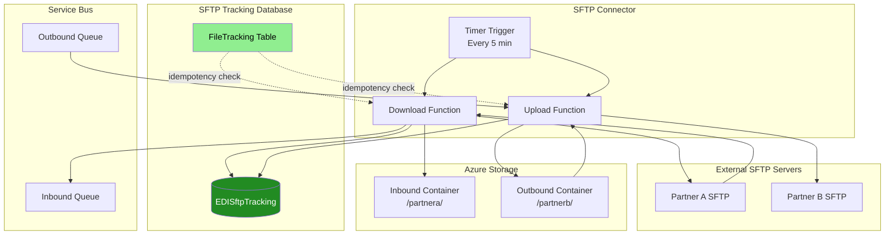

**Integration Points:**

| Component | Interaction | Purpose |
|-----------|-------------|---------|
| **SFTP Connector** | INSERT FileTracking records | Record all file operations |
| **TrackingService** | SELECT for idempotency checks | Prevent duplicate operations |
| **Service Bus** | CorrelationId linking | End-to-end message tracing |
| **Blob Storage** | BlobUrl tracking | Link files to storage locations |
| **Application Insights** | CorrelationId in telemetry | Distributed tracing |

### Database Schema

**FileTracking Table:**

```sql
CREATE TABLE [dbo].[FileTracking] (
    [Id] INT IDENTITY(1,1) NOT NULL,
    [PartnerCode] NVARCHAR(50) NOT NULL,
    [FileName] NVARCHAR(500) NOT NULL,
    [FileHash] NVARCHAR(100) NOT NULL,  -- SHA256 hash
    [FileSize] BIGINT NOT NULL,
    [Direction] NVARCHAR(20) NOT NULL,  -- 'Inbound' or 'Outbound'
    [Status] NVARCHAR(20) NOT NULL,     -- 'Downloaded', 'Uploaded', 'Failed'
    [ProcessedAt] DATETIME2 NOT NULL DEFAULT GETUTCDATE(),
    [BlobUrl] NVARCHAR(1000) NULL,
    [ErrorMessage] NVARCHAR(MAX) NULL,
    [CorrelationId] NVARCHAR(100) NULL,
    
    CONSTRAINT [PK_FileTracking] PRIMARY KEY CLUSTERED ([Id] ASC)
);

-- Index for idempotency checks (prevent duplicate downloads/uploads)
CREATE NONCLUSTERED INDEX [IX_FileTracking_PartnerCode_FileName_Direction_Status]
    ON [dbo].[FileTracking] ([PartnerCode], [FileName], [Direction], [Status])
    INCLUDE ([ProcessedAt]);

-- Index for date range queries (reporting and monitoring)
CREATE NONCLUSTERED INDEX [IX_FileTracking_ProcessedAt]
    ON [dbo].[FileTracking] ([ProcessedAt] DESC)
    INCLUDE ([PartnerCode], [FileName], [Direction], [Status]);

-- Filtered index for correlation tracking (only non-null values)
CREATE NONCLUSTERED INDEX [IX_FileTracking_CorrelationId]
    ON [dbo].[FileTracking] ([CorrelationId])
    WHERE [CorrelationId] IS NOT NULL;
```

**Column Descriptions:**

| Column | Type | Description | Constraints |
|--------|------|-------------|-------------|
| `Id` | INT IDENTITY | Primary key | NOT NULL, IDENTITY |
| `PartnerCode` | NVARCHAR(50) | Trading partner identifier (e.g., "PARTNERA") | NOT NULL |
| `FileName` | NVARCHAR(500) | Original file name from SFTP server | NOT NULL |
| `FileHash` | NVARCHAR(100) | SHA256 hash for duplicate detection | NOT NULL |
| `FileSize` | BIGINT | File size in bytes | NOT NULL |
| `Direction` | NVARCHAR(20) | Transfer direction: "Inbound" or "Outbound" | NOT NULL |
| `Status` | NVARCHAR(20) | Operation status: "Downloaded", "Uploaded", "Failed" | NOT NULL |
| `ProcessedAt` | DATETIME2 | UTC timestamp when operation completed | NOT NULL, DEFAULT GETUTCDATE() |
| `BlobUrl` | NVARCHAR(1000) | Full URL to file in Azure Blob Storage | NULL |
| `ErrorMessage` | NVARCHAR(MAX) | Error details if Status = 'Failed' | NULL |
| `CorrelationId` | NVARCHAR(100) | Links to Service Bus message ID | NULL |

**Status Enum Values:**

- **Downloaded** - File successfully downloaded from partner SFTP and stored in Azure Blob Storage
- **Uploaded** - File successfully uploaded to partner SFTP server
- **Failed** - Operation failed (see ErrorMessage for details)

**Direction Enum Values:**

- **Inbound** - File downloaded from partner SFTP server to Azure Blob Storage
- **Outbound** - File uploaded from Azure Blob Storage to partner SFTP server

### EF Core Entity Class

**FileTracking.cs:**

```csharp
using System.ComponentModel.DataAnnotations;
using System.ComponentModel.DataAnnotations.Schema;

namespace EDI.SftpTracking.Migrations.Entities;

/// <summary>
/// File tracking record for SFTP operations (inbound and outbound).
/// Provides idempotency and complete audit trail of all file transfers.
/// </summary>
[Table("FileTracking")]
public class FileTracking
{
    /// <summary>
    /// Primary key.
    /// </summary>
    [Key]
    [DatabaseGenerated(DatabaseGeneratedOption.Identity)]
    public int Id { get; set; }

    /// <summary>
    /// Trading partner identifier (e.g., "PARTNERA").
    /// Links to partner configuration in edi-partner-configs.
    /// </summary>
    [Required]
    [MaxLength(50)]
    public required string PartnerCode { get; set; }

    /// <summary>
    /// Original file name from SFTP server.
    /// </summary>
    [Required]
    [MaxLength(500)]
    public required string FileName { get; set; }

    /// <summary>
    /// SHA256 hash of file contents.
    /// Used to prevent re-downloading/re-uploading identical files.
    /// </summary>
    [Required]
    [MaxLength(100)]
    public required string FileHash { get; set; }

    /// <summary>
    /// File size in bytes.
    /// </summary>
    [Required]
    public long FileSize { get; set; }

    /// <summary>
    /// Transfer direction: "Inbound" or "Outbound".
    /// </summary>
    [Required]
    [MaxLength(20)]
    public required string Direction { get; set; }

    /// <summary>
    /// Operation status: "Downloaded", "Uploaded", "Failed".
    /// </summary>
    [Required]
    [MaxLength(20)]
    public required string Status { get; set; }

    /// <summary>
    /// UTC timestamp when operation completed.
    /// </summary>
    [Required]
    public DateTime ProcessedAt { get; set; }

    /// <summary>
    /// Full URL to file in Azure Blob Storage.
    /// Example: https://edistoragedev.blob.core.windows.net/inbound/partnera/claims_20251006.x12
    /// </summary>
    [MaxLength(1000)]
    public string? BlobUrl { get; set; }

    /// <summary>
    /// Error details if Status = 'Failed'.
    /// Null for successful operations.
    /// </summary>
    public string? ErrorMessage { get; set; }

    /// <summary>
    /// Correlation ID linking to Service Bus message.
    /// Used for distributed tracing across the system.
    /// Optional but recommended.
    /// </summary>
    [MaxLength(100)]
    public string? CorrelationId { get; set; }
}
```

### DbContext Configuration

**SftpTrackingDbContext.cs:**

```csharp
using Microsoft.EntityFrameworkCore;
using EDI.SftpTracking.Migrations.Entities;

namespace EDI.SftpTracking.Migrations;

/// <summary>
/// DbContext for EDI SFTP Tracking database.
/// Manages file transfer tracking for inbound and outbound SFTP operations.
/// </summary>
public class SftpTrackingDbContext : DbContext
{
    public DbSet<FileTracking> FileTracking { get; set; } = null!;

    public SftpTrackingDbContext(DbContextOptions<SftpTrackingDbContext> options)
        : base(options)
    {
    }

    protected override void OnModelCreating(ModelBuilder modelBuilder)
    {
        base.OnModelCreating(modelBuilder);

        modelBuilder.Entity<FileTracking>(entity =>
        {
            entity.ToTable("FileTracking");
            entity.HasKey(e => e.Id);

            // Required fields
            entity.Property(e => e.PartnerCode).IsRequired().HasMaxLength(50);
            entity.Property(e => e.FileName).IsRequired().HasMaxLength(500);
            entity.Property(e => e.FileHash).IsRequired().HasMaxLength(100);
            entity.Property(e => e.FileSize).IsRequired();
            entity.Property(e => e.Direction).IsRequired().HasMaxLength(20);
            entity.Property(e => e.Status).IsRequired().HasMaxLength(20);
            entity.Property(e => e.ProcessedAt).IsRequired().HasColumnType("datetime2");

            // Optional fields
            entity.Property(e => e.BlobUrl).HasMaxLength(1000);
            entity.Property(e => e.ErrorMessage);
            entity.Property(e => e.CorrelationId).HasMaxLength(100);

            // Index for idempotency checks
            entity.HasIndex(e => new { e.PartnerCode, e.FileName, e.Direction, e.Status })
                .HasDatabaseName("IX_FileTracking_PartnerCode_FileName_Direction_Status")
                .IncludeProperties(e => e.ProcessedAt);

            // Index for date range queries
            entity.HasIndex(e => e.ProcessedAt)
                .HasDatabaseName("IX_FileTracking_ProcessedAt")
                .IsDescending()
                .IncludeProperties(e => new { e.PartnerCode, e.FileName, e.Direction, e.Status });

            // Filtered index for correlation tracking
            entity.HasIndex(e => e.CorrelationId)
                .HasDatabaseName("IX_FileTracking_CorrelationId")
                .HasFilter("[CorrelationId] IS NOT NULL");
        });
    }
}
```

### TrackingService Integration

**Example: Recording Inbound File Download:**

```csharp
using EDI.SftpTracking.Migrations;
using EDI.SftpTracking.Migrations.Entities;
using Microsoft.EntityFrameworkCore;

public class TrackingService
{
    private readonly SftpTrackingDbContext _context;

    public TrackingService(SftpTrackingDbContext context)
    {
        _context = context;
    }

    /// <summary>
    /// Record successful file download from partner SFTP server.
    /// </summary>
    public async Task RecordDownloadAsync(
        string partnerCode,
        string fileName,
        string fileHash,
        long fileSize,
        string blobUrl,
        string? correlationId = null)
    {
        var tracking = new FileTracking
        {
            PartnerCode = partnerCode,
            FileName = fileName,
            FileHash = fileHash,
            FileSize = fileSize,
            Direction = "Inbound",
            Status = "Downloaded",
            ProcessedAt = DateTime.UtcNow,
            BlobUrl = blobUrl,
            CorrelationId = correlationId
        };

        _context.FileTracking.Add(tracking);
        await _context.SaveChangesAsync();
    }

    /// <summary>
    /// Record successful file upload to partner SFTP server.
    /// </summary>
    public async Task RecordUploadAsync(
        string partnerCode,
        string fileName,
        string fileHash,
        long fileSize,
        string blobUrl,
        string? correlationId = null)
    {
        var tracking = new FileTracking
        {
            PartnerCode = partnerCode,
            FileName = fileName,
            FileHash = fileHash,
            FileSize = fileSize,
            Direction = "Outbound",
            Status = "Uploaded",
            ProcessedAt = DateTime.UtcNow,
            BlobUrl = blobUrl,
            CorrelationId = correlationId
        };

        _context.FileTracking.Add(tracking);
        await _context.SaveChangesAsync();
    }

    /// <summary>
    /// Record failed file operation with error details.
    /// </summary>
    public async Task RecordFailureAsync(
        string partnerCode,
        string fileName,
        string direction,
        string errorMessage,
        string? correlationId = null)
    {
        var tracking = new FileTracking
        {
            PartnerCode = partnerCode,
            FileName = fileName,
            FileHash = "FAILED",  // No hash for failed operations
            FileSize = 0,
            Direction = direction,
            Status = "Failed",
            ProcessedAt = DateTime.UtcNow,
            ErrorMessage = errorMessage,
            CorrelationId = correlationId
        };

        _context.FileTracking.Add(tracking);
        await _context.SaveChangesAsync();
    }

    /// <summary>
    /// Check if file has already been downloaded (idempotency).
    /// </summary>
    public async Task<bool> IsFileAlreadyDownloadedAsync(
        string partnerCode,
        string fileName)
    {
        return await _context.FileTracking
            .AnyAsync(f => 
                f.PartnerCode == partnerCode &&
                f.FileName == fileName &&
                f.Direction == "Inbound" &&
                f.Status == "Downloaded");
    }

    /// <summary>
    /// Check if file with same hash has already been processed (duplicate detection).
    /// </summary>
    public async Task<bool> IsDuplicateFileAsync(
        string partnerCode,
        string fileHash,
        string direction)
    {
        return await _context.FileTracking
            .AnyAsync(f => 
                f.PartnerCode == partnerCode &&
                f.FileHash == fileHash &&
                f.Direction == direction &&
                f.Status != "Failed");
    }
}
```

### Migration Strategy

**Initial Migration: 20251006132201_InitialCreate**

Created on October 6, 2025, this migration establishes the complete database schema.

**Key Features:**
- Creates FileTracking table with all columns
- Adds 3 indexes (idempotency, date queries, correlation tracking)
- Configures default constraint for ProcessedAt (GETUTCDATE())
- Sets up filtered index for non-null CorrelationId values

**Deployment Command:**

```bash
# Apply migration to Azure SQL Database
dotnet ef database update --connection "Server=tcp:edi-sql-dev.database.windows.net,1433;Database=EDISftpTracking;Authentication=Active Directory Default;"

# Generate SQL script (for review before deployment)
dotnet ef migrations script --idempotent --output EDISftpTracking_Deploy.sql
```

### Idempotency Pattern

**Problem:**  
SFTP Connector runs on a timer (every 5 minutes). Network failures or function app restarts could cause the same file to be processed multiple times.

**Solution:**  
Before downloading or uploading a file, check if it has already been processed:

```csharp
// Before downloading from partner SFTP
var alreadyDownloaded = await _trackingService.IsFileAlreadyDownloadedAsync(
    partnerCode: "PARTNERA",
    fileName: "claims_20251006.x12"
);

if (alreadyDownloaded)
{
    _logger.LogInformation("File {FileName} already downloaded for {PartnerCode}, skipping",
        fileName, partnerCode);
    return;
}

// Proceed with download...
await DownloadFileAsync(partnerCode, fileName);

// Record successful download
await _trackingService.RecordDownloadAsync(
    partnerCode: partnerCode,
    fileName: fileName,
    fileHash: ComputeSHA256(fileContent),
    fileSize: fileContent.Length,
    blobUrl: blobUrl,
    correlationId: context.InvocationId.ToString()
);
```

**Composite Index for Idempotency:**

The index `IX_FileTracking_PartnerCode_FileName_Direction_Status` enables fast lookups for idempotency checks:

```sql
-- Efficient query using composite index
SELECT COUNT(*) FROM FileTracking
WHERE PartnerCode = 'PARTNERA'
  AND FileName = 'claims_20251006.x12'
  AND Direction = 'Inbound'
  AND Status = 'Downloaded';
```

### Correlation Tracking

**Purpose:**  
Link file operations to Service Bus messages and Application Insights traces for end-to-end observability.

**Flow:**

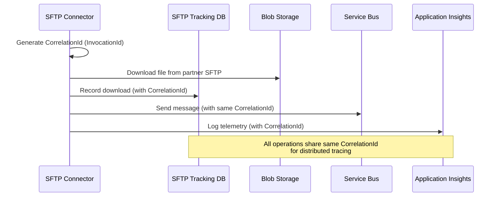

**Query by Correlation ID:**

```csharp
// Find all file operations for a specific Service Bus message
var operations = await _context.FileTracking
    .Where(f => f.CorrelationId == messageId)
    .OrderBy(f => f.ProcessedAt)
    .ToListAsync();
```

**Application Insights Query:**

```kusto
// Trace file operation from SFTP Connector through Service Bus to processing
union traces, requests, dependencies
| where customDimensions.CorrelationId == "abc123-def456-ghi789"
| project timestamp, operation_Name, message, customDimensions
| order by timestamp asc
```

### Relationship to Other Databases

**Independent Architecture:**

The SFTP Tracking Database is **independent** from Control Number Store and Event Store, with no direct foreign key relationships.

**Indirect Links:**

| Database | Link Field | Purpose |
|----------|-----------|---------|
| **Control Number Store** | `PartnerCode` | Same partner identifiers used across all databases |
| **Event Store** | `CorrelationId` | Links file downloads to 834 processing events |
| **Partner Configs** | `PartnerCode` | References partner configuration JSON files |

**End-to-End Tracing Example:**

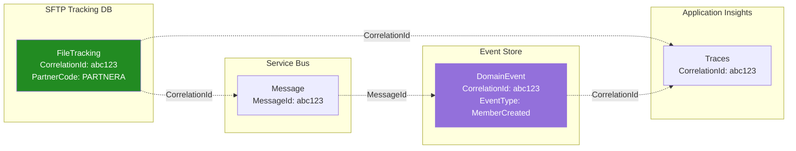

---

## Database Schemas

### Schema Overview

The Event Store database consists of **6 tables** organized into three categories:

| Category | Tables | Purpose |
|----------|--------|---------|
| **Source Tables** | `TransactionBatch`, `TransactionHeader` | Immutable file tracking |
| **Event Store** | `DomainEvent`, `EventSnapshot` | Append-only event log |
| **Projections** | `Member`, `Enrollment` | Materialized read models |

**Entity Relationship Diagram:**

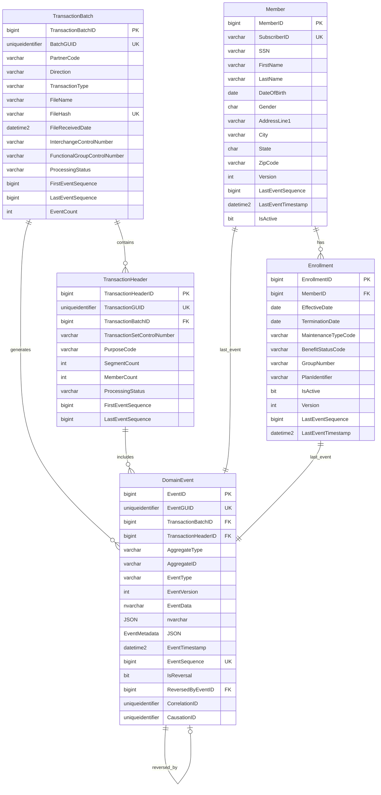

### Table 1: TransactionBatch (Immutable File Tracking)

**Purpose:** Tracks each EDI 834 file as an atomic processing unit. Immutable after creation.

**C# Entity (EF Core):**

```csharp
[Table("TransactionBatch", Schema = "dbo")]
public class TransactionBatch
{
    [Key]
    [DatabaseGenerated(DatabaseGeneratedOption.Identity)]
    public long TransactionBatchID { get; set; }

    [Required]
    public Guid BatchGUID { get; set; } = Guid.NewGuid();

    [Required]
    [MaxLength(15)]
    public string PartnerCode { get; set; } = null!;

    [Required]
    [MaxLength(10)]
    public string Direction { get; set; } = null!; // 'INBOUND', 'OUTBOUND'

    [Required]
    [MaxLength(10)]
    public string TransactionType { get; set; } = null!; // '834', '270', etc.

    // Source identification
    [MaxLength(500)]
    public string? FileName { get; set; }

    [MaxLength(64)]
    public string? FileHash { get; set; } // SHA256

    [Required]
    [Column(TypeName = "datetime2(3)")]
    public DateTime FileReceivedDate { get; set; }

    [MaxLength(1000)]
    public string? BlobFullUri { get; set; }

    // EDI envelope identifiers
    [MaxLength(15)]
    public string? InterchangeControlNumber { get; set; }

    [MaxLength(15)]
    public string? FunctionalGroupControlNumber { get; set; }

    // Processing metadata
    [Required]
    [MaxLength(20)]
    public string ProcessingStatus { get; set; } = "RECEIVED";

    [Column(TypeName = "datetime2(3)")]
    public DateTime? ProcessingStartedUtc { get; set; }

    [Column(TypeName = "datetime2(3)")]
    public DateTime? ProcessingCompletedUtc { get; set; }

    [Column(TypeName = "nvarchar(max)")]
    public string? ErrorMessage { get; set; }

    // Event correlation
    public long? FirstEventSequence { get; set; }
    public long? LastEventSequence { get; set; }

    [Required]
    public int EventCount { get; set; } = 0;

    // Audit
    [Required]
    [Column(TypeName = "datetime2(3)")]
    public DateTime CreatedUtc { get; set; } = DateTime.UtcNow;

    [Required]
    [Column(TypeName = "datetime2(3)")]
    public DateTime ModifiedUtc { get; set; } = DateTime.UtcNow;

    [Timestamp]
    public byte[]? RowVersion { get; set; }

    // Navigation properties
    public virtual ICollection<DomainEvent> DomainEvents { get; set; } = new List<DomainEvent>();
    public virtual ICollection<TransactionHeader> TransactionHeaders { get; set; } = new List<TransactionHeader>();
}
```

**Indexes (Configured in EventStoreDbContext):**

```csharp
modelBuilder.Entity<TransactionBatch>(entity =>
{
    entity.HasIndex(e => e.BatchGUID).IsUnique();
    entity.HasIndex(e => e.FileHash).IsUnique().HasFilter("[FileHash] IS NOT NULL");
    entity.HasIndex(e => new { e.PartnerCode, e.TransactionType, e.FileReceivedDate });
    entity.HasIndex(e => new { e.ProcessingStatus, e.FileReceivedDate });
    entity.HasIndex(e => new { e.InterchangeControlNumber, e.FunctionalGroupControlNumber });

    entity.HasCheckConstraint("CHK_TransactionBatch_Direction", 
        "[Direction] IN ('INBOUND', 'OUTBOUND')");
    entity.HasCheckConstraint("CHK_TransactionBatch_Status",
        "[ProcessingStatus] IN ('RECEIVED', 'PROCESSING', 'COMPLETED', 'FAILED', 'REVERSED')");
});
```

**Key Fields:**

| Field | Type | Purpose |
|-------|------|---------|
| `TransactionBatchID` | BIGINT | Primary key (identity) |
| `BatchGUID` | UNIQUEIDENTIFIER | Globally unique batch identifier (for distributed systems) |
| `PartnerCode` | VARCHAR(15) | Trading partner (e.g., `INTERNAL-ENROLLMENT`) |
| `Direction` | VARCHAR(10) | `INBOUND` or `OUTBOUND` |
| `TransactionType` | VARCHAR(10) | EDI transaction set (e.g., `834`) |
| `FileName` | VARCHAR(500) | Original file name |
| `FileHash` | VARCHAR(64) | SHA256 hash for idempotency |
| `FileReceivedDate` | DATETIME2(3) | File ingestion timestamp |
| `BlobFullUri` | VARCHAR(1000) | Azure Blob Storage URI (for replay) |
| `InterchangeControlNumber` | VARCHAR(15) | ISA13 control number |
| `FunctionalGroupControlNumber` | VARCHAR(15) | GS06 control number |
| `ProcessingStatus` | VARCHAR(20) | `RECEIVED`, `PROCESSING`, `COMPLETED`, `FAILED`, `REVERSED` |
| `FirstEventSequence` | BIGINT | First event generated from this batch |
| `LastEventSequence` | BIGINT | Last event generated from this batch |
| `EventCount` | INT | Total events generated |
| `RowVersion` | ROWVERSION | Optimistic concurrency |

**Example Record:**

```sql
INSERT INTO TransactionBatch (
    BatchGUID,
    PartnerCode,
    Direction,
    TransactionType,
    FileName,
    FileHash,
    FileReceivedDate,
    BlobFullUri,
    InterchangeControlNumber,
    FunctionalGroupControlNumber,
    ProcessingStatus,
    FirstEventSequence,
    LastEventSequence,
    EventCount,
    CreatedUtc,
    ModifiedUtc
) VALUES (
    'A12B3C4D-5678-90AB-CDEF-1234567890AB',
    'INTERNAL-ENROLLMENT',
    'INBOUND',
    '834',
    'enrollment_20250101.edi',
    'e3b0c44298fc1c149afbf4c8996fb92427ae41e4649b934ca495991b7852b855',
    '2025-01-01T10:00:00.000',
    'https://edirawprod.blob.core.windows.net/inbound-edi/834/enrollment_20250101.edi',
    '000000001',
    '000000001',
    'COMPLETED',
    98765,
    98890,
    125,
    GETUTCDATE(),
    GETUTCDATE()
);
```

### Table 2: TransactionHeader (EDI Transaction Tracking)

**Purpose:** Tracks individual ST/SE transactions within an EDI file (one file may contain multiple transactions).

**C# Entity (EF Core):**

```csharp
[Table("TransactionHeader", Schema = "dbo")]
public class TransactionHeader
{
    [Key]
    [DatabaseGenerated(DatabaseGeneratedOption.Identity)]
    public long TransactionHeaderID { get; set; }

    [Required]
    public Guid TransactionGUID { get; set; } = Guid.NewGuid();

    [Required]
    public long TransactionBatchID { get; set; }

    // EDI identifiers
    [Required]
    [MaxLength(15)]
    public string TransactionSetControlNumber { get; set; } = null!;

    [MaxLength(10)]
    public string? PurposeCode { get; set; } // '00' Original, '05' Replace

    [MaxLength(50)]
    public string? ReferenceIdentification { get; set; }

    [Column(TypeName = "date")]
    public DateTime? TransactionDate { get; set; }

    // Processing metadata
    [Required]
    public int SegmentCount { get; set; } = 0;

    [Required]
    public int MemberCount { get; set; } = 0;

    [Required]
    [MaxLength(20)]
    public string ProcessingStatus { get; set; } = "RECEIVED";

    // Event correlation
    public long? FirstEventSequence { get; set; }
    public long? LastEventSequence { get; set; }

    // Audit
    [Required]
    [Column(TypeName = "datetime2(3)")]
    public DateTime CreatedUtc { get; set; } = DateTime.UtcNow;

    [Required]
    [Column(TypeName = "datetime2(3)")]
    public DateTime ModifiedUtc { get; set; } = DateTime.UtcNow;

    // Navigation properties
    [ForeignKey(nameof(TransactionBatchID))]
    public virtual TransactionBatch TransactionBatch { get; set; } = null!;

    public virtual ICollection<DomainEvent> DomainEvents { get; set; } = new List<DomainEvent>();
}
```

**Indexes:**

```csharp
modelBuilder.Entity<TransactionHeader>(entity =>
{
    entity.HasIndex(e => e.TransactionGUID).IsUnique();
    entity.HasIndex(e => e.TransactionBatchID);
    entity.HasIndex(e => e.TransactionSetControlNumber);

    entity.HasOne(e => e.TransactionBatch)
        .WithMany(b => b.TransactionHeaders)
        .HasForeignKey(e => e.TransactionBatchID)
        .OnDelete(DeleteBehavior.Restrict);
});
```

### Table 3: DomainEvent (Append-Only Event Log)

**Purpose:** The source of truth for all domain events. Append-only, never updated or deleted.

**C# Entity (EF Core):**

```csharp
[Table("DomainEvent", Schema = "dbo")]
public class DomainEvent
{
    [Key]
    [DatabaseGenerated(DatabaseGeneratedOption.Identity)]
    public long EventID { get; set; }

    [Required]
    public Guid EventGUID { get; set; } = Guid.NewGuid();

    // Source correlation
    [Required]
    public long TransactionBatchID { get; set; }

    public long? TransactionHeaderID { get; set; }

    // Event classification
    [Required]
    [MaxLength(50)]
    public string AggregateType { get; set; } = null!; // 'Member', 'Enrollment', 'Coverage'

    [Required]
    [MaxLength(100)]
    public string AggregateID { get; set; } = null!; // Business key (SubscriberID)

    [Required]
    [MaxLength(100)]
    public string EventType { get; set; } = null!; // 'MemberCreated', 'EnrollmentTerminated'

    [Required]
    public int EventVersion { get; set; } = 1;

    // Event payload
    [Required]
    [Column(TypeName = "nvarchar(max)")]
    public string EventData { get; set; } = null!; // JSON

    [Column(TypeName = "nvarchar(max)")]
    public string? EventMetadata { get; set; } // JSON

    // Temporal ordering
    [Required]
    [Column(TypeName = "datetime2(3)")]
    public DateTime EventTimestamp { get; set; } = DateTime.UtcNow;

    [Required]
    public long EventSequence { get; set; } // Will be set by sequence

    // Event characteristics
    [Required]
    public bool IsReversal { get; set; } = false;

    public long? ReversedByEventID { get; set; }

    // Processing metadata
    [Required]
    public Guid CorrelationID { get; set; }

    public Guid? CausationID { get; set; }

    // Audit
    [Required]
    [Column(TypeName = "datetime2(3)")]
    public DateTime CreatedUtc { get; set; } = DateTime.UtcNow;

    // Navigation properties
    [ForeignKey(nameof(TransactionBatchID))]
    public virtual TransactionBatch TransactionBatch { get; set; } = null!;

    [ForeignKey(nameof(TransactionHeaderID))]
    public virtual TransactionHeader? TransactionHeader { get; set; }

    [ForeignKey(nameof(ReversedByEventID))]
    public virtual DomainEvent? ReversedBy { get; set; }

    public virtual ICollection<DomainEvent> ReversalEvents { get; set; } = new List<DomainEvent>();
}
```

**Indexes (Critical for Performance):**

```csharp
modelBuilder.Entity<DomainEvent>(entity =>
{
    entity.HasIndex(e => e.EventGUID).IsUnique();
    entity.HasIndex(e => e.EventSequence).IsUnique();
    entity.HasIndex(e => new { e.AggregateType, e.AggregateID, e.EventSequence });
    entity.HasIndex(e => new { e.EventType, e.EventTimestamp });
    entity.HasIndex(e => new { e.TransactionBatchID, e.EventSequence });
    entity.HasIndex(e => e.CorrelationID);
    entity.HasIndex(e => new { e.EventTimestamp, e.EventSequence });

    entity.HasOne(e => e.TransactionBatch)
        .WithMany(b => b.DomainEvents)
        .HasForeignKey(e => e.TransactionBatchID)
        .OnDelete(DeleteBehavior.Restrict);

    entity.HasOne(e => e.TransactionHeader)
        .WithMany(h => h.DomainEvents)
        .HasForeignKey(e => e.TransactionHeaderID)
        .OnDelete(DeleteBehavior.Restrict);

    entity.HasOne(e => e.ReversedBy)
        .WithMany(e => e.ReversalEvents)
        .HasForeignKey(e => e.ReversedByEventID)
        .OnDelete(DeleteBehavior.Restrict);

    // EventSequence default value via sequence
    entity.Property(e => e.EventSequence)
        .HasDefaultValueSql("NEXT VALUE FOR dbo.EventSequence");
});
```

**Event Sequence Configuration:**

```csharp
// Configure EventSequence (global monotonic ordering)
modelBuilder.HasSequence<long>("EventSequence", "dbo")
    .StartsAt(1)
    .IncrementsBy(1);
```

**Key Fields:**

| Field | Type | Purpose |
|-------|------|---------|
| `EventID` | BIGINT | Primary key (identity) |
| `EventGUID` | UNIQUEIDENTIFIER | Globally unique event identifier |
| `EventSequence` | BIGINT | Global monotonic ordering (from sequence) |
| `AggregateType` | VARCHAR(50) | `Member`, `Enrollment`, `Coverage` |
| `AggregateID` | VARCHAR(100) | Business key (e.g., `SUB12345`) |
| `EventType` | VARCHAR(100) | Event name (e.g., `MemberCreated`) |
| `EventVersion` | INT | Schema version (for evolution) |
| `EventData` | NVARCHAR(MAX) | JSON payload with domain data |
| `EventMetadata` | NVARCHAR(MAX) | JSON metadata (correlation, causation) |
| `EventTimestamp` | DATETIME2(3) | Event occurrence time |
| `IsReversal` | BIT | Is this a reversal event? |
| `ReversedByEventID` | BIGINT | FK to reversal event (if reversed) |
| `CorrelationID` | UNIQUEIDENTIFIER | Groups events from same batch |
| `CausationID` | UNIQUEIDENTIFIER | Links events in causal chain |

**Event Types (Examples):**

| Aggregate | Event Type | Description |
|-----------|------------|-------------|
| `Member` | `MemberCreated` | New member added |
| `Member` | `MemberAddressUpdated` | Address changed |
| `Member` | `MemberPhoneUpdated` | Phone number changed |
| `Member` | `MemberTerminated` | Member removed |
| `Enrollment` | `EnrollmentCreated` | New enrollment added |
| `Enrollment` | `EnrollmentUpdated` | Enrollment details changed |
| `Enrollment` | `EnrollmentTerminated` | Enrollment ended |
| `Coverage` | `CoverageAdded` | New coverage plan |
| `Coverage` | `CoverageUpdated` | Coverage details changed |
| `Coverage` | `CoverageTerminated` | Coverage ended |

### Table 4: Member (Projection - Current Member State)

**Purpose:** Materialized view of current member information, built from events.

**C# Entity (EF Core):**

```csharp
[Table("Member", Schema = "dbo")]
public class Member
{
    [Key]
    [DatabaseGenerated(DatabaseGeneratedOption.Identity)]
    public long MemberID { get; set; }

    // Business identifiers
    [Required]
    [MaxLength(50)]
    public string SubscriberID { get; set; } = null!;

    [MaxLength(10)]
    public string? MemberSuffix { get; set; }

    [MaxLength(11)]
    public string? SSN { get; set; }

    // Demographics
    [Required]
    [MaxLength(50)]
    public string FirstName { get; set; } = null!;

    [MaxLength(50)]
    public string? MiddleName { get; set; }

    [Required]
    [MaxLength(50)]
    public string LastName { get; set; } = null!;

    [Required]
    [Column(TypeName = "date")]
    public DateTime DateOfBirth { get; set; }

    [Column(TypeName = "char(1)")]
    public string? Gender { get; set; }

    // Contact information
    [MaxLength(100)]
    public string? AddressLine1 { get; set; }

    [MaxLength(100)]
    public string? AddressLine2 { get; set; }

    [MaxLength(50)]
    public string? City { get; set; }

    [Column(TypeName = "char(2)")]
    public string? State { get; set; }

    [MaxLength(10)]
    public string? ZipCode { get; set; }

    [MaxLength(20)]
    public string? PhoneNumber { get; set; }

    [MaxLength(100)]
    public string? EmailAddress { get; set; }

    // Enrollment status
    [MaxLength(2)]
    public string? RelationshipCode { get; set; }

    [MaxLength(2)]
    public string? EmploymentStatusCode { get; set; }

    // Projection metadata
    [Required]
    public int Version { get; set; } = 1;

    [Required]
    public long LastEventSequence { get; set; }

    [Required]
    [Column(TypeName = "datetime2(3)")]
    public DateTime LastEventTimestamp { get; set; }

    [Required]
    public bool IsActive { get; set; } = true;

    // Audit
    [Required]
    [Column(TypeName = "datetime2(3)")]
    public DateTime CreatedUtc { get; set; } = DateTime.UtcNow;

    [Required]
    [Column(TypeName = "datetime2(3)")]
    public DateTime ModifiedUtc { get; set; } = DateTime.UtcNow;

    // Navigation properties
    public virtual ICollection<Enrollment> Enrollments { get; set; } = new List<Enrollment>();
}
```

**Indexes:**

```csharp
modelBuilder.Entity<Member>(entity =>
{
    entity.HasIndex(e => e.SubscriberID).IsUnique();
    entity.HasIndex(e => new { e.LastName, e.FirstName, e.DateOfBirth });
});
```

**Key Fields:**

| Field | Type | Purpose |
|-------|------|---------|
| `MemberID` | BIGINT | Primary key (identity) |
| `SubscriberID` | VARCHAR(50) | Business key (unique) |
| `SSN` | VARCHAR(11) | Social Security Number (encrypted future) |
| `FirstName` | VARCHAR(50) | Given name |
| `LastName` | VARCHAR(50) | Surname |
| `DateOfBirth` | DATE | Birth date |
| `Gender` | CHAR(1) | `M`, `F`, `U` |
| `AddressLine1` | VARCHAR(100) | Street address |
| `City` | VARCHAR(50) | City |
| `State` | CHAR(2) | State code (e.g., `MA`) |
| `ZipCode` | VARCHAR(10) | Postal code |
| `LastEventSequence` | BIGINT | Last event applied to this projection |
| `LastEventTimestamp` | DATETIME2(3) | Last projection update time |
| `IsActive` | BIT | Is member currently active? |

### Table 5: Enrollment (Projection - Current Enrollment State)

**Purpose:** Materialized view of current enrollment information, built from events.

**C# Entity (EF Core):**

```csharp
[Table("Enrollment", Schema = "dbo")]
public class Enrollment
{
    [Key]
    [DatabaseGenerated(DatabaseGeneratedOption.Identity)]
    public long EnrollmentID { get; set; }

    [Required]
    public long MemberID { get; set; }

    // Enrollment details
    [Required]
    [Column(TypeName = "date")]
    public DateTime EffectiveDate { get; set; }

    [Column(TypeName = "date")]
    public DateTime? TerminationDate { get; set; }

    [Required]
    [MaxLength(3)]
    public string MaintenanceTypeCode { get; set; } = null!;

    [MaxLength(3)]
    public string? MaintenanceReasonCode { get; set; }

    [MaxLength(2)]
    public string? BenefitStatusCode { get; set; }

    // Plan information
    [MaxLength(50)]
    public string? GroupNumber { get; set; }

    [MaxLength(50)]
    public string? PlanIdentifier { get; set; }

    // Status
    [Required]
    public bool IsActive { get; set; } = true;

    // Projection metadata
    [Required]
    public int Version { get; set; } = 1;

    [Required]
    public long LastEventSequence { get; set; }

    [Required]
    [Column(TypeName = "datetime2(3)")]
    public DateTime LastEventTimestamp { get; set; }

    // Audit
    [Required]
    [Column(TypeName = "datetime2(3)")]
    public DateTime CreatedUtc { get; set; } = DateTime.UtcNow;

    [Required]
    [Column(TypeName = "datetime2(3)")]
    public DateTime ModifiedUtc { get; set; } = DateTime.UtcNow;

    // Navigation properties
    [ForeignKey(nameof(MemberID))]
    public virtual Member Member { get; set; } = null!;
}
```

**Indexes:**

```csharp
modelBuilder.Entity<Enrollment>(entity =>
{
    entity.HasIndex(e => new { e.MemberID, e.IsActive });
    entity.HasIndex(e => new { e.EffectiveDate, e.TerminationDate });

    entity.HasOne(e => e.Member)
        .WithMany(m => m.Enrollments)
        .HasForeignKey(e => e.MemberID)
        .OnDelete(DeleteBehavior.Restrict);
});
```

### Table 6: EventSnapshot (Future - Snapshotting Strategy)

**Purpose:** Stores periodic snapshots of aggregate state to improve event replay performance.

**C# Entity (EF Core):**

```csharp
[Table("EventSnapshot", Schema = "dbo")]
public class EventSnapshot
{
    [Key]
    [DatabaseGenerated(DatabaseGeneratedOption.Identity)]
    public long SnapshotID { get; set; }

    [Required]
    [MaxLength(50)]
    public string AggregateType { get; set; } = null!;

    [Required]
    [MaxLength(100)]
    public string AggregateID { get; set; } = null!;

    // Snapshot data
    [Required]
    [Column(TypeName = "nvarchar(max)")]
    public string SnapshotData { get; set; } = null!; // JSON

    [Required]
    public int SnapshotVersion { get; set; }

    // Temporal tracking
    [Required]
    public long EventSequence { get; set; }

    [Required]
    [Column(TypeName = "datetime2(3)")]
    public DateTime SnapshotTimestamp { get; set; } = DateTime.UtcNow;
}
```

**Indexes:**

```csharp
modelBuilder.Entity<EventSnapshot>(entity =>
{
    entity.HasIndex(e => e.EventSequence);
    entity.HasIndex(e => new { e.AggregateType, e.AggregateID, e.SnapshotVersion }).IsUnique();
});
```

**Snapshotting Strategy (Future Implementation):**

- Snapshot every 100 events for an aggregate
- Speeds up event replay for long-lived aggregates
- Replay from snapshot + subsequent events (not from beginning)
- Example: Aggregate with 10,000 events → Load snapshot 9,900 + 100 events

---

## EF Core Implementation

### Overview

The Event Store uses **Entity Framework Core 9.0** with code-first migrations, replacing the deprecated DACPAC approach. EF Core provides better source control integration, easier local development, and seamless integration with .NET application code.

### Project Structure

```
infra/ef-migrations/EDI.EventStore.Migrations/
└── EDI.EventStore.Migrations/
    ├── Data/
    │   └── EventStoreDbContext.cs           # DbContext with FluentAPI
    ├── Entities/
    │   ├── DomainEvent.cs                   # Entity classes
    │   ├── TransactionBatch.cs
    │   ├── TransactionHeader.cs
    │   ├── Member.cs
    │   ├── Enrollment.cs
    │   └── EventSnapshot.cs
    ├── Migrations/
    │   ├── 20251006054724_AddDefaultConstraints.cs
    │   ├── 20251006054724_AddDefaultConstraints.Designer.cs
    │   ├── 20251006054857_AddRemainingDefaults.cs
    │   ├── 20251006054857_AddRemainingDefaults.Designer.cs
    │   └── EventStoreDbContextModelSnapshot.cs
    ├── EDI.EventStore.Migrations.csproj     # Project file
    └── appsettings.json                     # Connection strings
```

### EventStoreDbContext Configuration

**Complete DbContext Implementation:**

```csharp
using Microsoft.EntityFrameworkCore;
using EDI.EventStore.Migrations.Entities;

namespace EDI.EventStore.Migrations.Data;

/// <summary>
/// EventStoreDbContext - EF Core DbContext for Event Store Database
/// Replaces broken Microsoft.Build.Sql DACPAC SDK
/// </summary>
public class EventStoreDbContext : DbContext
{
    public EventStoreDbContext(DbContextOptions<EventStoreDbContext> options)
        : base(options)
    {
    }

    // DbSet Properties
    public DbSet<DomainEvent> DomainEvents { get; set; } = null!;
    public DbSet<TransactionBatch> TransactionBatches { get; set; } = null!;
    public DbSet<TransactionHeader> TransactionHeaders { get; set; } = null!;
    public DbSet<Member> Members { get; set; } = null!;
    public DbSet<Enrollment> Enrollments { get; set; } = null!;
    public DbSet<EventSnapshot> EventSnapshots { get; set; } = null!;

    protected override void OnModelCreating(ModelBuilder modelBuilder)
    {
        base.OnModelCreating(modelBuilder);

        // Configure EventSequence (global monotonic ordering)
        modelBuilder.HasSequence<long>("EventSequence", "dbo")
            .StartsAt(1)
            .IncrementsBy(1);

        // TransactionBatch configuration
        modelBuilder.Entity<TransactionBatch>(entity =>
        {
            entity.HasIndex(e => e.BatchGUID).IsUnique();
            entity.HasIndex(e => e.FileHash).IsUnique()
                .HasFilter("[FileHash] IS NOT NULL");
            entity.HasIndex(e => new { e.PartnerCode, e.TransactionType, e.FileReceivedDate });
            entity.HasIndex(e => new { e.ProcessingStatus, e.FileReceivedDate });
            entity.HasIndex(e => new { e.InterchangeControlNumber, e.FunctionalGroupControlNumber });

            entity.HasCheckConstraint("CHK_TransactionBatch_Direction", 
                "[Direction] IN ('INBOUND', 'OUTBOUND')");
            entity.HasCheckConstraint("CHK_TransactionBatch_Status",
                "[ProcessingStatus] IN ('RECEIVED', 'PROCESSING', 'COMPLETED', 'FAILED', 'REVERSED')");
        });

        // TransactionHeader configuration
        modelBuilder.Entity<TransactionHeader>(entity =>
        {
            entity.HasIndex(e => e.TransactionGUID).IsUnique();
            entity.HasIndex(e => e.TransactionBatchID);
            entity.HasIndex(e => e.TransactionSetControlNumber);

            entity.HasOne(e => e.TransactionBatch)
                .WithMany(b => b.TransactionHeaders)
                .HasForeignKey(e => e.TransactionBatchID)
                .OnDelete(DeleteBehavior.Restrict);
        });

        // DomainEvent configuration
        modelBuilder.Entity<DomainEvent>(entity =>
        {
            entity.HasIndex(e => e.EventGUID).IsUnique();
            entity.HasIndex(e => e.EventSequence).IsUnique();
            entity.HasIndex(e => new { e.AggregateType, e.AggregateID, e.EventSequence });
            entity.HasIndex(e => new { e.EventType, e.EventTimestamp });
            entity.HasIndex(e => new { e.TransactionBatchID, e.EventSequence });
            entity.HasIndex(e => e.CorrelationID);
            entity.HasIndex(e => new { e.EventTimestamp, e.EventSequence });

            entity.HasOne(e => e.TransactionBatch)
                .WithMany(b => b.DomainEvents)
                .HasForeignKey(e => e.TransactionBatchID)
                .OnDelete(DeleteBehavior.Restrict);

            entity.HasOne(e => e.TransactionHeader)
                .WithMany(h => h.DomainEvents)
                .HasForeignKey(e => e.TransactionHeaderID)
                .OnDelete(DeleteBehavior.Restrict);

            entity.HasOne(e => e.ReversedBy)
                .WithMany(e => e.ReversalEvents)
                .HasForeignKey(e => e.ReversedByEventID)
                .OnDelete(DeleteBehavior.Restrict);

            // EventSequence default value via sequence
            entity.Property(e => e.EventSequence)
                .HasDefaultValueSql("NEXT VALUE FOR dbo.EventSequence");
        });

        // Member configuration
        modelBuilder.Entity<Member>(entity =>
        {
            entity.HasIndex(e => e.SubscriberID).IsUnique();
            entity.HasIndex(e => new { e.LastName, e.FirstName, e.DateOfBirth });
        });

        // Enrollment configuration
        modelBuilder.Entity<Enrollment>(entity =>
        {
            entity.HasIndex(e => new { e.MemberID, e.IsActive });
            entity.HasIndex(e => new { e.EffectiveDate, e.TerminationDate });

            entity.HasOne(e => e.Member)
                .WithMany(m => m.Enrollments)
                .HasForeignKey(e => e.MemberID)
                .OnDelete(DeleteBehavior.Restrict);
        });

        // EventSnapshot configuration
        modelBuilder.Entity<EventSnapshot>(entity =>
        {
            entity.HasIndex(e => e.EventSequence);
            entity.HasIndex(e => new { e.AggregateType, e.AggregateID, e.SnapshotVersion })
                .IsUnique();
        });
    }
}
```

### Migration Files

**Migration History:**

| Migration | Date | Purpose |
|-----------|------|---------|
| `AddDefaultConstraints` | 2024-10-06 | Add default constraints for timestamps and GUIDs |
| `AddRemainingDefaults` | 2024-10-06 | Add default values for processing status fields |

**Example Migration: AddDefaultConstraints**

```csharp
using Microsoft.EntityFrameworkCore.Migrations;

#nullable disable

namespace EDI.EventStore.Migrations.Migrations
{
    /// <inheritdoc />
    public partial class AddDefaultConstraints : Migration
    {
        /// <inheritdoc />
        protected override void Up(MigrationBuilder migrationBuilder)
        {
            migrationBuilder.AlterColumn<DateTime>(
                name: "CreatedUtc",
                table: "DomainEvent",
                type: "datetime2(3)",
                nullable: false,
                defaultValueSql: "GETUTCDATE()",
                oldClrType: typeof(DateTime),
                oldType: "datetime2(3)");

            migrationBuilder.AlterColumn<Guid>(
                name: "EventGUID",
                table: "DomainEvent",
                type: "uniqueidentifier",
                nullable: false,
                defaultValueSql: "NEWID()",
                oldClrType: typeof(Guid),
                oldType: "uniqueidentifier");

            migrationBuilder.AlterColumn<Guid>(
                name: "CorrelationID",
                table: "DomainEvent",
                type: "uniqueidentifier",
                nullable: false,
                defaultValueSql: "NEWID()",
                oldClrType: typeof(Guid),
                oldType: "uniqueidentifier");
        }

        /// <inheritdoc />
        protected override void Down(MigrationBuilder migrationBuilder)
        {
            migrationBuilder.AlterColumn<DateTime>(
                name: "CreatedUtc",
                table: "DomainEvent",
                type: "datetime2(3)",
                nullable: false,
                oldClrType: typeof(DateTime),
                oldType: "datetime2(3)",
                oldDefaultValueSql: "GETUTCDATE()");

            migrationBuilder.AlterColumn<Guid>(
                name: "EventGUID",
                table: "DomainEvent",
                type: "uniqueidentifier",
                nullable: false,
                oldClrType: typeof(Guid),
                oldType: "uniqueidentifier",
                oldDefaultValueSql: "NEWID()");

            migrationBuilder.AlterColumn<Guid>(
                name: "CorrelationID",
                table: "DomainEvent",
                type: "uniqueidentifier",
                nullable: false,
                oldClrType: typeof(Guid),
                oldType: "uniqueidentifier",
                oldDefaultValueSql: "NEWID()");
        }
    }
}
```

### Connection String Configuration

**appsettings.json:**

```json
{
  "ConnectionStrings": {
    "EventStore": "Server=tcp:edi-eventstore-prod.database.windows.net,1433;Initial Catalog=edi-eventstore;Authentication=Active Directory Managed Identity;Encrypt=True;TrustServerCertificate=False;"
  }
}
```

**Managed Identity Authentication:**

- No passwords in connection strings
- User-assigned managed identity for Function Apps
- Azure SQL firewall allows only VNet traffic
- SQL RBAC: `db_datareader`, `db_datawriter`, `db_ddladmin` (migrations only)

### EF Core CLI Commands

**Create New Migration:**

```powershell
# Navigate to project directory
cd c:\repos\ai-adf-edi-spec\infra\ef-migrations\EDI.EventStore.Migrations\EDI.EventStore.Migrations

# Create migration
dotnet ef migrations add MigrationName --context EventStoreDbContext

# Review generated files in Migrations/ folder
```

**Apply Migrations to Azure SQL:**

```powershell
# Set connection string (temporary for deployment)
$env:ConnectionStrings__EventStore = "Server=tcp:edi-eventstore-prod.database.windows.net,1433;Initial Catalog=edi-eventstore;User ID=admin@domain.com;Authentication=Active Directory Interactive;Encrypt=True;"

# Apply migrations
dotnet ef database update --context EventStoreDbContext

# Verify migration history
```

**Check Migration Status:**

```powershell
# List migrations
dotnet ef migrations list --context EventStoreDbContext

# Example output:
# 20251006054724_AddDefaultConstraints (Applied)
# 20251006054857_AddRemainingDefaults (Applied)
```

**Rollback Migration:**

```powershell
# Rollback to specific migration
dotnet ef database update AddDefaultConstraints --context EventStoreDbContext

# Rollback all migrations (danger!)
dotnet ef database update 0 --context EventStoreDbContext
```

**Generate SQL Script (for review):**

```powershell
# Generate SQL for all pending migrations
dotnet ef migrations script --context EventStoreDbContext --output migration.sql

# Generate SQL for specific range
dotnet ef migrations script AddDefaultConstraints AddRemainingDefaults --context EventStoreDbContext
```

### Deployment Process

**CI/CD Pipeline (GitHub Actions):**

```yaml
name: Deploy Event Store Migrations

on:
  push:
    branches: [main]
    paths:
      - 'infra/ef-migrations/**'
  workflow_dispatch:

jobs:
  deploy-migrations:
    runs-on: ubuntu-latest
    environment: production
    
    steps:
      - name: Checkout code
        uses: actions/checkout@v3
      
      - name: Setup .NET
        uses: actions/setup-dotnet@v3
        with:
          dotnet-version: '9.0.x'
      
      - name: Install EF Core tools
        run: dotnet tool install --global dotnet-ef
      
      - name: Azure Login
        uses: azure/login@v1
        with:
          creds: ${{ secrets.AZURE_CREDENTIALS }}
      
      - name: Get Azure SQL Access Token
        id: sql-token
        run: |
          TOKEN=$(az account get-access-token --resource https://database.windows.net --query accessToken -o tsv)
          echo "::add-mask::$TOKEN"
          echo "SQL_TOKEN=$TOKEN" >> $GITHUB_ENV
      
      - name: Apply Migrations
        working-directory: infra/ef-migrations/EDI.EventStore.Migrations/EDI.EventStore.Migrations
        env:
          ConnectionStrings__EventStore: "Server=tcp:edi-eventstore-prod.database.windows.net,1433;Initial Catalog=edi-eventstore;Authentication=Active Directory Managed Identity;Encrypt=True;"
        run: |
          dotnet ef database update --context EventStoreDbContext --verbose
      
      - name: Verify Migration
        run: |
          # Query __EFMigrationsHistory table to confirm
          sqlcmd -S edi-eventstore-prod.database.windows.net -d edi-eventstore \
            -Q "SELECT TOP 5 MigrationId, ProductVersion FROM __EFMigrationsHistory ORDER BY MigrationId DESC" \
            -G -N
```

### Migration History Tracking

EF Core automatically creates and maintains the `__EFMigrationsHistory` table:

```sql
-- Query migration history
SELECT 
    MigrationId,
    ProductVersion
FROM __EFMigrationsHistory
ORDER BY MigrationId DESC;

-- Example output:
-- 20251006054857_AddRemainingDefaults | 9.0.0
-- 20251006054724_AddDefaultConstraints | 9.0.0
```

### Benefits Over DACPAC

| Feature | DACPAC | EF Core Migrations |
|---------|--------|-------------------|
| **Source Control** | XML .sqlproj files | C# migration files |
| **Build Tool** | Microsoft.Build.Sql SDK | dotnet ef CLI |
| **Build Reliability** | Intermittent failures | Stable |
| **Local Development** | Requires SQL Server | Localdb or Docker |
| **Schema Comparison** | SqlPackage.exe | Automatic migration detection |
| **Rollback** | Complex manual scripts | `dotnet ef database update` |
| **Integration with .NET** | External process | Native EF Core |
| **CI/CD Complexity** | SqlPackage installation | Included in .NET SDK |
| **Migration History** | Custom tracking table | __EFMigrationsHistory |
| **Testing** | Difficult | EF Core InMemory provider |

### Usage in Application Code

**Dependency Injection (Startup.cs / Program.cs):**

```csharp
services.AddDbContext<EventStoreDbContext>(options =>
    options.UseSqlServer(
        configuration.GetConnectionString("EventStore"),
        sqlOptions =>
        {
            sqlOptions.EnableRetryOnFailure(
                maxRetryCount: 5,
                maxRetryDelay: TimeSpan.FromSeconds(30),
                errorNumbersToAdd: null);
            sqlOptions.CommandTimeout(60);
        }));
```

**Appending Events (834 Processor Function):**

```csharp
public class EnrollmentProcessor
{
    private readonly EventStoreDbContext _context;

    public EnrollmentProcessor(EventStoreDbContext context)
    {
        _context = context;
    }

    public async Task ProcessEnrollmentFile(string blobUri)
    {
        // Create transaction batch
        var batch = new TransactionBatch
        {
            BatchGUID = Guid.NewGuid(),
            PartnerCode = "INTERNAL-ENROLLMENT",
            Direction = "INBOUND",
            TransactionType = "834",
            FileName = Path.GetFileName(blobUri),
            FileHash = await ComputeFileHash(blobUri),
            FileReceivedDate = DateTime.UtcNow,
            BlobFullUri = blobUri,
            ProcessingStatus = "RECEIVED"
        };

        _context.TransactionBatches.Add(batch);
        await _context.SaveChangesAsync();

        // Parse EDI and generate events
        var events = await ParseAndGenerateEvents(blobUri, batch.TransactionBatchID);

        // Append events (EventSequence auto-assigned by database sequence)
        _context.DomainEvents.AddRange(events);
        await _context.SaveChangesAsync();

        // Update batch status
        batch.ProcessingStatus = "COMPLETED";
        batch.ProcessingCompletedUtc = DateTime.UtcNow;
        batch.EventCount = events.Count;
        batch.FirstEventSequence = events.Min(e => e.EventSequence);
        batch.LastEventSequence = events.Max(e => e.EventSequence);

        await _context.SaveChangesAsync();
    }

    private async Task<List<DomainEvent>> ParseAndGenerateEvents(
        string blobUri, 
        long batchId)
    {
        var events = new List<DomainEvent>();

        // Parse EDI file
        var transactions = await ParseEdiFile(blobUri);

        foreach (var transaction in transactions)
        {
            // Generate MemberCreated event
            events.Add(new DomainEvent
            {
                EventGUID = Guid.NewGuid(),
                TransactionBatchID = batchId,
                AggregateType = "Member",
                AggregateID = transaction.SubscriberID,
                EventType = "MemberCreated",
                EventVersion = 1,
                EventData = JsonSerializer.Serialize(new
                {
                    SubscriberID = transaction.SubscriberID,
                    FirstName = transaction.FirstName,
                    LastName = transaction.LastName,
                    DateOfBirth = transaction.DateOfBirth,
                    Gender = transaction.Gender
                }),
                EventMetadata = JsonSerializer.Serialize(new
                {
                    CorrelationID = batchId,
                    ProcessedBy = "func-834-processor",
                    UserAgent = "EDI-Processor-v2.1"
                }),
                EventTimestamp = DateTime.UtcNow,
                CorrelationID = Guid.NewGuid(),
                IsReversal = false
            });
        }

        return events;
    }
}
```

**Querying Projections:**

```csharp
public class MemberQueryService
{
    private readonly EventStoreDbContext _context;

    public MemberQueryService(EventStoreDbContext context)
    {
        _context = context;
    }

    public async Task<Member?> GetMemberBySubscriberID(string subscriberID)
    {
        return await _context.Members
            .Include(m => m.Enrollments)
            .FirstOrDefaultAsync(m => m.SubscriberID == subscriberID && m.IsActive);
    }

    public async Task<List<Member>> GetActiveMembers()
    {
        return await _context.Members
            .Where(m => m.IsActive)
            .OrderBy(m => m.LastName)
            .ThenBy(m => m.FirstName)
            .ToListAsync();
    }

    public async Task<List<DomainEvent>> GetMemberEventHistory(string subscriberID)
    {
        return await _context.DomainEvents
            .Where(e => e.AggregateType == "Member" && e.AggregateID == subscriberID)
            .OrderBy(e => e.EventSequence)
            .ToListAsync();
    }
}
```

### Migration Best Practices

1. **Test migrations locally first**
   - Apply to local SQL Server or Docker container
   - Verify schema changes
   - Test rollback procedures

2. **Review generated SQL**
   - Use `dotnet ef migrations script` to review changes
   - Check for data loss warnings
   - Validate index and constraint changes

3. **Use idempotent scripts**
   - EF Core migrations are automatically idempotent
   - Safe to run multiple times
   - Checks `__EFMigrationsHistory` before applying

4. **Backup before migration**
   - Azure SQL automatic backups (7-day PITR)
   - Create manual backup for major changes
   - Test restore procedures

5. **Monitor migration performance**
   - Large table alterations may take time
   - Consider online index operations
   - Schedule during maintenance windows for major changes

---

## Projection Management

### Overview

Projections are **materialized views** built from the event stream, optimized for query performance. The Event Store maintains two primary projections: `Member` and `Enrollment`.

### Projection Update Strategy

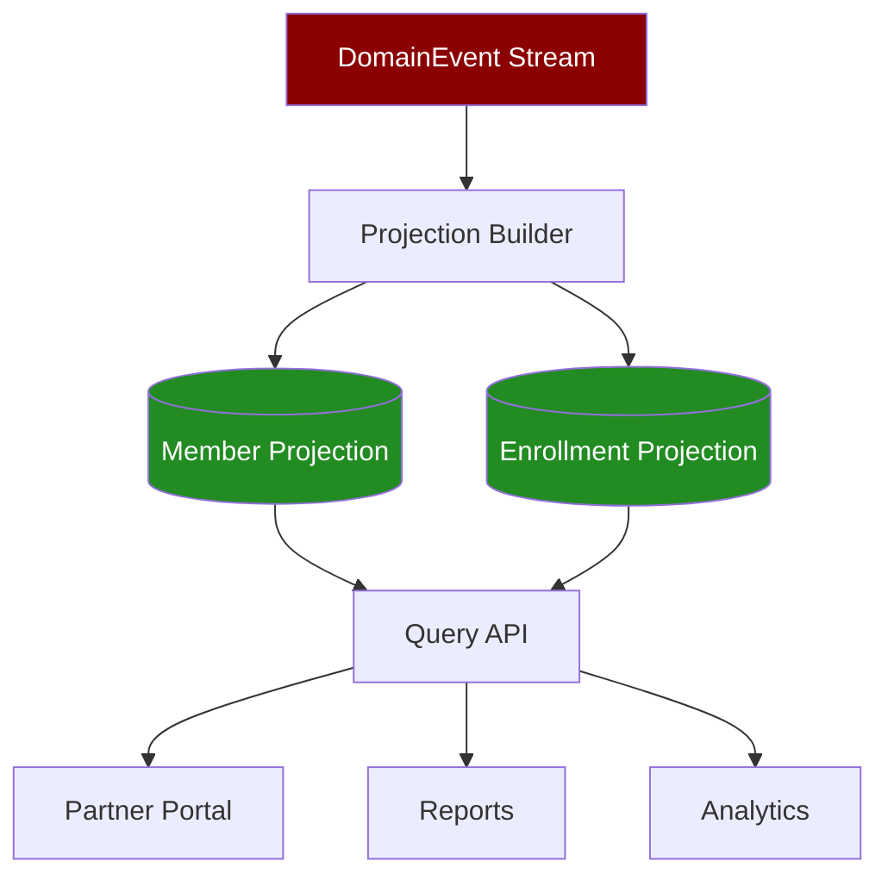

**Update Modes:**

| Mode | When to Use | Consistency | Performance |
|------|-------------|-------------|-------------|
| **Real-time** | Operational queries | Strong (seconds) | High throughput |
| **Batch** | Analytics/reporting | Eventual (minutes) | Very high throughput |
| **Scheduled** | Overnight reports | Eventual (hours) | Minimal impact |
| **On-demand** | Ad-hoc queries | Cache + rebuild | Variable |

**Recommended:** Real-time for Member and Enrollment projections (operational data).

### Projection State Tracking

Each projection tracks the last event applied via `LastEventSequence`:

```csharp
public async Task UpdateMemberProjection(DomainEvent domainEvent)
{
    var member = await _context.Members
        .FirstOrDefaultAsync(m => m.SubscriberID == domainEvent.AggregateID);

    if (member == null && domainEvent.EventType == "MemberCreated")
    {
        // Create new member projection
        var eventData = JsonSerializer.Deserialize<MemberCreatedData>(domainEvent.EventData);
        
        member = new Member
        {
            SubscriberID = eventData.SubscriberID,
            FirstName = eventData.FirstName,
            LastName = eventData.LastName,
            DateOfBirth = eventData.DateOfBirth,
            Gender = eventData.Gender,
            AddressLine1 = eventData.AddressLine1,
            City = eventData.City,
            State = eventData.State,
            ZipCode = eventData.ZipCode,
            Version = 1,
            LastEventSequence = domainEvent.EventSequence,
            LastEventTimestamp = domainEvent.EventTimestamp,
            IsActive = true,
            CreatedUtc = DateTime.UtcNow,
            ModifiedUtc = DateTime.UtcNow
        };
        
        _context.Members.Add(member);
    }
    else if (member != null && domainEvent.EventType == "MemberAddressUpdated")
    {
        // Update existing member projection
        var eventData = JsonSerializer.Deserialize<MemberAddressUpdatedData>(domainEvent.EventData);
        
        member.AddressLine1 = eventData.AddressLine1;
        member.AddressLine2 = eventData.AddressLine2;
        member.City = eventData.City;
        member.State = eventData.State;
        member.ZipCode = eventData.ZipCode;
        member.Version++;
        member.LastEventSequence = domainEvent.EventSequence;
        member.LastEventTimestamp = domainEvent.EventTimestamp;
        member.ModifiedUtc = DateTime.UtcNow;
    }
    
    await _context.SaveChangesAsync();
}
```

### Projection Lag Detection

Monitor projection health by comparing `LastEventSequence` to current max:

```sql
-- Projection Lag Query
SELECT 
    'Member' AS ProjectionName,
    COUNT(*) AS RecordCount,
    MAX(LastEventSequence) AS MaxEventSequence,
    (SELECT MAX(EventSequence) FROM DomainEvent) AS CurrentEventSequence,
    (SELECT MAX(EventSequence) FROM DomainEvent) - MAX(LastEventSequence) AS ProjectionLag,
    MAX(LastEventTimestamp) AS LastUpdateTime,
    DATEDIFF(SECOND, MAX(LastEventTimestamp), GETUTCDATE()) AS SecondsSinceUpdate
FROM Member
WHERE IsActive = 1

UNION ALL

SELECT 
    'Enrollment' AS ProjectionName,
    COUNT(*) AS RecordCount,
    MAX(LastEventSequence) AS MaxEventSequence,
    (SELECT MAX(EventSequence) FROM DomainEvent) AS CurrentEventSequence,
    (SELECT MAX(EventSequence) FROM DomainEvent) - MAX(LastEventSequence) AS ProjectionLag,
    MAX(LastEventTimestamp) AS LastUpdateTime,
    DATEDIFF(SECOND, MAX(LastEventTimestamp), GETUTCDATE()) AS SecondsSinceUpdate
FROM Enrollment
WHERE IsActive = 1;
```

**Expected Results:**

| ProjectionName | RecordCount | ProjectionLag | SecondsSinceUpdate |
|----------------|-------------|---------------|-------------------|
| Member | 15,000 | 0-50 | 0-5 |
| Enrollment | 20,000 | 0-50 | 0-5 |

**Alert Thresholds:**

- **Warning**: ProjectionLag > 100 events
- **Critical**: ProjectionLag > 500 events OR SecondsSinceUpdate > 60

### Projection Rebuild

Completely rebuild projections from event stream:

**PowerShell Script: Rebuild-Projections.ps1**

```powershell
<#
.SYNOPSIS
    Rebuild Event Store projections from event stream
.DESCRIPTION
    Truncates projection tables and replays all events
.PARAMETER ServerName
    Azure SQL server name
.PARAMETER DatabaseName
    Event Store database name
.PARAMETER ProjectionName
    Projection to rebuild (Member, Enrollment, All)
.EXAMPLE
    .\Rebuild-Projections.ps1 -ServerName "edi-eventstore-prod" -DatabaseName "edi-eventstore" -ProjectionName "Member"
#>

param(
    [Parameter(Mandatory=$true)]
    [string]$ServerName,
    
    [Parameter(Mandatory=$true)]
    [string]$DatabaseName,
    
    [Parameter(Mandatory=$true)]
    [ValidateSet("Member", "Enrollment", "All")]
    [string]$ProjectionName
)

# Azure login
Write-Host "Authenticating to Azure..."
az login --identity

# Get access token
$Token = az account get-access-token --resource https://database.windows.net --query accessToken -o tsv

# Step 1: Backup current projections
Write-Host "Creating backup of current projections..."
$BackupScript = @"
SELECT * INTO Member_Backup_$(Get-Date -Format 'yyyyMMdd_HHmmss')
FROM Member;

SELECT * INTO Enrollment_Backup_$(Get-Date -Format 'yyyyMMdd_HHmmss')
FROM Enrollment;
"@

Invoke-Sqlcmd -ServerInstance $ServerName -Database $DatabaseName -AccessToken $Token -Query $BackupScript

# Step 2: Truncate projections
Write-Host "Truncating projection tables..."
$TruncateScript = switch ($ProjectionName) {
    "Member" { "TRUNCATE TABLE Member;" }
    "Enrollment" { "TRUNCATE TABLE Enrollment;" }
    "All" { "TRUNCATE TABLE Enrollment; TRUNCATE TABLE Member;" }
}

Invoke-Sqlcmd -ServerInstance $ServerName -Database $DatabaseName -AccessToken $Token -Query $TruncateScript

# Step 3: Rebuild projections using .NET projector service
Write-Host "Rebuilding projections from event stream..."
$ProjectorPath = "C:\apps\edi-projector\EDI.EventStore.Projector.exe"

& $ProjectorPath rebuild --projection $ProjectionName --connection "Server=$ServerName;Database=$DatabaseName;Authentication=Active Directory Managed Identity;"

Write-Host "Projection rebuild complete!"
```

**C# Projection Rebuilder:**

```csharp
public class ProjectionRebuilder
{
    private readonly EventStoreDbContext _context;

    public ProjectionRebuilder(EventStoreDbContext context)
    {
        _context = context;
    }

    public async Task RebuildMemberProjection(long fromEventSequence = 0)
    {
        // Get all Member events ordered by sequence
        var events = await _context.DomainEvents
            .Where(e => e.AggregateType == "Member" && e.EventSequence >= fromEventSequence)
            .OrderBy(e => e.EventSequence)
            .ToListAsync();

        Console.WriteLine($"Replaying {events.Count} Member events...");

        var processedCount = 0;
        foreach (var domainEvent in events)
        {
            await ApplyMemberEvent(domainEvent);
            processedCount++;

            if (processedCount % 1000 == 0)
            {
                Console.WriteLine($"Processed {processedCount}/{events.Count} events...");
            }
        }

        Console.WriteLine($"Rebuild complete: {processedCount} events processed");
    }

    private async Task ApplyMemberEvent(DomainEvent domainEvent)
    {
        var member = await _context.Members
            .FirstOrDefaultAsync(m => m.SubscriberID == domainEvent.AggregateID);

        switch (domainEvent.EventType)
        {
            case "MemberCreated":
                await HandleMemberCreated(domainEvent);
                break;

            case "MemberAddressUpdated":
                await HandleMemberAddressUpdated(domainEvent, member);
                break;

            case "MemberPhoneUpdated":
                await HandleMemberPhoneUpdated(domainEvent, member);
                break;

            case "MemberTerminated":
                await HandleMemberTerminated(domainEvent, member);
                break;

            case "MemberCreatedReversed":
                await HandleMemberCreatedReversed(domainEvent, member);
                break;

            default:
                throw new InvalidOperationException($"Unknown event type: {domainEvent.EventType}");
        }

        await _context.SaveChangesAsync();
    }

    private async Task HandleMemberCreated(DomainEvent domainEvent)
    {
        var data = JsonSerializer.Deserialize<MemberCreatedData>(domainEvent.EventData);

        var member = new Member
        {
            SubscriberID = data.SubscriberID,
            FirstName = data.FirstName,
            LastName = data.LastName,
            DateOfBirth = data.DateOfBirth,
            Gender = data.Gender,
            AddressLine1 = data.AddressLine1,
            City = data.City,
            State = data.State,
            ZipCode = data.ZipCode,
            Version = 1,
            LastEventSequence = domainEvent.EventSequence,
            LastEventTimestamp = domainEvent.EventTimestamp,
            IsActive = true,
            CreatedUtc = domainEvent.EventTimestamp,
            ModifiedUtc = domainEvent.EventTimestamp
        };

        _context.Members.Add(member);
    }

    private async Task HandleMemberAddressUpdated(DomainEvent domainEvent, Member? member)
    {
        if (member == null) return;

        var data = JsonSerializer.Deserialize<MemberAddressUpdatedData>(domainEvent.EventData);

        member.AddressLine1 = data.AddressLine1;
        member.AddressLine2 = data.AddressLine2;
        member.City = data.City;
        member.State = data.State;
        member.ZipCode = data.ZipCode;
        member.Version++;
        member.LastEventSequence = domainEvent.EventSequence;
        member.LastEventTimestamp = domainEvent.EventTimestamp;
        member.ModifiedUtc = domainEvent.EventTimestamp;
    }

    private async Task HandleMemberTerminated(DomainEvent domainEvent, Member? member)
    {
        if (member == null) return;

        member.IsActive = false;
        member.Version++;
        member.LastEventSequence = domainEvent.EventSequence;
        member.LastEventTimestamp = domainEvent.EventTimestamp;
        member.ModifiedUtc = domainEvent.EventTimestamp;
    }

    private async Task HandleMemberCreatedReversed(DomainEvent domainEvent, Member? member)
    {
        if (member == null) return;

        // Reversal: Remove member from projection
        _context.Members.Remove(member);
    }
}
```

### Projection Consistency Verification

Verify projection consistency by comparing with event stream:

```sql
-- Count members by event stream vs projection
SELECT 'EventStream' AS Source, COUNT(DISTINCT AggregateID) AS MemberCount
FROM DomainEvent
WHERE AggregateType = 'Member' 
  AND EventType = 'MemberCreated'
  AND IsReversal = 0
  AND ReversedByEventID IS NULL

UNION ALL

SELECT 'Projection' AS Source, COUNT(*) AS MemberCount
FROM Member
WHERE IsActive = 1;

-- Expected: Counts should match (within projection lag tolerance)
```

**Consistency Check Queries:**

```sql
-- Find members in projection but not in event stream (orphaned)
SELECT m.SubscriberID, m.LastEventSequence
FROM Member m
WHERE NOT EXISTS (
    SELECT 1 
    FROM DomainEvent e 
    WHERE e.AggregateType = 'Member' 
      AND e.AggregateID = m.SubscriberID
      AND e.EventType = 'MemberCreated'
);

-- Find members in event stream but not in projection (missing)
SELECT DISTINCT e.AggregateID AS SubscriberID
FROM DomainEvent e
WHERE e.AggregateType = 'Member'
  AND e.EventType = 'MemberCreated'
  AND e.IsReversal = 0
  AND e.ReversedByEventID IS NULL
  AND NOT EXISTS (
      SELECT 1 
      FROM Member m 
      WHERE m.SubscriberID = e.AggregateID
  );
```

### Multiple Projections Strategy

Different projections serve different query needs:

| Projection | Purpose | Update Mode | Consistency |
|------------|---------|-------------|-------------|
| **Member** | Operational queries (Partner Portal) | Real-time | Strong (seconds) |
| **Enrollment** | Operational queries (eligibility checks) | Real-time | Strong (seconds) |
| **MemberHistory** | Audit/compliance (full event history) | Real-time | Strong (seconds) |
| **MemberAnalytics** | Reporting/BI (aggregated metrics) | Batch (daily) | Eventual (hours) |
| **MemberSnapshot** | Point-in-time views (as-of queries) | On-demand | Cache + rebuild |

**Future Projections (Not Yet Implemented):**

- `MemberAuditLog` - Complete audit trail for HIPAA compliance
- `EnrollmentHistory` - Historical enrollment changes
- `CoverageHistory` - Coverage plan changes over time
- `MemberMetrics` - Aggregated metrics for dashboards

---

## Event Sourcing Patterns

### Batch Reversal Pattern

Reversal creates compensating events rather than deleting original events:

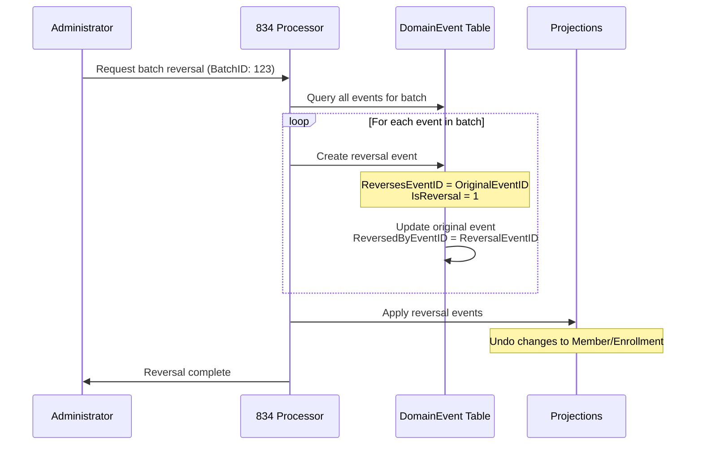

**SQL Implementation:**

```sql
-- Stored Procedure: usp_ReverseBatch
CREATE PROCEDURE [dbo].[usp_ReverseBatch]
    @TransactionBatchID BIGINT,
    @ReversalReason NVARCHAR(500),
    @ReversedBy VARCHAR(128)
AS
BEGIN
    SET NOCOUNT ON;
    BEGIN TRANSACTION;

    DECLARE @ReversalCorrelationID UNIQUEIDENTIFIER = NEWID();
    DECLARE @CurrentEventSequence BIGINT;

    -- Get all non-reversed events for batch
    DECLARE event_cursor CURSOR FOR
        SELECT EventID, AggregateType, AggregateID, EventType, EventData, EventMetadata
        FROM DomainEvent
        WHERE TransactionBatchID = @TransactionBatchID
          AND IsReversal = 0
          AND ReversedByEventID IS NULL
        ORDER BY EventSequence ASC;

    OPEN event_cursor;
    FETCH NEXT FROM event_cursor INTO @EventID, @AggregateType, @AggregateID, @EventType, @EventData, @EventMetadata;

    WHILE @@FETCH_STATUS = 0
    BEGIN
        -- Create reversal event
        INSERT INTO DomainEvent (
            EventGUID,
            TransactionBatchID,
            AggregateType,
            AggregateID,
            EventType,
            EventVersion,
            EventData,
            EventMetadata,
            EventTimestamp,
            IsReversal,
            ReversesEventID,
            CorrelationID
        )
        VALUES (
            NEWID(),
            @TransactionBatchID,
            @AggregateType,
            @AggregateID,
            @EventType + 'Reversed',  -- e.g., MemberCreatedReversed
            1,
            @EventData,
            JSON_MODIFY(@EventMetadata, '$.ReversalReason', @ReversalReason),
            GETUTCDATE(),
            1,  -- IsReversal
            @EventID,  -- ReversesEventID
            @ReversalCorrelationID
        );

        SET @ReversalEventID = SCOPE_IDENTITY();

        -- Update original event with reversal reference
        UPDATE DomainEvent
        SET ReversedByEventID = @ReversalEventID
        WHERE EventID = @EventID;

        FETCH NEXT FROM event_cursor INTO @EventID, @AggregateType, @AggregateID, @EventType, @EventData, @EventMetadata;
    END;

    CLOSE event_cursor;
    DEALLOCATE event_cursor;

    -- Update batch status
    UPDATE TransactionBatch
    SET ProcessingStatus = 'REVERSED',
        ModifiedUtc = GETUTCDATE()
    WHERE TransactionBatchID = @TransactionBatchID;

    COMMIT TRANSACTION;
END;
```

**Reversal Event Types:**

| Original Event | Reversal Event | Projection Effect |
|----------------|----------------|-------------------|
| `MemberCreated` | `MemberCreatedReversed` | Remove member from projection |
| `MemberAddressUpdated` | `MemberAddressUpdatedReversed` | Restore previous address |
| `EnrollmentCreated` | `EnrollmentCreatedReversed` | Remove enrollment |
| `EnrollmentTerminated` | `EnrollmentTerminatedReversed` | Reinstate enrollment |

### Event Replay Pattern

Rebuild projections by replaying events:

```csharp
public class EventReplayer
{
    private readonly EventStoreDbContext _context;

    public async Task ReplayEventsForAggregate(string aggregateType, string aggregateID)
    {
        // Get all events for aggregate ordered by sequence
        var events = await _context.DomainEvents
            .Where(e => e.AggregateType == aggregateType && e.AggregateID == aggregateID)
            .OrderBy(e => e.EventSequence)
            .ToListAsync();

        // Replay each event
        foreach (var evt in events)
        {
            await ApplyEvent(evt);
        }

        Console.WriteLine($"Replayed {events.Count} events for {aggregateType}:{aggregateID}");
    }

    public async Task ReplayEventsFromSequence(long fromSequence)
    {
        var events = await _context.DomainEvents
            .Where(e => e.EventSequence >= fromSequence)
            .OrderBy(e => e.EventSequence)
            .ToListAsync();

        foreach (var evt in events)
        {
            await ApplyEvent(evt);
        }

        Console.WriteLine($"Replayed {events.Count} events from sequence {fromSequence}");
    }

    private async Task ApplyEvent(DomainEvent evt)
    {
        switch (evt.AggregateType)
        {
            case "Member":
                await ApplyMemberEvent(evt);
                break;

            case "Enrollment":
                await ApplyEnrollmentEvent(evt);
                break;

            default:
                throw new InvalidOperationException($"Unknown aggregate type: {evt.AggregateType}");
        }
    }
}
```

### Idempotency Pattern

Ensure duplicate file processing produces identical results:

```csharp
public class IdempotentFileProcessor
{
    private readonly EventStoreDbContext _context;

    public async Task<ProcessResult> ProcessFile(string blobUri)
    {
        // Compute file hash
        var fileHash = await ComputeSHA256(blobUri);

        // Check for duplicate
        var existingBatch = await _context.TransactionBatches
            .FirstOrDefaultAsync(b => b.FileHash == fileHash);

        if (existingBatch != null)
        {
            return new ProcessResult
            {
                Success = true,
                Message = "Duplicate file detected - already processed",
                TransactionBatchID = existingBatch.TransactionBatchID,
                EventCount = existingBatch.EventCount,
                IsDuplicate = true
            };
        }

        // Process file (generate events)
        var result = await ProcessFileInternal(blobUri, fileHash);
        return result;
    }

    private async Task<string> ComputeSHA256(string blobUri)
    {
        using var sha256 = SHA256.Create();
        using var stream = await DownloadBlob(blobUri);
        var hash = sha256.ComputeHash(stream);
        return BitConverter.ToString(hash).Replace("-", "").ToLower();
    }
}
```

### Temporal Query Pattern

Reconstruct aggregate state at any point in time:

```csharp
public class TemporalQueryService
{
    private readonly EventStoreDbContext _context;

    public async Task<Member?> GetMemberAsOf(string subscriberID, DateTime asOfDate)
    {
        // Get all events up to specified date
        var events = await _context.DomainEvents
            .Where(e => e.AggregateType == "Member" 
                     && e.AggregateID == subscriberID
                     && e.EventTimestamp <= asOfDate)
            .OrderBy(e => e.EventSequence)
            .ToListAsync();

        if (!events.Any()) return null;

        // Replay events to reconstruct state
        Member? member = null;

        foreach (var evt in events)
        {
            switch (evt.EventType)
            {
                case "MemberCreated":
                    var data = JsonSerializer.Deserialize<MemberCreatedData>(evt.EventData);
                    member = new Member
                    {
                        SubscriberID = data.SubscriberID,
                        FirstName = data.FirstName,
                        LastName = data.LastName,
                        DateOfBirth = data.DateOfBirth,
                        // ... other fields
                    };
                    break;

                case "MemberAddressUpdated":
                    var addressData = JsonSerializer.Deserialize<MemberAddressUpdatedData>(evt.EventData);
                    if (member != null)
                    {
                        member.AddressLine1 = addressData.AddressLine1;
                        member.City = addressData.City;
                        member.State = addressData.State;
                        member.ZipCode = addressData.ZipCode;
                    }
                    break;

                // ... handle other event types
            }
        }

        return member;
    }

    public async Task<List<Member>> GetActiveMembersAsOf(DateTime asOfDate)
    {
        // Get all Member events up to date
        var events = await _context.DomainEvents
            .Where(e => e.AggregateType == "Member" && e.EventTimestamp <= asOfDate)
            .OrderBy(e => e.EventSequence)
            .ToListAsync();

        // Group by aggregate and replay
        var members = new Dictionary<string, Member>();

        foreach (var evt in events)
        {
            var subscriberID = evt.AggregateID;

            if (!members.ContainsKey(subscriberID) && evt.EventType == "MemberCreated")
            {
                var data = JsonSerializer.Deserialize<MemberCreatedData>(evt.EventData);
                members[subscriberID] = new Member { /* ... */ };
            }
            else if (members.ContainsKey(subscriberID))
            {
                // Apply event to existing member
                ApplyEventToMember(members[subscriberID], evt);
            }
        }

        return members.Values.Where(m => m.IsActive).ToList();
    }
}
```

**Use Cases:**

- "What was member's address on June 30, 2024?"
- "Show all active enrollments as of year-end 2024"
- "Compare member data before and after batch processing"
- Regulatory reporting with historical snapshots

---

## Performance Optimization

### Index Strategy

**Critical Indexes (Already Configured in EF Core):**

| Table | Index | Purpose | Type |
|-------|-------|---------|------|
| DomainEvent | `IX_DomainEvent_Sequence` | Global ordering, event replay | UNIQUE |
| DomainEvent | `IX_DomainEvent_GUID` | Event lookups by GUID | UNIQUE |
| DomainEvent | `IX_DomainEvent_Aggregate` | Aggregate event streams | NONCLUSTERED |
| DomainEvent | `IX_DomainEvent_Batch` | Batch event queries | NONCLUSTERED |
| DomainEvent | `IX_DomainEvent_CorrelationID` | Correlation queries | NONCLUSTERED |
| Member | `IX_Member_SubscriberID` | Member lookups | UNIQUE |
| Member | `IX_Member_Name_DOB` | Search queries | NONCLUSTERED |
| Enrollment | `IX_Enrollment_Member_Active` | Active enrollment queries | NONCLUSTERED |
| TransactionBatch | `IX_TransactionBatch_GUID` | Batch lookups | UNIQUE |
| TransactionBatch | `IX_TransactionBatch_FileHash` | Idempotency checks | UNIQUE |

**Index Maintenance:**

```sql
-- Rebuild fragmented indexes
ALTER INDEX ALL ON DomainEvent REBUILD WITH (ONLINE = ON);
ALTER INDEX ALL ON Member REBUILD WITH (ONLINE = ON);
ALTER INDEX ALL ON Enrollment REBUILD WITH (ONLINE = ON);

-- Update statistics
UPDATE STATISTICS DomainEvent WITH FULLSCAN;
UPDATE STATISTICS Member WITH FULLSCAN;
UPDATE STATISTICS Enrollment WITH FULLSCAN;
```

### Database Sequence Performance

The `EventSequence` provides gap-free global ordering:

```sql
-- Check sequence current value
SELECT current_value 
FROM sys.sequences 
WHERE name = 'EventSequence';

-- Check sequence performance (should be ~10,000 events/second)
SELECT 
    NEXT VALUE FOR dbo.EventSequence AS EventSequence;
```

**Optimization:**

- NO CACHE: Ensures gap-free ordering (slight performance trade-off)
- Alternative: CACHE 50 for better performance (allows gaps on restart)

```sql
-- Enable caching for higher performance (allows gaps)
ALTER SEQUENCE dbo.EventSequence CACHE 50;
```

### Connection Pooling

**EF Core Connection String:**

```json
{
  "ConnectionStrings": {
    "EventStore": "Server=tcp:edi-eventstore-prod.database.windows.net,1433;Initial Catalog=edi-eventstore;Authentication=Active Directory Managed Identity;Encrypt=True;TrustServerCertificate=False;Min Pool Size=10;Max Pool Size=100;Connection Timeout=30;"
  }
}
```

**Recommended Pool Settings:**

| Setting | Value | Rationale |
|---------|-------|-----------|
| Min Pool Size | 10 | Warm connections for low latency |
| Max Pool Size | 100 | Handle burst traffic |
| Connection Timeout | 30 seconds | Balance between responsiveness and retry |
| Connection Lifetime | 300 seconds | Refresh connections periodically |

### Batch Insert Performance

Use `AddRange` for bulk event insertion:

```csharp
public async Task AppendEvents(List<DomainEvent> events)
{
    // Batch insert (EF Core optimizes into single SQL statement)
    _context.DomainEvents.AddRange(events);
    await _context.SaveChangesAsync();
}
```

**Performance:**

- Single event insert: ~50-100 events/second
- Batch insert (100 events): ~1,000-2,000 events/second

### Query Performance Tips

1. **Use projections, not event replay for queries**
   ```csharp
   // ✅ GOOD: Query projection
   var member = await _context.Members
       .FirstOrDefaultAsync(m => m.SubscriberID == "SUB12345");

   // ❌ BAD: Replay events for every query
   var member = await ReplayEventsForMember("SUB12345");
   ```

2. **Use AsNoTracking for read-only queries**
   ```csharp
   var members = await _context.Members
       .AsNoTracking()
       .Where(m => m.IsActive)
       .ToListAsync();
   ```

3. **Paginate large result sets**
   ```csharp
   var members = await _context.Members
       .AsNoTracking()
       .OrderBy(m => m.LastName)
       .Skip(pageNumber * pageSize)
       .Take(pageSize)
       .ToListAsync();
   ```

4. **Use indexes for WHERE/ORDER BY clauses**
   ```csharp
   // ✅ Uses IX_Member_SubscriberID index
   var member = await _context.Members
       .FirstOrDefaultAsync(m => m.SubscriberID == "SUB12345");

   // ✅ Uses IX_Member_Name_DOB index
   var members = await _context.Members
       .Where(m => m.LastName == "Doe" && m.FirstName == "John")
       .ToListAsync();
   ```

### Storage Optimization

**Expected Growth:**

| Component | Size (3 months) | Size (1 year) | Size (3 years) |
|-----------|-----------------|---------------|----------------|
| DomainEvent | 10 GB | 40 GB | 120 GB |
| TransactionBatch | 500 MB | 2 GB | 6 GB |
| Member (Projection) | 100 MB | 400 MB | 1.2 GB |
| Enrollment (Projection) | 200 MB | 800 MB | 2.4 GB |
| Indexes | 5 GB | 20 GB | 60 GB |
| **Total** | **15 GB** | **60 GB** | **180 GB** |

**Archival Strategy (Future):**

- Partition `DomainEvent` by `EventTimestamp` (yearly partitions)
- Archive events older than 3 years to Azure Blob Storage
- Keep projections current (no archival needed)
- Compress archived partitions (50-70% compression ratio)

---

## Security & Compliance

### Authentication & Authorization

**Managed Identity (Recommended):**

```json
{
  "ConnectionStrings": {
    "EventStore": "Server=tcp:edi-eventstore-prod.database.windows.net,1433;Initial Catalog=edi-eventstore;Authentication=Active Directory Managed Identity;Encrypt=True;"
  }
}
```

**RBAC Assignments:**

| Principal | Role | Permissions |
|-----------|------|-------------|
| `func-834-processor` (User MI) | `db_datawriter`, `db_datareader` | Read/write events, projections |
| `func-projector` (User MI) | `db_datawriter`, `db_datareader` | Read events, write projections |
| `func-query-api` (User MI) | `db_datareader` | Read projections only |
| `DevOps Pipeline` (Service Principal) | `db_ddladmin` | Apply EF Core migrations |

**SQL Permissions:**

```sql
-- Grant permissions to managed identity (834 Processor)
CREATE USER [func-834-processor] FROM EXTERNAL PROVIDER;
ALTER ROLE db_datawriter ADD MEMBER [func-834-processor];
ALTER ROLE db_datareader ADD MEMBER [func-834-processor];

-- Grant permissions to query API (read-only)
CREATE USER [func-query-api] FROM EXTERNAL PROVIDER;
ALTER ROLE db_datareader ADD MEMBER [func-query-api];

-- Grant migration permissions to DevOps pipeline
CREATE USER [edi-devops-sp] FROM EXTERNAL PROVIDER;
ALTER ROLE db_ddladmin ADD MEMBER [edi-devops-sp];
ALTER ROLE db_datawriter ADD MEMBER [edi-devops-sp];
ALTER ROLE db_datareader ADD MEMBER [edi-devops-sp];
```

### Encryption

**Transparent Data Encryption (TDE):**

```sql
-- Enable TDE (Azure SQL default)
ALTER DATABASE [edi-eventstore] SET ENCRYPTION ON;

-- Verify TDE status
SELECT name, is_encrypted
FROM sys.databases
WHERE name = 'edi-eventstore';
```

**Always Encrypted (Future for PII):**

```csharp
// Encrypt SSN column in Member table
[Column(TypeName = "varchar(11)")]
[Encrypted(ColumnEncryptionKey = "CEK_PII")]
public string? SSN { get; set; }
```

**Connection Encryption:**

- TLS 1.2+ enforced
- Certificate validation enabled
- No public internet access (private endpoints only)

### Audit Logging

**Azure SQL Auditing:**

```powershell
# Enable auditing to Log Analytics workspace
az sql server audit-policy update \
  --resource-group rg-edi-prod \
  --name edi-eventstore-prod \
  --state Enabled \
  --log-analytics-target-state Enabled \
  --log-analytics-workspace-resource-id /subscriptions/{sub-id}/resourceGroups/rg-edi-prod/providers/Microsoft.OperationalInsights/workspaces/log-edi-prod
```

**Audit Categories:**

- Database schema changes (DDL)
- Data access (SELECT on sensitive tables)
- Data modifications (INSERT/UPDATE on DomainEvent)
- Authentication attempts (successful and failed)

### HIPAA Compliance

| Requirement | Implementation |
|-------------|----------------|
| **Access Control** | Managed Identity + RBAC, least privilege |
| **Audit Trails** | Event sourcing provides complete audit log |
| **Data Integrity** | Event immutability, RowVersion concurrency |
| **Encryption at Rest** | TDE enabled by default |
| **Encryption in Transit** | TLS 1.2+ enforced |
| **Authentication** | Azure AD only, no SQL authentication |
| **Network Security** | Private endpoints, VNet integration |
| **Backup & Recovery** | Geo-redundant backups, 7-14 day PITR |

---

## Monitoring & Observability

### KQL Monitoring Queries

**Query 1: Event Throughput (Events per Minute)**

```kusto
AzureDiagnostics
| where ResourceProvider == "MICROSOFT.SQL"
| where Category == "SQLInsights"
| where Resource contains "edi-eventstore"
| where QueryText contains "INSERT INTO DomainEvent"
| summarize EventCount = count() by bin(TimeGenerated, 1m)
| render timechart
    with (title="Event Store - Event Append Throughput (per minute)")
```

**Expected:** 50-500 events/minute during active processing

**Query 2: Projection Lag Monitoring**

```kusto
let MaxEventSequence = toscalar(
    AzureDiagnostics
    | where Resource contains "edi-eventstore"
    | where QueryText contains "SELECT MAX(EventSequence)"
    | project MaxSeq = extract(@"MAX\(EventSequence\) = (\d+)", 1, ResultText)
    | summarize max(toint(MaxSeq))
);
AzureDiagnostics
| where Resource contains "edi-eventstore"
| where QueryText contains "SELECT LastEventSequence FROM Member" 
   or QueryText contains "SELECT LastEventSequence FROM Enrollment"
| extend Projection = iff(QueryText contains "Member", "Member", "Enrollment")
| extend LastSeq = toint(extract(@"LastEventSequence = (\d+)", 1, ResultText))
| extend ProjectionLag = MaxEventSequence - LastSeq
| summarize AvgLag = avg(ProjectionLag), MaxLag = max(ProjectionLag) by Projection, bin(TimeGenerated, 5m)
| render timechart
    with (title="Event Store - Projection Lag")
```

**Thresholds:**

- Normal: Lag < 50 events
- Warning: Lag 50-100 events
- Critical: Lag > 100 events

**Query 3: Database Connection Pool Metrics**

```kusto
AzureDiagnostics
| where ResourceProvider == "MICROSOFT.SQL"
| where Resource contains "edi-eventstore"
| where Category == "Blocks" or Category == "Timeouts"
| summarize 
    BlockedQueries = countif(Category == "Blocks"),
    Timeouts = countif(Category == "Timeouts")
    by bin(TimeGenerated, 5m)
| render timechart
    with (title="Event Store - Connection Issues")
```

**Query 4: Transaction Batch Processing Status**

```kusto
AzureDiagnostics
| where Resource contains "edi-eventstore"
| where QueryText contains "SELECT ProcessingStatus FROM TransactionBatch"
| extend Status = extract(@"ProcessingStatus = '(\w+)'", 1, ResultText)
| summarize Count = count() by Status, bin(TimeGenerated, 1h)
| render columnchart
    with (title="Event Store - Batch Processing Status Distribution")
```

**Query 5: Event Store Table Sizes**

```kusto
AzureDiagnostics
| where Resource contains "edi-eventstore"
| where QueryText contains "sp_spaceused"
| extend TableName = extract(@"@objname = '(\w+)'", 1, QueryText)
| extend SizeMB = toint(extract(@"data = '(\d+) KB'", 1, ResultText)) / 1024
| summarize AvgSizeMB = avg(SizeMB) by TableName, bin(TimeGenerated, 1d)
| render timechart
    with (title="Event Store - Table Growth (MB)")
```

**Query 6: Slow Query Detection**

```kusto
AzureDiagnostics
| where ResourceProvider == "MICROSOFT.SQL"
| where Resource contains "edi-eventstore"
| where Category == "QueryStoreRuntimeStatistics"
| where duration_d > 1000  // Queries taking > 1 second
| summarize 
    Count = count(),
    AvgDuration = avg(duration_d),
    MaxDuration = max(duration_d)
    by query_hash_s, bin(TimeGenerated, 5m)
| where Count > 10
| order by AvgDuration desc
| project TimeGenerated, QueryHash = query_hash_s, Count, AvgDurationMs = round(AvgDuration, 2), MaxDurationMs = round(MaxDuration, 2)
```

**Query 7: Event Sequence Gaps (Should be None)**

```kusto
AzureDiagnostics
| where Resource contains "edi-eventstore"
| where QueryText contains "SELECT EventSequence FROM DomainEvent"
| extend Seq = toint(extract(@"EventSequence = (\d+)", 1, ResultText))
| serialize
| extend PrevSeq = prev(Seq, 1)
| extend Gap = Seq - PrevSeq
| where Gap > 1
| summarize GapCount = count(), MaxGap = max(Gap) by bin(TimeGenerated, 1h)
```

**Expected:** Zero gaps (EventSequence should be contiguous)

**Query 8: Failed Transaction Batches**

```kusto
AzureDiagnostics
| where Resource contains "edi-eventstore"
| where QueryText contains "UPDATE TransactionBatch SET ProcessingStatus = 'FAILED'"
| extend BatchID = extract(@"TransactionBatchID = (\d+)", 1, QueryText)
| extend ErrorMsg = extract(@"ErrorMessage = '([^']+)'", 1, QueryText)
| project TimeGenerated, BatchID, ErrorMsg
| order by TimeGenerated desc
```

### SFTP Tracking Monitoring Queries

**Query 1: Recent File Activity (Last 100 Files)**

```kusto
AzureDiagnostics
| where Resource contains "edi-sftptracking"
| where QueryText contains "SELECT * FROM FileTracking"
| extend PartnerCode = extract(@"PartnerCode = '(\w+)'", 1, ResultText)
| extend FileName = extract(@"FileName = '([^']+)'", 1, ResultText)
| extend Direction = extract(@"Direction = '(\w+)'", 1, ResultText)
| extend Status = extract(@"Status = '(\w+)'", 1, ResultText)
| extend ProcessedAt = todatetime(extract(@"ProcessedAt = '([^']+)'", 1, ResultText))
| project TimeGenerated, PartnerCode, FileName, Direction, Status, ProcessedAt
| order by ProcessedAt desc
| take 100
```

**Alternative: Direct SQL Query (for manual investigation)**

```sql
-- Recent file activity (last 24 hours)
SELECT TOP 100
    Id,
    PartnerCode,
    FileName,
    Direction,
    Status,
    FileSize / 1024.0 / 1024.0 AS FileSizeMB,
    ProcessedAt,
    ErrorMessage,
    CorrelationId
FROM FileTracking
WHERE ProcessedAt >= DATEADD(hour, -24, GETUTCDATE())
ORDER BY ProcessedAt DESC;
```

**Query 2: Partner Activity Summary**

```kusto
AzureDiagnostics
| where Resource contains "edi-sftptracking"
| where QueryText contains "SELECT PartnerCode, Direction, Status FROM FileTracking"
| extend PartnerCode = extract(@"PartnerCode = '(\w+)'", 1, ResultText)
| extend Direction = extract(@"Direction = '(\w+)'", 1, ResultText)
| extend Status = extract(@"Status = '(\w+)'", 1, ResultText)
| summarize 
    TotalFiles = count(),
    Downloaded = countif(Status == "Downloaded"),
    Uploaded = countif(Status == "Uploaded"),
    Failed = countif(Status == "Failed")
    by PartnerCode, Direction, bin(TimeGenerated, 1h)
| render columnchart
    with (title="SFTP Tracking - File Activity by Partner")
```

**Alternative: Direct SQL Query**

```sql
-- Partner activity summary (last 7 days)
SELECT 
    PartnerCode,
    Direction,
    Status,
    COUNT(*) AS FileCount,
    SUM(FileSize) / 1024.0 / 1024.0 / 1024.0 AS TotalSizeGB,
    MIN(ProcessedAt) AS FirstFile,
    MAX(ProcessedAt) AS LastFile
FROM FileTracking
WHERE ProcessedAt >= DATEADD(day, -7, GETUTCDATE())
GROUP BY PartnerCode, Direction, Status
ORDER BY PartnerCode, Direction, Status;
```

**Query 3: Failed Transfers (Last 7 Days)**

```kusto
AzureDiagnostics
| where Resource contains "edi-sftptracking"
| where QueryText contains "SELECT * FROM FileTracking WHERE Status = 'Failed'"
| extend PartnerCode = extract(@"PartnerCode = '(\w+)'", 1, ResultText)
| extend FileName = extract(@"FileName = '([^']+)'", 1, ResultText)
| extend Direction = extract(@"Direction = '(\w+)'", 1, ResultText)
| extend ErrorMessage = extract(@"ErrorMessage = '([^']+)'", 1, ResultText)
| extend ProcessedAt = todatetime(extract(@"ProcessedAt = '([^']+)'", 1, ResultText))
| where ProcessedAt >= ago(7d)
| project TimeGenerated, PartnerCode, FileName, Direction, ErrorMessage, ProcessedAt
| order by ProcessedAt desc
```

**Alternative: Direct SQL Query**

```sql
-- Failed transfers with error details
SELECT 
    Id,
    PartnerCode,
    FileName,
    Direction,
    ErrorMessage,
    ProcessedAt,
    CorrelationId
FROM FileTracking
WHERE Status = 'Failed'
  AND ProcessedAt >= DATEADD(day, -7, GETUTCDATE())
ORDER BY ProcessedAt DESC;
```

**Expected:** Zero failed transfers under normal conditions

**Query 4: Duplicate File Detection**

```kusto
AzureDiagnostics
| where Resource contains "edi-sftptracking"
| where QueryText contains "SELECT FileHash FROM FileTracking"
| extend PartnerCode = extract(@"PartnerCode = '(\w+)'", 1, ResultText)
| extend FileHash = extract(@"FileHash = '(\w+)'", 1, ResultText)
| extend Direction = extract(@"Direction = '(\w+)'", 1, ResultText)
| summarize FileCount = count() by PartnerCode, FileHash, Direction
| where FileCount > 1
| order by FileCount desc
```

**Alternative: Direct SQL Query**

```sql
-- Detect duplicate files (same hash processed multiple times)
SELECT 
    PartnerCode,
    FileHash,
    Direction,
    COUNT(*) AS DuplicateCount,
    STRING_AGG(FileName, ', ') AS FileNames,
    MIN(ProcessedAt) AS FirstSeen,
    MAX(ProcessedAt) AS LastSeen
FROM FileTracking
WHERE Status != 'Failed'
GROUP BY PartnerCode, FileHash, Direction
HAVING COUNT(*) > 1
ORDER BY DuplicateCount DESC;
```

**Expected:** No duplicates (idempotency should prevent this)

**Query 5: SFTP Connector Performance**

```kusto
AzureDiagnostics
| where Resource contains "edi-sftptracking"
| extend ProcessedAt = todatetime(extract(@"ProcessedAt = '([^']+)'", 1, ResultText))
| extend FileSize = toint(extract(@"FileSize = (\d+)", 1, ResultText))
| extend Status = extract(@"Status = '(\w+)'", 1, ResultText)
| where Status != "Failed"
| summarize 
    TotalFiles = count(),
    TotalSizeGB = sum(FileSize) / 1024.0 / 1024.0 / 1024.0,
    AvgFileSizeMB = avg(FileSize) / 1024.0 / 1024.0
    by bin(TimeGenerated, 1h)
| render timechart
    with (title="SFTP Connector - Throughput (Files and GB per hour)")
```

**Query 6: Correlation Tracking (Link Files to Service Bus)**

```kusto
// Step 1: Get file tracking records with CorrelationId
let FileOps = AzureDiagnostics
| where Resource contains "edi-sftptracking"
| where QueryText contains "SELECT * FROM FileTracking"
| extend CorrelationId = extract(@"CorrelationId = '([^']+)'", 1, ResultText)
| extend PartnerCode = extract(@"PartnerCode = '(\w+)'", 1, ResultText)
| extend FileName = extract(@"FileName = '([^']+)'", 1, ResultText)
| extend Direction = extract(@"Direction = '(\w+)'", 1, ResultText)
| where isnotempty(CorrelationId);
// Step 2: Join with Service Bus traces
FileOps
| join kind=inner (
    traces
    | where message contains "Service Bus message sent"
    | extend CorrelationId = tostring(customDimensions.CorrelationId)
) on CorrelationId
| project 
    FileProcessedAt = TimeGenerated,
    PartnerCode,
    FileName,
    Direction,
    CorrelationId,
    ServiceBusMessage = message,
    ServiceBusTimestamp = timestamp
| order by FileProcessedAt desc
```

**Query 7: Index Usage Statistics**

```sql
-- Verify SFTP Tracking indexes are being used efficiently
SELECT 
    OBJECT_NAME(s.object_id) AS TableName,
    i.name AS IndexName,
    s.user_seeks AS UserSeeks,
    s.user_scans AS UserScans,
    s.user_lookups AS UserLookups,
    s.user_updates AS UserUpdates,
    s.last_user_seek AS LastSeek,
    s.last_user_scan AS LastScan
FROM sys.dm_db_index_usage_stats s
INNER JOIN sys.indexes i ON s.object_id = i.object_id AND s.index_id = i.index_id
WHERE OBJECT_NAME(s.object_id) = 'FileTracking'
  AND s.database_id = DB_ID('EDISftpTracking')
ORDER BY s.user_seeks + s.user_scans + s.user_lookups DESC;
```

**Expected Index Usage:**
- `IX_FileTracking_PartnerCode_FileName_Direction_Status` - High seeks (idempotency checks)
- `IX_FileTracking_ProcessedAt` - High seeks/scans (reporting queries)
- `IX_FileTracking_CorrelationId` - Moderate seeks (correlation tracking)

### Alert Rules

**Alert 1: High Projection Lag**

```yaml
Alert Name: Event Store - High Projection Lag
Severity: Warning
Condition: avg(ProjectionLag) > 100 over 5 minutes
Action Group: edi-ops-team
Notification: Email + SMS
```

**Alert 2: Event Store Connection Failures**

```yaml
Alert Name: Event Store - Connection Failures
Severity: Critical
Condition: count(Timeouts) > 10 over 5 minutes
Action Group: edi-ops-team
Notification: Email + SMS + PagerDuty
```

**Alert 3: Failed Transaction Batches**

```yaml
Alert Name: Event Store - Failed Batches
Severity: Error
Condition: count(ProcessingStatus = 'FAILED') > 5 over 15 minutes
Action Group: edi-ops-team
Notification: Email + Slack
```

**Alert 4: Database Storage Growth**

```yaml
Alert Name: Event Store - Storage Threshold
Severity: Warning
Condition: Database size > 80% of allocated storage
Action Group: edi-ops-team
Notification: Email
```

**Alert 5: Failed SFTP Transfers**

```yaml
Alert Name: SFTP Tracking - Failed Transfers
Severity: Error
Condition: count(Status = 'Failed') > 5 over 15 minutes
Action Group: edi-ops-team
Notification: Email + Slack
```

**Alert 6: No SFTP Activity Detected**

```yaml
Alert Name: SFTP Tracking - No File Activity
Severity: Warning
Condition: count(FileTracking) == 0 over 60 minutes
Action Group: edi-ops-team
Notification: Email
```

**Alert 7: Duplicate File Detection**

```yaml
Alert Name: SFTP Tracking - Duplicate Files Detected
Severity: Warning
Condition: count(duplicate FileHash) > 0 over 1 hour
Action Group: edi-ops-team
Notification: Email
```

### Azure Monitor Dashboard

**Dashboard Tiles:**

1. **Event Throughput** - Events appended per minute (timechart)
2. **Projection Lag** - Member and Enrollment projection lag (timechart)
3. **Batch Processing Status** - Distribution of COMPLETED/FAILED/PROCESSING (pie chart)
4. **Database Connections** - Active connections and pool usage (gauge)
5. **Slow Queries** - Queries taking > 1 second (table)
6. **Table Sizes** - DomainEvent, Member, Enrollment growth (area chart)
7. **Failed Batches** - Recent failed transaction batches (table)
8. **Event Sequence Health** - Gap detection (scalar)
9. **SFTP File Activity** - Files downloaded/uploaded per hour by partner (timechart)
10. **SFTP Failed Transfers** - Recent failed SFTP operations (table)
11. **SFTP Throughput** - Total GB transferred per day (bar chart)
12. **SFTP Idempotency Health** - Duplicate file detection count (scalar)

---

## Troubleshooting Guide

### Control Number Store Scenarios

### Scenario 1: Projection Lag Increasing

**Symptoms:**

- Projection lag > 100 events
- `LastEventSequence` not updating
- Queries returning stale data

**Diagnosis:**

```sql
-- Check projection lag
SELECT 
    'Member' AS Projection,
    MAX(LastEventSequence) AS MaxProjectionSeq,
    (SELECT MAX(EventSequence) FROM DomainEvent) AS MaxEventSeq,
    (SELECT MAX(EventSequence) FROM DomainEvent) - MAX(LastEventSequence) AS Lag
FROM Member
UNION ALL
SELECT 
    'Enrollment' AS Projection,
    MAX(LastEventSequence) AS MaxProjectionSeq,
    (SELECT MAX(EventSequence) FROM DomainEvent) AS MaxEventSeq,
    (SELECT MAX(EventSequence) FROM DomainEvent) - MAX(LastEventSequence) AS Lag
FROM Enrollment;

-- Check projector function status
```

**PowerShell Remediation:**

```powershell
# Check projector function app status
az functionapp show --name func-projector-prod --resource-group rg-edi-prod --query state

# Restart projector function
az functionapp restart --name func-projector-prod --resource-group rg-edi-prod

# Trigger manual projection rebuild (if lag persists)
az functionapp function keys list \
  --name func-projector-prod \
  --resource-group rg-edi-prod \
  --function-name RebuildProjection \
  --query default -o tsv | ForEach-Object {
    $key = $_
    Invoke-RestMethod -Method Post `
      -Uri "https://func-projector-prod.azurewebsites.net/api/RebuildProjection?code=$key" `
      -Body '{"projection":"Member"}' `
      -ContentType "application/json"
}
```

### Scenario 2: Event Sequence Gaps Detected

**Symptoms:**

- Missing event sequences
- Non-contiguous `EventSequence` values
- Projection consistency issues

**Diagnosis:**

```sql
-- Find gaps in event sequence
WITH EventSequences AS (
    SELECT EventSequence
    FROM DomainEvent
),
ExpectedSequences AS (
    SELECT TOP 1000000 ROW_NUMBER() OVER (ORDER BY (SELECT NULL)) AS ExpSeq
    FROM sys.all_objects a CROSS JOIN sys.all_objects b
)
SELECT es.ExpSeq AS MissingSequence
FROM ExpectedSequences es
WHERE es.ExpSeq BETWEEN (SELECT MIN(EventSequence) FROM DomainEvent) 
                    AND (SELECT MAX(EventSequence) FROM DomainEvent)
  AND NOT EXISTS (SELECT 1 FROM EventSequences WHERE EventSequence = es.ExpSeq)
ORDER BY es.ExpSeq;
```

**Root Causes:**

- Transaction rollback with CACHE enabled on sequence
- Database restore from backup
- Manual deletion of events (violates immutability)

**Remediation:**

```sql
-- Check sequence configuration (should be NO CACHE)
SELECT name, cache_size, current_value
FROM sys.sequences
WHERE name = 'EventSequence';

-- If cache_size > 0, disable caching
ALTER SEQUENCE dbo.EventSequence NO CACHE;

-- Note: Gaps from rollbacks are acceptable if infrequent
-- Event sourcing logic should handle gaps gracefully
```

### Scenario 3: Failed Transaction Batch Processing

**Symptoms:**

- Batch stuck in `PROCESSING` status
- `ErrorMessage` populated in `TransactionBatch`
- Events not generated for file

**Diagnosis:**

```sql
-- Find failed batches
SELECT TOP 10
    TransactionBatchID,
    FileName,
    ProcessingStatus,
    ErrorMessage,
    ProcessingStartedUtc,
    ProcessingCompletedUtc
FROM TransactionBatch
WHERE ProcessingStatus IN ('FAILED', 'PROCESSING')
  AND ProcessingStartedUtc < DATEADD(MINUTE, -30, GETUTCDATE())
ORDER BY ProcessingStartedUtc DESC;

-- Check events generated for batch
SELECT COUNT(*) AS EventCount
FROM DomainEvent
WHERE TransactionBatchID = @TransactionBatchID;
```

**PowerShell Remediation:**

```powershell
# Get failed batch details
$batchId = 12345
$query = "SELECT FileName, BlobFullUri, ErrorMessage FROM TransactionBatch WHERE TransactionBatchID = $batchId"

$result = Invoke-Sqlcmd -ServerInstance "edi-eventstore-prod.database.windows.net" `
  -Database "edi-eventstore" `
  -AccessToken $(az account get-access-token --resource https://database.windows.net --query accessToken -o tsv) `
  -Query $query

Write-Host "Failed Batch: $($result.FileName)"
Write-Host "Blob URI: $($result.BlobFullUri)"
Write-Host "Error: $($result.ErrorMessage)"

# Reprocess file by triggering 834 processor function
$blobUri = $result.BlobFullUri
az functionapp function invoke \
  --name func-834-processor-prod \
  --resource-group rg-edi-prod \
  --function-name Process834File \
  --body "{\"blobUri\":\"$blobUri\"}"
```

### Scenario 4: Duplicate File Detected

**Symptoms:**

- Idempotency check returns `DUPLICATE`
- Same `FileHash` exists in `TransactionBatch`
- No events generated

**Diagnosis:**

```sql
-- Find duplicate file hashes
SELECT 
    FileHash,
    COUNT(*) AS DuplicateCount,
    STRING_AGG(CAST(TransactionBatchID AS VARCHAR), ', ') AS BatchIDs,
    STRING_AGG(FileName, ', ') AS FileNames
FROM TransactionBatch
WHERE FileHash IS NOT NULL
GROUP BY FileHash
HAVING COUNT(*) > 1;

-- Check if duplicate is intentional (reprocessing)
SELECT 
    TransactionBatchID,
    FileName,
    FileReceivedDate,
    ProcessingStatus,
    EventCount
FROM TransactionBatch
WHERE FileHash = @FileHash
ORDER BY FileReceivedDate ASC;
```

**Remediation (If Reprocessing Needed):**

```powershell
# Clear file hash to allow reprocessing
$batchId = 12345
$query = "UPDATE TransactionBatch SET FileHash = NULL WHERE TransactionBatchID = $batchId"

Invoke-Sqlcmd -ServerInstance "edi-eventstore-prod.database.windows.net" `
  -Database "edi-eventstore" `
  -AccessToken $(az account get-access-token --resource https://database.windows.net --query accessToken -o tsv) `
  -Query $query

Write-Host "FileHash cleared for batch $batchId - file can now be reprocessed"

# Trigger reprocessing via Function App
```

### Scenario 5: Projection Consistency Mismatch

**Symptoms:**

- Member count in projection != event stream count
- Orphaned members in projection
- Missing members in projection

**Diagnosis:**

```sql
-- Count discrepancies
SELECT 'EventStream' AS Source, COUNT(DISTINCT AggregateID) AS MemberCount
FROM DomainEvent
WHERE AggregateType = 'Member' 
  AND EventType = 'MemberCreated'
  AND IsReversal = 0
  AND ReversedByEventID IS NULL

UNION ALL

SELECT 'Projection' AS Source, COUNT(*) AS MemberCount
FROM Member
WHERE IsActive = 1;

-- Find orphaned members (in projection but not in event stream)
SELECT m.SubscriberID, m.LastEventSequence, m.ModifiedUtc
FROM Member m
WHERE NOT EXISTS (
    SELECT 1 
    FROM DomainEvent e 
    WHERE e.AggregateType = 'Member' 
      AND e.AggregateID = m.SubscriberID
      AND e.EventType = 'MemberCreated'
);

-- Find missing members (in event stream but not in projection)
SELECT DISTINCT e.AggregateID AS SubscriberID, MAX(e.EventSequence) AS LastEventSeq
FROM DomainEvent e
WHERE e.AggregateType = 'Member'
  AND e.EventType = 'MemberCreated'
  AND e.IsReversal = 0
  AND e.ReversedByEventID IS NULL
  AND NOT EXISTS (
      SELECT 1 
      FROM Member m 
      WHERE m.SubscriberID = e.AggregateID
  )
GROUP BY e.AggregateID;
```

**C# Remediation (Rebuild Projections):**

```csharp
// Run projection rebuilder
var rebuilder = new ProjectionRebuilder(context);

// Option 1: Full rebuild
await rebuilder.RebuildMemberProjection(fromEventSequence: 0);

// Option 2: Incremental rebuild (from last known good state)
var lastGoodSequence = await context.Members
    .Where(m => m.IsActive)
    .MinAsync(m => m.LastEventSequence);

await rebuilder.RebuildMemberProjection(fromEventSequence: lastGoodSequence);
```

### Scenario 6: Database Connection Timeouts

**Symptoms:**

- Function App logs show `SqlException: Timeout expired`
- Connection pool exhausted
- High DTU usage on Azure SQL

**Diagnosis:**

```sql
-- Check active connections
SELECT 
    DB_NAME(dbid) AS DatabaseName,
    COUNT(dbid) AS NumberOfConnections,
    loginame AS LoginName
FROM sys.sysprocesses
WHERE DB_NAME(dbid) = 'edi-eventstore'
GROUP BY DB_NAME(dbid), loginame;

-- Check blocked queries
SELECT 
    blocking_session_id,
    session_id,
    wait_type,
    wait_time,
    wait_resource,
    text
FROM sys.dm_exec_requests
CROSS APPLY sys.dm_exec_sql_text(sql_handle)
WHERE blocking_session_id <> 0;

-- Check DTU usage
SELECT 
    end_time,
    avg_cpu_percent,
    avg_data_io_percent,
    avg_log_write_percent
FROM sys.dm_db_resource_stats
ORDER BY end_time DESC;
```

**Remediation:**

```powershell
# Scale up Azure SQL database (temporary)
az sql db update \
  --resource-group rg-edi-prod \
  --server edi-eventstore-prod \
  --name edi-eventstore \
  --service-objective S3  # Scale up to higher tier

# Restart Function Apps to refresh connection pools
az functionapp restart --name func-834-processor-prod --resource-group rg-edi-prod
az functionapp restart --name func-projector-prod --resource-group rg-edi-prod

# Scale back down after load subsides
az sql db update \
  --resource-group rg-edi-prod \
  --server edi-eventstore-prod \
  --name edi-eventstore \
  --service-objective S1  # Scale back down
```

### Scenario 7: EF Core Migration Failure

**Symptoms:**

- `dotnet ef database update` fails
- Migration partially applied
- `__EFMigrationsHistory` out of sync

**Diagnosis:**

```sql
-- Check migration history
SELECT MigrationId, ProductVersion
FROM __EFMigrationsHistory
ORDER BY MigrationId DESC;

-- Check for incomplete migrations (tables/columns missing)
SELECT name, type_desc
FROM sys.objects
WHERE type IN ('U', 'V', 'P')
  AND name LIKE '%Event%';
```

**Remediation:**

```powershell
# Option 1: Rollback to last good migration
dotnet ef database update PreviousMigrationName --context EventStoreDbContext

# Option 2: Generate idempotent script and apply manually
dotnet ef migrations script --idempotent --context EventStoreDbContext --output rollback.sql

# Review rollback.sql and apply via Azure Portal Query Editor or sqlcmd

# Option 3: Mark migration as applied (if already manually applied)
$migrationId = "20251006054857_AddRemainingDefaults"
$query = "INSERT INTO __EFMigrationsHistory (MigrationId, ProductVersion) VALUES ('$migrationId', '9.0.0')"

Invoke-Sqlcmd -ServerInstance "edi-eventstore-prod.database.windows.net" `
  -Database "edi-eventstore" `
  -AccessToken $(az account get-access-token --resource https://database.windows.net --query accessToken -o tsv) `
  -Query $query
```

### SFTP Tracking Database Scenarios

### Scenario 1: Failed SFTP Transfers

**Symptoms:**

- Status = 'Failed' in FileTracking table
- ErrorMessage populated with exception details
- Files not appearing in Blob Storage or partner SFTP server

**Diagnosis:**

```sql
-- Check recent failures
SELECT TOP 20
    Id,
    PartnerCode,
    FileName,
    Direction,
    ErrorMessage,
    ProcessedAt,
    CorrelationId
FROM FileTracking
WHERE Status = 'Failed'
  AND ProcessedAt >= DATEADD(day, -7, GETUTCDATE())
ORDER BY ProcessedAt DESC;
```

**Common Causes:**

1. **SFTP Authentication Failure** - Invalid credentials in partner config
2. **Network Connectivity** - Partner SFTP server unreachable
3. **Permission Issues** - Missing read/write permissions on SFTP directories
4. **File Lock** - File locked by another process on partner server
5. **Blob Storage Issues** - Storage account access denied or quota exceeded

**Resolution:**

```powershell
# Step 1: Review error messages
$failures = Invoke-Sqlcmd -ServerInstance "edi-sftptracking-prod.database.windows.net" `
  -Database "EDISftpTracking" `
  -AccessToken $(az account get-access-token --resource https://database.windows.net --query accessToken -o tsv) `
  -Query "SELECT * FROM FileTracking WHERE Status = 'Failed' AND ProcessedAt >= DATEADD(hour, -24, GETUTCDATE())"

$failures | Format-Table PartnerCode, FileName, Direction, ErrorMessage -AutoSize

# Step 2: Test SFTP connectivity
$partnerConfig = Get-Content "c:\repos\edi-partner-configs\partners\partnera\config.json" | ConvertFrom-Json
sftp -P $partnerConfig.sftp.port "$($partnerConfig.sftp.username)@$($partnerConfig.sftp.host)"

# Step 3: Verify credentials
az keyvault secret show --vault-name "edi-keyvault-prod" --name "partnera-sftp-password"

# Step 4: Check Blob Storage access
az storage account show --name "edistoragedev" --query "networkAcls"

# Step 5: Manually retry failed operations via SFTP Connector
# (Function App will skip already-Downloaded files due to idempotency check)
```

**Prevention:**

- Set up alerts for `Status = 'Failed'` (Alert 5)
- Monitor SFTP connectivity with synthetic tests
- Implement retry logic with exponential backoff
- Validate partner credentials during onboarding

### Scenario 2: Duplicate Files Detected (Idempotency Violation)

**Symptoms:**

- Same FileHash appears multiple times in FileTracking
- Files processed more than once
- Duplicate Service Bus messages sent

**Diagnosis:**

```sql
-- Detect duplicates
SELECT 
    PartnerCode,
    FileHash,
    Direction,
    COUNT(*) AS DuplicateCount,
    STRING_AGG(CAST(Id AS NVARCHAR(10)), ', ') AS TrackingIds,
    STRING_AGG(FileName, ', ') AS FileNames,
    MIN(ProcessedAt) AS FirstProcessed,
    MAX(ProcessedAt) AS LastProcessed
FROM FileTracking
WHERE Status != 'Failed'
GROUP BY PartnerCode, FileHash, Direction
HAVING COUNT(*) > 1
ORDER BY DuplicateCount DESC;
```

**Root Causes:**

1. **Idempotency Check Bypassed** - TrackingService not called before file operations
2. **Race Condition** - Multiple SFTP Connector instances running simultaneously
3. **Database Timing Issue** - INSERT not committed before duplicate check
4. **Hash Collision** - Extremely rare SHA256 collision (astronomically unlikely)

**Resolution:**

```powershell
# Step 1: Identify duplicate records
$duplicates = Invoke-Sqlcmd -ServerInstance "edi-sftptracking-prod.database.windows.net" `
  -Database "EDISftpTracking" `
  -AccessToken $(az account get-access-token --resource https://database.windows.net --query accessToken -o tsv) `
  -Query "SELECT * FROM FileTracking WHERE FileHash IN (SELECT FileHash FROM FileTracking GROUP BY FileHash, PartnerCode, Direction HAVING COUNT(*) > 1)"

# Step 2: Review SFTP Connector code for idempotency checks
Get-Content "c:\repos\edi-sftp-connector\DownloadFunction.cs" | Select-String "IsFileAlreadyDownloadedAsync"

# Step 3: Check Function App configuration (ensure single instance)
az functionapp show --name "edi-sftp-connector-prod" --resource-group "edi-rg-prod" --query "kind,sku"

# Step 4: If duplicates are benign (same file content), delete extras
$deleteQuery = "DELETE FROM FileTracking WHERE Id IN (12345, 12346)  -- Keep oldest record"
Invoke-Sqlcmd -ServerInstance "edi-sftptracking-prod.database.windows.net" `
  -Database "EDISftpTracking" `
  -AccessToken $(az account get-access-token --resource https://database.windows.net --query accessToken -o tsv) `
  -Query $deleteQuery
```

**Prevention:**

- Always call `IsFileAlreadyDownloadedAsync` before processing
- Use pessimistic locking for idempotency checks:

```csharp
// Add transaction with SERIALIZABLE isolation
using var transaction = await _context.Database.BeginTransactionAsync(IsolationLevel.Serializable);

var exists = await _context.FileTracking
    .AnyAsync(f => f.PartnerCode == partnerCode && f.FileName == fileName && f.Direction == "Inbound");

if (!exists)
{
    // Proceed with download and insert tracking record
    await _context.SaveChangesAsync();
    await transaction.CommitAsync();
}
else
{
    await transaction.RollbackAsync();
}
```

- Configure Function App for single instance (App Service Plan, not Consumption)
- Add unique constraint on `(PartnerCode, FileName, Direction)` if idempotency is critical:

```sql
CREATE UNIQUE INDEX UX_FileTracking_Idempotency
    ON FileTracking (PartnerCode, FileName, Direction)
    WHERE Status = 'Downloaded';
```

### Scenario 3: Missing Tracking Records

**Symptoms:**

- Files exist in Blob Storage but no FileTracking records
- Service Bus messages sent but CorrelationId not in FileTracking
- SFTP Connector logs show successful operations but database is empty

**Diagnosis:**

```sql
-- Check for recent tracking records
SELECT COUNT(*) AS RecordCount,
       MIN(ProcessedAt) AS FirstRecord,
       MAX(ProcessedAt) AS LastRecord
FROM FileTracking
WHERE ProcessedAt >= DATEADD(hour, -24, GETUTCDATE());

-- Check if specific files are missing
-- (Compare Blob Storage file list with FileTracking records)
SELECT 
    'Expected' AS Source,
    'partnera/claims_20251006.x12' AS FileName
UNION ALL
SELECT 
    'Found' AS Source,
    FileName
FROM FileTracking
WHERE PartnerCode = 'PARTNERA'
  AND FileName LIKE '%claims_20251006%';
```

**Root Causes:**

1. **Database Connection Failure** - SFTP Connector can't connect to EDISftpTracking database
2. **EF Core SaveChanges Not Called** - Tracking records added to context but not committed
3. **Transaction Rollback** - Exception after file operation causes rollback
4. **Managed Identity Issues** - Function App identity lacks SQL database permissions
5. **Wrong Connection String** - Connector pointing to wrong database

**Resolution:**

```powershell
# Step 1: Verify connection string
az functionapp config appsettings list --name "edi-sftp-connector-prod" --resource-group "edi-rg-prod" | ConvertFrom-Json | Where-Object { $_.name -eq "SftpTrackingConnectionString" }

# Expected: Server=tcp:edi-sftptracking-prod.database.windows.net,1433;Database=EDISftpTracking;Authentication=Active Directory Default;

# Step 2: Test database connectivity from Function App
az functionapp show --name "edi-sftp-connector-prod" --resource-group "edi-rg-prod" --query "identity.principalId" -o tsv

# Step 3: Grant Function App Managed Identity SQL permissions
$functionAppIdentity = az functionapp show --name "edi-sftp-connector-prod" --resource-group "edi-rg-prod" --query "identity.principalId" -o tsv

$sqlQuery = @"
CREATE USER [edi-sftp-connector-prod] FROM EXTERNAL PROVIDER;
ALTER ROLE db_datawriter ADD MEMBER [edi-sftp-connector-prod];
ALTER ROLE db_datareader ADD MEMBER [edi-sftp-connector-prod];
"@

Invoke-Sqlcmd -ServerInstance "edi-sftptracking-prod.database.windows.net" `
  -Database "EDISftpTracking" `
  -AccessToken $(az account get-access-token --resource https://database.windows.net --query accessToken -o tsv) `
  -Query $sqlQuery

# Step 4: Check Application Insights for exceptions
az monitor app-insights query --app "edi-appinsights-prod" --analytics-query "exceptions | where timestamp > ago(24h) | where operation_Name contains 'TrackingService' | project timestamp, message, innermostMessage"

# Step 5: Manually backfill missing records
$blobFiles = az storage blob list --account-name "edistoragedev" --container-name "inbound" --prefix "partnera/" --query "[].name" -o json | ConvertFrom-Json

foreach ($blobPath in $blobFiles) {
    $fileName = Split-Path $blobPath -Leaf
    $exists = Invoke-Sqlcmd -ServerInstance "edi-sftptracking-prod.database.windows.net" `
      -Database "EDISftpTracking" `
      -AccessToken $(az account get-access-token --resource https://database.windows.net --query accessToken -o tsv) `
      -Query "SELECT COUNT(*) AS Cnt FROM FileTracking WHERE PartnerCode = 'PARTNERA' AND FileName = '$fileName'" | Select-Object -ExpandProperty Cnt
    
    if ($exists -eq 0) {
        Write-Host "Missing: $fileName - Manual backfill needed"
    }
}
```

**Prevention:**

- Add health check endpoint in SFTP Connector to verify database connectivity
- Implement comprehensive logging around SaveChangesAsync calls
- Set up alerts for "No SFTP Activity" (Alert 6)
- Use Application Insights dependency tracking to monitor SQL calls

### Scenario 4: Correlation Tracking Broken

**Symptoms:**

- CorrelationId is NULL in FileTracking records
- Can't link file operations to Service Bus messages
- Distributed tracing incomplete in Application Insights

**Diagnosis:**

```sql
-- Check for missing CorrelationIds
SELECT 
    PartnerCode,
    Direction,
    COUNT(*) AS TotalFiles,
    SUM(CASE WHEN CorrelationId IS NULL THEN 1 ELSE 0 END) AS MissingCorrelation,
    CAST(SUM(CASE WHEN CorrelationId IS NULL THEN 1 ELSE 0 END) * 100.0 / COUNT(*) AS DECIMAL(5,2)) AS MissingPercent
FROM FileTracking
WHERE ProcessedAt >= DATEADD(day, -7, GETUTCDATE())
GROUP BY PartnerCode, Direction;
```

**Root Causes:**

1. **CorrelationId Not Passed** - TrackingService called without correlationId parameter
2. **Function Context Not Available** - InvocationId not accessible in SFTP Connector
3. **Code Refactoring** - CorrelationId parameter removed during code changes
4. **Old Code Deployed** - Previous version of SFTP Connector without correlation support

**Resolution:**

```powershell
# Step 1: Review SFTP Connector code for CorrelationId usage
Get-Content "c:\repos\edi-sftp-connector\DownloadFunction.cs" | Select-String "correlationId"

# Step 2: Ensure InvocationId is passed to TrackingService
# CORRECT:
# await _trackingService.RecordDownloadAsync(..., correlationId: context.InvocationId.ToString());

# INCORRECT:
# await _trackingService.RecordDownloadAsync(..., correlationId: null);

# Step 3: Deploy updated code with correlation tracking
cd c:\repos\edi-sftp-connector
dotnet publish -c Release -o ./publish
Compress-Archive -Path ./publish/* -DestinationPath sftp-connector.zip -Force
az functionapp deployment source config-zip --resource-group "edi-rg-prod" --name "edi-sftp-connector-prod" --src sftp-connector.zip

# Step 4: Verify CorrelationId now populated (wait for next timer trigger)
Start-Sleep -Seconds 360  # Wait 6 minutes (timer runs every 5 minutes)
Invoke-Sqlcmd -ServerInstance "edi-sftptracking-prod.database.windows.net" `
  -Database "EDISftpTracking" `
  -AccessToken $(az account get-access-token --resource https://database.windows.net --query accessToken -o tsv) `
  -Query "SELECT TOP 10 * FROM FileTracking ORDER BY ProcessedAt DESC"
```

**Prevention:**

- Make `correlationId` a required parameter (not nullable) in TrackingService methods
- Add unit tests verifying CorrelationId is passed
- Use Azure DevOps pipeline checks to ensure correlation logging is present:

```yaml
# Azure Pipelines - Code Quality Check
- task: PowerShell@2
  displayName: 'Verify Correlation Tracking'
  inputs:
    targetType: 'inline'
    script: |
      $files = Get-ChildItem -Path "edi-sftp-connector" -Filter "*.cs" -Recurse
      $missingCorrelation = @()
      foreach ($file in $files) {
        $content = Get-Content $file.FullName -Raw
        if ($content -match "RecordDownloadAsync|RecordUploadAsync" -and $content -notmatch "correlationId:") {
          $missingCorrelation += $file.FullName
        }
      }
      if ($missingCorrelation.Count -gt 0) {
        Write-Error "Missing correlationId in: $($missingCorrelation -join ', ')"
        exit 1
      }
```

---

## Migration Strategy

### DACPAC to EF Core Migration

**Completed:** October 2024 (Event Store only)

**Lessons Learned:**

| Aspect | DACPAC Issues | EF Core Benefits |
|--------|---------------|------------------|
| Build Reliability | Intermittent MSBuild failures | Stable dotnet CLI |
| Source Control | XML .sqlproj files | C# migration files |
| Local Development | Requires Visual Studio | Works with VS Code |
| CI/CD Integration | SqlPackage.exe dependency | Native .NET SDK support |
| Schema Comparison | sqlpackage /Action:DeployReport | Automatic migration detection |
| Rollback | Manual T-SQL scripts | dotnet ef database update |

**Retained DACPAC:**

- Control Number Store (no build issues)
- Successfully deployed to Azure SQL
- No migration needed

---

## Summary

The EDI Platform's database layer implements three specialized data stores:

1. **Control Number Store** - DACPAC-based Azure SQL for X12 control number management with optimistic concurrency
2. **Event Store** - EF Core-based Azure SQL implementing event sourcing with CQRS pattern for 834 Enrollment Management
3. **SFTP Tracking Database** - EF Core-based Azure SQL for file transfer tracking with idempotency and audit trail

All three databases follow cloud-native patterns:

- Managed identity authentication
- Private endpoint networking
- Transparent data encryption (TDE)
- Geo-redundant backups
- HIPAA compliance

**Control Number Store:**

- **Purpose:** X12 control number generation (ISA, GS, ST)
- **Pattern:** Optimistic concurrency with version checking
- **Performance:** 1,000+ TPS (lightweight INSERT/UPDATE)
- **Storage:** < 1 GB (counters + audit)

**Event Store:**

- **Complete Auditability** - Immutable event log for regulatory compliance
- **Reversibility** - Transaction batch reversal with compensating events
- **Temporal Queries** - Historical state reconstruction
- **High Performance** - Append-only writes, projection-based queries
- **Flexibility** - New projections from existing events

**SFTP Tracking Database:**

- **Idempotency** - Prevents duplicate file downloads/uploads
- **Correlation Tracking** - Links file operations to Service Bus and Application Insights
- **Error Tracking** - Captures failed operations with detailed error messages
- **Duplicate Detection** - SHA256 file hashing prevents reprocessing
- **Audit Trail** - Complete immutable history of all file transfers

**Key Metrics:**

| Metric | Control Number Store | Event Store | SFTP Tracking Database |
|--------|---------------------|-------------|------------------------|
| **Throughput** | 1,000+ TPS | 500-2,000 TPS | 50-200 files/hour |
| **Latency** | < 50ms | < 100ms (projections) | < 10ms (idempotency check) |
| **Storage** | < 1 GB | 15 GB (3 months), 60 GB (1 year) | 1-5 GB (1 year) |
| **Deployment** | DACPAC (SqlPackage) | EF Core Migrations | EF Core Migrations |
| **Repository** | edi-database-controlnumbers | ai-adf-edi-spec/infra/ef-migrations | edi-database-sftptracking |

**Combined Cost:** ~$1,400/month (3 Azure SQL databases, GP_Gen5_2 tier)

**Related Documents:**

- [05 - Outbound Delivery](./05-outbound-delivery.md) - Control Number Store details
- [06 - SFTP Connector](./06-sftp-connector.md) - SFTP Tracking Database integration
- [11 - Event Sourcing Architecture](../11-event-sourcing-architecture-spec.md) - Complete event sourcing specification
- [09 - Security & Compliance](./09-security-compliance.md) - HIPAA compliance
- [08 - Monitoring & Operations](./08-monitoring-operations.md) - Consolidated KQL queries

---

**Document Maintenance:**

- Review quarterly for schema updates
- Update migration history as new EF Core migrations applied
- Revise performance metrics based on production telemetry
- Expand troubleshooting scenarios based on incidents

**Document Version:** 3.0  
**Last Updated:** January 2025  
**Next Review:** April 2025

