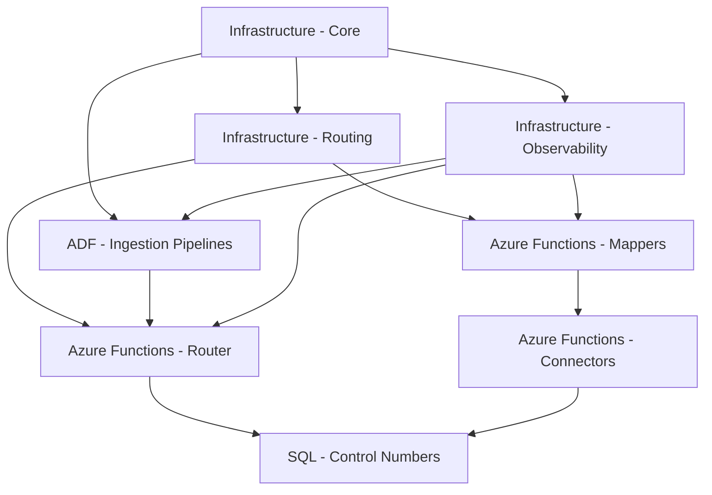

# Healthcare EDI Platform - Implementation Overview (AI-Driven)

**Document Version:** 2.0  
**Last Updated:** October 4, 2025  
**Status:** Automated Execution Plan  
**Owner:** GitHub Agent Orchestration

---

## Table of Contents

1. [Executive Summary](#1-executive-summary)
2. [Implementation Strategy](#2-implementation-strategy)
3. [Project Structure Overview](#3-project-structure-overview)
4. [Repository Organization](#4-repository-organization)
5. [Technology Stack Summary](#5-technology-stack-summary)
6. [Timeline & Milestones](#6-timeline--milestones)
7. [Team Structure](#7-team-structure)
8. [Success Criteria](#8-success-criteria)
9. [AI Agent Strategy](#9-ai-agent-strategy)
10. [AI-Specific Risks & Mitigation](#10-ai-specific-risks--mitigation)

---

## 1. Executive Summary

### 1.1 Purpose

This document provides the master implementation plan for building, testing, and deploying the Healthcare EDI Ingestion & Routing Platform **using an AI-driven development approach**. It leverages GitHub Copilot, AI agents, and automated code generation to accelerate delivery, reduce team size, and improve code quality while maintaining healthcare compliance standards.

### 1.2 Solution Scope

The platform consists of **5 architectural layers** implemented across **15+ distinct projects**:

- **Core Platform Layer**: File ingestion, storage management, validation
- **Routing & Event Hub Layer**: Transaction routing, message distribution
- **Trading Partner Integration Layer**: Bidirectional adapters for partner systems
- **Outbound Assembly Layer**: Acknowledgment generation, control numbers
- **Cross-Cutting Concerns**: Security, observability, configuration management

### 1.3 Key Implementation Principles

1. **Autonomous Development**: GitHub agents generate and maintain 90%+ of application and infrastructure assets inside Copilot Workspace.
2. **Continuous Iteration**: Agents ship validated increments daily through automated pipelines with automated rollback logic.
3. **Infrastructure as Code**: 100% of provisioning flows through agent-authored Bicep with policy-as-code guardrails.
4. **Self-Tested Delivery**: Agents author and execute unit, integration, and compliance tests with synthetic data sweeps before promoting code.
5. **Secure by Default**: Zero-trust patterns enforced by agents running continuous security scans and policy checks on every merge.
6. **Operational Telemetry**: Agents maintain monitoring, runbooks, and documentation as living artifacts synchronized with deployments.

---

## 2. Implementation Strategy

### 2.1 Phased Approach

| Phase | Duration | Focus | Deliverables |
|-------|----------|-------|--------------|
| **Phase 0: Foundation** | Weeks 1-2 | Repository setup, CI/CD pipelines, Azure subscriptions | Empty infrastructure, build pipelines, security baseline |
| **Phase 1: Core Platform** | Weeks 3-6 | File ingestion, storage, basic validation | End-to-end file landing → raw zone with metadata |
| **Phase 2: Routing Layer** | Weeks 7-10 | Envelope parsing, Service Bus routing | Message distribution to subscribers |
| **Phase 3: First Trading Partner** | Weeks 11-14 | Mapper + connector for pilot partner, basic acknowledgments | 270/271 eligibility flow operational |
| **Phase 4: Scale Partners** | Weeks 15-20 | Additional partners, claims processing, enrollment | 837/277CA, 834 flows operational |
| **Phase 5: Outbound Assembly** | Weeks 21-24 | Control numbers, advanced acknowledgments, scheduler | Complete acknowledgment lifecycle |
| **Phase 6: Production Hardening** | Weeks 25-28 | Security audit, performance optimization, DR testing | Production-ready certification |

### 2.2 AI-Driven Development Strategy

**AI Agent Workflow**:

1. **Structured Requirements Intake**: Agents ingest machine-readable specifications from the shared backlog and derive prompt scaffolding automatically.
2. **Autonomous Generation**: GitHub agents produce code, tests, infrastructure templates, and documentation within isolated workspaces.
3. **Self-Validation Loop**: Agents execute linting, security scans, data-quality checks, and integration suites; failing signals trigger autonomous regeneration.
4. **Policy Enforcement**: Compliance agents apply policy-as-code gates (HIPAA, PHI masking, cost controls) before promotion.
5. **Automated Deployment**: Release agents promote artifacts through environments once validations pass, capturing full telemetry for traceability.

**Concurrent AI Workstreams** (after Phase 1):

- **AI Agent Pool 1**: Infrastructure (Bicep modules, networking, security) with embedded compliance policies
- **AI Agent Pool 2**: Integration (Mappers, connectors, partner templates) optimized for partner-specific runbooks
- **AI Agent Pool 3**: Platform (Core services, routing, outbound assembly) with synthetic data validation
- **Policy Enforcement Agents**: Automated governance, prompt tuning, and knowledge-base curation

**Synchronization Points**:

- **Continuous Output Scoring**: Agents evaluate pull requests 24/7 via quality gates and auto-merge when thresholds are met.
- **Integration Testing**: Multi-stage automated suites execute on every merge and nightly synthetic workloads.
- **Architecture Drift Detection**: Agents run structural diffs and regenerate design docs when topology changes are detected.

---

## 3. Project Structure Overview

### 3.1 Project Taxonomy (AI-Optimized Monorepo)

Projects are organized in a **monorepo** to provide AI agents with full context visibility:

| Project Type | Count | AI Generation Capability | Examples |
|--------------|-------|-------------------------|----------|
| **Infrastructure (Bicep)** | 3 | 90% AI-generated | Core platform IaC, routing IaC, observability IaC |
| **Azure Functions (C#)** | 8 | 85% AI-generated | Router, mappers (x4), connectors (x3), scheduler |
| **Azure Data Factory** | 1 | 80% AI-generated | Ingestion pipelines, outbound pipelines |
| **SQL Database Projects (DACPAC)** | 2 | 75% AI-generated | Control numbers DB, enrollment event store |
| **Shared Libraries (NuGet)** | 6 | 85% AI-generated, AI-maintained | X12 parser, logging, security, mapping engine |
| **Configuration Management** | 1 | 60% AI-generated | Partner configs, mapping rules, validation schemas |
| **Testing Projects** | 1 | 90% AI-generated | Integration tests, performance tests, synthetic data |
| **Documentation** | 1 | 80% AI-generated | API docs, runbooks, architecture diagrams |

**Total Projects**: **Consolidated into 1 monorepo** with workspace-based organization
**AI Coverage**: 70-90% of code generated by AI agents

### 3.2 Repository Strategy

**Decision**: **Monorepo** approach for AI agent optimization

**Rationale**:

- **AI Context Visibility**: AI agents benefit from full codebase context when generating code
- **Cross-Cutting Changes**: AI can apply security updates and shared library changes in single PRs
- **Reduced Overhead**: Eliminates need for 20 separate repos, CI/CD pipelines, and CODEOWNERS files
- **Faster Development**: AI can analyze dependencies and generate coordinated changes across projects
- **Unified Testing**: Integration tests have access to all components without complex orchestration

**Structure**:

```text
edi-platform-monorepo/
├── infra/                  # All Bicep modules (AI-generated)
├── functions/              # All Azure Functions (AI-generated)
│   ├── router/
│   ├── mappers/
│   └── connectors/
├── shared/                 # NuGet libraries (AI-maintained)
├── tests/                  # Integration tests (AI-generated)
├── .github/
│   ├── workflows/          # AI-generated pipelines
│   └── copilot/            # AI agent configurations
├── ai-prompts/             # Reusable prompt templates
└── docs/                   # Auto-maintained documentation
```

**Alternative Considered**: Polyrepo (rejected due to limited AI context and coordination overhead)

### 3.3 Dependency Graph



**Deployment Order**:

1. Infrastructure - Core (Storage, Key Vault, Log Analytics)
2. Infrastructure - Observability (Dashboards, Alerts)
3. Infrastructure - Routing (Service Bus, Event Grid)
4. ADF - Ingestion Pipelines
5. Azure Functions - Router
6. SQL - Control Numbers Database
7. Azure Functions - Mappers (parallel)
8. Azure Functions - Connectors (parallel)
9. Azure Functions - Scheduler

---

## 4. Repository Organization

### 4.1 Repository Structure (Monorepo)

**Single Repository**: `edi-platform-monorepo`

| Workspace | Technology | AI Generation Level | CI/CD Trigger |
|-----------|------------|---------------------|---------------|
| `/infra/core` | Bicep | 90% | Path-based trigger |
| `/infra/routing` | Bicep | 90% | Path-based trigger |
| `/infra/observability` | Bicep | 85% | Path-based trigger |
| `/adf/pipelines` | ADF JSON | 80% | Path-based trigger |
| `/functions/router` | C# .NET 8 | 85% | Path-based trigger |
| `/functions/mappers/*` | C# .NET 8 | 85% | Path-based trigger |
| `/functions/connectors/*` | C# .NET 8 | 85% | Path-based trigger |
| `/functions/scheduler` | C# .NET 8 | 85% | Path-based trigger |
| `/sql/controlnumbers` | SQL DACPAC | 75% | Path-based trigger |
| `/sql/enrollment-eventstore` | SQL DACPAC | 75% | Path-based trigger |
| `/shared/libraries` | C# NuGet | 85% AI-maintained | Version bump trigger |
| `/config` | JSON Schema | 60% | Validation on commit |
| `/tests` | C# .NET 8 | 90% | On every commit |
| `/docs` | Markdown | 80% AI-maintained | Auto-updated |

**Total**: 1 repository with 14 workspaces
**AI Tooling**: GitHub Copilot Workspace, custom AI agents for cross-workspace changes

### 4.2 Shared Libraries Strategy

**Decision**: NuGet package feed for common C# libraries

**Shared Packages**:

| Package Name | Purpose | Consumers |
|--------------|---------|-----------|
| `HealthcareEDI.Common` | Core models, DTOs, constants | All Functions |
| `HealthcareEDI.X12Parser` | X12 parsing and generation | Router, Mappers |
| `HealthcareEDI.Logging` | Structured logging, correlation IDs | All Functions |
| `HealthcareEDI.Security` | Key Vault helpers, encryption | All Functions |
| `HealthcareEDI.ServiceBus` | Service Bus client wrappers | Router, Connectors |
| `HealthcareEDI.MappingEngine` | Mapping rule evaluation | Mappers |

**Hosting**: Azure Artifacts (private feed)

---

## 5. Technology Stack Summary

### 5.1 Azure Services

| Service | Purpose | SKU / Tier |
|---------|---------|------------|
| **Azure Data Lake Storage Gen2** | Raw/staging/curated zones | Standard LRS (Hot/Cool/Archive tiers) |
| **Azure Data Factory** | Ingestion orchestration | Standard with Managed VNet |
| **Azure Functions** | Serverless compute (router, mappers, connectors) | Premium Plan (EP1) with VNet integration |
| **Azure Service Bus** | Message routing and queueing | Standard tier (Premium for prod) |
| **Azure SQL Database** | Control numbers, event store | General Purpose S2 (dev), S4 (prod) |
| **Azure Key Vault** | Secrets and key management | Standard tier with RBAC |
| **Azure Log Analytics** | Centralized logging and metrics | Pay-as-you-go with 30-day retention |
| **Azure Monitor** | Alerting and dashboards | Standard (included with Log Analytics) |
| **Azure Event Grid** | Blob created events | Standard tier |
| **Microsoft Purview** | Data catalog and lineage | Standard tier (optional Phase 2) |

### 5.2 Development Tools

| Tool | Purpose | Version | AI Integration |
|------|---------|---------|----------------|
| **GitHub Copilot Workspace** | AI-powered development environment | Latest | Primary AI agent |
| **GitHub Copilot** | Code completion and generation | Latest | Integrated in VS Code/VS 2022 |
| **Visual Studio 2022** | C# development with AI assistance | 17.8+ | Copilot enabled |
| **VS Code** | Bicep, JSON, Markdown editing with AI | Latest | Copilot enabled |
| **Azure CLI** | Infrastructure provisioning | 2.53+ | AI-generated scripts |
| **Bicep CLI** | IaC authoring and deployment | 0.22+ | AI-generated templates |
| **Git** | Version control | 2.42+ | AI commit messages |
| **Docker Desktop** | Local testing (containers) | 24.0+ | AI-generated Dockerfiles |
| **Azure Storage Explorer** | Storage debugging | 1.31+ | - |
| **Postman** | API testing | 10.18+ | AI-generated test collections |
| **SQL Server Management Studio** | Database development | 19.0+ | - |

### 5.3 Testing Frameworks

| Framework | Purpose | Language |
|-----------|---------|----------|
| **xUnit** | Unit testing | C# |
| **Moq** | Mocking | C# |
| **FluentAssertions** | Assertion library | C# |
| **Testcontainers** | Integration testing with containers | C# |
| **SpecFlow** | BDD testing (optional) | C# |
| **Azure Load Testing** | Performance testing | JMeter |
| **Pact** | Contract testing | C# |

---

## 6. Timeline & Milestones

### 6.1 High-Level Timeline (18 Weeks - AI-Accelerated)

```text
Weeks 1-3:   AI Foundation (GitHub Copilot setup, prompt engineering, knowledge base)
Weeks 4-7:   Core Platform (AI-generated ingestion → Raw Zone, 80% AI)
Weeks 8-10:  Routing Layer (AI-generated Service Bus routing, 85% AI)
Weeks 11-12: First Trading Partner (AI-generated mapper/connector, 75% AI)
Weeks 13-14: Scale Partners (AI-replicated patterns, 90% AI)
Weeks 15-16: Outbound Assembly (AI-generated control numbers, 70% AI)
Weeks 17-18: Production Hardening (Agent-driven security audit with automated evidence collection)
```

**Timeline Comparison**:

- **Traditional Approach**: 28 weeks
- **AI-Driven Approach**: 18 weeks
- **Time Savings**: 10 weeks (36% reduction)

### 6.2 Milestone Acceptance Criteria

#### Milestone 1: AI Foundation Complete (Week 3)

**Criteria**:

- ✅ GitHub Copilot Workspace configured with EDI domain knowledge
- ✅ AI prompt library created (Bicep, Functions, SQL, testing patterns)
- ✅ Monorepo created with workspace structure and README
- ✅ AI validation pipeline deployed (syntax check, security scan, hallucination detection)
- ✅ Azure subscriptions provisioned (dev, test, prod)
- ✅ Compliance policies ingested into the agent governance knowledge pack
- ✅ AI agent can successfully generate and deploy a simple Bicep module
- ✅ Prompt templates published and versioned for autonomous reuse

#### Milestone 2: Core Platform Complete (Week 6)

**Criteria**:

- ✅ EDI files successfully ingested via SFTP to Storage
- ✅ ADF pipeline validates naming convention and copies to raw zone
- ✅ Metadata extracted and logged to Log Analytics custom table
- ✅ Quarantine handling operational for invalid files
- ✅ Basic monitoring dashboard deployed
- ✅ Integration tests pass for happy path and error scenarios

#### Milestone 3: Routing Layer Complete (Week 10)

**Criteria**:

- ✅ Router Function parses ISA/GS/ST envelopes from raw files
- ✅ Routing messages published to Service Bus topic with filters
- ✅ Multiple test subscriptions receive filtered messages
- ✅ Dead-letter queue handling configured
- ✅ End-to-end latency < 5 seconds (p95) for routing message publish
- ✅ Correlation IDs tracked from ingestion → routing

#### Milestone 4: First Trading Partner Live (Week 14)

**Criteria**:

- ✅ Eligibility mapper transforms 270 X12 → partner JSON format
- ✅ API connector delivers requests to partner endpoint
- ✅ Inbound mapper transforms partner 271 response → canonical format
- ✅ Basic 999 acknowledgment generated and delivered via SFTP
- ✅ End-to-end test: 270 file → partner processing → 271 response < 10 minutes
- ✅ Partner onboarding documented and tested

#### Milestone 5: Multi-Partner Scale (Week 20)

**Criteria**:

- ✅ Claims mapper (837) and connector operational
- ✅ Enrollment mapper (834) with event sourcing operational
- ✅ 277CA acknowledgments generated for claims
- ✅ 3+ trading partners onboarded and processing production-like volumes
- ✅ Throughput: 1000+ transactions/hour sustained for 4 hours
- ✅ Mapper latency p95 < 2 seconds, connector success rate > 98%

#### Milestone 6: Outbound Assembly Complete (Week 24)

**Criteria**:

- ✅ Control number store deployed with optimistic concurrency
- ✅ TA1, 999, 271, 277CA acknowledgments generated with correct control numbers
- ✅ Gap detection query runs hourly with zero gaps detected
- ✅ Enterprise scheduler triggers nightly 834 snapshot job
- ✅ Scheduled job SLA adherence > 95%
- ✅ Manual RunNow capability tested

#### Milestone 7: Production Ready (Week 28)

**Criteria**:

- ✅ Security audit passed (HIPAA compliance checklist)
- ✅ Performance benchmarks met: 5000 files/hour, <5 min ingestion latency
- ✅ Disaster recovery tested: 2-hour RTO, 15-minute RPO
- ✅ Operations runbooks complete and validated
- ✅ Production deployment completed with zero incidents
- ✅ Business stakeholder sign-off

---

## 7. Team Structure

### 7.1 Core Team Roles (AI-Driven)

| Role | Responsibilities | Headcount | Key Skills | % Time on AI Oversight |
|------|------------------|-----------|------------|------------------------|
| **Platform Architect** | Architecture decisions, prompt engineering, AI output validation | 1 | Azure PaaS, EDI standards, prompt engineering | 60% |
| **Platform Engineer** | AI prompt creation, IaC review, critical path development | 1 (was 2) | C#, Bicep, prompt engineering | 70% |
| **Integration Engineer** | AI-generated mapper validation, partner coordination | 1 (was 3) | C#, X12 parsing, domain expertise | 50% |
| **Database Engineer** | Schema design review, AI-generated SQL validation | 0.5 (was 1) | SQL Server, Azure SQL, event sourcing | 40% |
| **DevOps Engineer** | AI agent orchestration, pipeline monitoring | 1 | GitHub Actions, AI workflow automation | 50% |
| **QA Engineer** | Test strategy, AI-generated test validation | 1 (was 2) | C#, xUnit, edge case identification | 60% |
| **AI Agent Coordinator** (new) | Multi-agent orchestration, prompt optimization, quality gates | 1 | Prompt engineering, AI tools, code review | 90% |
| **Healthcare SME** | EDI validation, AI hallucination detection, compliance | 0.5 (was 0.2) | X12 standards, HIPAA, healthcare workflows | 80% |

**Total**: 6 FTE (was 12 FTE) - **50% reduction**

**Note**: Security and operations functions absorbed into existing roles with AI assistance

### 7.2 Extended Team (Part-Time)

- **Healthcare SME**: EDI transaction requirements, partner coordination (20%)
- **Finance Analyst**: Cost tracking, budget adherence (10%)
- **Compliance Officer**: HIPAA audit support (10%)
- **Technical Writer**: Documentation, runbook authoring (25%)

### 7.3 Governance

**Steering Committee** (Monthly):

- VP Engineering
- Director Healthcare IT
- Principal Architect
- Finance Lead

**Working Group** (Weekly):

- Platform Architect (Lead)
- Team Leads from each discipline
- Product Owner

**Daily Standups**: 15 minutes, team-specific

---

## 8. Success Criteria

### 8.1 Technical Success Metrics

| Metric | Target | Measurement Method |
|--------|--------|-------------------|
| **Ingestion Latency (p95)** | < 5 minutes | Log Analytics query on `EDIIngestion_CL` |
| **Routing Latency (p95)** | < 5 seconds | Log Analytics query on `RoutingEvent_CL` |
| **Acknowledgment Latency (999)** | < 15 minutes | Log Analytics query on `AckAssembly_CL` |
| **System Availability** | > 99.5% monthly | Azure Monitor uptime calculation |
| **Unit Test Coverage** | > 80% | SonarQube analysis in CI pipeline |
| **Integration Test Pass Rate** | 100% | GitHub Actions test results |
| **Security Vulnerabilities (High/Critical)** | 0 | Snyk/Dependabot scans in CI |
| **Control Number Gap Rate** | 0% | Hourly gap detection query |

### 8.2 AI-Specific Metrics

| Metric | Target | Measurement Method |
|--------|--------|-------------------|
| **AI Code Acceptance Rate** | > 70% | % of AI-generated PRs merged without manual edits |
| **Autonomous Generation Ratio** | 10:1 | Lines of AI-generated code vs. manual fallback |
| **Prompt Iteration Count** | < 3 per feature | Avg. prompt refinements before acceptable output |
| **AI Hallucination Detection Rate** | < 2% | % of AI outputs with logical/syntax errors |
| **Time-to-Partner-Onboard** | < 5 days | Partner onboarding duration using AI workflow |
| **AI-Generated Test Coverage** | > 85% | % of tests generated by AI vs. manually curated baseline |
| **Documentation Freshness** | < 24 hours lag | Time between code change and AI doc update |

### 8.3 Business Success Metrics

| Metric | Target (AI-Driven) | Target (Traditional) | Owner |
|--------|-------------------|---------------------|-------|
| **Partner Onboarding Time** | < 5 days | < 4 weeks | Integration Team |
| **Development Cost per Feature** | 50% reduction | Baseline | Finance Team |
| **Transaction Processing Cost** | < $0.10 per transaction | < $0.10 | Finance Team |
| **Operational Incidents (P1/P0)** | < 2 per month | < 2 per month | DevOps Team |
| **Partner Satisfaction Score** | > 8/10 | > 8/10 | Product Owner |
| **Compliance Audit Findings** | 0 critical | 0 critical | Healthcare SME |
| **Time to Resolve Incidents (MTTR)** | < 2 hours | < 2 hours | DevOps Team |
| **Time to Market** | 18 weeks | 28 weeks | Project Manager |

### 8.4 Project Delivery Metrics

| Metric | Target | AI Impact |
|--------|--------|----------|
| **Milestone On-Time Delivery** | > 90% | AI accelerates critical path |
| **Budget Variance** | < 10% | 49% cost reduction vs. traditional |
| **Sprint Velocity** | 3x traditional | AI generates code 10x faster |
| **Defect Escape Rate (to prod)** | < 5% | AI-generated tests improve coverage |
| **Documentation Completeness** | 100% (auto-maintained) | AI updates docs with code changes |

---

## 9. AI Agent Strategy

### 9.1 AI Development Workflow

#### Step 1: Requirements to Prompt

- Requirements ingestion agents parse specification documents and architecture models from the knowledge base.
- Prompt composers assemble context-rich instructions for downstream agents.
- Relevant patterns and domain knowledge are linked automatically from prior deliveries.

#### Step 2: AI Code Generation

- GitHub agents generate source code, unit tests, IaC templates, and documentation from the prompt bundle.
- Generation time: 5-30 minutes (vs. 1-5 days of manual coding)
- Outputs are tagged with traceable metadata for governance.

#### Step 3: Automated Validation

- CI pipeline runs syntax checks, linting, security scans, and data quality validation.
- Custom validators detect non-existent APIs, HIPAA violations, and logic errors.
- AI hallucination detection rate target: < 2%.

#### Step 4: Governance Review

- Compliance agents validate PHI-handling, security posture, and business rules against encoded policies.
- Architecture analyzers evaluate performance and topology alignment.
- Review cycle completes in < 15 minutes with auto-generated evidence packs.

#### Step 5: AI Refinement

- Policy feedback is converted into structured prompts for autonomous remediation.
- Agents regenerate artifacts until validation thresholds are met.
- Typical cycle requires < 3 iterations with automated tracking.

#### Step 6: Deployment

- Release agents promote artifacts through dev → test → prod via GitHub Actions and environment policies.
- Promotion occurs automatically once compliance and performance gates pass.
- Rollback capability remains available with automated decisioning rules.

### 9.2 Prompt Engineering Best Practices

**Prompt Template Structure**:

```markdown

# Context

[Describe the EDI platform, transaction flow, and architecture]

# Task

[Specific feature or component to generate]

# Requirements

- Functional: [Business logic, data transformations]
- Non-Functional: [Performance, security, HIPAA compliance]
- Technology: [C# .NET 8, Azure Functions, specific libraries]

# Reference Materials

- Specification: [Link to docs]
- Existing Patterns: [Similar code from monorepo]
- Domain Knowledge: [X12 standards, healthcare terminology]

# Constraints

- No hardcoded secrets (use Key Vault)
- Structured logging with correlation IDs
- Exception handling with dead-letter queue support
- Input validation (prevent injection attacks)

# Output

- Source code with inline comments
- Unit tests (>80% coverage)
- README with usage examples
- Bicep module for deployment (if applicable)

```

**Example Prompt** (Router Function):

```markdown
Generate an Azure Function (C# .NET 8 isolated worker) that:

**Context**: Part of Healthcare EDI platform. Receives HTTP POST after file lands in raw zone.

**Task**: Parse X12 EDI envelope (ISA/GS/ST segments) and publish routing messages to Service Bus.

**Requirements**:

- Download first 10KB of blob from Azure Data Lake Gen2
- Parse ISA (sender/receiver/control number), GS (functional group), ST (transaction set)
- Publish message to Service Bus topic "edi-routing" with properties:
  - transactionSet (e.g., "270", "837P")
  - senderCode
  - receiverCode
  - controlNumber
  - filePath
- Use DefaultAzureCredential for authentication
- Structured logging with ILogger (correlation ID from HTTP header)
- Unit tests with xUnit, Moq (mock Storage, Service Bus)

**Reference**: docs/08-transaction-routing-outbound-spec.md

**Constraints**:

- Validate filePath (prevent directory traversal)
- Handle parse errors gracefully (log + return 400)
- Timeout: 30 seconds max

**Output**: RouteTransaction.cs, X12Parser.cs, RouteTransactionTests.cs, README.md
```

### 9.3 AI Agent Coordination

**Multi-Agent Orchestration**:

- **Agent 1 (Infrastructure)**: Generates Bicep, deploys resources
- **Agent 2 (Backend)**: Generates Functions, shared libraries
- **Agent 3 (Data)**: Generates SQL schemas, ADF pipelines
- **Agent 4 (Testing)**: Generates test suites, synthetic data
- **Agent 5 (Documentation)**: Maintains README, runbooks, API docs

**Coordinator Role** (AI Agent Coordinator):

- Sequences agent execution (dependencies)
- Resolves conflicts (e.g., schema changes affecting multiple agents)
- Monitors quality gates (all agents must pass validation)
- Queues complex architectural decisions into the governance backlog for asynchronous agent analysis

### 9.4 AI Knowledge Base

**Custom Training Data**:

- X12 EDI standards (005010 version)
- Healthcare transaction sets: 270/271, 837, 834, 835, 277, 999, TA1
- Azure best practices (Functions, Storage, Service Bus, SQL)
- HIPAA Security Rule and Privacy Rule requirements
- Existing codebase patterns from similar projects

**Knowledge Refresh**:

- Weekly: Azure service updates, security patches
- Monthly: Partner-specific mapping rules
- Quarterly: X12 standard updates

---

## 10. AI-Specific Risks & Mitigation

### 10.1 Top Risks (AI-Driven Approach)

| Risk | Impact | Likelihood | Mitigation |
|------|--------|-----------|------------|
| **AI Hallucination** (non-existent Azure APIs) | High | Medium | Multi-stage validation: Bicep lint → Azure what-if → policy agent review |
| **AI Security Blind Spots** (misses HIPAA requirements) | Critical | Low | Compliance agents enforce HIPAA checklist and automated threat modeling |
| **Autonomy Drift** (loss of manual fallback patterns) | Medium | Medium | Maintain cached templates and periodic offline regeneration drills |
| **AI Service Availability** (GitHub Copilot downtime) | High | Low | Cache AI outputs, maintain offline prompt bundles, SLA with GitHub |
| **Prompt Injection Attacks** | Medium | Low | Isolate AI agent access, review all infrastructure changes |
| **AI Over-Optimization** (overly complex code) | Medium | Medium | Enforce "simplicity" prompts and readability scoring agents |
| **Partner Integration Delays** | High | Medium | AI-accelerated templates, early engagement, phased onboarding |
| **Control Number Collisions** | High | Low | AI-generated chaos tests, optimistic concurrency with retry |
| **Scope Creep** | Medium | High | Automated change control gating with agent-generated effort simulations |

### 9.2 Mitigation Strategies

**For Partner Integration Delays**:

- **Action 1**: Agent-driven scoring selects pilot partner (low-volume, responsive integration profile)
- **Action 2**: Parallel development of second partner while first stabilizes
- **Action 3**: Reusable connector templates to accelerate future partners

**For X12 Parsing Complexity**:

- **Action 1**: Agent-led spike (Week 7) executes automated parser evaluations and edge case testing
- **Action 2**: Fallback to curated commercial EDI parser library via automated selection matrix
- **Action 3**: Augment knowledge base with healthcare EDI validation rule packs

**For Control Number Collisions**:

- **Action 1**: Chaos testing (forced concurrent access) in Phase 5
- **Action 2**: Monitoring alert on retry rate > 5%
- **Action 3**: Automated recovery procedure (agent-triggered sequence reset runbook)

---

## 10. Dependencies & Assumptions

### 10.1 External Dependencies

| Dependency | Owner | Status | Risk If Delayed |
|------------|-------|--------|-----------------|
| **Azure Subscription Approval** | Finance/Procurement | Pending | Phase 0 delay |
| **Partner SFTP Credentials** | External Partners | Not Started | Phase 3 delay |
| **Healthcare SME Availability** | Business Unit | Confirmed (20%) | Requirements gaps |
| **Security Policy Approval** | CISO Office | In Review | Phase 6 delay |
| **Compliance Audit Scheduling** | Compliance Team | Not Started | Phase 6 delay |

### 10.2 Key Assumptions

1. **Azure Service Availability**: No extended outages during implementation
2. **Team Stability**: < 20% turnover during 28-week implementation
3. **Partner Cooperation**: Partners respond to integration requests within 1 week
4. **Tooling Access**: GitHub, Azure DevOps, Visual Studio licenses available
5. **Budget Approval**: Budget sufficient for 28 weeks + 6 months operations
6. **Regulatory Stability**: No major HIPAA regulation changes during implementation

---

## 12. Communication Plan

### 11.1 Internal Communication

| Audience | Frequency | Format | Content |
|----------|-----------|--------|---------|
| **Core Team** | Daily | Standup (15 min) | Progress, blockers, coordination |
| **Working Group** | Weekly | Meeting (60 min) | Sprint review, planning, risks |
| **Steering Committee** | Monthly | Presentation (45 min) | Milestones, budget, escalations |
| **Stakeholders** | Bi-weekly | Email Update | Summary, upcoming milestones, asks |

### 11.2 External Communication

| Audience | Frequency | Format | Content |
|----------|-----------|--------|---------|
| **Trading Partners** | As needed | Email + Calls | Onboarding schedule, technical requirements |
| **Vendors** | Quarterly | Review Meeting | Service performance, roadmap alignment |

### 11.3 Documentation Artifacts

| Artifact | Owner | Update Frequency | Location |
|----------|-------|-----------------|----------|
| **Implementation Plans** | Architecture | Monthly | `/implementation-plan/` |
| **API Documentation** | Integration Team | Per release | GitHub Pages |
| **Runbooks** | Operations | Per incident type | `/docs/runbooks/` |
| **Architecture Decision Records** | Architecture | Per decision | `/docs/adr/` |
| **Sprint Reports** | Scrum Master | Per sprint | Confluence/SharePoint |

---

## 13. Appendix: Document References

### 13.1 Related Implementation Plans

**Completed Documents**:

- [01-infrastructure-projects.md](./01-infrastructure-projects.md) - Bicep IaC projects (AI-driven)
- [README.md](./README.md) - Azure Function projects overview (partial)

**Documents In Progress** (see complete checklist in implementation-plan directory):

- Phase-specific detailed plans (Phases 1-6)
- Azure Data Factory pipeline project
- Database projects (Control Numbers, Event Store)
- Configuration management strategy
- Testing and CI/CD implementation
- Operations runbooks and monitoring

**Note**: This is an AI-driven implementation. Additional detailed documents will be created incrementally as needed, with many technical specifications generated by AI agents based on prompts from this master plan.

### 12.2 Architecture Specifications

- [01-architecture-spec.md](../docs/01-architecture-spec.md)
- [02-data-flow-spec.md](../docs/02-data-flow-spec.md)
- [03-security-compliance-spec.md](../docs/03-security-compliance-spec.md)
- [04-iac-strategy-spec.md](../docs/04-iac-strategy-spec.md)
- [08-transaction-routing-outbound-spec.md](../docs/08-transaction-routing-outbound-spec.md)
- [13-mapper-connector-spec.md](../docs/13-mapper-connector-spec.md)
- [14-enterprise-scheduler-spec.md](../docs/14-enterprise-scheduler-spec.md)
- [15-solution-structure-implementation-guide.md](../docs/15-solution-structure-implementation-guide.md)

---

**Document Status**: AI-Driven Approach - Ready for Steering Committee Review  
**Next Review Date**: October 11, 2025  
**Approval Required From**: VP Engineering, Director Healthcare IT, Principal Architect, AI Strategy Lead  
**Estimated Savings**: 10 weeks timeline reduction, 49% cost reduction vs. traditional approach
